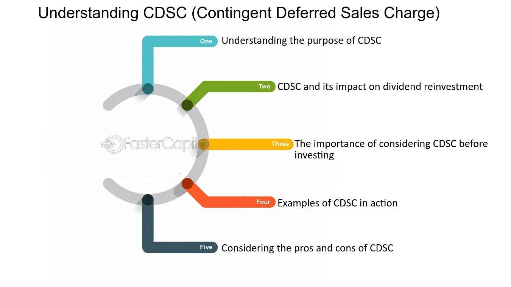

## Table of Contents

## What is a Contingent Deferred Sales Charge (CDSC)?

A Contingent Deferred Sales Charge (CDSC), also known as a back-end load, is a fee that investors might have to pay when they sell certain types of mutual fund shares. This fee is typically a percentage of the value of the shares being sold and decreases the longer the investor holds onto the shares. The purpose of the CDSC is to encourage investors to keep their money in the fund for a longer period, which helps the fund manage its cash flow and investment strategy more effectively.

For example, if you buy shares in a mutual fund with a CDSC, you might have to pay a 5% fee if you sell the shares within the first year. This fee might drop to 4% in the second year, 3% in the third year, and so on, until it eventually reaches zero after a certain number of years. This structure is designed to discourage short-term trading and reward long-term investment in the fund.

## How does a CDSC affect mutual fund investors?

A Contingent Deferred Sales Charge (CDSC) can impact mutual fund investors by adding a cost if they decide to sell their shares early. If an investor needs to sell their shares soon after buying them, they might have to pay a fee, which can be a big part of the money they get back. This fee starts high and gets smaller the longer the investor keeps the shares. So, if someone sells their shares in the first year, they might pay a 5% fee, but if they wait until the fifth year, the fee could be much less or even zero.

This fee can make investors think twice before selling their shares quickly. It encourages them to keep their money in the fund for a longer time. This can be good for the fund because it helps them plan their investments better. But for the investor, it means they need to be sure they can leave their money in the fund for a while. If they might need the money soon, a fund with a CDSC might not be the best choice for them.

## What is the typical duration of a CDSC?

The typical duration of a Contingent Deferred Sales Charge (CDSC) can vary, but it usually lasts between 3 to 10 years. This means that if you sell your mutual fund shares within this period, you might have to pay a fee. The longer you keep your money in the fund, the less you will have to pay if you decide to sell.

For example, a common setup is that the CDSC might start at 5% if you sell in the first year, then drop to 4% in the second year, 3% in the third year, and so on until it reaches zero. This encourages investors to stay invested for the full duration to avoid the fee. It's important for investors to understand this timeline before they buy into a fund with a CDSC.

## Can you explain how the CDSC rate changes over time?

The CDSC rate usually starts high and goes down over time. If you sell your mutual fund shares early, you might have to pay a bigger fee. For example, if you sell in the first year, the fee might be 5%. This is to make people think twice before selling their shares right away.

As time goes on, the CDSC fee gets smaller. If you wait a year, the fee might drop to 4%. After two years, it could be 3%. This keeps going down until it reaches zero, usually after 3 to 10 years. This way, the longer you keep your money in the fund, the less you pay if you decide to sell.

This setup helps the mutual fund because it encourages people to leave their money in for a long time. It also means that if you think you might need your money soon, you should be careful about choosing a fund with a CDSC. You need to plan to keep your money in the fund for the whole time to avoid the fee.

## In what types of investment products is a CDSC commonly found?

A CDSC is commonly found in certain types of mutual funds, especially those known as Class B shares. These funds are designed to encourage long-term investment by charging a fee if you sell your shares too soon. The fee starts high and goes down over time, so if you keep your money in the fund for a long time, you won't have to pay the fee when you sell.

You might also find a CDSC in some types of annuities. Annuities are insurance products that can provide income over time, and some of them have a CDSC to discourage early withdrawals. Like with mutual funds, the longer you keep your money in the annuity, the less you'll have to pay if you decide to take your money out early.

## How does a CDSC differ from a front-end load?

A CDSC, or back-end load, is a fee you might have to pay when you sell your mutual fund shares. This fee is usually a percentage of the value of the shares and goes down the longer you keep your money in the fund. So, if you sell early, you pay more, but if you wait, the fee gets smaller or goes away. The idea is to keep people from selling their shares too soon and to encourage them to stay invested for a longer time.

A front-end load is different because you pay it when you buy the mutual fund shares, not when you sell them. This fee is also a percentage of the amount you're investing, and you pay it right away. Unlike a CDSC, a front-end load doesn't change over time. It's a one-time fee that you know about from the start. So, with a front-end load, you start with a smaller investment because of the fee, but you don't have to worry about fees when you decide to sell your shares later.

## What are the potential benefits of investing in a fund with a CDSC?

One potential benefit of investing in a fund with a CDSC is that it can help you save on upfront costs. When you buy shares in a fund with a CDSC, you don't have to pay a fee right away like you would with a front-end load. This means you can put more of your money into the fund from the start, which can help your investment grow more over time.

Another benefit is that a CDSC can encourage you to think long-term. Since the fee goes down the longer you keep your money in the fund, it can make you less likely to sell your shares quickly. This can be good for your investment because staying invested for a longer time often leads to better returns. Plus, it helps the fund managers plan better because they know people are more likely to keep their money in the fund.

## What should investors consider before choosing a fund with a CDSC?

Before choosing a fund with a CDSC, investors should think about how long they plan to keep their money in the fund. Since the CDSC fee goes down over time and can be high if you sell early, it's important to be sure you can leave your money in the fund for a while. If you might need your money soon, a fund with a CDSC might not be the best choice because you could end up paying a big fee.

Investors should also think about other costs and how the fund performs. Even though you don't pay a fee when you buy the fund, there might be other fees like management fees that you need to know about. It's also a good idea to look at how the fund has done in the past and if it fits with your investment goals. Choosing a fund with a CDSC means you're okay with paying a fee if you sell early, so make sure it's the right fit for your plans.

## How can investors avoid or minimize the impact of a CDSC?

Investors can avoid or minimize the impact of a CDSC by planning to keep their money in the fund for the full duration of the CDSC period. This means if the CDSC lasts for 5 years, they should be ready to leave their money in the fund for at least that long. By doing this, the CDSC fee will go down to zero, and they won't have to pay anything when they decide to sell their shares.

Another way to minimize the impact is by choosing funds that offer a CDSC waiver. Some funds might let you avoid the CDSC if you're selling your shares for certain reasons, like if you're retiring or if you're using the money to buy a different fund from the same company. It's important to read the fund's rules carefully to see if they offer any ways to avoid the fee.

## What are the regulatory requirements surrounding CDSCs?

There are rules set by the Financial Industry Regulatory Authority (FINRA) and the Securities and Exchange Commission (SEC) that funds with a CDSC have to follow. These rules are there to make sure investors know about the CDSC and how it works before they buy the fund. Funds have to tell investors about the CDSC in their prospectus, which is a document that explains everything about the fund. They also have to be clear about how the CDSC fee goes down over time and when it reaches zero.

Another important rule is that funds can't charge a CDSC if the investor dies or if the fund gets taken over by another company. There are also rules about how much the CDSC can be. For example, the fee can't be more than 8.5% of the value of the shares you're selling. These rules help make sure that the CDSC is fair and that investors know what they're getting into when they buy a fund with a CDSC.

## How do financial advisors discuss CDSCs with their clients?

Financial advisors talk to their clients about CDSCs by first explaining what they are and how they work. They tell their clients that a CDSC is a fee you might have to pay if you sell your mutual fund shares too soon. The fee starts high and goes down the longer you keep your money in the fund. Advisors make sure their clients understand that if they sell early, they could lose a big part of their money because of the fee. They also explain that the CDSC is meant to encourage people to stay invested for a longer time, which can be good for the fund and might help the client's investment grow more.

Advisors also talk about the pros and cons of choosing a fund with a CDSC. They point out that one good thing is that you don't have to pay a fee when you buy the fund, so you can put more money into your investment from the start. But they also warn their clients that if they might need their money soon, a fund with a CDSC might not be the best choice. They help their clients think about how long they can keep their money in the fund and if the CDSC fits with their plans. By explaining all this clearly, advisors help their clients make a smart choice about whether a fund with a CDSC is right for them.

## What are the latest trends and changes in the use of CDSCs in the investment industry?

In recent years, the use of CDSCs in the investment industry has been going down. More and more investors and financial advisors are choosing funds that don't have these fees. This is because people want more freedom to move their money around without having to pay extra fees. Also, there's been a big push for more clear and fair ways of investing, which has made funds with no CDSCs more popular. Many fund companies have started to offer more no-load funds, which don't have any sales charges at all, either when you buy or sell.

Even though CDSCs are less common now, some investors still find them useful. For example, some people like the idea of a CDSC because it helps them stick to a long-term investment plan. It can make them think twice before selling their shares too soon, which can be good for their overall investment strategy. But because of the trend towards more flexible and transparent investment options, funds with CDSCs are becoming less common, and investors have more choices than ever before.

## What are Sales Charges and CDSCs and how can they be decoded?

Sales charges are important cost considerations in mutual fund investments. They manifest primarily as front-end loads, back-end loads, and level loads, each affecting the net returns on investments differently. 

**Front-End Loads:** These are initial fees paid when purchasing mutual fund shares. They are deducted from the total investment amount, thus reducing the capital allocated to purchasing shares. For example, if a mutual fund imposes a front-end load of 5%, and an investor wishes to invest $10,000, only $9,500 would be invested in the mutual fund, with $500 going towards the load fee. 

**Back-End Loads (including CDSCs):** Also known as “deferred sales charges,” back-end loads are fees charged upon the sale of mutual fund shares, if they are sold within a predefined period. A specific kind of back-end load is the Contingent Deferred Sales Charge (CDSC). The CDSC typically decreases over time, often structured to encourage investors to hold shares for longer durations. For instance, a CDSC might start at 5% if shares are redeemed within the first year, decreasing by 1% each subsequent year until it eventually disappears after a certain period, usually around five to seven years. Class B shares frequently incorporate CDSCs, which provide an incentive to avoid short-term trading that can lead to higher transaction costs and volatile fund management.

The mathematical treatment of a CDSC can be expressed as a decreasing function over time $t$:

$$
\text{CDSC}(t) = \max(0, r - kt)
$$

where $r$ is the initial CDSC rate and $k$ is the decrease in the charge per year. This function illustrates that the charge diminishes annually, eventually reaching zero if the investors hold onto their shares long enough.

**Level Loads:** These charges are consistent fees applied throughout the duration of the investment, rather than being concentrated either at the sale or purchase. They are generally included as part of the annual operating expenses of the fund.

The strategy behind implementing these charges, particularly CDSCs, is to discourage frequent trading which could disrupt the fund’s management and incur additional costs. By imposing financial penalties on short-term sales, mutual funds align investor behavior with fund management strategies aimed at stability and long-term growth. This encourages investors to adopt a buy-and-hold strategy, reducing the impact of market [volatility](/wiki/volatility-trading-strategies) on the fund.

## What are the frequently asked questions?

**What is a CDSC and how does it work?**

A Contingent Deferred Sales Charge (CDSC), often referred to as a back-end load, is a fee imposed on the sale of certain mutual fund shares. This charge is typically applied when an investor sells their shares before a specified period has elapsed, usually ranging between one to seven years. The primary purpose of a CDSC is to discourage frequent trading and short-term investment behaviors. 

The CDSC percentage generally decreases over time, often on a sliding scale. For example, if a mutual fund has a CDSC that starts at 5% and reduces by 1% each year, an investor selling shares after two years might incur a charge of 3%. The charge is calculated based on either the original purchase price or the sale price, whichever is lower. The formula for calculating the fee can be expressed as:

$$
\text{CDSC Fee} = \text{Shares Sold} \times \text{Lower of Purchase or Sale Price} \times \text{CDSC Rate}
$$

**How can investors avoid paying excessive fees?**

To avoid excessive investment fees, investors should consider several strategies:

1. **Long-term Holding:** By holding investments for the long term, investors can avoid CDSCs as these fees decrease over time and eventually vanish.

2. **Opt for No-Load Funds:** Choosing mutual funds without sales loads or those classified as “no-load” can eliminate entry or exit charges.

3. **Negotiate With Brokers:** Investors might achieve better fee structures by negotiating with brokers, especially if they have significant investment portfolios.

4. **Educate on Fees:** Understanding the fee structures of various share classes can guide investors to choose those that align with their investment horizon and strategy.

**What role does algorithmic trading play in investment management?**

Algorithmic trading plays a significant role in modern investment management by employing algorithms to execute trades automatically based on predefined criteria. Key benefits include:

1. **Enhanced Speed and Efficiency:** Algorithms can process and execute trades faster than human traders, capitalizing on brief market opportunities.

2. **Minimizing Errors:** By removing human emotion and error from trade execution, algo trading can provide more consistent results.

3. **Fee Management:** Algorithms can consider fee structures when determining optimal entry and exit points, minimizing the impact of charges like CDSCs on overall returns.

4. **Adaptability:** Algo trading strategies can be tailored to various market conditions, ensuring that they remain effective across different economic cycles.

In Python, basic algo-trading strategies can be implemented using libraries like `pandas` for data manipulation and `numpy` for numerical operations, alongside trading-specific packages such as `Zipline` or `Backtrader` for [backtesting](/wiki/backtesting) strategies. Here’s a simplified Python example illustrating how an algorithm could evaluate fee structures:

```python
import pandas as pd
import numpy as np

# Hypothetical fee data
data = {'time': np.arange(0, 10),
        'CDSC_rate': [5, 4, 3, 2, 1, 0, 0, 0, 0, 0]}  # decreasing rate over time

df = pd.DataFrame(data)

def calculate_cdsc(sale_price, purchase_price, shares_sold, year):
    applicable_rate = df.loc[df['time'] == year, 'CDSC_rate'].values[0]
    lower_price = min(sale_price, purchase_price)
    return shares_sold * lower_price * (applicable_rate / 100)

# Example: calculating CDSC for a sale in year 3
cdsc_fee = calculate_cdsc(110, 100, 50, 3)
print(f"CDSC fee incurred: ${cdsc_fee:.2f}")
```

This example demonstrates how an algorithm could be structured to quantify the cost implications of CDSC charges, guiding investment decisions accordingly.

## References & Further Reading

[1]: Bergstra, J., Bardenet, R., Bengio, Y., & Kégl, B. (2011). ["Algorithms for Hyper-Parameter Optimization."](https://dl.acm.org/doi/10.5555/2986459.2986743) Advances in Neural Information Processing Systems 24.

[2]: ["Advances in Financial Machine Learning"](https://www.amazon.com/Advances-Financial-Machine-Learning-Marcos/dp/1119482089) by Marcos Lopez de Prado

[3]: ["Evidence-Based Technical Analysis: Applying the Scientific Method and Statistical Inference to Trading Signals"](https://www.amazon.com/Evidence-Based-Technical-Analysis-Scientific-Statistical/dp/0470008741) by David Aronson

[4]: ["Machine Learning for Algorithmic Trading"](https://github.com/PacktPublishing/Machine-Learning-for-Algorithmic-Trading-Second-Edition) by Stefan Jansen

[5]: ["Quantitative Trading: How to Build Your Own Algorithmic Trading Business"](https://books.google.com/books/about/Quantitative_Trading.html?id=j70yEAAAQBAJ) by Ernest P. Chan