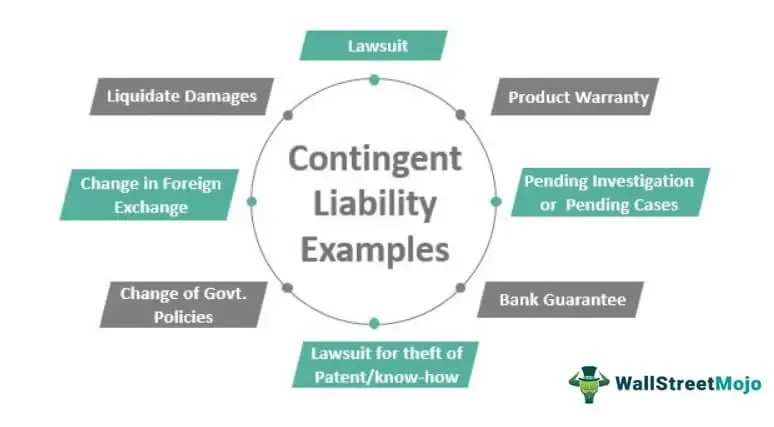

This article examines how accounting standards, financial reporting, contingent liabilities, and algorithmic trading collectively shape modern financial markets and support informed strategic decision-making. Accounting standards offer a framework that ensures financial information is recorded and presented consistently, providing stakeholders with accurate insights into a firm's financial health. This consistency is pivotal in a rapidly evolving market environment, where transparency and comparability are essential for investor confidence and sound decision-making.

Financial reporting plays a crucial role in this process. By adhering to established standards, companies can present a clear and reliable picture of their operations, enabling stakeholders to make informed judgments about past performance and future prospects. Such transparency is particularly significant in identifying and managing contingent liabilities, which represent potential future obligations that depend on uncertain events. Proper recognition and disclosure of these liabilities are vital to reflect a company's true financial position accurately.



Algorithmic trading introduces another layer of complexity to the financial landscape. As trading processes become increasingly automated, the speed and precision of transactions can lead to significant impacts on market behaviors, such as volatility and liquidity. This trajectory necessitates robust governance frameworks to address the risks associated with algorithmic activities. Effective risk management strategies and controls are essential to safeguard market integrity and ensure compliance with regulatory expectations.

By understanding and integrating these elements, firms can navigate the complexities of today's financial environments more efficiently. This article will provide insights into how firms can align their financial reporting practices with the realities of algorithmic trading while effectively managing contingent liabilities to optimize their financial strategies, balance risks, and maintain regulatory compliance.

## Table of Contents

## Understanding Accounting Standards in Financial Reporting

Accounting standards are integral to the infrastructure of financial reporting, providing the necessary rules and guidelines that ensure the consistency, transparency, and comparability of financial statements. At the core of these standards is the Generally Accepted Accounting Principles (GAAP), which serves as a comprehensive framework for financial accounting and reporting.

GAAP comprises a set of accounting principles, standards, and procedures that companies must follow when compiling their financial statements. These principles ensure that the financial statements of different companies are comparable, facilitating stakeholders' ability to assess and compare the financial health of an organization reliably.

One of the key aspects of accounting standards under GAAP is the recognition of financial transactions. Financial recognition involves determining when and how transactions and events should be reflected in the financial statements. For example, revenue recognition dictates when revenue should be considered earned and recorded in the financial statements, ensuring accuracy and consistency.

Measurement, another critical element of GAAP, involves the accurate determination of the monetary amounts at which the financial items are to be recognized and recorded in the financial statements. This may include the valuation of assets and liabilities based on historical cost, fair value, or other relevant bases.

Disclosure is the final pillar of GAAP, emphasizing the importance of providing comprehensive information in financial statements. This transparency is crucial for stakeholders, such as investors and regulators, who rely on detailed financial disclosures to make informed decisions. Proper disclosure under GAAP mandates that all significant financial information, potential risks, and uncertainties are clearly reflected in the notes to the financial statements.

A practical example of these accounting principles in action is the treatment of leases in financial reporting. According to the Financial Accounting Standards Board's (FASB) Topic 842, leases must be recognized as right-of-use assets and corresponding liabilities on the balance sheet. This shift from previous standards reflects a commitment to improving transparency and accountability in financial reporting.

Understanding and applying these standards are crucial for producing accurate financial statements that reflect an organization's true financial position. When companies adhere strictly to GAAP, they enhance the reliability of their reported financial data, fostering trust and confidence among investors, regulators, and other stakeholders. This commitment to standardization also aids in the detection and prevention of fraudulent financial reporting, protecting the integrity of financial markets.

## Contingent Liabilities: Definition and Impact

Contingent liabilities are financial obligations that may occur depending on the outcome of uncertain future events. These liabilities are not certain and hinge on the resolution of specific situations that have yet to transpire. The classification of contingent liabilities into three primary categories—probable, reasonably possible, and remote—plays a crucial role in their financial reporting and influences the assessment of a company's financial health.

1. **Probable Contingent Liabilities**: These are liabilities that are likely to occur, with a high probability. They must be recognized in the financial statements if the financial loss can be reasonably estimated. Under the Generally Accepted Accounting Principles (GAAP), probable liabilities warrant a provision in the financial statements with corresponding disclosures to inform stakeholders of the potential impact.

2. **Reasonably Possible Contingent Liabilities**: These liabilities have a less than likely, but more than remote, chance of occurring. Although they are not recorded as a liability in the financial statements, they require adequate disclosure in the notes to the financial statements. This disclosure provides stakeholders with an understanding of potential financial impacts and ensures transparency.

3. **Remote Contingent Liabilities**: These liabilities are unlikely to occur, and therefore, do not typically require recognition or disclosure in financial statements, except when they are of significant importance. Since the likelihood of occurrence is minimal, they generally have a negligible impact on a company’s perceived financial health.

Recognizing and disclosing contingent liabilities are integral to accurate financial reporting, as these potential obligations can significantly alter a company's financial outlook. Failure to properly classify and report contingent liabilities can lead to misleading financial statements, affecting stakeholder decision-making and company credibility.

The importance of contingent liabilities extends beyond mere compliance with accounting principles. These liabilities can signal underlying risks associated with business operations, legal challenges, or market conditions, and their recognition allows firms to prepare and implement risk management strategies proactively. Consequently, effectively managing contingent liabilities is essential for maintaining a company's overall financial stability.

## Recognition and Disclosure of Contingent Liabilities under GAAP

Under Generally Accepted Accounting Principles (GAAP), the recognition and disclosure of contingent liabilities are governed by specific criteria aimed at ensuring transparency and reliability in financial reporting. The primary consideration in this process is whether the liability is probable and can be reasonably estimated. 

### Recognition Criteria

A contingent liability is recorded in the financial statements if two key conditions are met:

1. **Probability of Occurrence**: The event leading to the obligation must be likely to occur. The term "probable" under GAAP generally suggests a likelihood exceeding 70%. This assessment requires a thorough understanding of potential future events and their impacts on the firm's financial position.

2. **Reasonable Estimation**: The financial obligation arising from the contingent liability must be capable of reasonable estimation. This often involves quantitative assessments and, if necessary, expert consultations to ensure that the cost or financial impact is not speculative but grounded in sound reasoning.

If both conditions are satisfied, the liability is recognized as a debit to an expense account and a credit to a liability account within the financial statements. This approach upholds the consistency and comparability of financial information.

### Disclosure Requirements

Even when contingent liabilities do not meet the criteria for recognition in the financial statements, GAAP mandates their disclosure if there is at least a reasonable possibility of a future loss. This involves including pertinent details in the notes to the financial statements, such as:

- The nature of the contingency
- An estimate of the potential financial impact or a statement explaining why such an estimate cannot be made
- Any potential insurance recovery or mitigation efforts

These disclosures provide stakeholders with critical insights into potential risks that might not yet affect the financial statements' balances but could influence future financial outcomes.

### Assessing Financial Risks

The accurate recognition and disclosure of contingent liabilities are essential for stakeholders to assess potential financial risks realistically. This ensures they have a clear understanding of the company's financial health and its exposure to uncertainties. The nuanced application of these principles protects investors and promotes informed decision-making.

### Example

Consider a scenario where a company is facing a lawsuit. If legal counsel believes an unfavorable outcome is probable and can estimate the settlement amount reasonably, the company should recognize the liability in its financial statements. Conversely, if the outcome is only possible but not probable, disclosure in the notes would suffice, detailing the lawsuit's nature and potential impact.

GAAP's structured approach to recognizing and disclosing contingent liabilities reflects its commitment to accuracy, transparency, and consistency in financial reporting. This framework helps maintain stakeholder confidence and ensures the reliability of financial statements amidst uncertainties.

## The Intersection of Algo Trading and Financial Reporting

Algorithmic trading, a method where computer algorithms automatically execute trading orders at high speed and precision, has significantly transformed modern financial markets. This transformation presents unique challenges for financial reporting, which must adapt to accommodate the shifting landscape of market [volatility](/wiki/volatility-trading-strategies) and risk associated with algo trading.

One primary impact of [algorithmic trading](/wiki/algorithmic-trading) on financial reporting concerns the rapid market movements it often triggers. Algorithms process vast volumes of data in milliseconds, responding to market trends much faster than human traders can. This heightened reactivity exacerbates market volatility, as large sell-offs or buy-ins can occur almost instantaneously based on small changes in market conditions. Financial statements must now [factor](/wiki/factor-investing) in these fluctuations, providing more frequent updates and adjustments to asset valuations to reflect current market realities accurately.

The influence of algorithmic trading extends to risk assessment and reporting. Algo trading strategies rely on complex mathematical models and historical data to predict market movements. However, unexpected events can lead to significant model deviations, creating discrepancies between predicted and actual outcomes. Consequently, firms must enhance their risk management frameworks, incorporating real-time data analysis to monitor potential discrepancies and adjusting strategies accordingly. This dynamic risk reporting allows stakeholders to grasp the risks associated with sudden market shifts more accurately.

Moreover, the integration of algorithmic trading requires robust governance structures to mitigate associated risks, ensuring market integrity and compliance with regulatory expectations. Governance in algo trading involves validating algorithms before deployment, conducting rigorous [backtesting](/wiki/backtesting), and implementing controls like kill switches that can halt trading operations if certain thresholds are breached. These measures protect against erroneous trades that could disrupt financial markets, and their effectiveness must be transparently reported in financial statements to assure stakeholders of the firm's control over its trading strategies.

Compliance with financial reporting standards amidst these agile trading strategies is critical. Algorithmic trading can lead to situations where the valuation of assets and liabilities can shift markedly within reporting periods. Financial reports need to capture these variations, ensuring that the statements reflect the true financial position of the firm at the balance sheet date. The precise recording and reporting of such dynamic transactions call for advanced analytics and robust reporting systems capable of handling high-frequency data.

In summary, algorithmic trading profoundly affects financial reporting, necessitating new approaches to account for increased market volatility and risk. Firms must integrate advanced forecasting and risk management tools to align their financial reporting practices with the realities of fast-paced trading environments. Robust governance and adaptive strategies are essential in maintaining the accuracy and reliability of financial statements amidst the complexities introduced by algorithmic trading.

## Role of Governance and Controls in Algorithmic Trading

Effective governance and controls within algorithmic trading are essential to ensure the stability and integrity of financial markets. With the increasing reliance on sophisticated computer algorithms to execute trades swiftly, the associated risks have also escalated. These risks can manifest in various forms, such as erroneous trades due to programming flaws, unforeseen market impacts, and potential breaches of regulatory compliance. As such, implementing robust governance frameworks and control measures is paramount.

Validating algorithms is a fundamental aspect of governance in algorithmic trading. This process involves ensuring that algorithms operate as intended under diverse market conditions. It requires a comprehensive review and testing phase where potential errors can be identified and corrected. Testing should encompass both historical data analysis and simulated environments to account for various market scenarios.

Backtesting strategies are another critical component of control measures. This practice involves running algorithms against historical market data to evaluate their effectiveness and reliability. Backtesting helps in fine-tuning strategies to maximize returns while mitigating risks. For accurate backtesting, it is crucial that datasets accurately reflect actual market conditions, and potential data biases are addressed.

To mitigate risks, implementing tools like kill switches is imperative. These tools act as crucial fail-safes, enabling traders to halt all trading activities instantaneously should an algorithm behave unexpectedly or market conditions become too volatile. The ability to quickly respond to unforeseen circumstances helps prevent unintended financial losses and maintains market stability.

Compliance with regulatory expectations is a key consideration in algorithmic trading. Regulatory bodies such as the U.S. Securities and Exchange Commission (SEC) and similar institutions globally have specific requirements for trading activities. Firms must ensure that their algorithms adhere to these regulations, which may involve regular audits and disclosures about trading practices and the strategies employed by their algorithms.

In summary, the role of governance and controls in algorithmic trading is multifaceted yet critical. Proper validation of algorithms, thorough backtesting practices, and effective risk mitigation tools are vital in safeguarding the integrity of financial markets. Moreover, compliance with regulatory standards ensures that trading entities operate within legal boundaries, further contributing to the stability and trust in modern financial systems.

## Integrating Risk Assessment in Financial Practices

Risk management is integral to ensuring that accounting standards align seamlessly with trading practices. This alignment is critical as companies strive to maintain financial stability while navigating the complexities of modern financial markets. One of the central elements of this process is the evaluation of contingent liabilities, which are potential obligations that may depend on the result of future events. Accurately assessing these liabilities and strategically incorporating them into trading practices is vital for firms aiming for resilient financial planning.

The process of integrating risk assessment involves a comprehensive understanding of the varied impacts contingent liabilities can have on a firm's financial position. For example, contingent liabilities categorized as "probable" may need to be accounted for more prominently in financial statements as opposed to those considered "remote". This requires firms to continuously monitor developments and reassess their contingent liabilities to reflect the true state of their financial health.

Algorithmic trading further complicates this landscape due to its rapid execution and detailed data requirements. The algorithms used must adapt to the dynamic assessment of contingent liabilities and other risk factors, requiring robust computational capabilities. A practical example in Python for recalibrating trading algorithms based on new risk assessments might involve adjusting the risk thresholds within the algorithm's decision-making processes:

```python
def adjust_trading_risk(threshold, financial_health):
    """
    Adjusts trading risk thresholds based on the firm's assessed financial health.

    Parameters:
    - threshold: Current risk threshold for trades.
    - financial_health: Assessment of the firm's current financial standing.

    Returns:
    - Adjusted risk threshold.
    """
    if financial_health == 'Strong':
        return threshold * 1.1  # Increase threshold for higher risk appetite
    elif financial_health == 'Weak':
        return threshold * 0.9  # Decrease threshold for lower risk appetite
    else:
        return threshold  # No change

# Example usage
current_threshold = 1.0
financial_status = 'Weak'
new_threshold = adjust_trading_risk(current_threshold, financial_status)
print(f"Adjusted trading risk threshold: {new_threshold}")
```

Here, the algorithm adjusts trading risk thresholds based on the firm's financial condition, integrating contingent liabilities into this assessment. Such strategic changes enhance the firm's ability to make informed decisions during trading operations.

The integration of risk assessment into financial practices also supports strategic planning by providing a holistic view of potential risks in volatile markets. By proactively assessing risks and incorporating them into trading strategies, firms can mitigate adverse effects and capitalize on opportunities. This approach fosters a more adaptive and resilient financial strategy, ensuring that organizations remain prepared for potential market fluctuations.

In conclusion, effective risk assessment merging accounting standards with trading practices not only ensures compliance and transparency but also fortifies financial stability. This continuous evaluation allows firms to strategically plan and execute in the unpredictable environment of modern financial markets.

## Conclusion: Navigating Financial Complexity

Balancing accounting standards, financial reporting, contingent liabilities, and algorithmic trading necessitates strategic foresight to ensure operational efficiency and regulatory compliance. Firms must prioritize transparent reporting practices as these are fundamental to trust and accountability in financial markets. This transparency is achieved through adherence to established accounting standards, such as Generally Accepted Accounting Principles (GAAP), which guide the accurate and consistent presentation of financial statements.

Furthermore, leveraging technology is crucial for optimizing trading processes. Algorithmic trading, characterized by its speed and precision, enables firms to execute trades with high efficiency. However, it also introduces complexities, particularly regarding market volatility and risk management. The effective integration of algorithmic trading systems with sound financial reporting mechanisms ensures that firms can capitalize on technological advancements while maintaining market integrity.

The evolving financial landscape demands continuous adaptation and proactive management. Companies must not only respond to current challenges but also anticipate future trends and regulatory changes. This involves a comprehensive risk assessment strategy that evaluates and addresses contingent liabilities—potential obligations dependent on future events—thus safeguarding the company’s financial health.

Ultimately, thriving in this dynamic environment requires a holistic approach, where rigorous governance and control mechanisms are in place to manage risks and ensure compliance with regulatory expectations. Firms that can adeptly balance these elements are well-positioned to navigate financial complexities, leveraging both traditional financial practices and innovative trading technologies to drive strategic growth.

## References & Further Reading

1. Financial Accounting Standards Board (FASB). "Summary of Statement No. 5: Accounting for Contingencies." This document outlines the criteria for recognizing and disclosing contingent liabilities under Generally Accepted Accounting Principles (GAAP). It is an essential resource for understanding how potential obligations are classified and reported. Available at: [FASB Statement No. 5](https://www.fasb.org/).

2. International Financial Reporting Standards (IFRS) Foundation. "IFRS Standards Navigator." This comprehensive guide provides details on the global accounting standards that ensure consistency and transparency in financial reporting across different jurisdictions. Available at: [IFRS Standards](https://www.ifrs.org/issued-standards/).

3. Securities and Exchange Commission (SEC). "Algorithmic Trading: Regulatory Framework and Oversight." This document discusses the regulatory environment governing algorithmic trading, emphasizing the importance of compliance and risk management in maintaining market integrity. Available at: [SEC on Algorithmic Trading](https://www.sec.gov/).

4. Hull, J. C. "Risk Management and Financial Institutions." This textbook offers an in-depth analysis of risk management strategies, critical for integrating accounting standards with modern trading practices. It discusses the role of governance, controls, and risk assessment in financial stability.

5. Snider, M. B., and Calsyn, T. S. "Contingent Liabilities: A Strategic Consideration." This paper explores the strategic implications of contingent liabilities, highlighting their impact on financial decision-making and reporting.

6. Engle, R. F. "Autoregressive Conditional Heteroskedasticity with Estimates of the Variance of UK Inflation." This foundational work presents statistical models that are often used in financial markets to gauge volatility, which is a significant consideration for algorithmic trading.

7. Patterson, S. "Dark Pools: High-Speed Traders, A.I. Bandits, and the Threat to the Global Financial System." This book examines the complexities introduced by high-frequency and algorithmic trading, providing valuable insights into the modern trading environment and its challenges. 

8. Ernst & Young. "Building a Better Working World: Managing Market Volatility with Advanced Trading Technology." This report discusses how technological advances in trading systems impact financial reporting and risk management practices. Available at: [EY Insights](https://www.ey.com/).

9. Deloitte. "Governance and Control in Algorithmic Trading: Achieving Compliance and Strategic Alignment." This publication provides guidance on establishing robust governance systems to ensure algorithmic trading aligns with regulatory and strategic objectives. Available at: [Deloitte](https://www2.deloitte.com/).

These resources provide a comprehensive understanding of the critical elements affecting modern financial practices, from accounting standards and reporting to the complexities introduced by algorithmic trading.

