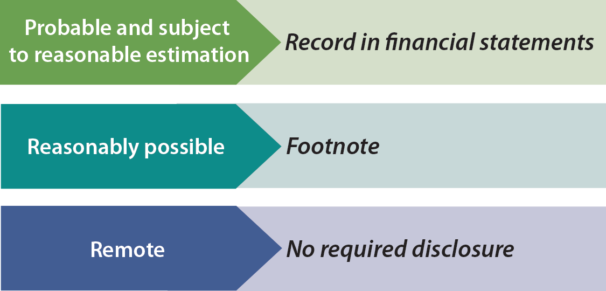

## Table of Contents

## What is a contingent liability in accounting?

A contingent liability is a potential financial obligation that might happen in the future, depending on the outcome of a certain event. It's something that a company knows about but can't be sure will actually happen. For example, if a company is being sued, it might have to pay money if it loses the case. This possible payment is a contingent liability.

In accounting, companies have to mention contingent liabilities in their financial statements if there's a good chance they will happen and if the amount can be reasonably estimated. This is important because it helps people who look at the financial statements understand all the risks the company might face. However, if the chance of the event happening is very small, the company doesn't have to include it in the financial statements.

## How do contingent liabilities differ from actual liabilities?

Contingent liabilities and actual liabilities are different because actual liabilities are debts or obligations that a company definitely has to pay. For example, if a company borrows money from a bank, it has an actual liability because it must pay back the loan. On the other hand, contingent liabilities are potential debts that might happen depending on future events. For instance, if a company is being sued, it might have to pay money if it loses the case, but it's not certain yet.

The way these liabilities are shown in financial statements also differs. Actual liabilities are always included in the balance sheet because they are certain and their amounts are known. Contingent liabilities, however, are only mentioned in the notes to the financial statements if there's a good chance they will happen and if the amount can be estimated. If the chance of the event happening is very small, the company doesn't have to mention it at all. This helps people understand the risks a company might face, but it also shows that these risks are not guaranteed to become real debts.

## What are the common examples of contingent liabilities?

Common examples of contingent liabilities include lawsuits and legal claims. If a company is being sued, it might have to pay money if it loses the case. This possible payment is a contingent liability because it depends on the outcome of the lawsuit. Another example is when a company gives a warranty on its products. If the products have problems, the company might have to fix them or give refunds, but it's not certain how many products will have issues.

Another type of contingent liability is related to environmental issues. For example, if a company is found to have polluted a river, it might have to pay for the cleanup, but this depends on whether it is proven responsible. Similarly, companies might face contingent liabilities from government investigations or fines. If a company is being investigated for breaking a law, it might have to pay a fine if found guilty, but it's not certain until the investigation is finished.

These examples show that contingent liabilities are potential financial obligations that depend on future events. They are important for companies to consider because they could affect the company's financial health, even though they are not guaranteed to happen.

## When should a contingent liability be recorded in the financial statements?

A contingent liability should be recorded in the financial statements if it is likely to happen and if the amount can be reasonably estimated. "Likely to happen" means there's a good chance it will occur, usually more than 50%. For example, if a company is being sued and it looks like they might lose, they should record this as a contingent liability. The amount should be based on what they think they might have to pay.

If the chance of the event happening is not as high, or if it's hard to guess how much it might cost, the company doesn't have to record it in the financial statements. Instead, they might just mention it in the notes to the financial statements. This way, people who look at the financial statements know about the risk, but it's not treated as a sure thing. For instance, if there's a small chance a company might have to pay for environmental cleanup, they would just note it rather than recording it as a liability.

## What is the difference between a probable, reasonably possible, and remote contingent liability?

The difference between a probable, reasonably possible, and remote contingent liability is based on how likely it is that the event will happen. A probable contingent liability means there's a good chance, more than 50%, that the company will have to pay. For example, if a company is being sued and it looks like they will lose, this would be a probable contingent liability. When it's probable and the amount can be estimated, the company has to record it in their financial statements.

A reasonably possible contingent liability means there's a chance it could happen, but it's not as likely as probable. It's somewhere in the middle. If a company is being investigated for breaking a rule but it's not clear if they will be found guilty, this would be a reasonably possible contingent liability. These don't have to be recorded in the financial statements, but the company should mention them in the notes so people know about the risk.

A remote contingent liability means there's a very small chance it will happen. For example, if a company might have to pay a fine for something that's very unlikely to be their fault, this would be a remote contingent liability. These don't need to be recorded in the financial statements or even mentioned in the notes because the risk is so low.

## How is a contingent liability disclosed in the financial statements?

A contingent liability is disclosed in the financial statements based on how likely it is to happen. If it's probable that the company will have to pay and the amount can be guessed pretty well, then the company records it right in the financial statements. This means they show it as a liability on their balance sheet. For example, if a company is being sued and it looks like they will lose, they would put the estimated amount they might have to pay on their balance sheet.

If the chance of the event happening is not as high, like it's reasonably possible, the company doesn't record it in the financial statements. Instead, they mention it in the notes to the financial statements. This way, people who look at the financial statements know about the risk, but it's not treated as a sure thing. For example, if a company might have to pay for environmental cleanup but it's not clear if they will be responsible, they would write about it in the notes.

If the chance of the event happening is very small, meaning it's remote, the company doesn't have to mention it at all in the financial statements or the notes. This is because the risk is so low that it's not important enough to tell people about. For instance, if there's a tiny chance a company might have to pay a fine for something that's very unlikely to be their fault, they wouldn't need to disclose it anywhere.

## What are the accounting standards that govern the treatment of contingent liabilities?

The main accounting standards that govern the treatment of contingent liabilities are the Generally Accepted Accounting Principles (GAAP) in the United States and the International Financial Reporting Standards (IFRS) used globally. Under GAAP, companies must record a contingent liability on their balance sheet if it is probable that the liability will occur and the amount can be reasonably estimated. If the likelihood is only reasonably possible, the company should disclose the contingent liability in the notes to the financial statements. If the likelihood is remote, no disclosure is needed.

Similarly, under IFRS, a contingent liability is recognized in the financial statements if it is probable that an outflow of resources will be required to settle the obligation and the amount can be reliably measured. If the likelihood is less than probable but more than remote, the contingent liability should be disclosed in the notes to the financial statements. If the likelihood is remote, no disclosure is required. Both standards aim to provide transparency about potential financial risks to those who read the financial statements.

## How do you estimate the amount of a contingent liability?

Estimating the amount of a contingent liability can be tricky because it depends on what might happen in the future. For example, if a company is being sued, they might need to guess how much they might have to pay if they lose the case. To do this, they could look at similar past cases and see what other companies had to pay. They might also talk to lawyers who know about these kinds of cases and get their best guess on the amount. The goal is to come up with a number that seems fair and likely, even if it's not exact.

Once the company has a good idea of what they might have to pay, they need to think about how sure they are about that number. If they feel pretty confident in their guess, they can use that amount for the contingent liability. But if there's a lot of uncertainty, they might need to use a range of possible amounts instead. For example, they might say it could be anywhere from $10,000 to $50,000. This helps everyone who looks at the financial statements understand the risk better, even if the exact amount is hard to pin down.

## What are the impacts of contingent liabilities on a company's financial health?

Contingent liabilities can affect a company's financial health in big ways. If a contingent liability turns into a real one, like if a company loses a lawsuit and has to pay a lot of money, it can hurt the company's profits and make it harder to pay its bills. This can also make the company's financial statements look worse, which might make investors and banks less willing to give them money. If people think the company might have to pay a lot for something that might happen, they might not want to invest in it or lend it money.

But even if the contingent liability doesn't turn into a real one, just knowing about it can still affect the company. If the company has to tell everyone about a big possible problem in its financial statements, it might make people worried. This worry can make the company's stock price go down or make it harder for the company to get loans. So, even if the company never actually has to pay anything, the possibility of having to pay can still cause financial trouble.

## How should changes in the status of a contingent liability be handled in accounting?

When the status of a contingent liability changes, a company needs to update its financial statements to reflect the new situation. If a contingent liability that was thought to be probable becomes more certain, the company might need to adjust the amount recorded on its balance sheet. For example, if a lawsuit that seemed likely to result in a payment now has a clearer outcome with a different amount, the company would change the liability to match the new estimate. This helps keep the financial statements accurate and up-to-date.

If the likelihood of a contingent liability happening changes, the company also needs to update how it's reported. If a contingent liability goes from being reasonably possible to probable, the company would move it from the notes to the financial statements to being recorded on the balance sheet. On the other hand, if the likelihood drops to remote, the company might remove any mention of it from the financial statements altogether. Keeping track of these changes is important because it shows the current risks the company faces and helps everyone understand its financial health better.

## What are the best practices for managing and reporting contingent liabilities?

Managing and reporting contingent liabilities well is important for a company's financial health. A good practice is to keep a close eye on any events that could turn into liabilities, like lawsuits or warranty claims. Companies should work with lawyers and other experts to understand how likely these events are to happen and how much they might cost. This helps them make better guesses about what they might have to pay. It's also a good idea to have a clear plan for what to do if a contingent liability turns into a real one. This could mean setting aside money to cover possible costs or having insurance to help with big payments.

When it comes to reporting, companies should be honest and clear about their contingent liabilities. If something is likely to happen and they can guess the cost, they should show it right in their financial statements. If it's less certain, they should at least mention it in the notes so people know about the risk. It's important to update these reports if the situation changes, like if a lawsuit gets more serious or less likely. By being open about these possible problems, companies can help investors and others understand their financial situation better and make smarter decisions.

## How do international accounting standards compare to U.S. GAAP in treating contingent liabilities?

International Financial Reporting Standards (IFRS) and U.S. Generally Accepted Accounting Principles (GAAP) both have rules for how to deal with contingent liabilities, but they are a bit different. Under IFRS, a company has to show a contingent liability in their financial statements if it's likely they will have to pay and they can guess the amount pretty well. If it's not as likely but still could happen, they just mention it in the notes. If it's very unlikely, they don't have to say anything. U.S. GAAP is similar, but it uses the words "probable," "reasonably possible," and "remote" to describe how likely something is to happen. If it's probable and they can guess the amount, they show it in the financial statements. If it's reasonably possible, they mention it in the notes. If it's remote, they don't have to say anything.

The main difference between IFRS and U.S. GAAP is in how they talk about how likely something is to happen. IFRS uses "probable" and "possible," while U.S. GAAP uses "probable," "reasonably possible," and "remote." This can make a small difference in how companies report their contingent liabilities. Both sets of rules want to make sure that people who look at the financial statements know about the risks a company might face, but they use slightly different words and ways to explain it.

## References & Further Reading

1. Financial Accounting Standards Board (FASB). "Summary of Statement No. 5: Accounting for Contingencies." This document outlines the criteria for recognizing and disclosing contingent liabilities under Generally Accepted Accounting Principles (GAAP). It is an essential resource for understanding how potential obligations are classified and reported. Available at: [FASB Statement No. 5](https://www.fasb.org/).

2. International Financial Reporting Standards (IFRS) Foundation. "IFRS Standards Navigator." This comprehensive guide provides details on the global accounting standards that ensure consistency and transparency in financial reporting across different jurisdictions. Available at: [IFRS Standards](https://www.ifrs.org/issued-standards/).

3. Securities and Exchange Commission (SEC). "Algorithmic Trading: Regulatory Framework and Oversight." This document discusses the regulatory environment governing algorithmic trading, emphasizing the importance of compliance and risk management in maintaining market integrity. Available at: [SEC on Algorithmic Trading](https://www.sec.gov/).

4. Hull, J. C. "Risk Management and Financial Institutions." This textbook offers an in-depth analysis of risk management strategies, critical for integrating accounting standards with modern trading practices. It discusses the role of governance, controls, and risk assessment in financial stability.

5. Snider, M. B., and Calsyn, T. S. "Contingent Liabilities: A Strategic Consideration." This paper explores the strategic implications of contingent liabilities, highlighting their impact on financial decision-making and reporting.

6. Engle, R. F. "Autoregressive Conditional Heteroskedasticity with Estimates of the Variance of UK Inflation." This foundational work presents statistical models that are often used in financial markets to gauge volatility, which is a significant consideration for algorithmic trading.

7. Patterson, S. "Dark Pools: High-Speed Traders, A.I. Bandits, and the Threat to the Global Financial System." This book examines the complexities introduced by high-frequency and algorithmic trading, providing valuable insights into the modern trading environment and its challenges. 

8. Ernst & Young. "Building a Better Working World: Managing Market Volatility with Advanced Trading Technology." This report discusses how technological advances in trading systems impact financial reporting and risk management practices. Available at: [EY Insights](https://www.ey.com/).

9. Deloitte. "Governance and Control in Algorithmic Trading: Achieving Compliance and Strategic Alignment." This publication provides guidance on establishing robust governance systems to ensure algorithmic trading aligns with regulatory and strategic objectives. Available at: [Deloitte](https://www2.deloitte.com/).

These resources provide a comprehensive understanding of the critical elements affecting modern financial practices, from accounting standards and reporting to the complexities introduced by [algorithmic trading](/wiki/algorithmic-trading).

