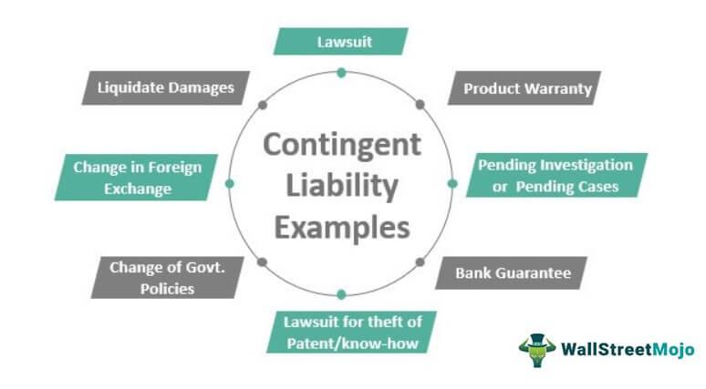

In the complex world of finance and accounting, understanding key concepts such as contingent liabilities and algorithmic trading is crucial for businesses and investors. Contingent liabilities refer to potential financial obligations that may arise depending on the outcome of future events. These liabilities can significantly impact a company’s financial health as they represent uncertainties that must be accounted for in financial planning and reporting. Examples of contingent liabilities include pending lawsuits and product warranties, which require careful estimation and disclosure to provide an accurate picture of a company’s obligations.

On the other hand, algorithmic trading, often referred to as algo trading, involves the use of computer algorithms to automate trading processes. This innovative approach to trading is designed for speed and efficiency, allowing for the execution of large volumes of trades with minimal human intervention. By minimizing human emotions and errors, algorithmic trading offers potential advantages in today’s fast-paced markets, such as increased accuracy, the ability to backtest strategies, and improved transaction speeds.



This article aims to provide readers with a clearer understanding of these concepts and their implications in the financial world. By exploring contingent liabilities and algorithmic trading, we can appreciate their roles and applications and how they contribute to strategic decision-making and risk management in finance.

## Table of Contents

## Understanding Contingent Liabilities

Contingent liabilities are potential obligations that may arise from events that are uncertain at present, but will resolve in the future. They are vital in accounting, offering transparency regarding a company’s financial status and potential future obligations. The Generally Accepted Accounting Principles (GAAP) classify contingent liabilities into three categories based on the likelihood of their future occurrence: probable, possible, and remote.

A contingent liability deemed probable has a high likelihood of occurrence, and its financial impact can be reasonably estimated. Such liabilities need to be reflected in the company's financial statements. For instance, if a company faces litigation with high chances of losing, and the potential financial loss can be estimated, this must be recorded in the financial statements. The accounting entry typically involved includes:

$$
\text{Debit: Contingency Expense}
$$
$$
\text{Credit: Contingent Liability}
$$

Possible contingent liabilities, which might occur but are not certain, require disclosure in the notes of the financial statements rather than being recorded on the balance sheet or income statement. This disclosure provides stakeholders with insight into potential financial risks without impacting the current financial statements.

Lastly, remote contingent liabilities are circumstances where the likelihood of the event occurring is minimal, and therefore, no reporting in the financial statements or notes is necessary.

Examples illustrating contingent liabilities include pending lawsuits and product warranties. In a pending lawsuit, a company might have to pay damages if the court's decision is unfavorable. Product warranties require a company to forecast possible future costs linked to repairing or replacing products, hence recognizing a warranty liability. These examples emphasize the importance of accounting for potential obligations that hinge on the outcomes of future events.

## Accounting for Contingent Liabilities

The accounting treatment for contingent liabilities involves assessing both their likelihood and measurability. Contingent liabilities are essential to financial reporting as they provide stakeholders with an understanding of potential future obligations that a company may face. According to Generally Accepted Accounting Principles (GAAP) and International Financial Reporting Standards (IFRS), the treatment of these liabilities varies based on the probability of their occurrence and the ability to estimate them.

When both the likelihood of the contingent liability occurring and the estimable amount are confirmed, the liability must be recorded in the financial statements. In this scenario, the company should recognize the contingent liability in both the balance sheet and the income statement. This involves creating a liability account for the estimated amount and recording an expense that corresponds to the potential loss or obligation. For example, if a company is facing a lawsuit where the probability of losing is high and the settlement can be reasonably estimated, the financial statements will reflect this liability.

If the likelihood of the contingent liability is possible but the amount cannot be precisely quantified, standard accounting practices require that the company disclose this potential obligation in the notes to the financial statements. This disclosure should provide information on the nature of the contingency and an estimate of the potential financial impact, if feasible. Disclosures ensure transparency by informing investors and stakeholders of possible future financial obligations without affecting the current balance sheet figures.

By accounting for contingent liabilities according to their likelihood and measurability, companies can ensure compliance with GAAP and IFRS. This compliance is crucial for maintaining transparent and accurate financial records, reinforcing investor confidence and ensuring that financial statements present a true and fair view of the company's financial health. Proper accounting for contingent liabilities also allows for better financial planning and risk management by acknowledging potential future costs and obligations.

## Examples of Contingent Liabilities

Pending lawsuits serve as a prime example of contingent liabilities, as they involve uncertain outcomes that can significantly affect a company's financial status. When a company is involved in litigation, there is always a possibility, however uncertain, that the case will result in a financial loss. This potential financial burden must be accounted for by assessing the probability of the loss occurring and its potential financial impact. Accounting standards necessitate that if the loss is probable and can be reasonably estimated, it should be recorded in the financial statements.

Another common form of contingent liability is product warranties, which require businesses to estimate future costs associated with warranty claims. Companies must project the likelihood of defects or failures in their products and the related costs of repairs or replacements. This foresight leads to the creation of a warranty liability on the balance sheet, ensuring that potential future costs are anticipated and preparatively managed. The estimation process can involve various statistical and historical data analysis techniques to predict the extent of potential warranty claims.

These examples emphasize the critical importance of anticipating and preparing for financial obligations that hinge on uncertain future events. By recognizing and appropriately managing contingent liabilities, companies can ensure financial stability and maintain accurate and transparent financial reporting, which is essential for investor confidence and regulatory compliance.

## Algorithmic Trading: An Overview

Algorithmic trading, often referred to as algo trading, employs complex computer programs to facilitate and automate financial trading operations. These automated systems are designed to execute orders in the financial markets with speed and precision that human traders cannot match. Built on intricate mathematical models, they analyze a plethora of market variables, such as price, timing, and [volume](/wiki/volume-trading-strategy), to make trades at optimal moments. This methodology enables the handling of substantial volumes of trades efficiently, driven by pre-programmed instructions that reflect specific market-making strategies.

The speed and accuracy afforded by [algorithmic trading](/wiki/algorithmic-trading) are two of its most celebrated advantages. In a market where milliseconds can mean the difference between profit and loss, the ability to place trades instantaneously gives traders a significant edge. By executing trades in rapid succession, algorithmic trading ensures that orders are placed or canceled promptly, thereby optimizing the opportunity for favorable price conditions. This advantage is critical when dealing with large volumes, as it helps in managing price impact and slippage — the difference between the expected price of a trade and the actual price.

Another significant benefit of algorithmic trading is its capacity to minimize errors rooted in human emotions, such as fear or greed, which can lead to irrational decision-making. Emotions can often lead to suboptimal trading decisions, such as panic selling or holding onto losing positions for too long in the hope that the market will turn in their favor. By automating the trading process, algorithmic systems adhere strictly to predefine strategies without deviation, thus fostering a more disciplined approach to trading.

The integration of algorithmic trading into financial markets has transformed the landscape, not only altering market dynamics but also influencing traditional trading strategies. Algo trading strategies can range from [trend following](/wiki/trend-following) to statistical [arbitrage](/wiki/arbitrage) and [market making](/wiki/market-making), each designed to exploit different market inefficiencies and opportunities. The breadth of these strategies allows traders to adapt to various market conditions and objectives, thereby maximizing their potential for profitability.

In conclusion, algorithmic trading serves as a robust method for navigating the complexity and [volatility](/wiki/volatility-trading-strategies) of modern financial markets. Its emphasis on speed, precision, and emotional detachment formulates a significant advantage, particularly in high-frequency trading scenarios, where even minor delays can lead to substantial financial impacts. As technology continues to evolve, the sophistication and influence of algorithmic trading are likely to expand, promising ongoing transformations in how trading is conducted globally.

## Benefits and Considerations of Algo Trading

Algorithmic trading, commonly known as algo trading, offers a multitude of advantages that significantly enhance the trading process. One of the foremost benefits is the increased speed of transactions. By utilizing complex algorithms, trades can be executed within fractions of a second. This rapid execution is critical in high-frequency trading environments, where milliseconds can impact profitability.

Another advantage is improved accuracy in trading. Algorithms eliminate human errors and biases, thus leading to more precise trade execution. For example, algorithms can be programmed to follow specific trading strategies, ensuring consistency and strict adherence to predefined rules. This precision helps minimize slippage and improves overall trading outcomes.

Algo trading also provides the capability to backtest trading strategies. Backtesting involves running a trading strategy on historical data to evaluate its effectiveness before live deployment. By analyzing past performance, traders can refine their strategies, reducing the risk of losses. Here's a simple Python example illustrating the concept of [backtesting](/wiki/backtesting):

```python
import pandas as pd

def backtest_strategy(price_data, buy_threshold, sell_threshold):
    capital = 10000
    position = 0
    portfolio_value = capital
    for price in price_data:
        if price < buy_threshold and capital > price:
            position += 1
            capital -= price
        elif price > sell_threshold and position > 0:
            position -= 1
            capital += price
    portfolio_value += position * price_data[-1]
    return portfolio_value

# Example price data over a period
price_data = [100, 105, 102, 98, 95, 97, 110]
final_value = backtest_strategy(price_data, 100, 105)
print("Final portfolio value:", final_value)
```

Despite these benefits, algorithmic trading requires robust technical infrastructure. Efficient hardware and software systems are critical for processing large volumes of data and executing trades seamlessly. Additionally, maintaining low latency with exchange servers can be vital in fast-paced trading environments.

Furthermore, algo trading faces significant regulatory scrutiny. Regulatory bodies like the U.S. Securities and Exchange Commission (SEC) and the European Securities and Markets Authority (ESMA) impose rules to ensure fair and efficient markets. Traders must ensure their strategies comply with regulations, such as avoiding market manipulation tactics.

In summary, while algorithmic trading presents numerous benefits, including speed, accuracy, and strategic testing, it also necessitates strong technical systems and adherence to market regulations to operate successfully and ethically.

## Integrating Accounting and Algo Trading in Finance

Integrating accounting principles, specifically contingent liabilities, into algorithmic trading frameworks can enhance the decision-making capability of traders. Recognizing these potential financial obligations within a company's financial statements allows traders to refine their risk assessments and develop more robust trading strategies.

Contingent liabilities, which are potential obligations that depend on the outcome of future events, are crucial for understanding a company’s financial health. For algorithmic traders, this understanding can be translated into algorithms that assess a company's financial stability in real-time. For instance, traders can integrate data from financial statements to analyze the probability and potential impact of these liabilities. This integration can be mathematically represented using probability theory to determine expected loss values that could affect a company’s stock price.

By automating the analysis of contingent liabilities, traders can efficiently react to new information and adjust their strategies accordingly. Consider the following simplified Python code that illustrates how one might incorporate risk assessment based on contingent liabilities:

```python
def calculate_expected_loss(probability, estimated_loss):
    return probability * estimated_loss

def evaluate_risk(contingent_liabilities):
    expected_losses = []
    for liability in contingent_liabilities:
        loss = calculate_expected_loss(liability['probability'], liability['estimated_loss'])
        expected_losses.append(loss)
    total_expected_loss = sum(expected_losses)
    return total_expected_loss

contingent_liabilities = [
    {'probability': 0.7, 'estimated_loss': 100000},
    {'probability': 0.3, 'estimated_loss': 200000}
]

total_risk = evaluate_risk(contingent_liabilities)
print(f"Total Expected Loss: ${total_risk:.2f}")
```

In this example, the function `calculate_expected_loss` computes the expected loss for each contingent liability, and `evaluate_risk` aggregates these to project an overall risk. Algorithmic trading platforms could incorporate similar calculations to proactively adjust portfolios based on dynamic financial risks.

Moreover, incorporating contingent liabilities into algorithmic models allows for a more comprehensive financial analysis, leading to more strategic trades. As algorithms evolve to interpret complex financial data, the ability to anticipate and account for potential liabilities will play a pivotal role in optimizing trading decisions and enhancing market outcomes.

## Conclusion

Mastering the concepts of contingent liabilities and algorithmic trading is essential for individuals and organizations involved in modern financial markets. These two aspects, although seemingly disparate, are interconnected components of a comprehensive financial strategy.

Accurate accounting of contingent liabilities provides a transparent view of a company's potential financial exposures. This vigilance in financial reporting ensures compliance with global accounting standards such as GAAP (Generally Accepted Accounting Principles) and IFRS (International Financial Reporting Standards). By accounting for probable liabilities such as lawsuits or warranty obligations, businesses can better anticipate financial challenges, which assists stakeholders in making informed decisions.

Simultaneously, strategic algorithmic trading serves as a powerful tool that leverages technology to enhance trading efficiency and effectiveness. The automation of trading through algorithms minimizes human error and enables rapid executions that capitalize on minute market fluctuations. Algorithmic trading also allows for extensive backtesting of trading strategies, thereby optimizing performance based on historical data.

The integration of precise accounting practices with algorithmic trading can significantly improve financial performance. A comprehensive understanding of a company’s financial obligations allows traders to refine their risk assessment and trading strategies. For instance, algorithmic systems could incorporate financial metrics such as contingent liabilities when scanning for investment opportunities, thereby aligning trading actions with a company's financial health.

By adopting these integrated approaches, businesses and investors can cultivate a competitive edge in the financial arena. The fusion of accounting vigilance with technological prowess fosters an environment where financial risks are managed effectively, and opportunities are pursued with confidence. Ultimately, this combination equips entities with the tools necessary to thrive in a dynamic and challenging financial landscape.

## References & Further Reading

[1]: ["Contingent Liabilities - Financial Accounting Standards Board (FASB)"](https://www.fasb.org/jsp/FASB/Document_C/DocumentPage?cid=1218220131280&acceptedDisclaimer=true)

[2]: Hull, J. C. (2018). ["Options, Futures, and Other Derivatives"](https://www.semanticscholar.org/paper/Options%2C-Futures%2C-and-Other-Derivatives-Hull/89bdee500c8623864fc9eb7a471546aa713acc44) (10th Edition). Pearson.

[3]: Hasbrouck, J. (2007). ["Empirical Market Microstructure: The Institutions, Economics, and Econometrics of Securities Trading"](https://academic.oup.com/book/52241) Oxford University Press.

[4]: Lakshmi Narasimhan, A., & Rachev, S. (2018). ["Advances in Risk Management"](https://aapm.onlinelibrary.wiley.com/doi/10.1002/mp.16220) Elsevier Academic Press.

[5]: Fabozzi, F. J., & Koller, T. (2020). ["Equity Valuation: Science, Art, or Craft?"](https://papers.ssrn.com/sol3/papers.cfm?abstract_id=3254580) CFA Institute.