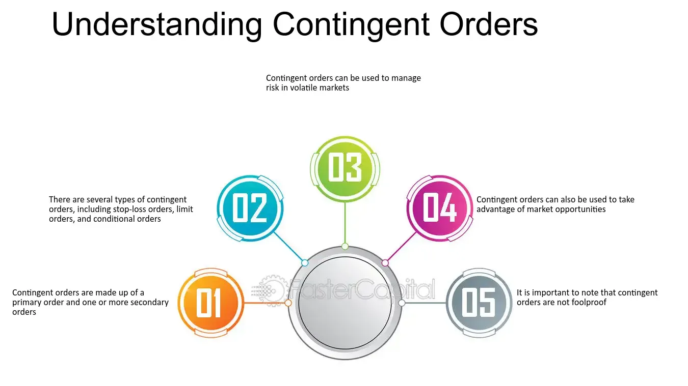

## Table of Contents

## What is a contingent order?

A contingent order is a type of order that you set up to happen only if certain conditions are met. It's like saying, "I want to buy this stock, but only if its price goes down to a certain level." This can be useful for investors who want to make sure they buy or sell at the right time without having to watch the market all the time.

For example, you might set a contingent order to buy a stock if its price drops to $50. If the stock never reaches $50, the order won't go through. This helps you stick to your investment plan and avoid making quick decisions based on emotions. Contingent orders can include things like stop orders, which trigger a buy or sell when a stock reaches a specific price, and limit orders, which set a maximum or minimum price at which you're willing to trade.

## How does a contingent order differ from a standard order?

A contingent order is different from a standard order because it only happens if certain things happen first. A standard order, on the other hand, goes through right away as long as there's someone to take the other side of the trade. So, if you put in a standard order to buy a stock at the current price, it will happen quickly if there's a seller at that price.

With a contingent order, you might say, "I want to buy this stock, but only if its price goes down to $50." If the stock never hits $50, your order won't go through. This can be helpful because it lets you set up your trades in advance based on what you think will happen in the market, without having to watch it all the time. Standard orders are simpler and more immediate, but contingent orders give you more control over when your trade happens.

## What are the basic types of contingent orders?

There are a few basic types of contingent orders that people use when trading. The first type is a stop order. A stop order is used to buy or sell a stock once it reaches a certain price. For example, if you own a stock and you want to sell it if the price drops to $40, you can set a stop order at $40. This helps protect your investment by limiting how much you might lose if the price goes down a lot.

Another type of contingent order is a limit order. A limit order lets you set a specific price at which you want to buy or sell a stock. For example, you might want to buy a stock, but only if you can get it for $50 or less. You can set a limit order to buy at $50, and if the stock price ever hits $50, your order will go through. This helps you make sure you get a good price for your trade.

The last type is a stop-limit order, which combines features of both stop and limit orders. With a stop-limit order, you set two prices: a stop price and a limit price. When the stock hits the stop price, it triggers a limit order at the limit price. For example, you might set a stop price at $40 and a limit price at $39. If the stock falls to $40, it triggers a limit order to sell at $39 or better. This gives you more control over the price at which your order is filled.

## Can you explain how a stop-loss order works as a contingent order?

A stop-loss order is a type of contingent order that helps you limit your losses on a stock. When you set a stop-loss order, you pick a price at which you want to sell your stock if it starts to go down. For example, if you bought a stock for $50 and you don't want to lose more than $5, you might set a stop-loss order at $45. If the stock price drops to $45, your stop-loss order will trigger and sell your stock automatically. This way, you can protect your investment from losing too much value.

Stop-loss orders are useful because they help you manage risk without having to watch the market all the time. They act like a safety net, making sure you don't lose more money than you're comfortable with. However, it's important to remember that the price you get when your stop-loss order triggers might not be exactly $45. If the stock is falling fast, it might sell at a slightly lower price. Still, a stop-loss order is a good tool for setting limits on how much you're willing to lose on a trade.

## What is a stop-limit order and how is it used?

A stop-limit order is a type of order that combines a stop order and a limit order. It helps you control when you buy or sell a stock by setting two prices: a stop price and a limit price. When the stock hits the stop price, it triggers a limit order at the limit price. For example, if you own a stock and want to sell it if the price drops to $40, but only if you can sell it for at least $39, you would set a stop price at $40 and a limit price at $39.

Using a stop-limit order can be helpful because it gives you more control over the price at which your trade happens. If the stock price hits $40, your order will be triggered, but it will only go through if someone is willing to buy your stock at $39 or better. This can be useful if you want to make sure you get a certain price for your stock, but it also means there's a chance your order won't be filled if the stock price keeps falling and no one buys at your limit price. So, stop-limit orders are a good tool for managing your trades, but you need to be aware of the risks that come with them.

## How can contingent orders be applied in trading strategies?

Contingent orders are really helpful in trading because they let you set up your trades in advance based on what you think the market will do. For example, if you think a stock is going to go up but you want to buy it at a lower price, you can use a limit order to buy the stock only if it drops to that price. This way, you don't have to watch the market all the time. You can also use a stop-loss order to protect your investment. If you buy a stock and it starts to go down, a stop-loss order can sell it automatically at a price you set, so you don't lose too much money.

Another way to use contingent orders is with a stop-limit order. This can be useful if you want to sell a stock when it drops to a certain price, but only if you can get a good price for it. For example, you might set a stop price at $40 and a limit price at $39. If the stock hits $40, your order will trigger, but it will only go through if someone is willing to buy it at $39 or better. This gives you more control over when and at what price your trade happens. By using these types of orders, you can create a trading strategy that helps you stick to your plan and manage risk without having to watch the market constantly.

## What are the risks associated with using contingent orders?

Using contingent orders can be really helpful, but they also come with some risks. One big risk is that your order might not get filled. For example, if you set a limit order to buy a stock at a certain price, but the stock never reaches that price, your order won't go through. This can be frustrating if you miss out on a good opportunity because the stock price moved too quickly.

Another risk is that you might end up selling your stock at a worse price than you expected. With a stop-loss order, if the stock price drops fast, your order might be filled at a lower price than you set. This can happen during times when the market is very volatile, and it can lead to bigger losses than you planned for. So, it's important to understand these risks and use contingent orders carefully as part of your trading strategy.

## How do market conditions affect the execution of contingent orders?

Market conditions can really change how well your contingent orders work. If the market is moving fast and prices are changing a lot, your orders might not get filled at the exact price you want. For example, if you set a stop-loss order to sell a stock at $40, but the market is dropping quickly, your stock might end up selling for less than $40. This can happen because there might not be enough buyers at your stop price, so your order gets filled at the next available price, which could be lower.

On the other hand, if the market is calm and prices are stable, your contingent orders are more likely to be filled at the price you set. But even in calm markets, there can be times when there aren't enough buyers or sellers at your chosen price, so your order might not go through at all. It's important to keep an eye on market conditions and understand that they can affect whether your contingent orders work the way you want them to.

## Can contingent orders be used for both buying and selling securities?

Yes, contingent orders can be used for both buying and selling securities. When you want to buy a stock, you can set a limit order to buy it only if the price drops to a certain level. For example, if you think a stock is a good buy at $50, you can set a limit order to buy it if the price reaches $50 or lower. This way, you can get the stock at a price you're happy with without having to watch the market all the time.

You can also use contingent orders to sell securities. A common type of order for selling is a stop-loss order. If you own a stock and you want to limit your losses, you can set a stop-loss order to sell the stock if its price drops to a certain level, like $40. This helps protect your investment by making sure you don't lose too much money if the stock price goes down. Another option is a stop-limit order, which lets you set both a stop price and a limit price, giving you more control over the price at which you sell.

## What advanced features do some trading platforms offer for contingent orders?

Some trading platforms offer advanced features for contingent orders that can help you manage your trades better. One common feature is the ability to set multiple contingent orders at the same time. This means you can set up different orders for buying and selling based on different price levels, all at once. For example, you could set a stop-loss order to sell a stock if it drops to $40, and at the same time, set a limit order to buy more of the stock if it goes down to $35. This way, you can cover different scenarios without having to keep changing your orders.

Another advanced feature is the option to use trailing stops. A trailing stop is a type of stop-loss order that moves with the price of the stock. If the stock price goes up, the trailing stop moves up with it, but if the stock price goes down, the trailing stop stays where it is. This can help you lock in profits while still protecting against big losses. Some platforms also let you set up conditional orders, which are orders that only go through if certain other conditions are met, like if another stock reaches a certain price. These features give you more flexibility and control over your trading strategy.

## How can algorithmic trading utilize contingent orders effectively?

Algorithmic trading can use contingent orders to make trading decisions based on specific rules and conditions without needing a person to watch the market all the time. For example, an algorithm might use a stop-loss order to sell a stock if its price drops to a certain level, helping to limit losses automatically. The algorithm can also set up limit orders to buy or sell stocks at prices that the trader thinks are good, making sure the trades happen only when the market reaches those prices. This way, the algorithm can follow a trading plan precisely, even when the market is moving quickly.

Another way [algorithmic trading](/wiki/algorithmic-trading) can use contingent orders is by setting up complex strategies with multiple orders. For instance, an algorithm might use a stop-limit order to sell a stock if it falls to a certain price, but only if it can be sold at a slightly higher price. This gives the algorithm more control over the price at which the trade happens. Additionally, algorithms can use trailing stops to lock in profits as a stock's price goes up, while still protecting against big drops. By using these advanced features of contingent orders, algorithmic trading can manage risk and take advantage of market opportunities more effectively.

## What are the regulatory considerations when using contingent orders in different markets?

When using contingent orders in different markets, it's important to know the rules that each market has. Different countries and stock exchanges can have their own rules about how you can use contingent orders. For example, some places might have strict rules about how long a stop-loss order can stay active, or they might have rules about what kinds of orders you can use during certain times of the day. It's a good idea to check with the specific market you're trading in to make sure you're following their rules.

Another thing to think about is that some markets might have different ways of handling contingent orders during times when the market is moving a lot. For example, if the market is going up or down really fast, some markets might pause trading or change how they handle orders to keep things fair. This can affect how well your contingent orders work. So, it's important to understand these rules and how they might affect your trading strategy, especially if you're trading in more than one market.

## References & Further Reading

[1]: Bergstra, J., Bardenet, R., Bengio, Y., & Kégl, B. (2011). ["Algorithms for Hyper-Parameter Optimization."](https://dl.acm.org/doi/10.5555/2986459.2986743) Advances in Neural Information Processing Systems 24.

[2]: ["Advances in Financial Machine Learning"](https://www.amazon.com/Advances-Financial-Machine-Learning-Marcos/dp/1119482089) by Marcos Lopez de Prado

[3]: ["Evidence-Based Technical Analysis: Applying the Scientific Method and Statistical Inference to Trading Signals"](https://www.amazon.com/Evidence-Based-Technical-Analysis-Scientific-Statistical/dp/0470008741) by David Aronson

[4]: ["Machine Learning for Algorithmic Trading"](https://github.com/stefan-jansen/machine-learning-for-trading) by Stefan Jansen

[5]: ["Quantitative Trading: How to Build Your Own Algorithmic Trading Business"](https://www.amazon.com/Quantitative-Trading-Build-Algorithmic-Business/dp/1119800064) by Ernest P. Chan