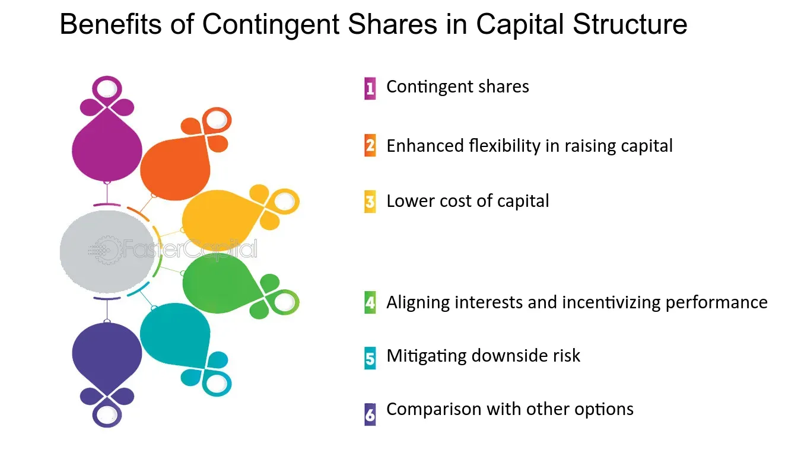

## Table of Contents

## What are contingent shares?

Contingent shares are a type of stock that a company might give out in the future, but only if certain conditions are met first. These conditions could be things like the company reaching a certain level of profit, or a specific event happening, like a merger with another company. The idea behind contingent shares is to motivate people, like employees or executives, to help the company achieve its goals.

When a company decides to use contingent shares, it's like making a promise. They are saying, "If you help us reach this goal, we will give you these shares." This can be really motivating because the value of the shares could be worth a lot of money. But, if the company doesn't meet the conditions, then no shares are given out. This makes contingent shares a bit risky, but also potentially very rewarding.

## How do contingent shares work?

Contingent shares are special kinds of stocks that a company might give to people in the future, but only if certain things happen first. These things could be the company making a certain amount of money, or something big happening, like merging with another company. The idea is to get people, like workers or bosses, to work hard to help the company reach its goals. If the company does well and meets the conditions, then the people get the shares. But if the company doesn't meet the conditions, no shares are given out.

This makes contingent shares a bit like a bet. They can be risky because there's no guarantee that the company will meet the conditions. But if everything goes well, the shares could be worth a lot of money. This can be a big motivator for people to do their best. Companies use contingent shares to keep everyone focused on the same goals and to reward them if those goals are met.

## What is the purpose of issuing contingent shares?

The main reason companies issue contingent shares is to motivate their employees and executives to work towards specific goals. By promising shares that will only be given if certain conditions are met, like reaching a profit target or completing a merger, the company encourages everyone to focus on achieving those objectives. This can create a shared sense of purpose and drive within the organization.

Contingent shares also help align the interests of the employees with those of the company. When people know they can earn valuable shares by helping the company succeed, they are more likely to work hard and make decisions that benefit the company's long-term goals. This can be especially useful in keeping key talent motivated and committed to the company's success.

## Who typically uses contingent shares?

Companies often use contingent shares to motivate their employees and executives. They promise to give out shares if certain goals are met, like making more money or finishing a big project. This can make people work harder because they want to earn those shares, which could be worth a lot of money.

Startups and growing businesses especially like using contingent shares. They might not have a lot of money to pay big salaries, so they use shares to attract and keep good workers. This way, everyone in the company is focused on the same goals and working together to make the company successful.

## What are the common conditions for releasing contingent shares?

Companies usually set specific goals that need to be met before they give out contingent shares. These goals can be things like making a certain amount of money, reaching a sales target, or finishing a big project. For example, a company might say they will give shares to employees if they make $1 million in profit by the end of the year. This motivates everyone to work hard towards that goal because they know they could get valuable shares if they succeed.

Another common condition is related to big events like mergers or acquisitions. If a company is planning to join with another company, they might promise shares to employees if the merger happens successfully. This encourages everyone to help make the merger go smoothly. Sometimes, the conditions can also be about the company's stock price reaching a certain level, which means everyone works to increase the value of the company.

## What are the advantages of contingent shares for the issuing company?

Contingent shares can help a company by motivating its employees and executives to work harder towards specific goals. When a company promises to give shares if certain targets are met, like making more money or completing a big project, everyone focuses on achieving those objectives. This shared purpose can make the whole team work together better and push harder to succeed. It's like giving everyone a reason to do their best because they know they could get something valuable in return.

Another advantage is that contingent shares can help a company keep and attract good workers, especially when it doesn't have a lot of money to offer high salaries. Startups and growing businesses often use contingent shares to bring in talented people who believe in the company's future. By offering shares that could be worth a lot if the company does well, the company can make sure everyone's interests are aligned with its long-term success. This can be a smart way to build a committed and motivated team without spending a lot of cash upfront.

## What are the potential benefits for shareholders receiving contingent shares?

Receiving contingent shares can be really good for shareholders because it gives them a chance to own more of the company without paying more money right away. If the company meets its goals, like making a certain amount of profit or finishing a big project, shareholders get more shares. This means they could end up with a bigger piece of the company, which could be worth a lot more money if the company does well.

Also, contingent shares can make shareholders feel more connected to the company's success. Knowing that they could get more shares if the company reaches its targets can make shareholders more interested in helping the company do well. They might be more likely to support the company's decisions and work harder if they are employees, because they know they could benefit directly from the company's success.

## What are the risks and disadvantages of contingent shares for the issuing company?

Contingent shares can be risky for the company because they might have to give out more shares if they meet their goals. This means the value of each share could go down because there are more shares to go around. If the company's stock price doesn't go up enough to make up for the extra shares, existing shareholders might not be happy. They could feel like their part of the company is worth less than before, which might make them sell their shares or not support the company as much.

Another disadvantage is that if the company doesn't meet the conditions for giving out the shares, it might make employees and executives feel disappointed or less motivated. They might have been working hard expecting to get those shares, and if it doesn't happen, they could lose trust in the company. This can make it harder for the company to keep good workers or attract new talent. Plus, setting up and managing contingent shares can be complicated and take a lot of time and effort, which might distract the company from its main goals.

## How might contingent shares affect the valuation of a company?

Contingent shares can change how much a company is worth because they might lead to more shares being given out. If the company meets its goals and gives out these extra shares, the total number of shares goes up. This can make each share worth less money because the company's value is now split into more pieces. If the company's overall value doesn't grow enough to make up for the extra shares, the price of each share could drop. This might make the company seem less valuable to investors, who might worry about their shares being worth less.

On the other hand, if the company does well and meets the conditions for giving out contingent shares, it could also show that the company is doing great. This success might make investors feel more confident about the company's future, which could drive up the stock price. If the company's value grows faster than the number of shares, the price per share could actually go up, making the company seem more valuable. So, contingent shares can affect the company's valuation in different ways, depending on how well the company does in reaching its goals.

## What are the tax implications of contingent shares for both the issuer and the recipient?

For the company issuing contingent shares, the tax implications can be tricky. When the company gives out the shares, it might have to deal with tax rules about giving employees or executives something valuable. This could mean the company has to pay taxes on the value of the shares they give out, or they might have to report it as an expense. The exact tax rules can depend on where the company is and what kind of shares they are giving out, so it's important for the company to talk to a tax expert to make sure they're doing everything right.

For the people getting the contingent shares, the tax situation can also be complicated. When they get the shares, they might have to pay taxes on the value of those shares as if it were income. This means they could owe taxes even before they sell the shares and get any money from them. If they later sell the shares for more money than they were worth when they got them, they might also have to pay capital gains tax on the profit. It's a good idea for anyone getting contingent shares to talk to a tax advisor to understand exactly what they need to do and how much they might owe in taxes.

## How do contingent shares compare to other forms of equity compensation?

Contingent shares are a type of equity compensation where a company promises to give out shares if certain goals are met. This is different from other forms of equity compensation like stock options or restricted stock units (RSUs). With stock options, employees get the right to buy shares at a set price in the future, which can be valuable if the stock price goes up. RSUs, on the other hand, are shares given to employees that vest over time, meaning they get the shares after working for the company for a certain period. Contingent shares are unique because they depend on the company achieving specific targets, making them more performance-based than stock options or RSUs.

Another way contingent shares differ from other equity compensation is in how they motivate employees. Stock options and RSUs can motivate employees by giving them a stake in the company's future, but contingent shares add an extra layer of motivation because they are tied to specific goals. If the company meets those goals, employees get the shares, which can be a big reward. However, if the goals aren't met, no shares are given out, which can be a risk. This performance-based aspect can make contingent shares more appealing to companies that want to focus their employees on specific outcomes, but it also means employees might feel more pressure to achieve those goals.

## What are some real-world examples of companies that have used contingent shares and the outcomes?

One example of a company using contingent shares is Tesla. In 2018, Tesla's CEO Elon Musk was promised a huge package of contingent shares if he could help the company reach certain goals. These goals were things like making a certain amount of money and hitting production targets for their cars. If Musk reached all the goals, he could get shares worth up to $55 billion. By 2023, Tesla had met most of these goals, and Musk got a lot of those shares. This made him work hard to make Tesla successful, and it helped the company grow a lot.

Another example is when Yahoo used contingent shares during their merger with Verizon in 2017. Yahoo promised to give shares to their employees if the merger went through successfully. The idea was to keep everyone motivated to make sure the merger happened without any big problems. In the end, the merger did happen, and the employees who stayed with Yahoo got the shares. This helped Yahoo keep their team focused and working together during a big change in the company.

## What are Contingent Shares and How Do They Work?

Contingent shares are a distinctive class of company stock that are issued to shareholders upon the achievement of specific conditions. Commonly, these shares are associated with milestones like profitability targets or events such as mergers and acquisitions. Unlike typical shares, contingent shares only become active and tradable when the predefined criteria are satisfied. This mechanism serves as an incentive for management and employees, aligning their performance with the strategic objectives of shareholders and the company.

The structure of contingent shares provides a strategic tool for companies aiming to motivate executives towards achieving specific financial or operational goals. For instance, a company might grant contingent shares as part of a compensation package, which vest only upon reaching certain profitability benchmarks or successful completion of a merger. This aligns executive efforts with shareholder value maximization.

However, if the conditions tied to contingent shares are not met, these shares can become worthless, posing a risk to stakeholders expecting compensation through this medium. The risk includes not only the potential lack of return on such shares but also psychological and motivational impacts on employees expecting these rewards.

In terms of financial impacts, the issuance of contingent shares results in the dilution of existing shareholders' ownership. When the contingent shares vest and become part of the total share count, they effectively reduce the ownership percentage held by existing shareholders. This dilution is particularly crucial to consider as it impacts earnings per share (EPS), a key measure of a company's profitability per share of stock. The formula for calculating the impact on EPS post-issuance can be expressed as:

$$
\text{New EPS} = \frac{\text{Net Income}}{\text{Existing Shares + Contingent Shares}}
$$

This dilution effect necessitates careful consideration by companies when deciding on the issuance and conditions attached to contingent shares. The strategic advantage of contingent shares must be weighed against the potential drawbacks of ownership dilution and its subsequent effects on shareholder value.

## What are the disadvantages of contingent shares?

Contingent shares are a financial instrument that can lead to several disadvantages for the stakeholders involved, primarily revolving around the concept of ownership dilution. When these additional shares are issued upon the satisfaction of specific conditions, the overall ownership percentage and the intrinsic value of existing shares decrease. This dilution effect is quantified by the reduced earnings per share (EPS), calculated as:

$$
\text{EPS} = \frac{\text{Net Income}}{\text{Total Shares Outstanding}}
$$

The increase in the total number of shares outstanding causes a drop in EPS, as the same amount of net income is spread over a larger number of shares. Consequently, this can impact the perceived value of the company on financial markets, potentially affecting stock prices negatively.

Moreover, contingent shares pose risks because their real value is contingent on the achievability of predefined conditions and prevailing market circumstances. If these conditions are ambitious or unrealistic, the contingent shares may turn worthless, resulting in no added value for investors or employees. This uncertainty requires careful evaluation to ensure that goals are not only challenging but also realistically attainable within the market environment.

Overutilization of contingent shares can exacerbate the issue of value dilution. As issuing excessive contingent shares dilutes ownership further, it may lead to dissatisfaction among shareholders who perceive a reduction in their proportional claim over the company’s future profits. They may feel disadvantaged, especially if the market does not adequately adjust the share price to reflect the newly issued contingent shares’ potential future value. Balancing the issuance of contingent shares is crucial to maintain shareholder confidence and support.

## References & Further Reading

[1]: Chung, K. H., & Zhang, H. (2014). ["High-frequency trading and market volatility."](https://www.researchgate.net/profile/Kee-Chung/publication/299382871_High-frequency_Trading_Review_of_the_Literature_and_Regulatory_Initiatives_around_the_World/links/63c5548ad7e5841e0bd2f00a/High-frequency-Trading-Review-of-the-Literature-and-Regulatory-Initiatives-around-the-World.pdf) Journal of Financial Economics, 114(1), 35- 68.

[2]: Arora, S., Yadav, S., & Yadav, S. P. (2014). ["Evolution of modern approaches for efficient algorithmic trading"](https://www.semanticscholar.org/paper/Behavioural-Finance%3A-A-Review-Arora-C.S.Yadav/c66770df87f690673660f15498de61e868158a6c). Earth Science Informatics, 7(4), 217-232.

[3]: Guéant, O., Lehalle, C. A., & Fernandez-Tapia, J. (2013). ["Dealing with the inventory risk: a solution to the market making problem."](https://arxiv.org/abs/1105.3115) Mathematics and Financial Economics, 7(4), 477-507.

[4]: Harris, L. (2003). ["Trading & Exchanges: Market Microstructure for Practitioners."](https://www.amazon.com/Trading-Exchanges-Market-Microstructure-Practitioners/dp/0195144708) Oxford University Press.

[5]: Kissell, R. (2014). ["The Science of Algorithmic Trading and Portfolio Management."](https://www.sciencedirect.com/book/9780124016897/the-science-of-algorithmic-trading-and-portfolio-management) Academic Press.