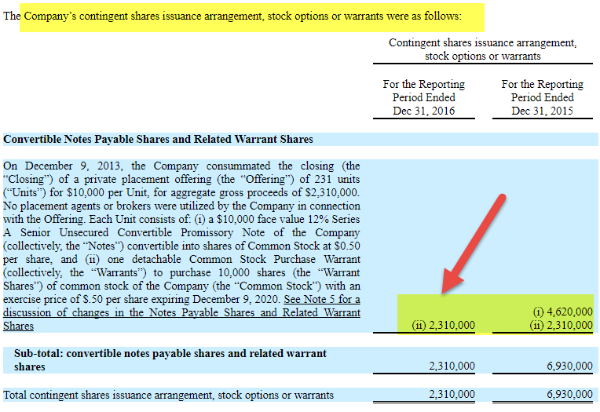

Investing in stocks requires a comprehensive understanding of the various share structures and trading strategies that exist, each presenting its own set of benefits and disadvantages. One such financial instrument, contingent shares, emerges as a pivotal component, especially relevant in scenarios like mergers and acquisitions. These shares are conditional on the achievement of certain targets, acting as both opportunities and potential risks for investors. 

On another front, algorithmic trading, commonly known as algo trading, has transformed the landscape by leveraging technology to execute trades with increased speed and precision. This method ensures that decisions are based on predefined parameters, minimizing human-induced errors. However, despite its efficiency, algorithmic trading introduces its own challenges, predominantly linked to technological dependencies.

This article aims to provide an in-depth exploration of both contingent shares and algorithmic trading. By shedding light on their respective benefits and drawbacks, we highlight their indispensable roles in contemporary stock investment and trading. Investors equipped with knowledge of these components can navigate the intricate financial ecosystem with greater confidence, making informed decisions that are aligned with their strategic goals.

## Table of Contents

## Understanding Contingent Shares

Contingent shares are a distinctive class of company stock that are issued to shareholders upon the achievement of specific conditions. Commonly, these shares are associated with milestones like profitability targets or events such as mergers and acquisitions. Unlike typical shares, contingent shares only become active and tradable when the predefined criteria are satisfied. This mechanism serves as an incentive for management and employees, aligning their performance with the strategic objectives of shareholders and the company.

The structure of contingent shares provides a strategic tool for companies aiming to motivate executives towards achieving specific financial or operational goals. For instance, a company might grant contingent shares as part of a compensation package, which vest only upon reaching certain profitability benchmarks or successful completion of a merger. This aligns executive efforts with shareholder value maximization.

However, if the conditions tied to contingent shares are not met, these shares can become worthless, posing a risk to stakeholders expecting compensation through this medium. The risk includes not only the potential lack of return on such shares but also psychological and motivational impacts on employees expecting these rewards.

In terms of financial impacts, the issuance of contingent shares results in the dilution of existing shareholders' ownership. When the contingent shares vest and become part of the total share count, they effectively reduce the ownership percentage held by existing shareholders. This dilution is particularly crucial to consider as it impacts earnings per share (EPS), a key measure of a company's profitability per share of stock. The formula for calculating the impact on EPS post-issuance can be expressed as:

$$
\text{New EPS} = \frac{\text{Net Income}}{\text{Existing Shares + Contingent Shares}}
$$

This dilution effect necessitates careful consideration by companies when deciding on the issuance and conditions attached to contingent shares. The strategic advantage of contingent shares must be weighed against the potential drawbacks of ownership dilution and its subsequent effects on shareholder value.

## Advantages of Contingent Shares

Contingent shares, also known as conditional shares, are a strategic tool in corporate finance that can offer several advantages, primarily by aligning company performance with shareholder expectations. These shares become available to the recipients only when certain predefined conditions, such as profitability metrics or revenue milestones, are achieved. This conditional nature of contingent shares serves as a substantial motivational mechanism to drive performance and meet specific targets. 

By tying the acquisition of shares to the attainment of organizational goals, companies can incentivize management and employees effectively. This alignment encourages individuals within the organization to focus their efforts on long-term strategic objectives, ensuring that their personal gains are closely linked to the overall success of the company. Therefore, offering contingent shares as rewards for achieving targets like increased profitability not only helps in enhancing corporate performance but also fosters a culture of accountability and achievement.

In the context of mergers and acquisitions (M&A), contingent shares can serve as powerful negotiating tools. They offer a means to bridge valuation disparities between the parties involved in the transaction. By agreeing to exchange contingent shares based on future performance outcomes, companies can address disagreements over valuations and potential risks. This conditional payout structure can facilitate smoother negotiations, enabling parties to reach agreements that may have been stalled due to differing forecasts of future performance.

Moreover, if the performance conditions stipulated for the contingent shares are met successfully, it can significantly enhance shareholder value. The realization of these conditions often signals strong company performance, boosting investor confidence and potentially driving up the stock price. Shareholders, therefore, stand to benefit significantly if the issuance of contingent shares leads to the achievement of critical economic objectives.

These shares encourage a forward-looking approach among all stakeholders, fostering a commitment to achieving the business's long-term goals. By integrating contingent shares into their strategic frameworks, companies can create an environment where management's and employees' performance ambitions are intricately linked with shareholder interests, driving organizational success and enhancing overall enterprise value.

## Disadvantages of Contingent Shares

Contingent shares are a financial instrument that can lead to several disadvantages for the stakeholders involved, primarily revolving around the concept of ownership dilution. When these additional shares are issued upon the satisfaction of specific conditions, the overall ownership percentage and the intrinsic value of existing shares decrease. This dilution effect is quantified by the reduced earnings per share (EPS), calculated as:

$$
\text{EPS} = \frac{\text{Net Income}}{\text{Total Shares Outstanding}}
$$

The increase in the total number of shares outstanding causes a drop in EPS, as the same amount of net income is spread over a larger number of shares. Consequently, this can impact the perceived value of the company on financial markets, potentially affecting stock prices negatively.

Moreover, contingent shares pose risks because their real value is contingent on the achievability of predefined conditions and prevailing market circumstances. If these conditions are ambitious or unrealistic, the contingent shares may turn worthless, resulting in no added value for investors or employees. This uncertainty requires careful evaluation to ensure that goals are not only challenging but also realistically attainable within the market environment.

Overutilization of contingent shares can exacerbate the issue of value dilution. As issuing excessive contingent shares dilutes ownership further, it may lead to dissatisfaction among shareholders who perceive a reduction in their proportional claim over the company’s future profits. They may feel disadvantaged, especially if the market does not adequately adjust the share price to reflect the newly issued contingent shares’ potential future value. Balancing the issuance of contingent shares is crucial to maintain shareholder confidence and support.

## Algorithmic Trading: An Overview

Algorithmic trading, often referred to as algo trading, represents a modern approach to executing trades in financial markets utilizing predetermined computer algorithms. As financial markets have evolved, the demand for faster, more efficient, and precise trading methods has increased, giving rise to [algorithmic trading](/wiki/algorithmic-trading). At its core, algorithmic trading automates the trading process by leveraging variables such as time, price, and [volume](/wiki/volume-trading-strategy) to make informed trade decisions without the need for direct human intervention.

Primarily, algo trading is favored for its notable speed and accuracy. The minimization of human involvement eliminates emotional biases, which are common in traditional trading, ensuring that strategies are consistently and logically applied. This automation is particularly advantageous in environments where rapid decision-making is essential, allowing traders to capitalize on market inefficiencies or price discrepancies that may appear only for fleeting moments.

The technology behind algo trading enables high-frequency trading ([HFT](/wiki/high-frequency-trading-strategies)), a subset of algorithmic trading characterized by executing a large number of trades in fractions of a second. This rapid operation allows for the exploitation of minute price fluctuations across multiple markets and asset classes simultaneously, significantly enhancing market [liquidity](/wiki/liquidity-risk-premium). By making it possible to perform thousands of trades per second, algorithms can react to market conditions more swiftly than a human trader ever could.

In addition to speed and precision, algorithmic trading supports diversification strategies, spreading risk across different assets and markets through systematic rebalancing and execution of orders. The ability to operate continuously without fatigue further improves the consistency of trading outcomes.

Overall, while the technological infrastructure and the complexity of creating and maintaining effective trading algorithms can be challenging, the benefits of algorithmic trading have firmly established it as a critical component of modern finance. Its capacity to execute trades with alacrity and precision offers participants a significant competitive advantage in today's fast-paced financial markets.

## Benefits of Algorithmic Trading

Algorithmic trading, often abbreviated as algo trading, leverages sophisticated computer algorithms to execute trades at speeds and volumes unattainable by human traders. This method has revolutionized the trading landscape, primarily due to several significant advantages it provides.

One of the primary benefits is its ability to execute trades at lightning-fast speeds. Algorithmic trading systems are capable of seizing even the minute price fluctuations that occur within milliseconds, enabling traders to capitalize on [arbitrage](/wiki/arbitrage) opportunities and price discrepancies that are beyond human capability to exploit. This speed advantage is crucial, particularly in a market where timing is critical, and the slightest delay can turn potential profits into losses.

Accuracy is another critical advantage of algorithmic trading. By automating the trading process, algo trading substantially reduces the chances of human error. Decisions are made based on predefined criteria such as price, timing, and quantity, ensuring trades are executed flawlessly as per the trading strategy's parameters. This precision is essential in minimizing costly mistakes that often result from manual trading.

Moreover, algorithmic trading effectively prevents emotional trades. Human traders are susceptible to emotional biases that can lead to inconsistent and suboptimal trading decisions. Algorithmic systems apply trading strategies consistently across different market conditions without being influenced by greed, fear, or other emotions that typically affect human judgment. This consistency ensures that trading strategies are implemented as intended, leading to more predictable and reliable outcomes.

Additionally, algo trading facilitates high-volume and high-frequency trading, which significantly enhances market liquidity. By executing large numbers of trades rapidly, algorithmic trading ensures that market participants can buy or sell assets without causing significant price movement, thus maintaining market stability. The enhanced liquidity also reduces the cost of trading, benefiting traders and investors by providing better price execution.

In conclusion, the integration of algorithmic trading into financial markets offers numerous benefits, including unparalleled speed and accuracy, emotional detachment in decision-making, and enhanced market liquidity. These advantages have cemented algo trading as an indispensable tool in modern trading strategies, allowing traders to exploit opportunities efficiently and effectively.

## Drawbacks of Algorithmic Trading

Algorithmic trading, while offering significant advantages, also presents several challenges that investors and traders must consider. A primary concern is its heavy dependency on technology and infrastructure. Trading algorithms require robust and reliable systems to function correctly. Any technical failure or system downtime can lead to substantial financial losses. For instance, a minor glitch in the algorithm or server can delay trade execution, potentially causing significant missed opportunities or triggering unintended trades. 

The initial setup costs associated with algorithmic trading are high. Participants must invest in specialized hardware and software capable of handling high-speed data processing and executing trades within milliseconds. Additionally, maintaining these systems necessitates ongoing costs for updates, maintenance, and technical support. 

Furthermore, algorithmic trading demands strong programming skills. Creating and optimizing trading algorithms require expertise in programming languages such as Python, R, or C++. This requirement poses a barrier for individual traders or firms that lack in-house technical expertise. As a result, traders often depend on professional programmers or third-party solutions, which can increase operational costs and risks related to intellectual property and strategy confidentiality.

The regulatory environment is another major drawback. Algorithmic trading is subject to stringent regulations that can vary by jurisdiction. Changes in these regulations can impact trading strategies and necessitate costly and complex compliance efforts. For example, regulators may impose limits on high-frequency trading or implement requirements for transparency in algorithmic decision-making processes. These changes can oblige traders to alter or abandon existing strategies, potentially affecting profitability and market dynamics.

In summary, while algorithmic trading enhances efficiency and execution speed, its dependence on advanced technology, the necessity for specialized skills, high costs, and regulatory complexity present significant drawbacks. Traders must carefully evaluate these factors when considering or maintaining an algorithmic trading strategy.

## Conclusion

Both contingent shares and algorithmic trading offer distinct advantages and pose certain challenges in stock market participation. Contingent shares provide a mechanism for aligning the interests of key stakeholders with long-term company objectives and are particularly useful in negotiating complex mergers and acquisitions. However, their potential to dilute existing ownership and affect profitability must be carefully assessed, ensuring they align with the company's strategic direction.

Algorithmic trading, renowned for its speed and precision, offers advantages such as enhanced liquidity and reduced human error. Yet, its dependency on robust technological infrastructure and vulnerability to regulatory changes underscores the importance of maintaining resilient systems and staying abreast of evolving market conditions. As initial setup costs and the need for specialized skills can be significant, companies must evaluate the financial and operational feasibility of implementing such systems.

In today’s fast-paced financial landscape, informed decision-making is imperative. Stakeholders must conduct comprehensive analyses of these mechanisms to align them with their financial objectives and risk thresholds. By integrating a thorough understanding of contingent shares and algorithmic trading, companies and investors can strategically position themselves for growth and optimize investment returns. Embracing these financial tools judiciously can enhance competitiveness and drive efficient market participation.

## References & Further Reading

[1]: Chung, K. H., & Zhang, H. (2014). ["High-frequency trading and market volatility."](https://www.researchgate.net/profile/Kee-Chung/publication/299382871_High-frequency_Trading_Review_of_the_Literature_and_Regulatory_Initiatives_around_the_World/links/63c5548ad7e5841e0bd2f00a/High-frequency-Trading-Review-of-the-Literature-and-Regulatory-Initiatives-around-the-World.pdf) Journal of Financial Economics, 114(1), 35- 68.

[2]: Arora, S., Yadav, S., & Yadav, S. P. (2014). ["Evolution of modern approaches for efficient algorithmic trading"](https://www.semanticscholar.org/paper/Behavioural-Finance%3A-A-Review-Arora-C.S.Yadav/c66770df87f690673660f15498de61e868158a6c). Earth Science Informatics, 7(4), 217-232.

[3]: Guéant, O., Lehalle, C. A., & Fernandez-Tapia, J. (2013). ["Dealing with the inventory risk: a solution to the market making problem."](https://arxiv.org/abs/1105.3115) Mathematics and Financial Economics, 7(4), 477-507.

[4]: Harris, L. (2003). ["Trading & Exchanges: Market Microstructure for Practitioners."](https://www.amazon.com/Trading-Exchanges-Market-Microstructure-Practitioners/dp/0195144708) Oxford University Press.

[5]: Kissell, R. (2014). ["The Science of Algorithmic Trading and Portfolio Management."](https://www.sciencedirect.com/book/9780124016897/the-science-of-algorithmic-trading-and-portfolio-management) Academic Press.