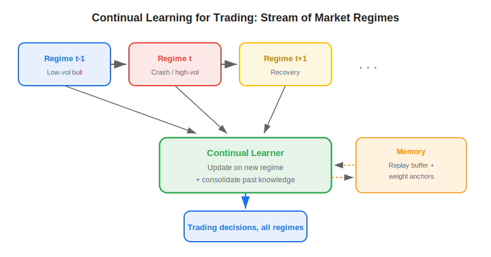
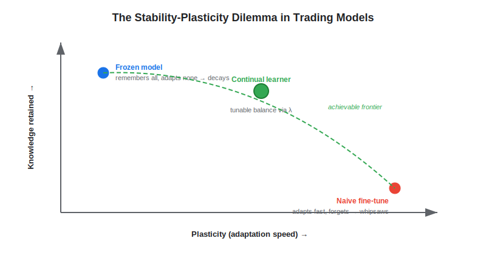
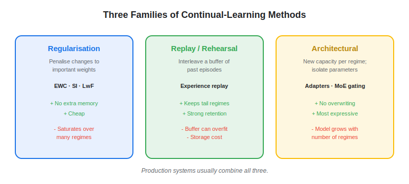

**Continual learning** — also called lifelong or incremental learning — is a machine-learning paradigm in which a model keeps updating from a never-ending stream of new data while preserving the knowledge it already acquired. In trading, this matters because markets are non-stationary: the statistical relationships a model learned in a low-volatility bull market can invert during a crash, and a model that simply overwrites old knowledge with new data tends to whipsaw. Continual learning offers a disciplined middle ground between a frozen model that decays as regimes shift and a naively retrained one that forgets how to behave in rare states. This article explains the core problem of catastrophic forgetting, the three main families of continual-learning methods, and how the approach compares to the rolling-window retraining most quants default to.

## Table of Contents

## What Is Continual Learning?

Continual learning is the study of training models on a sequence of tasks or data distributions that arrive over time, under the constraint that earlier data is unavailable (or expensive to revisit) when later data arrives. The defining challenge, named by McCloskey and Cohen (1989) and formalised for deep networks by Kirkpatrick et al. (2017), is **catastrophic forgetting**: when a neural network is trained on new data, gradient descent freely overwrites the weights that encoded previous knowledge, and performance on earlier tasks collapses. A model that learned to trade the 2017 low-volatility grind, then fine-tuned only on 2020 COVID-crash data, may lose its ability to act sensibly when calm conditions return.

The goal is captured by the **stability–plasticity dilemma**. Plasticity is the capacity to learn new patterns quickly; stability is the capacity to retain old ones. Too much plasticity and the model forgets; too much stability and it cannot adapt. A useful trading model needs both — enough plasticity to absorb a new volatility regime within days, enough stability to remember that mean-reversion edges resurface once the shock passes.

 This is precisely the tension that [regime detection](https://paperswithbacktest.com/wiki/regime-detection-financial-markets) and [structural-break](https://paperswithbacktest.com/wiki/structural-breaks-financial-time-series) analysis try to surface, but continual learning addresses it at the level of the model's parameters rather than as a preprocessing step.

## How It Works

Formally, continual learning seeks parameters $\theta$ that perform well across all distributions seen so far, $\mathcal{D}_1, \dots, \mathcal{D}_t$, while only having access to $\mathcal{D}_t$ at step $t$. A common regularisation-based objective augments the new-task loss with a penalty that anchors important weights near their old values:

$$\mathcal{L}(\theta) = \mathcal{L}_t(\theta) + \frac{\lambda}{2} \sum_i F_i \, (\theta_i - \theta_{t-1,i})^2$$

Here $\mathcal{L}_t$ is the loss on the current regime's data, $\theta_{t-1}$ are the weights after the previous regime, and $F_i$ measures how important parameter $i$ was for earlier tasks (in Elastic Weight Consolidation, $F_i$ is the Fisher information). The hyperparameter $\lambda$ tunes the stability–plasticity balance: large $\lambda$ protects old knowledge, small $\lambda$ favours fast adaptation. Solutions fall into three broad families:

- **Regularisation-based** — Add a penalty (EWC, Synaptic Intelligence, Learning without Forgetting) that slows changes to weights deemed important for past regimes. Cheap, no extra memory, but the penalty can saturate after many regimes.
- **Replay / rehearsal** — Keep a small buffer of past samples (or generate synthetic ones) and interleave them with new data. Experience replay is the workhorse of [reinforcement-learning portfolio managers](https://paperswithbacktest.com/wiki/reinforcement-learning-portfolio-management); a reservoir of crisis-period episodes keeps the agent fluent in tail behaviour.
- **Architectural / parameter-isolation** — Allocate fresh capacity per regime (Progressive Networks, adapters, mixture-of-experts gating) so new learning lives in new parameters and cannot overwrite the old. Most expressive, but model size grows with the number of regimes unless capacity is shared.

In practice these are combined. A trading system might gate a small expert per detected regime (architectural), train each expert with a replay buffer of analogous historical episodes (replay), and apply a mild EWC penalty (regularisation) so shared layers drift slowly.

## Continual Learning vs Rolling-Window Retraining

Most systematic desks already handle non-stationarity with periodic retraining: refit the model every month on a trailing window, or run [walk-forward optimization](https://paperswithbacktest.com/wiki/walk-forward-optimization). This is a crude form of continual learning, and it has two well-known failure modes. A short window forgets rare states entirely — a model retrained on a 250-day window in mid-2021 had no memory of March 2020. A long window dilutes the present — by the time enough crisis data accumulates to shift the weights, the crisis is over.

| Dimension | Rolling-Window Retraining | Continual Learning |
|---|---|---|
| Memory of rare regimes | Drops out of the window | Preserved via replay or weight anchoring |
| Compute per update | Full refit from scratch | Incremental, often 5–20× cheaper |
| Adaptation speed | Tied to retrain cadence | Per-batch, near-online |
| Forgetting control | Implicit, window-length dependent | Explicit, tunable via $\lambda$ |
| Catastrophic forgetting | Severe at short windows | Directly mitigated |
| Implementation complexity | Low | Moderate to high |

The 2026 *Regime-Adaptive Continual Learning for Portfolio Management* study frames the contrast sharply: rolling-window retraining is computationally wasteful and discards transferable knowledge, while naive online fine-tuning underuses what the model already knows. Their regime-aware continual learner — which consolidates knowledge across sequential market tasks rather than refitting — reported higher returns and better adaptability than both baselines on multi-asset backtests. The lesson generalises beyond any single paper: treating each regime as a *task* to be remembered, not a window to be overwritten, is what separates continual learning from periodic retraining.

## Practical Considerations in Algo Trading

Continual learning is not free lunch, and several frictions decide whether it survives contact with live markets.

**Label latency and noise.** Trading "tasks" are not cleanly delimited the way they are in academic benchmarks. Regime boundaries are fuzzy and only knowable in hindsight, so a continual learner needs a robust change-point or [hidden-Markov](https://paperswithbacktest.com/wiki/hidden-markov-models-trading) signal to decide *when* to consolidate. Mislabel the regime and you anchor weights to noise.

**Capacity and capacity-cost.** Architectural methods that add an expert per regime grow unbounded; a five-year intraday system can encounter dozens of micro-regimes. In production, cap the number of experts and let a gating network share capacity, accepting some forgetting as the price of a fixed memory footprint.

**Overfitting the replay buffer.** A buffer of a few hundred crisis episodes is tiny relative to a deep model's capacity, so rehearsal can memorise rather than generalise. The usual [overfitting safeguards](https://paperswithbacktest.com/wiki/backtesting-pitfalls-overfitting) — purged cross-validation, conservative position sizing, out-of-sample regime holdouts — remain mandatory.

**Realistic expectations.** Reported Sharpe uplifts from continual-learning trading studies typically sit in the 0.2–0.6 range over a strong retrained baseline, before costs. After slippage, transaction costs, and the operational overhead of maintaining a streaming pipeline, the net edge is narrower. The value is often less about peak return than about smoother drawdowns through regime transitions — the moments when frozen models bleed the most. As with [strategy decay](https://paperswithbacktest.com/wiki/strategy-decay-minimum-regime-performance), the honest benchmark is performance across the worst regimes, not the average.

## Conclusion

Continual learning reframes the oldest problem in quantitative trading — markets change — as a question of how a model remembers. Instead of discarding the past on every retrain or freezing it in place, it consolidates knowledge across regimes, trading a modest rise in engineering complexity for cheaper updates, faster adaptation, and explicit control over forgetting. As streaming infrastructure and foundation models make always-on learning practical, the desks that win the next decade will likely be the ones whose models forget on purpose rather than by accident.

## References & Further Reading

[1]: [Regime-Adaptive Continual Learning for Portfolio Management (2026)](https://arxiv.org/abs/2606.00143)
[2]: [Kirkpatrick et al. — Overcoming Catastrophic Forgetting in Neural Networks (PNAS, 2017)](https://arxiv.org/abs/1612.00796)
[3]: [Parisi et al. — Continual Lifelong Learning with Neural Networks: A Review (2019)](https://arxiv.org/abs/1802.07569)
[4]: [De Lange et al. — A Continual Learning Survey: Defying Forgetting in Classification Tasks (2021)](https://arxiv.org/abs/1909.08383)
