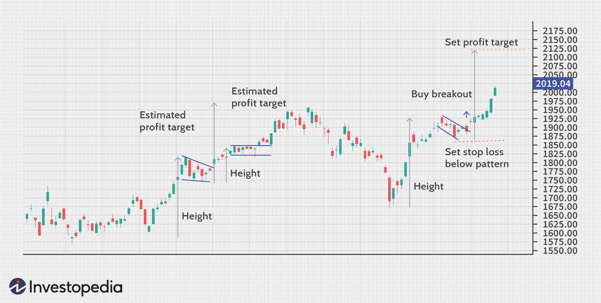

## Table of Contents

## What are continuation patterns in technical analysis?

Continuation patterns in technical analysis are chart patterns that suggest a pause in the current trend, but indicate that the trend will likely continue in the same direction after the pause. These patterns are useful for traders because they help predict where the price might go next. Common continuation patterns include flags, pennants, and rectangles. When traders spot these patterns, they often prepare to enter trades in the direction of the original trend, expecting the price to keep moving that way once the pattern completes.

For example, a flag pattern looks like a small rectangle that slopes against the prevailing trend. It forms after a sharp price movement and represents a brief consolidation before the price continues in the direction of the initial move. Similarly, a pennant looks like a small symmetrical triangle and also indicates a brief pause before the trend resumes. By recognizing these patterns, traders can make more informed decisions about when to buy or sell, aiming to capitalize on the continuation of the trend.

## How do continuation patterns differ from reversal patterns?

Continuation patterns and reversal patterns are two types of chart patterns used in technical analysis, but they tell us different things about the price trend. Continuation patterns show that the price is taking a short break, but the trend will likely keep going in the same direction after this pause. They are like a quick rest before the price keeps moving up or down. Examples include flags, pennants, and rectangles. When traders see these patterns, they get ready to trade in the direction the price was going before the pause.

Reversal patterns, on the other hand, signal that the current trend might be about to change direction. These patterns show that the price could start moving the opposite way soon. Common reversal patterns include head and shoulders, double tops and bottoms, and inverse head and shoulders. When traders spot these patterns, they prepare to trade in the opposite direction of the current trend, expecting a new trend to start. Understanding the difference between these two types of patterns helps traders make better decisions about when to buy or sell.

## What are some common types of continuation patterns?

Continuation patterns are shapes on a price chart that show the price might keep going the same way after a short break. Some common types are flags, pennants, and rectangles. A flag pattern looks like a small rectangle that goes against the main trend. It happens after a big price move and shows a quick pause before the price keeps going in the same direction. A pennant looks like a small triangle and also shows a short break before the trend continues.

Another common continuation pattern is the rectangle. It forms when the price moves sideways between two parallel lines, showing that buyers and sellers are in balance for a while. But once the price breaks out of the rectangle, it usually continues in the direction it was going before the pattern started. These patterns help traders guess where the price might go next, so they can decide when to buy or sell.

## Can you explain the formation and significance of a flag pattern?

A flag pattern looks like a small rectangle that slopes against the main trend on a price chart. It forms after a big, quick move in the price, which is called the flagpole. After this sharp move, the price takes a short break and moves sideways or slightly against the trend, creating the flag part of the pattern. This pause usually doesn't last long, and the flag is often parallel on both sides, looking a bit like a flag on a pole.

The flag pattern is important because it tells traders that the price might keep moving in the same direction as the flagpole after the pause. When traders see a flag pattern, they get ready to buy or sell in the direction of the original big move, expecting the price to continue that way. This pattern helps traders predict where the price might go next, so they can make better decisions about when to enter or [exit](/wiki/exit-strategy) trades.

## How does a pennant pattern form and what does it indicate?

A pennant pattern forms after a big, fast move in the price, which is called the flagpole. After this sharp move, the price takes a short break and starts to move in a small triangle shape. This triangle, or pennant, has two lines that come together, making it look like a small flag. The price moves back and forth within this triangle, showing that buyers and sellers are trying to figure out what to do next. This pattern usually doesn't last long, often just a few days or weeks.

The pennant pattern is important because it tells traders that the price might keep going in the same direction as the flagpole after the short break. When traders see a pennant, they get ready to buy or sell in the direction of the original big move, expecting the price to continue that way. This pattern helps traders predict where the price might go next, so they can decide when to enter or exit trades.

## What is a rectangle pattern and how is it used in trading?

A rectangle pattern forms when the price of a stock or another asset moves sideways between two parallel lines. These lines are called support and resistance. The price goes up to the resistance line and then falls back to the support line, creating a rectangle shape on the chart. This pattern shows that buyers and sellers are in balance for a while, as the price keeps bouncing between these two levels.

Traders use the rectangle pattern to make trading decisions. When the price finally breaks out of the rectangle, it usually continues moving in the same direction it was going before the pattern started. If the price was going up before the rectangle formed, traders might buy when the price breaks above the resistance line, expecting it to keep going up. If the price was going down before the rectangle, traders might sell when the price breaks below the support line, expecting it to keep going down. This helps traders guess where the price might go next and make better choices about when to trade.

## How can traders identify a continuation pattern on a chart?

Traders can spot a continuation pattern on a chart by looking for certain shapes that show the price is taking a short break but might keep moving the same way soon. These shapes include flags, pennants, and rectangles. A flag looks like a small rectangle that goes against the main trend, a pennant looks like a small triangle, and a rectangle forms when the price moves sideways between two lines. To find these patterns, traders watch for a big, fast move in the price first, which is called the flagpole for flags and pennants. After this move, if the price starts to move in one of these shapes, it might be a continuation pattern.

Once traders think they see a continuation pattern, they check if the price breaks out of the pattern in the same direction as the big move before the pattern started. For example, if the price was going up before forming a flag, traders look for the price to break above the top of the flag. If it does, they might buy, expecting the price to keep going up. The same goes for pennants and rectangles. By watching for these shapes and the direction of the [breakout](/wiki/breakout-trading), traders can use continuation patterns to guess where the price might go next and make better trading decisions.

## What are the key differences between a bullish and bearish continuation pattern?

Bullish and bearish continuation patterns show that the price might keep going in the same direction after a short break, but they are different because they point to opposite trends. A bullish continuation pattern happens when the price was going up before the pattern started. It shows that the price might keep going up after the pause. Common bullish continuation patterns include bullish flags, bullish pennants, and bullish rectangles. When traders see these patterns, they get ready to buy, expecting the price to rise more.

A bearish continuation pattern is the opposite. It happens when the price was going down before the pattern formed. This pattern suggests that the price might keep going down after the short break. Examples of bearish continuation patterns are bearish flags, bearish pennants, and bearish rectangles. When traders spot these patterns, they get ready to sell, expecting the price to fall further. By understanding whether a continuation pattern is bullish or bearish, traders can make better guesses about where the price might go next and decide when to trade.

## How reliable are continuation patterns in predicting future price movements?

Continuation patterns can be helpful for guessing where the price might go next, but they are not perfect. They work a lot of the time, but sometimes the price does not keep going in the same direction after the pattern. Things like news, big events, or changes in what people think can make the price move differently than the pattern suggests. So, while continuation patterns give traders clues about what might happen, they should use other tools and information too to make the best choices.

Traders often use continuation patterns along with other ways to look at the market, like looking at the overall trend, using indicators, and watching the [volume](/wiki/volume-trading-strategy) of trades. This helps them make better guesses about the price. Even though continuation patterns are not always right, they can still be a useful part of a trader's plan. By knowing that these patterns can sometimes be wrong, traders can be ready for different outcomes and make smarter decisions about when to buy or sell.

## What are some advanced techniques for confirming continuation patterns?

Traders use a few advanced tricks to make sure that continuation patterns are more likely to work. One way is to look at the trading volume. If the volume is high during the big move before the pattern starts and then drops during the pattern, it can mean the pattern is more likely to be right. When the price breaks out of the pattern, traders want to see the volume go up again. This shows that more people are trading and the breakout is strong. Another trick is to use other tools like trend lines, moving averages, or indicators like the Relative Strength Index (RSI) or the Moving Average Convergence Divergence (MACD). If these tools also show that the trend will keep going, it can make traders more sure about the pattern.

Another technique is to wait for the price to break out of the pattern and then pull back a little before it keeps going in the same direction. This is called a "throwback" or "pullback," and it can make the pattern more reliable. Traders also look at how long the pattern takes to form. If it forms quickly, it might be more likely to work. By using these advanced ways to check continuation patterns, traders can feel more confident about their guesses and make better choices about when to buy or sell.

## How do volume and other indicators enhance the analysis of continuation patterns?

Volume and other indicators can make the analysis of continuation patterns more accurate. Volume shows how many people are trading. If there is a lot of volume during the big move before the pattern starts, and then it drops while the pattern is forming, it can mean the pattern is more likely to be right. When the price breaks out of the pattern, traders want to see the volume go up again. This shows that more people are getting interested and the breakout is strong. By looking at the volume, traders can see if the pattern is supported by a lot of trading activity, which can make them more sure about their guesses.

Other tools like trend lines, moving averages, and indicators such as the Relative Strength Index (RSI) or the Moving Average Convergence Divergence (MACD) can also help. If these tools show that the trend will keep going, it can make traders more confident in the continuation pattern. For example, if the RSI is not overbought or oversold and the MACD shows a strong trend, it can support the idea that the price will keep moving the same way after the pattern. By using these extra tools, traders can get a better picture of what might happen next and make smarter choices about when to buy or sell.

## What are the potential pitfalls and limitations of relying on continuation patterns for trading decisions?

Continuation patterns can be helpful for guessing where the price might go next, but they are not always right. One big problem is that the price might not keep going the same way after the pattern. Things like news, big events, or changes in what people think can make the price move differently than the pattern suggests. So, if traders only use continuation patterns, they might be surprised by sudden changes in the price. Also, these patterns can be hard to spot correctly. Sometimes, what looks like a continuation pattern might actually be a different kind of pattern or just random price movement.

Another limitation is that continuation patterns work better in some markets and time frames than others. They might be more reliable in markets that move smoothly and less so in markets that jump around a lot. Traders also need to be careful about how they use these patterns. If they jump into trades too quickly without waiting for other signs, like volume or other indicators, they might make bad choices. By knowing these pitfalls and limitations, traders can use continuation patterns more carefully and combine them with other tools to make better trading decisions.

## What are the applications in algorithmic trading?

Algorithmic trading has transformed the landscape of financial markets by enabling traders to execute complex strategies at high speeds and with precision. Continuation patterns, integral to technical analysis, are especially suitable for [algorithmic trading](/wiki/algorithmic-trading), as they can be systematically identified and acted upon using automated systems. By embedding continuation patterns within algorithmic frameworks, traders can efficiently monitor multiple markets and timeframes, allowing them to capitalize on ongoing trends.

### Key Strategies

1. **Pattern Recognition Algorithms**

   Pattern recognition algorithms form the foundation of using continuation patterns in algorithmic trading. These algorithms utilize advanced computational methods, such as [machine learning](/wiki/machine-learning) and [deep learning](/wiki/deep-learning), to scan large volumes of financial data. They identify specific chart formations that signify continuation patterns, triggering trades at optimal moments. The automation of pattern recognition reduces human error and ensures timely execution. A typical pattern recognition algorithm in Python could look like this:

   ```python
   import pandas as pd
   import numpy as np
   from sklearn.linear_model import LogisticRegression

   def identify_patterns(data):
       # Assuming 'data' is a DataFrame with price data
       # This function would include logic to identify patterns such as triangles, flags, etc.
       data['pattern'] = np.where((data['close'] > data['open']), 1, 0)
       # Example: identifying an upward trend in simplified terms
       return data

   # Load data
   price_data = pd.read_csv('price_data.csv')
   identified_patterns = identify_patterns(price_data)
   ```

2. **Breakout Strategies**

   Breakout strategies are designed to open trades when the price breaches a defined boundary of a continuation pattern, such as the upper line of a triangle or rectangle. These algorithms monitor key support and resistance levels, executing orders as the market signals a potential continuation of the prevailing trend. 

   The formula used to identify breakouts often involves the Average True Range (ATR) to confirm the strength of breakouts, calculated as follows:
$$
   \text{ATR}_{t} = \frac{1}{n} \sum_{i=1}^{n} \text{True Range}_{i}

$$

   where $\text{True Range} = \max(\text{High}_t - \text{Low}_t, |\text{High}_t - \text{Close}_{t-1}|, |\text{Low}_t - \text{Close}_{t-1}|)$.

   When the price breaks out with a movement greater than a multiple of the ATR, it triggers a trade signal.

3. **Mean Reversion Strategies**

   Although continuation patterns suggest a persistent trend, mean reversion strategies take advantage of temporary pullbacks that occur within these patterns. By identifying periods of price deviation from the average, algorithms can execute trades based on the assumption that prices will revert to the mean. This requires understanding the statistical properties of the price series and often involves Bollinger Bands® to identify potential reversion points:
$$
   \text{Upper Band} = \text{SMA}(n) + m \times \text{Standard Deviation}(n)

$$
$$
   \text{Lower Band} = \text{SMA}(n) - m \times \text{Standard Deviation}(n)

$$

   where $\text{SMA}$ is the Simple Moving Average, $n$ is the period, and $m$ is typically 2 for two standard deviations.

In summary, algorithmic trading enhances the utilization of continuation patterns by allowing pattern recognition and trade execution to be conducted with speed and consistency, thus maximizing the potential advantages these patterns provide in forecasting trend continuations. Through pattern recognition algorithms, breakout strategies, and mean reversion techniques, traders can automate their decision-making process, improving efficiency and potentially increasing profitability.

## References & Further Reading

[1]: Bergstra, J., Bardenet, R., Bengio, Y., & Kégl, B. (2011). ["Algorithms for Hyper-Parameter Optimization."](https://papers.nips.cc/paper/4443-algorithms-for-hyper-parameter-optimization) Advances in Neural Information Processing Systems 24.

[2]: ["Advances in Financial Machine Learning"](https://www.amazon.com/Advances-Financial-Machine-Learning-Marcos/dp/1119482089) by Marcos Lopez de Prado

[3]: ["Evidence-Based Technical Analysis: Applying the Scientific Method and Statistical Inference to Trading Signals"](https://www.amazon.com/Evidence-Based-Technical-Analysis-Scientific-Statistical/dp/0470008741) by David Aronson

[4]: ["Machine Learning for Algorithmic Trading"](https://github.com/stefan-jansen/machine-learning-for-trading) by Stefan Jansen

[5]: ["Quantitative Trading: How to Build Your Own Algorithmic Trading Business"](https://www.amazon.com/Quantitative-Trading-Build-Algorithmic-Business/dp/1119800064) by Ernest P. Chan