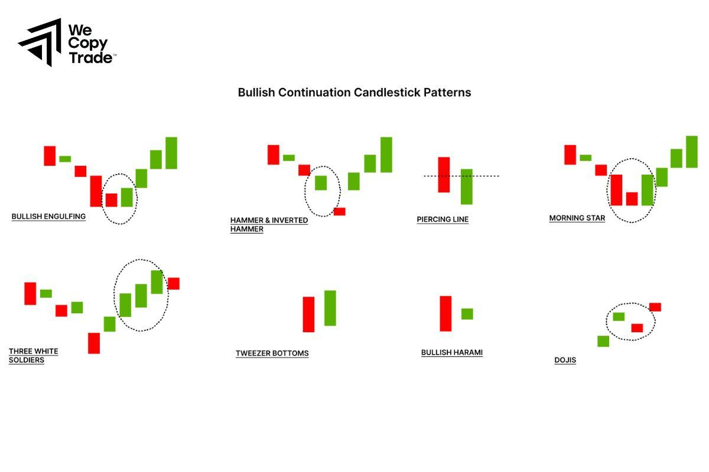

## Table of Contents

## What are continuation patterns in trading?

Continuation patterns in trading are chart formations that show a pause in a trend, but suggest that the trend will continue after the pause. Traders use these patterns to make decisions about when to buy or sell. Common continuation patterns include flags, pennants, and rectangles. These patterns are important because they help traders predict where the price might go next.

When you see a continuation pattern, it means the market is taking a short break. During this break, the price might move sideways or form a small trend in the opposite direction. But, the main trend is expected to pick up again. For example, if the overall trend is upward and you see a flag pattern, it's a signal that the price will likely keep going up after the flag completes. This can help traders decide to stay in their positions or even add to them, expecting the trend to resume.

## Why are continuation patterns important for traders?

Continuation patterns are important for traders because they help predict what the price will do next. When traders see these patterns, they know that the current trend is likely to keep going after a short break. This can help them make better decisions about when to buy or sell. For example, if a trader sees a flag pattern during an uptrend, they might decide to keep their position or buy more, expecting the price to go up again.

These patterns also help traders manage their risk. By understanding that a trend is likely to continue, traders can set their stop-loss orders more effectively. This means they can protect their investments while still taking advantage of the trend. Overall, continuation patterns give traders a clearer picture of the market, helping them to trade more confidently and potentially make more profit.

## Can you explain the difference between continuation and reversal patterns?

Continuation patterns and reversal patterns are both important in trading, but they tell us different things about the market. Continuation patterns show that a trend is taking a short break, but it will likely keep going in the same direction after the pause. For example, if the price is going up and you see a flag pattern, it means the price will probably keep going up after the flag is done. Traders use these patterns to stay in their positions or even buy more, expecting the trend to continue.

Reversal patterns, on the other hand, tell us that the current trend might be about to change direction. If the price has been going up and you see a head and shoulders pattern, it means the price might start going down soon. Traders use these patterns to get ready for a change in the market. They might sell their positions or get ready to buy if they think the price will start moving the other way. 

Understanding the difference between these two types of patterns helps traders make smarter decisions. Continuation patterns help them stay with the trend, while reversal patterns help them prepare for a change. Both are important tools for anyone trying to make money in the markets.

## What are some common types of continuation patterns?

Some common types of continuation patterns are flags, pennants, and rectangles. A flag pattern looks like a small rectangle that slopes against the main trend. It forms after a big move in the price and shows that the price is taking a short break before continuing in the same direction. A pennant pattern is similar, but it looks like a small triangle. It also forms after a big move and shows that the price will likely keep going the same way after the triangle is done.

Another common continuation pattern is the rectangle. This pattern forms when the price moves sideways between two parallel lines. It shows that the price is taking a break, but it will probably keep going in the same direction once it breaks out of the rectangle. These patterns are important because they help traders know when to stay in their positions or even buy more, expecting the trend to continue.

## How can a beginner identify a continuation pattern on a chart?

To identify a continuation pattern on a chart, a beginner should first look at the overall trend. Is the price going up, down, or moving sideways? Once you know the trend, watch for a pause in that trend. This pause might look like the price moving sideways or a small move in the opposite direction. Common continuation patterns include flags, pennants, and rectangles. 

A flag pattern looks like a small rectangle that slopes against the main trend. It usually forms after a big move in the price. A pennant looks like a small triangle and also forms after a big move. A rectangle pattern happens when the price moves sideways between two parallel lines. When you see one of these patterns, it means the price is taking a short break but will likely keep going in the same direction after the pattern is done. By looking for these shapes on the chart, beginners can start to predict where the price might go next.

## What is the significance of volume in confirming continuation patterns?

Volume is really important when you're trying to confirm continuation patterns. When you see a pattern like a flag or a pennant, you should also look at the [volume](/wiki/volume-trading-strategy). If the volume drops while the pattern is forming, that's a good sign. It means the market is taking a break, but the trend is still strong. When the price breaks out of the pattern, the volume should go up again. This shows that more people are interested in the stock, and the trend is likely to keep going.

So, volume helps you know if the continuation pattern is real. If the volume stays high during the pattern, it might mean the pattern isn't as strong. But if the volume goes down during the pattern and then goes up when the price breaks out, that's a good sign that the trend will continue. This makes volume a key thing to watch when you're trying to use continuation patterns to make trading decisions.

## How do continuation patterns differ across various time frames?

Continuation patterns can look different depending on the time frame you're looking at. On shorter time frames, like a 5-minute or 15-minute chart, continuation patterns might form and complete quickly. You might see a flag or pennant pattern within a few hours. These patterns can help day traders make quick decisions, but they might not be as reliable because the market can be more unpredictable over short periods.

On longer time frames, like daily or weekly charts, continuation patterns take more time to form and complete. A flag or rectangle pattern might take days or even weeks to develop. These patterns are often more reliable because they show trends that last longer. Traders who hold positions for weeks or months pay close attention to these patterns because they can help predict where the price will go over a longer period.

## What are the key entry and exit strategies when trading continuation patterns?

When trading continuation patterns, the key entry strategy is to buy or sell when the price breaks out of the pattern in the direction of the main trend. For example, if you see a flag pattern during an uptrend, you would enter a long position when the price breaks above the top of the flag. It's important to wait for this [breakout](/wiki/breakout-trading) and look for an increase in volume to confirm that the trend is likely to continue. This helps you get into the trade at a good point, right as the trend starts moving again.

For [exit](/wiki/exit-strategy) strategies, you need to set a target price and a stop-loss order. The target price can be set by measuring the height of the move that happened before the pattern formed and adding that to the breakout point. This gives you an idea of how far the price might go. A stop-loss order should be placed just below the breakout point for a long position, or just above it for a short position. This helps you limit your losses if the pattern fails and the price moves against you. By using these entry and exit strategies, you can trade continuation patterns more effectively and manage your risk.

## Can you discuss the psychological aspects that contribute to the formation of continuation patterns?

Continuation patterns form because of how traders think and feel. When the price is going up or down strongly, traders start to feel excited or worried. This strong emotion makes them trade a lot, which creates the big move before the pattern starts. But after that big move, traders get tired and need a break. They stop trading as much, and the price starts to move sideways or a little bit the other way. This is when the pattern, like a flag or pennant, starts to form. It's like the market is taking a deep breath before it keeps going.

The break in the pattern also shows that some traders are not sure what will happen next. They might take profits or sell to avoid losing more money. But the overall trend is still strong, and more traders believe in it. When the price breaks out of the pattern, it's because these traders start buying or selling again, feeling more confident. The increase in trading shows that the trend is still popular, and it's likely to keep going. So, the psychology of traders, with their emotions and beliefs, is what makes continuation patterns happen and work.

## How do continuation patterns perform in different market conditions, such as bull vs. bear markets?

Continuation patterns can work well in both bull and bear markets, but how they act can be a bit different. In a bull market, when the price is going up, you might see patterns like flags or pennants more often. These patterns show that the price is taking a short break before it keeps going up. Traders in a bull market might feel more confident and keep buying when they see these patterns, making them more likely to work. The key is to watch for the breakout and see if the volume goes up, which means more people are interested and the trend will likely keep going.

In a bear market, when the price is going down, continuation patterns like flags or pennants can also show up. They mean the price is taking a short break before it keeps falling. Traders in a bear market might feel more worried and keep selling when they see these patterns, which can make them work well too. The important thing is to look for the breakout in the direction of the trend and see if the volume increases, showing that more people are selling and the downtrend will probably continue. So, continuation patterns can be useful in both types of markets, but you need to pay attention to the overall trend and the volume to make good trading decisions.

## What are some advanced techniques for improving the accuracy of continuation pattern predictions?

To improve the accuracy of continuation pattern predictions, traders can use multiple time frame analysis. This means looking at the same pattern on different time frames, like a 1-hour chart and a daily chart. If the pattern looks the same on both, it's more likely to be a good signal. Another technique is to use technical indicators, like the Relative Strength Index (RSI) or Moving Averages, to confirm the pattern. If these indicators show the same trend as the pattern, it can make the prediction more reliable. Also, watching the volume closely can help. If the volume goes down during the pattern and then goes up when the price breaks out, it's a strong sign that the pattern will work.

Another advanced technique is to look at the context of the market. This means understanding what's happening in the bigger picture, like economic news or events that might affect the price. If the news supports the trend, the continuation pattern is more likely to be accurate. Traders can also use [backtesting](/wiki/backtesting) to see how well the pattern has worked in the past. By looking at old charts and seeing if the pattern led to the expected results, traders can get a better idea of how it might work in the future. Combining these techniques can help traders make more accurate predictions and improve their trading success.

## How can traders use continuation patterns in conjunction with other technical analysis tools for better results?

Traders can use continuation patterns with other technical analysis tools to get better results. One way is to use indicators like the Relative Strength Index (RSI) or Moving Averages. If a continuation pattern like a flag or pennant shows up, and the RSI is also showing that the trend is strong, it makes the pattern more reliable. Moving Averages can help too. If the price breaks out of the pattern and is also above a key Moving Average, it's a good sign that the trend will keep going. By looking at these indicators along with the pattern, traders can feel more sure about their trades.

Another way is to use multiple time frames. This means looking at the same pattern on different charts, like a 1-hour chart and a daily chart. If the pattern looks the same on both, it's more likely to be a good signal. Traders can also watch the volume closely. If the volume goes down during the pattern and then goes up when the price breaks out, it's a strong sign that the pattern will work. By combining these tools, traders can make better predictions and improve their chances of making money in the markets.

## What are Trading Strategies Using Continuation Patterns?

Traders can leverage continuation patterns to enhance their trading strategies by accurately recognizing these formations and executing trades based on pattern analysis. Continuation patterns are crucial for traders aiming to capitalize on market [momentum](/wiki/momentum) and maintain positions in the direction of the prevailing trend. 

### Step-by-step Guide to Executing Trades

1. **Identification of the Pattern**: The first step involves identifying a continuation pattern such as a flag, pennant, triangle, or rectangle on the chart. Traders should look for periods where the price consolidates after a strong trend, forming shapes indicative of a temporary pause.

2. **Determine Entry Points**: Typically, entry points are determined once the price breaks through the resistance in an uptrend or support in a downtrend. For instance, in a bull flag pattern, a trader enters a long position when the price breaks above the resistance level formed by the flag's upper trendline.

3. **Setting Price Targets**: Price targets can often be inferred from the height of the pattern. For instance, if a triangle pattern has a height of $10, traders might expect a similar price movement after the breakout. This is calculated using the formula:
$$
   \text{Price Target} = \text{Breakout Price} \pm \text{Height of the Pattern}

$$

   For a symmetrical triangle, the price target is generally set from the breakout point with an anticipated move equal to the widest section of the triangle.

4. **Establishing Stop-Loss Orders**: Stop-loss orders are essential to manage risk. They are usually set below the support level in bullish patterns or above the resistance in bearish ones. This ensures that a false breakout does not lead to substantial losses. A common practice is to place the stop-loss just outside the pattern's extremes.

### Breakout Strategies

Breakout strategies are integral to trading continuation patterns. They involve taking positions once the price has broken through significant levels of support or resistance, signaling the continuation of the prior trend. Traders use volume as a confirmation tool; a genuine breakout is often accompanied by increased trading volume, indicating strong market participation.

```python
def calculate_price_target(breakout_price, pattern_height, trend_direction='up'):
    # Calculate the price target based on breakout price and pattern height
    if trend_direction == 'up':
        return breakout_price + pattern_height
    elif trend_direction == 'down':
        return breakout_price - pattern_height
    else:
        raise ValueError("Invalid trend direction. Choose 'up' or 'down'.")

# Example usage:
breakout_price = 150
pattern_height = 10
target_price = calculate_price_target(breakout_price, pattern_height, trend_direction='up')
```

### Risk Management Considerations

To effectively manage risk, traders should be vigilant for warning signs such as a breakout lacking volume support or a pattern taking an unusually long time to resolve. Risk management involves determining the amount of capital to risk on a trade, often no more than 1-2% of the overall portfolio. This allocation can be calculated using the formula:

$$
\text{Risk Per Trade} = \text{Portfolio Value} \times \text{Risk Percentage}
$$

By combining technical analysis with well-defined entry and exit strategies, continuation patterns offer traders an opportunity to trade with confidence in alignment with existing market trends. Proper risk management further enhances the effectiveness of these strategies, enabling traders to capitalize on market movements while minimizing potential losses.

## References & Further Reading

[1]: Bergstra, J., Bardenet, R., Bengio, Y., & Kégl, B. (2011). ["Algorithms for Hyper-Parameter Optimization."](https://papers.nips.cc/paper/4443-algorithms-for-hyper-parameter-optimization) Advances in Neural Information Processing Systems 24.

[2]: ["Advances in Financial Machine Learning"](https://www.amazon.com/Advances-Financial-Machine-Learning-Marcos/dp/1119482089) by Marcos Lopez de Prado

[3]: ["Evidence-Based Technical Analysis: Applying the Scientific Method and Statistical Inference to Trading Signals"](https://books.google.com/books/about/Evidence_Based_Technical_Analysis.html?id=jbD47VkOHAEC) by David Aronson

[4]: ["Machine Learning for Algorithmic Trading"](https://github.com/stefan-jansen/machine-learning-for-trading) by Stefan Jansen

[5]: ["Quantitative Trading: How to Build Your Own Algorithmic Trading Business"](https://www.amazon.com/Quantitative-Trading-Build-Algorithmic-Business/dp/1119800064) by Ernest P. Chan