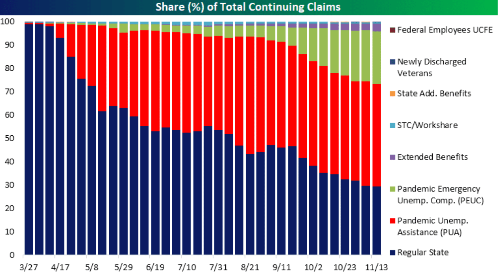

The claims process for unemployment insurance and the integration of algorithmic trading create a unique intersection of finance and social support systems. Understanding these processes is crucial for individuals seeking to navigate through periods of unemployment as well as for traders aiming to optimize their strategies in response to labor market dynamics. Unemployment insurance provides a safety net for individuals who are temporarily out of work, allowing them to maintain basic financial stability while they search for new employment. This system tracks both initial claims (new applications for benefits) and continuing claims (ongoing benefits for those already receiving aid), offering valuable insights into the health of the labor market.

Algorithmic trading, on the other hand, represents a sophisticated approach to financial markets, using computational algorithms to execute trades at high speed and with high precision. These algorithms can analyze vast amounts of data, including economic indicators like unemployment claims, to predict market movements and make informed trading decisions. The intersection of unemployment data and algorithmic trading represents a growing area of interest, as traders increasingly seek to incorporate macroeconomic indicators into their models for enhanced predictive power.



This article explores the continuing claims process for unemployment insurance and how algorithmic trading can respond to labor market indicators. We will also examine how these two aspects impact economic measures, influencing policy decisions and contributing to the overall dynamics of financial markets. By understanding the connection between unemployment claims and trading algorithms, stakeholders can gain a deeper insight into the broader economy, creating opportunities for more informed decision-making and strategic planning.

## Table of Contents

## Understanding Continuing Claims and Initial Claims

Continuing claims and initial claims are two key components of unemployment insurance data, each serving a distinct role in assessing labor market conditions. Initial claims refer to the number of new individuals filing for unemployment benefits for the first time, indicating emerging trends in job loss and shifts in employment sectors. This metric is crucial for providing a short-term view of the labor market's health, allowing policymakers and economists to react promptly to changes in unemployment.

On the other hand, continuing claims represent the ongoing number of individuals who have previously filed initial claims and continue to receive unemployment benefits. This measure provides insight into the duration of unemployment and the ability of individuals to find new employment over time. Continuing claims help to ascertain whether the labor market is improving, stabilizing, or deteriorating by monitoring longer-term patterns in unemployment.

Understanding the difference between these two metrics is critical for accurate economic analysis. Initial claims offer early signals of labor market disruptions, while continuing claims reveal the persistence of unemployment. Economists pay close attention to changes in these figures, as significant deviations can indicate macroeconomic shifts. For example, a sustained rise in continuing claims may suggest structural unemployment issues or insufficient job creation in the economy, potentially signaling the need for intervention through policy measures.

Moreover, these metrics are essential for financial modeling, enabling analysts to assess economic health and predict future market conditions. By incorporating initial and continuing claims data, financial models can more accurately simulate economic scenarios, forecast labor market trends, and inform investment strategies. For instance, a python-based model could incorporate claims data as follows:

```python
import pandas as pd
import numpy as np

# Assuming we have unemployment claims data in a pandas dataframe 'claims_data'
# with columns ['date', 'initial_claims', 'continuing_claims']

# Calculate a simple moving average of initial and continuing claims
claims_data['initial_claims_ma'] = claims_data['initial_claims'].rolling(window=4).mean()
claims_data['continuing_claims_ma'] = claims_data['continuing_claims'].rolling(window=4).mean()

# Determine trends by comparing the moving average to current data
claims_data['initial_trend'] = np.where(claims_data['initial_claims'] > claims_data['initial_claims_ma'], 'Increasing', 'Decreasing')
claims_data['continuing_trend'] = np.where(claims_data['continuing_claims'] > claims_data['continuing_claims_ma'], 'Increasing', 'Decreasing')

print(claims_data[['date', 'initial_claims', 'initial_trend', 'continuing_claims', 'continuing_trend']])
```

This simplified example calculates a moving average of initial and continuing claims to identify trends, indicating whether claims are increasing or decreasing. Such information is vital for predicting unemployment rates, assessing job market health, and making informed decisions in both public policy and financial markets.

## The Economic Impact of Unemployment Claims

Unemployment claims are pivotal in assessing economic health due to their ability to signal fluctuations in the labor market. Distinguishing between initial and continuing claims is key to understanding their respective implications. While initial claims represent newly unemployed individuals filing for benefits, continuing claims account for those who continue to receive unemployment support. This ongoing data serves as a barometer for economic stability or distress.

Continuing claims provide insights into longer-term unemployment trends. An increasing number of continuing claims can indicate enduring economic challenges, suggesting that individuals struggle to find new employment opportunities. Conversely, a decline in these claims suggests improved labor market conditions. Monitoring the trajectory of continuing claims offers a glimpse into potential economic recoveries or downturns.

Unemployment claims data is intrinsically linked to macroeconomic indicators like Gross Domestic Product (GDP) and inflation. A rise in unemployment invariably impacts GDP, often resulting in decreased consumer spending and contributing to negative GDP growth. This aligns with Okun's Law, which postulates a relationship between unemployment rates and GDP performance. The formula:

$$
\Delta Y = -c \times \Delta U
$$

where $\Delta Y$ represents the change in GDP, $\Delta U$ signifies the change in the unemployment rate, and $c$ is a constant factor, typically used in economic analysis to forecast GDP variations based on unemployment changes.

Unemployment data also influences inflation metrics. According to the Phillips Curve, there is an inverse relationship between unemployment and inflation, meaning that as unemployment decreases, inflation tends to rise if other factors remain constant. This relationship urges policymakers to balance employment levels with inflation control to maintain economic stability.

Governments and monetary authorities rely on unemployment claims data to craft strategies and implement policies aimed at economic stabilization. High unemployment typically prompts governments to deploy fiscal policies, such as increased public spending or tax reductions, to stimulate job creation and consumer demand. Central banks might adjust interest rates in response to labor market conditions, aiming to foster economic growth or curb inflationary pressures.

In essence, unemployment claims not only provide snapshots of current labor market conditions but also guide macroeconomic strategies and monetary policies. This data, by reflecting economic strengths and vulnerabilities, becomes central to decision-making processes, ensuring that interventions are timely and effectively geared toward stabilizing the economy.

## Algorithmic Trading and Its Importance in Financial Markets

Algorithmic trading, also known as algo-trading or automated trading, employs computer algorithms to execute trades at optimal speeds and often at high frequencies. These systems are designed to perform trades based on predefined criteria and complex mathematical models, thereby minimizing human intervention and emotional decision-making. The adoption of [algorithmic trading](/wiki/algorithmic-trading) in financial markets has significantly improved both [liquidity](/wiki/liquidity-risk-premium) and market efficiency, evident in the increased [volume](/wiki/volume-trading-strategy) of trades and reduced bid-ask spreads.

One of the primary benefits of algorithmic trading is its ability to quickly respond to market movements. By executing large orders over a series of smaller transactions across different markets and times, algorithms help in reducing market impact and executing trades at better average prices. This strategy is particularly crucial in environments with significant [volatility](/wiki/volatility-trading-strategies), where rapid execution can mitigate adverse price changes.

Programming plays a pivotal role in developing trading algorithms. Modern algorithms are often written in Python due to its simplicity and extensive libraries for data analysis and [machine learning](/wiki/machine-learning), though languages like C++ are also used for their speed and performance. These algorithms can be tuned to adapt to various market conditions, incorporating diverse data inputs, including economic indicators like unemployment claims.

Python Example:
```python
import pandas as pd
from sklearn.linear_model import LinearRegression

# Load unemployment data
data = pd.read_csv("unemployment_data.csv")

# Define predictor and outcome
X = data[['initial_claims', 'continuing_claims']]
y = data['market_trend']

# Train the model
model = LinearRegression()
model.fit(X, y)

# Predict market trend based on new unemployment data
new_data = {'initial_claims': 400000, 'continuing_claims': 360000}
market_prediction = model.predict(pd.DataFrame([new_data]))

print("Predicted Market Trend:", market_prediction)
```

In this context, algorithmic trading systems can integrate labor market indicators such as continuing and initial unemployment claims. These factors can provide insights into economic conditions and assist in predicting market movements. For instance, a sudden spike in unemployment claims might signal economic downturn risks, prompting algorithms to adjust their trading strategies to account for potential market contraction.

Such integration illustrates how swiftly algorithmic trading can adapt to economic data, leveraging real-time information to optimize trade execution, manage risk, and capitalize on market opportunities. However, relying on economic indicators in algorithmic trading also poses potential risks, including overreliance on historical correlations that may not hold in all market scenarios, necessitating ongoing refinement of algorithms to ensure robust performance across varying economic conditions.

## Integrating Unemployment Data with Algorithmic Trading

Integrating unemployment data, particularly continuing claims, into algorithmic trading systems offers significant opportunities for enhancing market predictions and making informed financial decisions. Traders and financial models increasingly leverage unemployment trends to anticipate shifts in market dynamics. This integration aids in refining trading strategies, offering a more comprehensive understanding of market movements.

### Utilizing Unemployment Trends

Traders utilize unemployment data to gauge macroeconomic conditions that can influence asset prices. Continuing claims reflect persistent unemployment levels and can signal economic slowdowns or recoveries. By monitoring these indicators, traders can adjust their strategies accordingly. For instance, a prolonged increase in continuing claims might suggest a weakening economy, prompting traders to adopt a more conservative stance or shift investments towards safe-haven assets.

### Algorithmic Strategies

Several algorithmic strategies incorporate labor market data to improve their predictive accuracy:

1. **Sentiment Analysis**: Algorithms can parse news articles and reports for keywords related to unemployment, integrating this sentiment data with continuing claims figures to anticipate market sentiment shifts.

2. **Regression Analysis**: Financial models often employ regression analysis, using historical unemployment data as predictors for future asset price movements. Linear regression models might take the form:
$$
   P_t = \beta_0 + \beta_1 U_t + \beta_2 C_t + \epsilon_t

$$

   Where $P_t$ is the asset price at time $t$, $U_t$ is the initial unemployment claims, $C_t$ is the continuing claims, and $\epsilon_t$ is the error term.

3. **Machine Learning Models**: Advanced machine learning algorithms, such as random forests or neural networks, can learn complex patterns between unemployment data and market changes. These models can dynamically adjust to new data inputs, improving their predictive capacity.

   ```python
   from sklearn.ensemble import RandomForestRegressor

   # Assume X_train contains historical unemployment data and y_train contains asset prices
   model = RandomForestRegressor()
   model.fit(X_train, y_train)

   # Predict future asset prices based on new unemployment data
   predictions = model.predict(X_new)
   ```

### Risks and Rewards

Integrating unemployment data into algorithmic trading brings both rewards and risks. The primary reward lies in the potential for more accurate market forecasts, allowing traders to capitalize on shifts in economic conditions. This data-driven approach can offer significant competitive advantages in financial markets.

However, the reliance on economic indicators also carries risks. Unemployment data is subject to revisions and reporting lags, which can lead to outdated or inaccurate information influencing trading decisions. Moreover, external factors, such as geopolitical events or policy changes, may disrupt unemployment trends, reducing the effectiveness of algorithms that rely heavily on these indicators.

Incorporating unemployment data into algorithmic trading represents an intersection of economic analysis and financial technology. While it offers promising avenues for refined market predictions, traders must remain vigilant about the inherent uncertainties and potential data limitations.

## Conclusion

The intersection of unemployment insurance claims and algorithmic trading represents a significant confluence of social support systems and financial technologies. This relationship highlights how data derived from unemployment claims, especially continuing claims, acts as a pivotal economic indicator. These claims not only signal the health of the labor market but also influence macroeconomic variables such as GDP, inflation, and policy-making decisions. Algorithmic trading, on the other hand, utilizes automated and data-driven approaches to optimize trading strategies based on such economic indicators, showcasing an interconnected feedback loop between social data and financial markets.

Unemployment claims reflect broader economic trends and can preface potential downturns or periods of economic growth. When incorporated into algorithmic trading models, these data points can enhance prediction accuracy and strategic trading decisions, potentially stabilizing financial markets through more informed responses to economic indicators. This integration can thus provide traders with a competitive edge, as algorithms configured to consider dynamic labor market conditions can adjust trading strategies in real-time in response to emerging data.

Looking to the future, the potential to further leverage data and technology in developing sophisticated economic models and trading frameworks is vast. Algorithms could integrate a broader array of labor market indicators, such as workforce participation rates and job vacancy [statistics](/wiki/bayesian-statistics), thereby offering a more nuanced understanding of economic conditions. For financial markets, this means an increased capability to anticipate changes and respond proactively, potentially smoothing out volatility and contributing to overall market stability.

Continued exploration and advancement in this area are essential. As more comprehensive datasets become available and technology continues to advance, the ability of market participants to interpret and utilize economic indicators will also grow. This ongoing adaptation will not only enhance trading strategies but also foster more resilient economic models better equipped to navigate and respond to shifting economic landscapes.

## References & Further Reading

[1]: Bergstra, J., Bardenet, R., Bengio, Y., & Kégl, B. (2011). ["Algorithms for Hyper-Parameter Optimization."](https://papers.nips.cc/paper/4443-algorithms-for-hyper-parameter-optimization) Advances in Neural Information Processing Systems 24.

[2]: ["Advances in Financial Machine Learning"](https://www.amazon.com/Advances-Financial-Machine-Learning-Marcos/dp/1119482089) by Marcos Lopez de Prado

[3]: ["Evidence-Based Technical Analysis: Applying the Scientific Method and Statistical Inference to Trading Signals"](https://www.amazon.com/Evidence-Based-Technical-Analysis-Scientific-Statistical/dp/0470008741) by David Aronson

[4]: ["Machine Learning for Algorithmic Trading"](https://github.com/PacktPublishing/Machine-Learning-for-Algorithmic-Trading-Second-Edition) by Stefan Jansen

[5]: ["Quantitative Trading: How to Build Your Own Algorithmic Trading Business"](https://books.google.com/books/about/Quantitative_Trading.html?id=j70yEAAAQBAJ) by Ernest P. Chan

[6]: U.S. Department of Labor. ["Unemployment Insurance Weekly Claims Data."](https://oui.doleta.gov/unemploy/claims.asp)

[7]: Gürkaynak, R. S., & Kısacıkoğlu, B. (2022). ["Empirical Asset Pricing with Macro Factors: The Enduring Importance of Aggregate Unemployment Claims."](https://papers.ssrn.com/sol3/papers.cfm?abstract_id=4110158) International Review of Financial Analysis.

[8]: Economic Policy Institute. ["Understanding the Unemployment Claims Report."](https://en.wikipedia.org/wiki/Employment_Policies_Institute)

[9]: Engle, R. F., & Rangel, J. G. (2008). ["The Spline-GARCH Model for Low-Frequency Volatility and Its Global Macroeconomic Causes."](https://www.semanticscholar.org/paper/The-Spline-Garch-Model-for-Low-Frequency-Volatility-Engle-Rangel/5474c5e60461b7f0598f48ce3e6aba9fc4fb728d) Journal of Business & Economic Statistics, 26(3), 344-357.

[10]: BlackRock. ["Macro Uncertainties and Market Outlook](https://www.blackrock.com/us/individual/insights/macro-outlook)