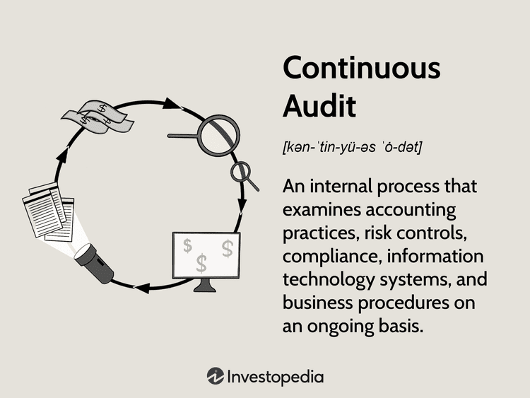

In today's dynamic financial landscape, businesses increasingly rely on audits to ensure transparency and compliance. Audits are crucial in verifying the accuracy of financial statements, evaluating internal controls, and ensuring adherence to regulatory requirements. As financial transactions become more complex, there is a growing need for more sophisticated auditing methods to address potential risks and inefficiencies.

Continuous audits are integrated seamlessly into algorithmic trading processes, addressing the need for real-time oversight. Algorithmic trading, which involves the use of computer algorithms to execute trades at high speed and volume, demands precise monitoring to prevent potential trading anomalies and non-compliance issues. The integration of continuous audits in these processes is becoming more critical as the technology enables auditors to analyze data on a near real-time basis. This allows for immediate detection of discrepancies, errors, or regulatory breaches, thus significantly reducing reaction times.



This article takes an in-depth look at the multifaceted benefits of continuous audits within the auditing process, particularly concerning algorithmic trading. Continuous audits allow firms to keep up with the rapid pace of trading activities, providing valuable insights into operational performance and ensuring adherence to regulatory frameworks. By offering enhanced visibility and greater control over trading operations, continuous audits improve decision-making capabilities and minimize the risk of financial losses due to non-compliance or system errors. Consequently, they are instrumental in enhancing both operational efficiency and risk management.

As businesses continue to navigate the evolving financial and regulatory landscapes, the adoption of continuous auditing practices will increasingly be viewed as indispensable.

## Table of Contents

## Understanding Continuous Audits

Continuous auditing is an iterative method focused on the continuous evaluation of internal control systems and procedures, aiming for timely detection and correction of issues. In contrast to traditional audits, which are typically retrospective and scheduled periodically, continuous auditing harnesses technological advancements to enable real-time data analysis and decision-making support. This real-time capability is a pivotal feature, allowing organizations to gain immediate insights into various operations and financial transactions. 

At the heart of continuous auditing is the integration of automated systems designed to consistently monitor activities and swiftly identify any deviations or violations of set control practices. These systems utilize advanced algorithms and data analysis techniques to scrutinize data flows and transactions. When anomalies or non-compliance instances arise, automated alerts are generated, facilitating rapid response and remediation. 

For example, such systems might be based on rule-based frameworks or [machine learning](/wiki/machine-learning) (ML) models that evolve over time. A simple Python representation to detect anomalies in financial transactions might look like this:

```python
import pandas as pd

# Sample data
data = {'transaction_id': [1, 2, 3, 4],
        'amount': [100, 2500, 150, 5000],
        'expected_range': [(50, 200), (50, 300), (50, 200), (50, 300)]}

df = pd.DataFrame(data)

# Function to flag anomalies
def check_anomalies(row):
    lower, upper = row['expected_range']
    return not (lower <= row['amount'] <= upper)

# Apply function
df['anomaly'] = df.apply(check_anomalies, axis=1)

print(df)
```

In this code snippet, transactions are checked against expected ranges, and anomalies are flagged accordingly. Such implementations, when scaled, serve organizations by maintaining continuous oversight and ensuring compliance with predefined financial thresholds and regulatory requirements.

The integration of continuous audits extends beyond simple error detection. These systems can be configured to assess adherence to various regulatory standards, such as those set by financial regulatory bodies. Consequently, organizations are better equipped to maintain compliance, reduce risk, and ensure accurate financial reporting.

Overall, continuous auditing represents a paradigm shift in audit methodology, significantly enhancing the ability of organizations to manage and monitor their internal controls effectively. This proactive audit approach contributes to increased transparency and operational efficiency, which are critical in today’s rapidly evolving financial environment.

## Benefits of Continuous Audits in Algorithmic Trading

Continuous audits in [algorithmic trading](/wiki/algorithmic-trading) offer substantial benefits by providing real-time insights into trading activities, significantly enhancing decision-making and trading accuracy. This real-time capability allows for the immediate analysis and validation of transactions, leading to a more dynamic and responsive trading environment. By continuously monitoring algorithmic systems, these audits are adept at early anomaly detection, thereby safeguarding against potential financial losses. This proactive approach ensures that any discrepancies or irregularities in trading patterns are identified and addressed promptly. 

A critical advantage of continuous audits is their role in ensuring regulatory compliance, which is often a complex and evolving landscape in financial markets. By integrating automated checks and balances, continuous audits reduce the risk of non-compliance, subsequently minimizing the possibility of legal issues. These automated systems effectively track and document every trade, compliance status, and any deviations from the norm, thus providing a comprehensive audit trail. 

Moreover, continuous audits facilitate improved strategic decision-making by offering stakeholders detailed, up-to-the-minute information. This enhances not only the precision of executions but also the overall trading strategy, allowing firms to adapt quickly to market changes. The capacity to swiftly react to market conditions is particularly valuable in algorithmic trading, where speed and accuracy are paramount to success.

In summary, the integration of continuous audits within algorithmic trading frameworks promotes a more robust, accountable, and compliant trading environment, making it an indispensable tool for modern financial operations.

## The Audit Process in Algorithmic Trading

The audit process in algorithmic trading is a comprehensive mechanism aimed at ensuring transparent, compliant, and risk-averse trading environments. This process encompasses several critical functions, including tracking automated trade executions, verifying adherence to compliance guidelines, and monitoring risk controls. 

Tracking automated trade executions is a fundamental component of the audit process. This task involves the systematic documentation and examination of the actions undertaken by trading algorithms. By maintaining detailed records of every trade execution, auditors can retrospectively analyze trading patterns and outcomes. This analysis helps ascertain the effectiveness of the algorithm and ensures that trades align with the predefined strategies and risk parameters.

Compliance checking is the next crucial step in the audit process. Given the stringent regulatory frameworks governing financial markets, algorithmic trading systems must operate within established legal and ethical boundaries. Continuous audits facilitate this by employing automated tools to constantly cross-reference trade data against regulatory requirements. Such real-time scrutiny ensures that any deviation from compliance is swiftly identified and rectified, thereby preempting potential legal issues.

Risk control is another pivotal aspect of the audit process. The high-speed nature of algorithmic trading can lead to significant financial exposure. Continuous audits contribute to risk management by providing immediate insights into trading anomalies or irregular market behaviors. Through automated logging of trade data, these audits can trigger alerts for potential risks, allowing firms to take corrective actions promptly.

The implementation of continuous audits transforms the auditing landscape in algorithmic trading. By automating data logging and analysis, continuous audits streamline the assessment process for internal auditors. This automation reduces the manual workload and enhances the precision of performance evaluations and compliance checks. As a result, firms can maintain a current and comprehensive understanding of their trading operations, which is crucial for sustaining transparency and accountability in high-frequency trading environments.

In summary, continuous audits integrate advanced technological solutions to enhance the audit process in algorithmic trading. By automating the tracking of trade executions, ensuring compliance, and establishing robust risk controls, these audits play a vital role in maintaining the integrity and stability of financial markets.

## Challenges and Best Practices

Implementing continuous audits within algorithmic trading systems poses several challenges, primarily due to the requirement for robust technological infrastructure capable of handling real-time data processing. The nature of continuous audits demands seamless integration and analysis of vast amounts of data generated from diverse sources within milliseconds. This necessity for rapid processing requires advanced computing systems, high-speed networks, and data storage solutions optimized for real-time operations.

A significant challenge in this implementation is achieving effective data integration across various systems. Algorithmic trading environments often consist of heterogeneous systems, including trading platforms, risk management software, and regulatory compliance tools. Ensuring these systems communicate and share data efficiently is crucial to complete a continuous audit's efficacy. Without seamless data integration, inconsistencies and gaps in communication may lead to incorrect audits, potentially missing out on key insights or failing to identify critical issues.

Best practices for implementing continuous audits begin with ensuring data accuracy. This involves validating and verifying data integrity as it is processed in real time. Utilizing advanced algorithms, such as machine learning models, can enhance data validation by detecting anomalies and outliers that may indicate errors or fraudulent activities. Additionally, data cleansing procedures should be employed to remove inaccuracies before audit analyses.

Hiring skilled personnel is another essential component of effective continuous audits. Professionals with expertise in both auditing and technology are indispensable, as they can navigate the complexities of algorithmic trading systems while understanding the audit objectives. These individuals must be adept at using advanced data analytics tools and should possess an acute understanding of industry regulations and compliance requirements.

Despite the reliance on automation and technology, maintaining human oversight during continuous audit processes is crucial. Human auditors are essential for interpreting audit results, particularly when nuanced judgments are needed beyond what automated systems can determine. This includes scenarios where subjective assessments and context-specific evaluations are necessary to understand the broader implications of findings.

Incorporating these best practices equips firms with the ability to overcome the challenges posed by continuous audits. It ensures that the implementation not only enhances operational efficiency but also bolsters the reliability and integrity of algorithmic trading systems.

## Conclusion

Continuous audits represent a significant advancement in the auditing process, offering numerous benefits, particularly within algorithmic trading. As businesses increasingly depend on advanced technology for financial operations, continuous audits provide a framework for ongoing evaluation and adjustment of trading algorithms and practices. They enable firms to promptly identify and rectify discrepancies, thereby upholding compliance and preventing potential financial missteps.

Implementing continuous audits may necessitate considerable investment in terms of technology and personnel, but the advantages in risk management and operational efficiency outweigh these initial challenges. By offering real-time insights and automated alerts, continuous auditing reduces the financial and operational risks that businesses face, ensuring a more robust trading environment.

Moreover, as financial and regulatory landscapes continue to evolve, continuous audits are poised to play a crucial role in maintaining market integrity and trust. The dynamic nature of financial markets demands that businesses stay ahead of regulatory changes, and continuous audits provide the mechanisms to do so effectively. These audits ensure that trading systems comply with the latest regulations, minimize legal risks, and protect firms from potentially damaging penalties.

In conclusion, continuous audits not only advance the auditing process but also fortify the stability and reliability of algorithmic trading operations. Businesses that invest in continuous audit frameworks will find themselves better positioned to navigate the complexities of modern financial markets, achieving sustained growth and compliance in an ever-changing landscape.

## References & Further Reading

[1]: Vasarhelyi, M. A., & Halper, F. B. (1991). ["The Continuous Audit of Online Systems."](https://www.researchgate.net/publication/255667612_The_Continuous_Audit_of_Online_Systems) Auditing: A Journal of Practice & Theory.

[2]: Alles, M., Brennan, G., Kogan, A., & Vasarhelyi, M. A. (2006). ["Continuous Monitoring of Business Process Controls: A Pilot Implementation of a Continuous Auditing System at Siemens."](https://www.emerald.com/insight/content/doi/10.1108/978-1-78743-413-420181010/full/html) International Journal of Accounting Information Systems.

[3]: ["Advances in Financial Machine Learning"](https://www.amazon.com/Advances-Financial-Machine-Learning-Marcos/dp/1119482089) by Marcos Lopez de Prado.

[4]: ["Quantitative Trading: How to Build Your Own Algorithmic Trading Business"](https://www.amazon.com/Quantitative-Trading-Build-Algorithmic-Business/dp/1119800064) by Ernest P. Chan.

[5]: Sutton, S. G., Holt, M. J., & Arnold, V. (2008). ["The Role of Continuous Auditing in Public Finance."](https://scholar.google.com/citations?user=cEnHyZAAAAAJ&hl=en) The Journal of Information Systems.

[6]: Carnaghan, C. A. (2005). ["Business Process Modeling for Internal Control and Compliance"](https://www.semanticscholar.org/paper/Business-process-modeling-approaches-in-the-context-Carnaghan/4dff028fcd061aea325b5cffe4f114a83a896ac5). Issues in Accounting Education.