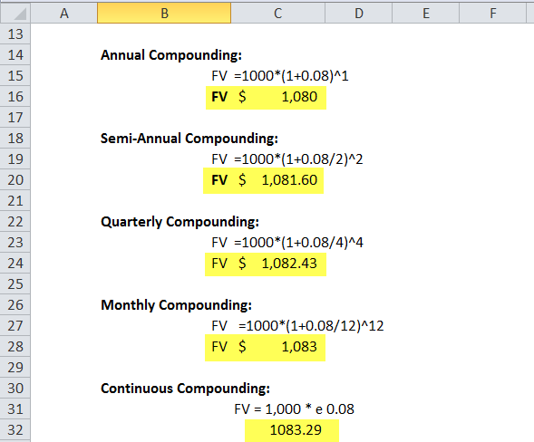

The concept of compounding has significantly impacted financial growth strategies, providing effective avenues for exponential wealth accumulation. By continuously reinvesting earnings, compounding enables capital to grow at a faster rate than simple interest, where profits are generated only on the principal amount. In the fields of finance and trading, a thorough understanding of how compounding works can drastically influence investment outcomes. 

Algorithmic trading, or algo trading, has expertly harnessed the power of compounding to enhance returns on investments. By employing automated systems to execute trades and reinvest profits based on predetermined strategies, algorithmic trading optimizes the potential of compounding. These systems can adapt to evolving market conditions, making real-time adjustments to strategies that align with specific financial goals and risk profiles.



This article will explore the complexities of interest compounding, its fundamental principles in finance, and how it effectively integrates into algorithmic trading. Through a strategic application of compounding concepts, investors can potentially yield significant profits, provided they apply careful planning and disciplined execution in their strategies.

## Table of Contents

## Understanding Compound Interest

Compound interest is an essential concept in finance that significantly impacts wealth accumulation. Unlike simple interest, which is calculated solely on the principal amount, compound interest applies to both the initial principal and the interest that accumulates over previous periods. This results in interest earning additional interest, creating a compounding effect that can profoundly enhance financial growth over time.

The mathematical expression for compound interest is represented by the formula:

$$
A = P (1 + \frac{r}{n})^{nt}
$$

In this equation:
- $A$ represents the future value of the investment/loan, including interest.
- $P$ is the principal investment amount.
- $r$ is the annual interest rate (decimal).
- $n$ denotes the number of times that interest is compounded per year.
- $t$ is the number of years the money is invested or borrowed for.

For example, suppose an investor places $1,000 in an account that offers an annual [interest rate](/wiki/interest-rate-trading-strategies) of 5%, compounded annually. Using the formula, the investment's value after 3 years would be:

$$
A = 1000 \times (1 + \frac{0.05}{1})^{1 \times 3} = 1157.63
$$

This calculation demonstrates how regular compounding intervals contribute to the increasing value over time.

Financial institutions typically provide compound interest through various schedules, including annually, semi-annually, quarterly, monthly, and even daily. More frequent compounding periods result in higher accrued interest due to the periodic reinvestment of earnings, tapping into the exponential nature of compound growth. For instance, daily compounding would slightly increase the interest accumulated compared to annual compounding, assuming the same nominal interest rate. 

The core tenet of compound interest is the reinvestment strategy, which aims to generate additional earnings. Reinvesting the returns, rather than withdrawing, enhances the compounding effect and stimulates a cycle where accrued interests further contribute to the principal, thus continuously magnifying the investment's growth potential. This principle underpins the power of compound interest and why it can substantially outperform simple interest over long periods.

To see compound interest in action using Python, consider this simple simulation:

```python
def compound_interest(principal, rate, times_compounded, years):
    amount = principal * (1 + rate / times_compounded) ** (times_compounded * years)
    return amount

# Example: $1,000 principal, 5% annual interest rate, compounded monthly, for 3 years
principal = 1000  # Initial investment
rate = 0.05  # Annual interest rate
times_compounded = 12  # Compounding monthly
years = 3  # Duration of investment

future_value = compound_interest(principal, rate, times_compounded, years)
print(f"Future Value: ${future_value:.2f}")
```

This script demonstrates how the investment grows when interest is compounded monthly, reflecting the potential for significant growth through consistent compounding. Understanding and applying compound interest principles can thus serve as a powerful tool for effective financial planning and growth.

## Continuous Compounding: A Theoretical Outlook

Continuous compounding represents an idealized mathematical framework where interest is compounded an infinite number of times over infinitesimally small periods. This conceptual model involves the exponential growth of an investment, where interest is continuously applied to the principal sum and all previously accrued interest. The formula for continuous compounding is expressed as:

$$
A = Pe^{rt}
$$

where $A$ is the amount of money accumulated after time $t$ (including principal and interest), $P$ is the principal amount, $r$ is the annual nominal interest rate, $t$ is the time in years, and $e$ is the base of the natural logarithm, approximately equal to 2.71828.

Continuous compounding serves as a theoretical benchmark for understanding the maximum potential of interest compounding. While practical implementations generally use discrete compounding intervals such as daily, monthly, or annually, continuous compounding offers insights into the growth dynamics within financial systems. It models an optimal scenario where reinvestment occurs at every possible moment, allowing investors to grasp the full power of exponential growth potential.

On a theoretical level, continuous compounding provides a profound understanding of the interplay between time and interest rates. By examining the continuous compounding model, investors and financial analysts can appreciate the effects of small changes in interest rates or compounding frequency on investment outcomes over extended periods. These insights are critical in evaluating the compounding effect within various financial products and economic environments.

However, despite its conceptual elegance, continuous compounding remains largely impractical for real-world applications. Financial institutions typically adopt discrete compounding intervals due to the constraints of transaction processing and financial regulation. Nonetheless, the continuous compounding model remains a pivotal tool in theoretical finance, serving as an important reference point for the potential of compounded interest.

## Compound Trading and Its Fundamentals

Compound trading is a financial strategy that harnesses the principle of compounding within the trading industry, aiming to reinvest earnings to amplify future profits. It operates on the fundamental concept that reinvestment of gains can exponentially increase returns over time. This strategy is not only about capitalizing on initial profits but also about leveraging these profits as additional capital to fuel subsequent trading operations. 

An essential tool in executing compound trading is the compound plan template. This template serves as a strategic guide for traders, helping them determine the exact percentage of earnings to reinvest in each trading cycle. The choice of reinvestment rate is crucial as it directly impacts the growth trajectory of the trading portfolio. For instance, a higher reinvestment rate might offer substantial returns, but it also elevates the risk level.

Moreover, compound trading demands a disciplined approach coupled with a solid risk management plan. Financial markets are inherently volatile, and unexpected downturns can quickly negate the benefits of compounding if adequate precautions aren't in place. Therefore, risk management strategies must be meticulously designed to protect investments against market [volatility](/wiki/volatility-trading-strategies). This includes setting stop-loss orders, diversifying portfolios, and maintaining [liquidity](/wiki/liquidity-risk-premium) to absorb potential losses without derailing long-term growth plans.

The effectiveness of compound trading is contingent upon the trader's ability to balance the reinvestment of profits with careful monitoring of market conditions. This requires a robust understanding of market dynamics and the readiness to adjust the compounding strategy in response to changing market trends. Through disciplined execution and sound risk management, compound trading can substantially enhance the potential for profit generation in financial markets.

## Algorithmic Trading and Compounding

Algorithmic trading, a prominent facet of modern finance, utilizes automated systems to execute trades based on predefined criteria. These algorithms can incorporate compound interest strategies to enhance investment returns efficiently. By automating the reinvestment process, traders can steadily optimize their profits in alignment with specific financial goals and risk tolerances.

The role of algorithms in integrating compounding is multifaceted. They can dynamically adjust to prevailing market conditions, ensuring that compounding efforts align with real-time data on volatility and price movements. This adaptability allows for the fine-tuning of strategies to balance potential risks and rewards, a crucial aspect in volatile markets.

One method used is to define precise criteria within algorithms that dictate when and how profits are reinvested. For instance, an algorithm might specify that a certain percentage of gains is reinvested when market conditions are stable, while opting for a more conservative approach during periods of uncertainty. This dynamic approach mitigates risks inherent in choppy markets while still leveraging the power of compounding to bolster growth over time.

In practical terms, implementing such strategies may involve writing code that evaluates market indicators—like moving averages or [momentum](/wiki/momentum) signals—and adjusts the compounding parameters accordingly. A simple Python code snippet for an algorithm might look like this:

```python
def should_reinvest(profit, risk_level, market_stability):
    # Assess market conditions before reinvesting
    if market_stability >= 0.7 and risk_level <= 0.5:
        return int(profit * 0.5)  # Reinvest 50% of profit if conditions are favorable
    else:
        return int(profit * 0.2)  # Reinvest 20% of profit if conditions are not favorable

profit = 1000  # example profit
risk_level = 0.3  # example risk appetite
market_stability = 0.8  # example market stability score

reinvestment_amount = should_reinvest(profit, risk_level, market_stability)
```

Here, the function `should_reinvest` uses inputs for `profit`, `risk_level`, and `market_stability` to decide the amount to reinvest. This simplistic example illustrates how algorithms can be programmed to respond to various inputs and adjust trading strategies dynamically.

Algorithmic strategies that embrace compound interest principles often use [backtesting](/wiki/backtesting) to validate their effectiveness. By simulating past financial data, these systems can predict outcomes and refine strategies for optimal performance. The capacity to model different scenarios helps traders anticipate potential outcomes and tailor their compounding approach accordingly.

Incorporating compounding strategies in [algorithmic trading](/wiki/algorithmic-trading) enhances both the precision and efficacy of investment practices, thereby contributing to more sophisticated trading systems capable of maximizing financial growth. As technology advances, these algorithms will continue to evolve, offering increasingly intricate methods to balance risk and potential profit effectively.

## Strategic Implementation of Compounding in Algo Trading

Successful implementation of compounding in algorithmic trading demands the development of sophisticated algorithms capable of simulating various compounding scenarios and evaluating their potential outcomes. These algorithms need to incorporate several key factors to ensure robust performance and adaptability to changing market conditions.

One essential element is accounting for interest rate changes. As fluctuations in interest rates can significantly impact the profitability of compounding strategies, the algorithms must be programmed to adjust their parameters dynamically. By doing so, they remain sensitive to macroeconomic indicators that might signal impending rate adjustments. Incorporating real-time data feeds can enhance the algorithm's ability to adapt swiftly.

Compounding frequencies play another critical role in these strategies. The choice of frequency—whether it's annual, quarterly, monthly, or even daily—affects the growth potential of compounded returns. Algorithms should evaluate the trade-offs between higher compounding frequencies (which may offer greater compound benefits) and the transactional costs associated with more frequent trading activity. Therefore, an optimal balance must be struck to maximize net profitability.

Reinvestment proportions dictate the amount of profit reinvested back into the trading system, influencing both risk exposure and growth potential. Algorithms need to perform continuous assessments to determine the most advantageous reinvestment proportion. This involves analyzing historical performance data to predict future profitability while mitigating unnecessary risks.

Backtesting stands as a crucial component in assessing the viability of these trading strategies. By applying algorithms to historical market data, traders can evaluate the effectiveness and reliability of different compounding scenarios. Backtesting allows for the identification and rectification of potential weaknesses in the compounding model. It also facilitates optimization, where parameters such as compounding frequency and reinvestment proportions are fine-tuned to enhance strategy performance.

For instance, in Python, a basic structure for backtesting a simple compounding strategy could look something like this:

```python
import pandas as pd

def simulate_compounding_strategy(initial_investment, compounding_rate, frequency, periods):
    investment = initial_investment
    for _ in range(periods):
        investment *= (1 + compounding_rate / frequency)
    return investment

# Example usage
historical_data = pd.read_csv('historical_market_data.csv')
compounding_rate = 0.05   # 5% annual
frequency = 12            # Monthly
periods = len(historical_data)

final_amount = simulate_compounding_strategy(10000, compounding_rate, frequency, periods)
print(f"Final investment amount after backtesting: ${final_amount:.2f}")
```

By integrating realistic market conditions and varying economic indicators into their backtesting procedures, traders enhance their ability to forecast and optimize the real-world effectiveness of their strategies. As technology advances and financial markets evolve, leveraging precise algorithmic solutions and comprehensive data analysis is critical for maximizing the benefits of compounding in algo trading.

## Risks and Challenges in Compounding Finance

Compounding in finance, while offering substantial profit potential, also comes with its own set of risks and challenges, particularly in volatile market environments. One fundamental risk is the inherent unpredictability of market movements. During periods of heightened volatility, the compounding cycle can be disrupted, resulting in significant losses. For instance, a sudden market downturn can erode the value of compounded earnings, negating the benefits accrued from previous compounding periods.

Traders engaged in compounding strategies must remain vigilant to unforeseen market events that could adversely impact their investments. These events may include geopolitical developments, macroeconomic shifts, or sudden market corrections. The unpredictability of such events makes it essential for traders to maintain an agile and responsive approach to managing their portfolios.

Effective risk management is crucial for safeguarding investments, particularly during market downturns. Traders can employ several strategies to mitigate risks:

1. **Diversification**: By spreading investments across a variety of asset classes, traders can reduce the impact of a downturn in any single market sector. Diversification helps in cushioning the portfolio against extreme losses while still allowing for compounding benefits in more stable sectors.

2. **Hedging**: Implementing hedging strategies, such as options or futures contracts, can protect against adverse price movements. These financial instruments act as insurance, helping to offset potential losses from the primary investment strategy.

3. **Stop-loss orders**: These automated orders trigger the sale of an asset when its price falls to a predetermined level. Stop-loss orders can help limit potential losses and preserve capital for future compounding opportunities.

4. **Regular Monitoring and Adjustment**: Continuous monitoring of market conditions and regular rebalancing of the investment portfolio are essential practices. By keeping a close eye on the market, traders can adjust their compounding strategies in real-time to align with current financial goals and risk appetites.

5. **Setting Realistic Expectations**: Compounding should be approached with realistic expectations regarding potential returns and associated risks. Traders must avoid the lure of overly aggressive compounding strategies that promise high returns but expose them to undue risk.

The role of algorithmic trading can further enhance risk management in compounding. Algorithms can rapidly process large volumes of data, assess changing market conditions, and adjust trading strategies automatically. Such systems can implement, for instance, a Python-based approach for calculating optimal compounding reinvestment levels, factoring in both current market volatility and historical performance data:

```python
def calculate_optimal_reinvestment(balance, risk_tolerance, volatility_index):
    # Example: Calculate reinvestment percentage based on market conditions
    baseline_investment = 0.10  # Baseline 10% reinvestment
    volatility_adjustment = (1 - volatility_index) * risk_tolerance
    optimal_reinvestment_percentage = baseline_investment + volatility_adjustment
    return balance * optimal_reinvestment_percentage

current_balance = 10000
risk_tolerance = 0.05  # 5% risk tolerance
volatility_index = 0.30  # Example index representing current market volatility

optimal_reinvestment = calculate_optimal_reinvestment(current_balance, risk_tolerance, volatility_index)
print(f"Optimal Reinvestment Amount: ${optimal_reinvestment:.2f}")
```

In conclusion, while compounding finance carries inherent risks, especially in volatile markets, it is possible to mitigate these risks through disciplined investment strategies and advanced algorithmic tools. Such measures not only help in preserving accumulated gains but also provide a systematic approach to capitalizing on compounding benefits under changing market conditions.

## Conclusion

Interest compounding and algorithmic trading, when combined, offer significant opportunities for enhancing financial growth. The core principle of interest compounding involves [earning](/wiki/earning-announcement) returns not only on the initial capital but also on accumulated profits, leading to exponential wealth accumulation over time. By integrating this principle with algorithmic trading, investors can optimize their investment strategies, leveraging automation and computational efficiency to maximize returns.

Strategic application is crucial for successful implementation. Compounding requires a thoughtful approach to selecting the appropriate compounding frequency and reinvestment strategy. Algorithmic trading systems enhance these strategies by executing trades based on pre-defined criteria and can adjust strategies in real-time to adapt to market conditions. However, this potential for profit demands disciplined execution and meticulous planning. Traders must design algorithms that are adept at evaluating various compounding scenarios and accounting for possible market volatilities and risks.

As financial markets advance, the incorporation of cutting-edge technologies such as [artificial intelligence](/wiki/ai-artificial-intelligence) into algorithmic trading systems will likely amplify the benefits of compounding. AI can provide enhanced predictive capabilities and data analysis, allowing for more refined decision-making processes and making it possible to anticipate market movements with greater accuracy. This evolution yields the promise of further increasing the efficacy of compounded investments and optimizing financial strategies toward substantial profit growth, while also necessitating robust risk management practices to safeguard against market downturns.

In conclusion, by understanding and applying the synergistic potential of interest compounding and algorithmic trading, investors stand to achieve significant financial gains. However, the success of these ventures rests heavily on careful strategy formulation and the disciplined application of advanced trading technologies.

## References & Further Reading

[1]: Merton, R. C. (1990). ["Continuous-time finance"](https://archive.org/details/continuoustimefi0000mert). Wiley-Blackwell.

[2]: Hull, J. C. (2018). ["Options, Futures, and Other Derivatives"](https://www.semanticscholar.org/paper/Options%2C-Futures%2C-and-Other-Derivatives-Hull/89bdee500c8623864fc9eb7a471546aa713acc44). Pearson.

[3]: Wilmott, P. (2006). ["Paul Wilmott Introduces Quantitative Finance"](https://www.amazon.com/Paul-Wilmott-Quantitative-Finance-Set/dp/0470018704). Wiley.

[4]: Clark, C. (2012). ["Algorithmic Trading: Winning Strategies and Their Rationale"](https://www.wiley.com/en-us/Algorithmic+Trading%3A+Winning+Strategies+and+Their+Rationale-p-9781118460146). Wiley.

[5]: Fabozzi, F. J., & Focardi, S. M. (2001). ["Mathematical Methods for Financial Markets"](https://www.semanticscholar.org/paper/Quantitative-Equity-Investing%3A-Techniques-and-Fabozzi-Focardi/1c49a2a53919f7e65cb96f16691b8ff726fd3cd7). Springer.

[6]: Lopez de Prado, M. (2018). ["Advances in Financial Machine Learning"](https://www.amazon.com/Advances-Financial-Machine-Learning-Marcos/dp/1119482089). Wiley.

[7]: Chan, E. (2009). ["Quantitative Trading: How to Build Your Own Algorithmic Trading Business"](https://github.com/ftvision/quant_trading_echan_book). Wiley.