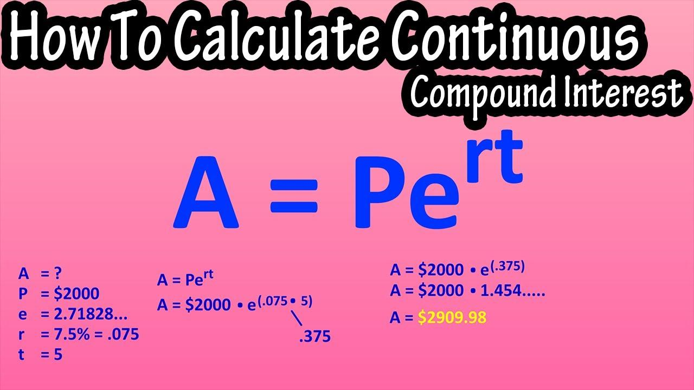

## Table of Contents

## What is continuous compounding?

Continuous compounding is a way of calculating interest where the interest is added to the account balance all the time, instead of at certain times like monthly or yearly. Imagine if you had a savings account and instead of getting interest added once a month, you got tiny bits of interest added every second of every day. That's what continuous compounding does.

This method uses a special math formula that makes the interest grow faster than with regular compounding. It's often used in finance and banking to figure out how investments or loans will grow over time. Because the interest is added continuously, even small amounts of money can grow to be much larger over long periods.

## How does continuous compounding differ from simple and compound interest?

Continuous compounding, simple interest, and compound interest are three ways to calculate how money grows over time, but they work differently. Simple interest is the easiest to understand. It's calculated by taking the initial amount of money, called the principal, and multiplying it by the interest rate and the time the money is invested or borrowed for. For example, if you put $100 in a bank account that gives you 5% simple interest per year, after one year you'll have $105. The interest stays the same every year, so after two years, you'll have $110.

Compound interest is a bit more complex. It's like simple interest, but the interest earned is added to the principal, so you start earning interest on a bigger amount. If you have $100 in a bank account with 5% compound interest per year, after the first year, you'll have $105 like with simple interest. But in the second year, you'll earn 5% on $105, not just $100, so you'll end up with $110.25. The more often the interest is compounded, like monthly or daily, the faster your money grows.

Continuous compounding takes this idea to the extreme. Instead of adding interest at certain times, like yearly or monthly, it adds interest all the time. It uses a special math formula that makes the money grow even faster than with regular compound interest. If you had $100 with 5% continuous compounding, after one year, you'd have a bit more than $105.13. Over long periods, this difference can become very big. Continuous compounding is often used in finance to figure out how investments or loans will grow over time.

## What is the formula for calculating continuous compounding?

The formula for continuous compounding is A = Pe^(rt). Here, A is the amount of money you'll have after time t, P is the starting amount of money, r is the interest rate, and e is a special number in math that's about 2.71828. The little ^ sign means you're raising e to the power of rt.

To use this formula, you just plug in the numbers. For example, if you start with $100, and the interest rate is 5% per year, and you want to know how much money you'll have after one year, you'd use P = 100, r = 0.05, and t = 1. So the formula becomes A = 100e^(0.05 * 1). When you do the math, you get A = 100e^0.05, which is about $105.13. This means that with continuous compounding, your $100 would grow to about $105.13 after one year.

## Can you explain the concept of e in the context of continuous compounding?

The letter e in the formula for continuous compounding stands for a special number in math that's about 2.71828. This number is called Euler's number, named after the mathematician Leonhard Euler. In the context of continuous compounding, e helps us figure out how money grows when interest is added all the time, instead of at certain times like monthly or yearly. It's like a magic number that makes the math work right for continuous growth.

When you use e in the formula A = Pe^(rt), it makes the interest grow smoothly and continuously. Imagine if you were blowing up a balloon and it got bigger and bigger without stopping. That's what e does in the formula. It lets the interest add up in tiny bits all the time, so the money grows faster than with regular compound interest. This is why e is so important in the world of finance and banking when they need to calculate how investments or loans will grow over time.

## What are some real-world applications of continuous compounding?

Continuous compounding is used a lot in the world of finance and banking. When people invest their money, like in stocks or bonds, banks and investment companies use continuous compounding to figure out how much the investment will grow over time. It helps them tell investors how much money they might have in the future. For example, if you put money into a retirement account, the bank might use continuous compounding to show you how much your savings could be worth when you retire.

Continuous compounding is also used in other areas, like in figuring out the value of things that grow over time. Scientists and economists use it to predict how populations or economies might change. For instance, if a scientist wants to know how a population of animals might grow, they could use continuous compounding to make a good guess. This way, they can plan for the future and make decisions based on how things might change.

## How does the frequency of compounding affect the final amount in continuous compounding?

In continuous compounding, the frequency of compounding doesn't change the final amount because it's already happening all the time. When you use continuous compounding, you're not adding interest at certain times like monthly or yearly. Instead, you're adding tiny bits of interest every moment, which means the money grows as fast as it can. So, no matter how often you think about adding interest, it's already being added continuously, making the frequency of compounding irrelevant.

This is different from regular compound interest, where the more often you add interest, the more money you end up with. For example, if you compound interest yearly, you'll have less money than if you compound it monthly or daily. But with continuous compounding, you're already at the fastest possible rate of growth, so changing the frequency doesn't make a difference. It's like trying to make a balloon grow faster by blowing into it more often; if it's already being filled continuously, blowing more often won't make it bigger.

## What are the advantages of using continuous compounding over other compounding methods?

Continuous compounding has some big advantages over other ways of adding interest. One of the main ones is that it makes your money grow faster than with regular compound interest. This is because it adds interest all the time, instead of at certain times like monthly or yearly. Over a long time, this can make a big difference. For example, if you're saving for retirement, using continuous compounding can help your savings grow to be much larger than if you used a different method. This is really helpful for anyone who wants their money to grow as much as possible.

Another advantage is that continuous compounding is used a lot in finance and banking, so it's good to understand it if you're dealing with investments or loans. Banks and investment companies use it to figure out how much money you might have in the future. Knowing how continuous compounding works can help you make better choices about where to put your money. It's also used in other areas like science and economics to predict how things grow over time, so it's a useful tool to know about.

## Can you provide an example of how to calculate the future value using continuous compounding?

Let's say you want to know how much money you'll have after 5 years if you start with $1,000 and the interest rate is 3% per year. You can use the formula for continuous compounding, which is A = Pe^(rt). In this formula, A is the amount of money you'll have at the end, P is the starting amount, r is the interest rate, t is the time in years, and e is a special number that's about 2.71828. For our example, P is $1,000, r is 0.03 (which is 3% as a decimal), and t is 5 years.

So, you plug these numbers into the formula: A = 1000e^(0.03 * 5). First, you multiply 0.03 by 5 to get 0.15. Then, you need to find e raised to the power of 0.15, which is about 1.16183. Now, you multiply $1,000 by 1.16183 to get the final amount. So, A = 1000 * 1.16183, which comes out to about $1,161.83. This means that after 5 years, with continuous compounding at a 3% interest rate, your $1,000 will grow to about $1,161.83.

## How does continuous compounding relate to the concept of the time value of money?

Continuous compounding is closely related to the time value of money, which is the idea that money today is worth more than the same amount of money in the future. This is because money today can be invested and earn interest over time. With continuous compounding, the interest is added to the money all the time, which makes it grow faster than with other ways of adding interest. This means that if you have money now and you use continuous compounding, it will be worth more in the future than if you used a different method.

Understanding continuous compounding can help you see how the time value of money works in real life. For example, if you're saving for something like a car or a house, knowing how much your money will grow with continuous compounding can help you plan better. It shows you that the sooner you start saving, the more your money can grow because of the interest being added all the time. This way, you can make smarter choices about when to save or invest your money to get the most out of it.

## What are the limitations or assumptions made when using continuous compounding?

Continuous compounding assumes that interest is added to the money all the time, without any breaks. This is different from real life where banks might add interest at certain times, like monthly or yearly. Because of this, continuous compounding is more of an idea or a way to think about how money can grow, rather than something you'll see in a bank account. It's a tool that helps us understand how money can grow over time, but it's not always exactly what happens in the real world.

Another limitation is that continuous compounding assumes that the interest rate stays the same all the time. In real life, interest rates can change because of things like the economy or decisions made by banks. If the interest rate changes, the way the money grows will be different from what continuous compounding predicts. So, while continuous compounding is a good way to learn about how money can grow, it's important to remember that it's based on some assumptions that might not always be true in real life.

## How can continuous compounding be used in financial planning and investment strategies?

Continuous compounding can help you plan your finances and make smart investment choices. When you're saving for something big, like buying a house or retiring, you want your money to grow as much as possible. Continuous compounding shows you how much your money could be worth in the future if it grows all the time. This can help you decide how much to save now and how long you need to save to reach your goals. For example, if you're saving for retirement, knowing how much your money will grow with continuous compounding can help you figure out if you're saving enough.

In investment strategies, continuous compounding is useful because it helps you see how different investments might grow over time. If you're choosing between different ways to invest your money, like stocks or bonds, you can use continuous compounding to compare them. This way, you can pick the investment that will help your money grow the most. It's also helpful for understanding how loans work. If you're borrowing money, continuous compounding can show you how much you'll have to pay back over time, helping you decide if a loan is a good idea.

## What advanced mathematical models incorporate continuous compounding in their calculations?

Some advanced math models use continuous compounding to figure out how things grow over time. One example is the Black-Scholes model, which is used to find out the price of options in finance. Options are like bets on whether a stock will go up or down. The Black-Scholes model uses continuous compounding to see how the value of these options changes over time. This helps people who invest in options to make better choices about when to buy or sell them.

Another example is the Gordon Growth Model, which is used to figure out the value of a company's stock. This model assumes that the company's profits will grow at a steady rate forever. It uses continuous compounding to calculate how much those future profits are worth right now. This helps investors decide if a stock is a good buy. Both of these models show how important continuous compounding is in understanding how money and investments grow over time.

## What is Understanding Compound Interest?

Compound interest is an essential concept in finance that significantly impacts wealth accumulation. Unlike simple interest, which is calculated solely on the principal amount, compound interest applies to both the initial principal and the interest that accumulates over previous periods. This results in interest earning additional interest, creating a compounding effect that can profoundly enhance financial growth over time.

The mathematical expression for compound interest is represented by the formula:

$$
A = P (1 + \frac{r}{n})^{nt}
$$

In this equation:
- $A$ represents the future value of the investment/loan, including interest.
- $P$ is the principal investment amount.
- $r$ is the annual interest rate (decimal).
- $n$ denotes the number of times that interest is compounded per year.
- $t$ is the number of years the money is invested or borrowed for.

For example, suppose an investor places $1,000 in an account that offers an annual [interest rate](/wiki/interest-rate-trading-strategies) of 5%, compounded annually. Using the formula, the investment's value after 3 years would be:

$$
A = 1000 \times (1 + \frac{0.05}{1})^{1 \times 3} = 1157.63
$$

This calculation demonstrates how regular compounding intervals contribute to the increasing value over time.

Financial institutions typically provide compound interest through various schedules, including annually, semi-annually, quarterly, monthly, and even daily. More frequent compounding periods result in higher accrued interest due to the periodic reinvestment of earnings, tapping into the exponential nature of compound growth. For instance, daily compounding would slightly increase the interest accumulated compared to annual compounding, assuming the same nominal interest rate. 

The core tenet of compound interest is the reinvestment strategy, which aims to generate additional earnings. Reinvesting the returns, rather than withdrawing, enhances the compounding effect and stimulates a cycle where accrued interests further contribute to the principal, thus continuously magnifying the investment's growth potential. This principle underpins the power of compound interest and why it can substantially outperform simple interest over long periods.

To see compound interest in action using Python, consider this simple simulation:

```python
def compound_interest(principal, rate, times_compounded, years):
    amount = principal * (1 + rate / times_compounded) ** (times_compounded * years)
    return amount

# Example: $1,000 principal, 5% annual interest rate, compounded monthly, for 3 years
principal = 1000  # Initial investment
rate = 0.05  # Annual interest rate
times_compounded = 12  # Compounding monthly
years = 3  # Duration of investment

future_value = compound_interest(principal, rate, times_compounded, years)
print(f"Future Value: ${future_value:.2f}")
```

This script demonstrates how the investment grows when interest is compounded monthly, reflecting the potential for significant growth through consistent compounding. Understanding and applying compound interest principles can thus serve as a powerful tool for effective financial planning and growth.

## What is the theoretical outlook on continuous compounding?

Continuous compounding represents an idealized mathematical framework where interest is compounded an infinite number of times over infinitesimally small periods. This conceptual model involves the exponential growth of an investment, where interest is continuously applied to the principal sum and all previously accrued interest. The formula for continuous compounding is expressed as:

$$
A = Pe^{rt}
$$

where $A$ is the amount of money accumulated after time $t$ (including principal and interest), $P$ is the principal amount, $r$ is the annual nominal interest rate, $t$ is the time in years, and $e$ is the base of the natural logarithm, approximately equal to 2.71828.

Continuous compounding serves as a theoretical benchmark for understanding the maximum potential of interest compounding. While practical implementations generally use discrete compounding intervals such as daily, monthly, or annually, continuous compounding offers insights into the growth dynamics within financial systems. It models an optimal scenario where reinvestment occurs at every possible moment, allowing investors to grasp the full power of exponential growth potential.

On a theoretical level, continuous compounding provides a profound understanding of the interplay between time and interest rates. By examining the continuous compounding model, investors and financial analysts can appreciate the effects of small changes in interest rates or compounding frequency on investment outcomes over extended periods. These insights are critical in evaluating the compounding effect within various financial products and economic environments.

However, despite its conceptual elegance, continuous compounding remains largely impractical for real-world applications. Financial institutions typically adopt discrete compounding intervals due to the constraints of transaction processing and financial regulation. Nonetheless, the continuous compounding model remains a pivotal tool in theoretical finance, serving as an important reference point for the potential of compounded interest.

## References & Further Reading

[1]: Merton, R. C. (1990). ["Continuous-time finance"](https://archive.org/details/continuoustimefi0000mert). Wiley-Blackwell.

[2]: Hull, J. C. (2018). ["Options, Futures, and Other Derivatives"](https://www.semanticscholar.org/paper/Options%2C-Futures%2C-and-Other-Derivatives-Hull/89bdee500c8623864fc9eb7a471546aa713acc44). Pearson.

[3]: Wilmott, P. (2006). ["Paul Wilmott Introduces Quantitative Finance"](https://www.amazon.com/Paul-Wilmott-Quantitative-Finance-Set/dp/0470018704). Wiley.

[4]: Clark, C. (2012). ["Algorithmic Trading: Winning Strategies and Their Rationale"](https://www.wiley.com/en-us/Algorithmic+Trading%3A+Winning+Strategies+and+Their+Rationale-p-9781118460146). Wiley.

[5]: Fabozzi, F. J., & Focardi, S. M. (2001). ["Mathematical Methods for Financial Markets"](https://www.semanticscholar.org/paper/Quantitative-Equity-Investing%3A-Techniques-and-Fabozzi-Focardi/1c49a2a53919f7e65cb96f16691b8ff726fd3cd7). Springer.

[6]: Lopez de Prado, M. (2018). ["Advances in Financial Machine Learning"](https://www.amazon.com/Advances-Financial-Machine-Learning-Marcos/dp/1119482089). Wiley.

[7]: Chan, E. (2009). ["Quantitative Trading: How to Build Your Own Algorithmic Trading Business"](https://github.com/ftvision/quant_trading_echan_book). Wiley.