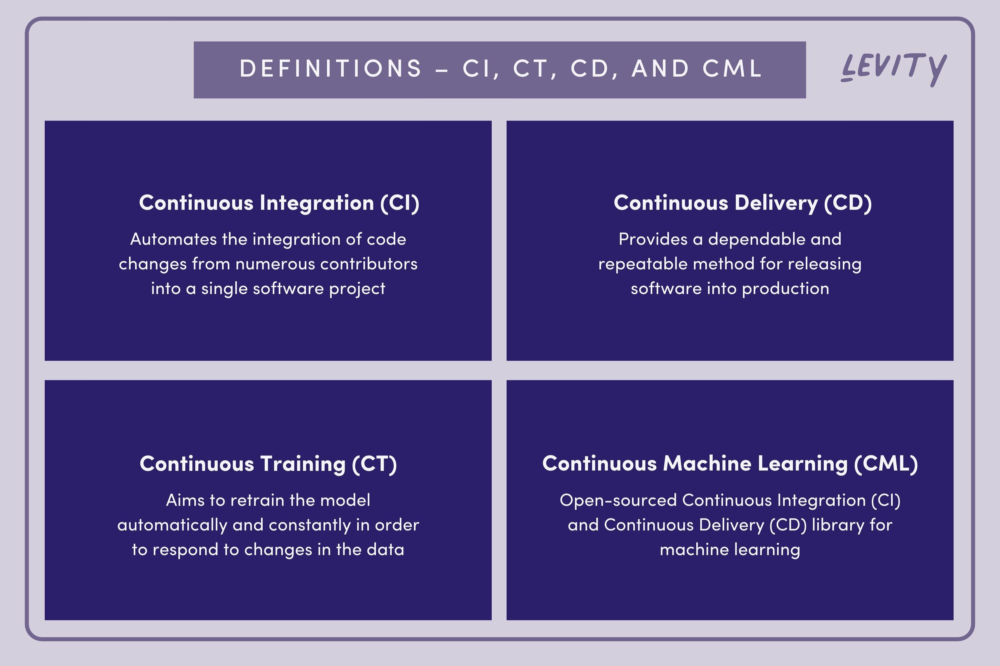

## Table of Contents

## What is a continuous feature in machine learning?

A continuous feature in machine learning is a type of data that can take any value within a range. Unlike categorical data, which can only take specific values, continuous data can be measured and can have an infinite number of possible values. For example, temperature, height, and weight are all continuous features because they can be any number within a certain range.

In machine learning models, continuous features are often used as input variables to predict outcomes. These features are important because they allow the model to understand and learn from subtle variations in the data. For instance, if you are predicting house prices, the size of the house in square feet is a continuous feature that can greatly influence the model's predictions. By using continuous features, machine learning algorithms can make more accurate and nuanced predictions.

## How do continuous features differ from categorical features?

Continuous features and categorical features are two different types of data used in machine learning. Continuous features can take any value within a range, like temperature or height. They can be measured and have an infinite number of possible values. For example, if you measure the temperature outside, it could be 23.5 degrees Celsius, or 23.6, or any other number in between. This kind of data helps machine learning models understand small changes and make more accurate predictions.

On the other hand, categorical features can only take specific values, like colors or types of fruits. These values are often grouped into categories, such as "red," "blue," and "green" for colors, or "apple," "banana," and "orange" for fruits. Unlike continuous features, categorical features cannot be measured in the same way. For instance, you can't have a "half-apple, half-banana" fruit; it's either one or the other. Machine learning models use these categories to classify and group data in a different way than they do with continuous data.

To summarize, continuous features are about numbers that can change smoothly, while categorical features are about distinct groups or labels. Both types of features are important in [machine learning](/wiki/machine-learning), but they are used differently depending on the problem at hand.

## Why are continuous features important in machine learning models?

Continuous features are important in machine learning models because they provide a lot of detail about the data. Imagine you are trying to predict how much a house will cost. The size of the house, measured in square feet, is a continuous feature. This feature can be any number, like 1500 square feet or 1501 square feet. By using this kind of detailed information, the machine learning model can learn about small changes and make better predictions. If you only used big categories like "small," "medium," and "large," you would miss out on important details that can affect the price.

Another reason continuous features are important is that they help the model understand patterns and relationships in the data. For example, if you are predicting someone's weight, you might use their height as a continuous feature. Height and weight often have a relationship where taller people tend to weigh more. By using continuous features, the model can learn this relationship and use it to make more accurate predictions. This makes the model better at understanding the world and making useful predictions.

## What are some common examples of continuous features in datasets?

Continuous features are numbers that can be any value, not just specific ones. Some common examples are temperature, height, and weight. If you measure the temperature outside, it could be 23.5 degrees Celsius or 23.6 degrees Celsius, or any other number in between. The same goes for height; someone might be 175.3 cm tall, and weight could be 72.8 kg. These numbers help machine learning models understand small changes and make better predictions.

Another example of a continuous feature is the price of something, like a house or a car. The price can be any number, like $250,000 or $250,001. This helps the model see how small changes in other features, like the size of a house, can affect the price. Time is also a continuous feature. It can be measured in seconds, minutes, or hours, and can be any number, like 12.5 minutes or 3.75 hours. Using time as a continuous feature helps models understand how things change over time.

## How can you preprocess continuous features before feeding them into a model?

Before using continuous features in a machine learning model, it's important to preprocess them to make the model work better. One common way to do this is called normalization. This means changing the numbers so they all fit between 0 and 1. You do this by taking each number, subtracting the smallest number in the feature, and then dividing by the difference between the biggest and smallest numbers. This helps the model learn faster and work better with different kinds of features. Another way to preprocess continuous features is called standardization. This means changing the numbers so they have an average of 0 and a standard deviation of 1. You do this by taking each number, subtracting the average of all the numbers in the feature, and then dividing by the standard deviation. This helps the model understand the data better and can make it easier to compare different features.

Sometimes, you might also need to deal with missing values in continuous features. One way to do this is by filling in the missing values with the average or median of the feature. This helps keep the data complete and makes sure the model has all the information it needs. Another important step is to check for outliers, which are numbers that are very different from the others. Outliers can mess up the model's predictions, so you might need to remove them or change them to be closer to the other numbers. By preprocessing continuous features carefully, you can help the model learn better and make more accurate predictions.

## What techniques are used to handle outliers in continuous features?

Outliers in continuous features are numbers that are very different from most of the other numbers. They can mess up the predictions of a machine learning model, so it's important to handle them carefully. One way to handle outliers is to remove them. You can do this by setting a rule, like removing any number that is more than three times the standard deviation away from the average. Another way is to change the outliers to be closer to the other numbers. This is called capping or winsorizing. For example, you could change any number that is higher than a certain value to that value, or any number that is lower than another value to that value.

Another technique to handle outliers is to use transformations. For example, you can use the logarithm function to make big numbers smaller and more similar to the other numbers. If you have a number $$x$$ that is an outlier, you can change it to $$\log(x)$$. This can help the model work better with the data. Another way is to use a robust statistical method, like the median and the interquartile range (IQR), instead of the mean and standard deviation. The median is the middle number when you put all the numbers in order, and the IQR is the difference between the number at 75% and the number at 25%. Using these can help the model be less affected by outliers.

In some cases, you might want to keep the outliers if they are important for the model. For example, if you are predicting house prices, a very expensive house might be an outlier, but it's still important to include it in the data. In this case, you can use algorithms that are less sensitive to outliers, like Random Forests or Gradient Boosting Machines. These algorithms can handle outliers better than others, like linear regression, which can be thrown off by just a few unusual numbers. By choosing the right technique to handle outliers, you can help your machine learning model make better predictions.

## How do you normalize or standardize continuous features, and why is it necessary?

Normalizing or standardizing continuous features means changing the numbers so they fit better in a machine learning model. Normalization changes the numbers so they are all between 0 and 1. You do this by taking each number, subtracting the smallest number in the feature, and then dividing by the difference between the biggest and smallest numbers. This is helpful because it makes all the features have the same range, which can help the model learn faster and work better with different kinds of features. Standardization, on the other hand, changes the numbers so they have an average of 0 and a standard deviation of 1. You do this by taking each number, subtracting the average of all the numbers in the feature, and then dividing by the standard deviation. This helps the model understand the data better and can make it easier to compare different features.

It's necessary to normalize or standardize continuous features because raw data can have different ranges and scales. For example, if you are using both height in centimeters and weight in kilograms as features, the numbers for height will be much bigger than the numbers for weight. This can make the model focus more on height and less on weight, which might not be what you want. By normalizing or standardizing the features, you make sure that each feature has the same importance in the model. This helps the model learn from all the features equally and makes the predictions more accurate.

## What are the challenges of working with high-dimensional continuous features?

Working with high-dimensional continuous features can be tough because it makes things more complicated for machine learning models. When you have a lot of features, the model has to learn from a lot more data, which can take a long time and use a lot of computer power. It's like trying to find a small object in a huge room full of stuff. The more stuff there is, the harder it is to find what you're looking for. This problem is called the "curse of dimensionality." It means that as the number of features grows, the amount of data you need to make good predictions grows really fast. If you don't have enough data, the model might not learn well and could make bad predictions.

Another challenge is that high-dimensional data can make it hard to see patterns and relationships. When you have a lot of features, it's easy for the model to focus on the wrong things, like small changes that don't really matter. This can lead to overfitting, where the model learns the training data too well but doesn't work well with new data. To deal with these challenges, you can use techniques like feature selection, where you pick only the most important features, or dimensionality reduction, where you change the data to have fewer features but keep the important information. For example, a common method for dimensionality reduction is Principal Component Analysis (PCA), which can help simplify the data while keeping the main patterns.

## How can feature engineering enhance the performance of models using continuous features?

Feature engineering can make machine learning models work better with continuous features by creating new features or changing existing ones to help the model understand the data better. For example, if you are predicting house prices, you might have a feature for the size of the house in square feet. By creating a new feature that is the square root of the size, like $$\sqrt{\text{size}}$$, you can help the model see how the price changes with different sizes more clearly. This new feature can make the relationship between size and price easier for the model to learn. Another way to use feature engineering is by combining different continuous features into one. For instance, if you have features for the length and width of a house, you can create a new feature for the area by multiplying them, like $$\text{length} \times \text{width}$$. This can help the model see important patterns that it might miss if it only looks at length and width separately.

Feature engineering can also help by making the data easier for the model to work with. Sometimes, continuous features have a lot of small changes that don't really matter for the model's predictions. By grouping these small changes into bigger categories, you can make the model focus on what's important. For example, if you are predicting how much electricity a house uses, you might have a feature for the temperature outside. Instead of using the exact temperature, you could group temperatures into categories like "cold," "mild," and "hot." This can help the model see how temperature affects electricity use more clearly. By using feature engineering to create better features, you can help the model learn faster and make more accurate predictions.

## What are some advanced methods for feature selection with continuous variables?

Feature selection with continuous variables can be done using advanced methods like Lasso (Least Absolute Shrinkage and Selection Operator) and Random Forests. Lasso is a type of regression that adds a penalty to the coefficients of the features. This penalty, called the L1 penalty, can make some coefficients become zero, which means those features are not used in the model. By using Lasso, you can automatically select the most important features and leave out the ones that don't help much. For example, if you have a lot of features predicting house prices, Lasso can help you find out which ones, like the size of the house or the number of bedrooms, are the most important for making good predictions.

Another advanced method is using Random Forests, which are a type of machine learning model that can tell you how important each feature is. Random Forests work by making a lot of decision trees and then combining their predictions. Each tree in the forest can use different features, and by looking at how much each feature helps the trees make good predictions, you can see which features are the most important. For example, if you are predicting how much electricity a house uses, Random Forests can help you see that the temperature outside and the size of the house are more important than the color of the house. By using these advanced methods, you can pick the best features and make your model work better with continuous variables.

## How do you evaluate the impact of continuous features on model performance?

To evaluate the impact of continuous features on model performance, you can use techniques like feature importance and partial dependence plots. Feature importance helps you see which features are most important for the model's predictions. For example, if you are using a Random Forest model to predict house prices, you can look at the feature importance to see if the size of the house or the number of bedrooms has a bigger impact on the predictions. This helps you understand which continuous features are driving the model's performance. You can also use partial dependence plots to see how changing one feature affects the predictions while keeping the other features the same. For instance, a partial dependence plot for the size of a house can show you how the predicted price changes as the size gets bigger or smaller.

Another way to evaluate the impact of continuous features is by using metrics like Mean Absolute Error (MAE) or Root Mean Squared Error (RMSE) before and after removing or changing a feature. If you remove a continuous feature and the model's performance gets worse, it means that feature was important. For example, if you take away the size of the house from the model and the MAE goes up, it shows that the size of the house was helping the model make good predictions. You can also use cross-validation to see how well the model performs with different sets of features. By trying out different combinations of continuous features and seeing how the model's performance changes, you can figure out which features are most important for making accurate predictions.

## What are the latest research trends in handling continuous features in deep learning models?

The latest research trends in handling continuous features in [deep learning](/wiki/deep-learning) models focus a lot on improving how these models learn from and use continuous data. One big trend is the use of advanced normalization techniques. For example, researchers are working on better ways to normalize data, like using adaptive normalization methods that change based on the data. These methods help deep learning models learn faster and perform better with continuous features. Another trend is the development of new architectures that are better at handling continuous data. For instance, some researchers are exploring the use of attention mechanisms, which help models focus on the most important parts of the continuous data. This can make the models more accurate and efficient when dealing with high-dimensional continuous features.

Another important trend is the use of advanced feature engineering techniques specifically designed for deep learning models. Researchers are looking into ways to automatically create new features from continuous data that can help models learn better. For example, some studies are using autoencoders to transform continuous features into a more useful form. An autoencoder is a type of [neural network](/wiki/neural-network) that can learn how to compress and then reconstruct data, which can help highlight important patterns in continuous features. Additionally, there is a growing interest in using [reinforcement learning](/wiki/reinforcement-learning) to optimize feature selection and engineering. This approach can help find the best set of continuous features for a model by trying out different combinations and learning which ones work best. These trends show that the field is moving towards more sophisticated and tailored methods for handling continuous features in deep learning models.