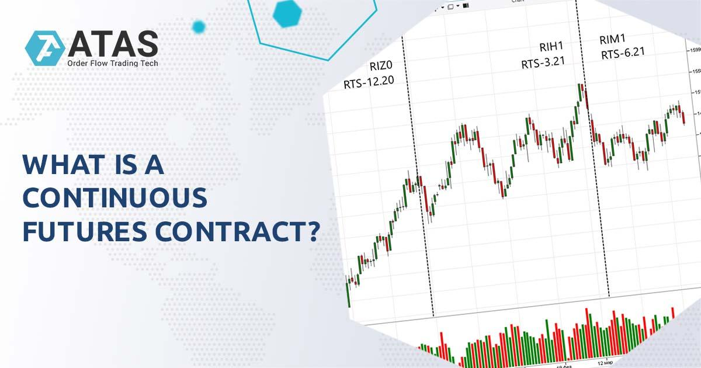

Continuous contract futures play a crucial role in algorithmic trading by addressing the challenges associated with the expiration of individual futures contracts. In futures trading, contracts are typically limited by expiration dates, leading to a discontinuous data series that can hinder effective strategy analysis and backtesting. Continuous contracts offer a solution to this problem by creating an uninterrupted data series that spans across multiple contract expiration dates, allowing for seamless analysis and strategy development.

The significance of continuous contracts lies in their ability to provide a consistent and comprehensive view of market trends. By eliminating gaps and abrupt price changes due to contract expirations, continuous contracts enable traders to conduct more accurate technical analysis, execute robust backtesting, and devise reliable trading algorithms. This extended data continuity is particularly valuable in the fast-paced world of algorithmic trading, where precise and comprehensive historical data are critical for optimizing trading strategies.



The article aims to explore the concept of continuous contracts in detail, examining their advantages over traditional futures contracts, the challenges posed by the latter, and the methodologies for constructing continuous futures. These methodologies help in creating a unified time series by adjusting price and volume data across different contract expirations. Understanding and utilizing continuous contracts effectively can enhance a trader’s ability to perform both short-term technical analysis and long-term trend analysis, ultimately leading to more informed decision-making and improved trading performance.

## Table of Contents

## Understanding Futures Contracts

Futures contracts are standardized legal agreements to buy or sell a specific commodity or financial instrument at a predetermined price on a specified future date. They are essential components of the financial markets, allowing market participants to hedge against risk, speculate on price movements, or ensure price stability for future transactions. Futures contracts are traded on futures exchanges, which act as intermediaries and standardize the contract specifications to facilitate trading. This standardization includes the quantity of the underlying asset, the quality or grade where applicable, the delivery location, and the delivery date.

There are two primary types of futures contracts: physical delivery contracts and cash settlement contracts. In physical delivery contracts, the underlying asset is delivered from the seller to the buyer upon expiration of the contract. This type is common in commodities markets, where the physical good, such as oil, wheat, or gold, is transferred. Conversely, cash settlement contracts do not require the actual delivery of the asset. Instead, they are settled in cash based on the difference between the contract price and the market price at expiration. Cash settlement is prevalent in financial futures, such as those based on stock indices, interest rates, and currencies, where physical delivery is impractical or impossible.

Futures contract nomenclature is crucial for traders and analysts, as it provides detailed information about the contract specifications. Each futures contract is assigned a ticker symbol, consisting of several parts that identify the underlying asset, the contract month, and the year of expiration. For example, in commodities, the ticker symbol "CLZ23" might represent a Crude Oil futures contract expiring in December 2023. The "CL" denotes [crude oil](/wiki/crude-oil), "Z" represents the month of December using the standardized futures month codes (where January is "F", February is "G", etc.), and "23" indicates the year 2023.

Furthermore, the expiry details of futures contracts refer to the dates on which the contracts cease trading before the final settlement. Each contract has a last trading day, which typically occurs shortly before the expiration date. This allows for the settlement process to take place, whether it's physical delivery or cash settlement. Understanding the nuances of futures contract expiry is critical, as it affects [liquidity](/wiki/liquidity-risk-premium), pricing, and trading strategies. Traders often roll over their positions to future contract months ahead of expiry to maintain their exposure without undergoing physical delivery or final settlement.

## What are Continuous Contracts?

Continuous contracts, often referred to as continuous futures, are synthesized instruments derived from the series of individual futures contracts that regularly expire. They play a crucial role in the [algorithmic trading](/wiki/algorithmic-trading) domain, mainly due to their ability to amalgamate these discrete contracts into a seamless and continuous time series. This continuity is particularly important when analyzing and [backtesting](/wiki/backtesting) trading strategies over extended periods.

In algorithmic trading, continuous contracts provide a practical solution for handling the complexities associated with the expiration of individual futures contracts. Every futures contract has a specified expiration date, which necessitates the rollover to the next contract in the sequence. This rollover process can interrupt the continuity of historical data series, presenting significant challenges for traders and analysts when applying technical analysis or developing [quantitative trading](/wiki/quantitative-trading) strategies.

A primary advantage of using continuous contracts is their ability to eliminate the gaps and abrupt price adjustments that typically occur at each contract expiration. Without continuous contracts, the shift from one futures contract to the next might lead to artificial price anomalies in the data due to differing contract specifications and market conditions. Continuous contracts resolve this by employing techniques that adjust past prices to create a smooth transition across expirations, allowing for accurate trend analysis and modeling.

For instance, when constructing continuous futures, one common method is the Backward Adjustment approach. In this method, historical price data is adjusted by the difference in prices between the expiring contract and the new contract upon rollover. This adjustment helps align the price series, minimizing discontinuities:

$$
\text{Adjusted Price}_{t} = \text{Price}_{t} + (\text{Price}_{rollover\ date} - \text{Price}_{new\ contract})
$$

This approach ensures that the price shifts due to contract expiration are accounted for, facilitating consistent analysis without sudden data jumps.

Continuous contracts also allow traders to maintain a long-term perspective on market trends. Unlike individual futures contracts, which are restricted by their expiration dates, continuous contracts provide a comprehensive historical dataset. This enriched dataset is invaluable for backtesting trading strategies and conducting in-depth market analysis, thereby enabling traders to identify patterns and trends over longer time horizons.

In summary, continuous contracts serve as vital tools in algorithmic trading by offering a coherent and continuous dataset. They enable traders to seamless integrate data from multiple contract expirations, thus supporting more robust and reliable trading strategies while mitigating the challenges of data discontinuity.

## Challenges with Traditional Futures Contracts

Futures contracts are integral to financial markets, serving as standardized agreements to buy or sell assets at a predetermined price at a specified future date. However, traditional futures contracts present several challenges, particularly due to their fixed expiration dates. This characteristic creates relatively short data spans for each contract, complicating the process of continuous data analysis. 

One primary challenge is the frequent expiries of futures contracts, which can result in discontinuous data sets. Each new contract series, initialized after the expiry of the previous one, begins with fresh data that may not align perfectly with the prior series. This constant shift hinders the ability to perform seamless technical analysis, as traders and analysts must stitch together disparate data sequences, impacting signal generation and model accuracy.

Technical analysis often relies on the continuity of price data to accurately identify trends and patterns. The non-continuous nature of individual futures contracts can cause discrepancies in identifying these trends. For instance, a moving average calculated over a dataset that includes contract expiration gaps may yield misleading signals, as the calculation is disrupted by abrupt price changes, commonly observed at the rollovers between contract months. This can lead to incorrect assumptions about market direction and [volatility](/wiki/volatility-trading-strategies).

Furthermore, expiration-related discrepancies in futures contracts can create false impressions of price movements. For example, the difference in settlement prices between an expiring contract and the one replacing it can cause artificial price jumps, misrepresenting the actual market sentiment. Traders relying solely on historical data without accounting for such discontinuities might misinterpret these jumps as genuine market shifts.

In summary, the traditional structure of futures contracts poses significant challenges for traders and analysts seeking to conduct thorough technical analysis. The frequent expiries create data discontinuities that can hamper accurate signal generation and trend analysis, necessitating sophisticated techniques like continuous contracts to mitigate such challenges in algorithmic trading.

## Methods to Build Continuous Futures

In constructing continuous futures, various methodologies are employed to create seamless data series that aid in backtesting and analysis. This section explores three commonly used methods: Proportional Adjustment, Backward/Forward Adjustment, and Rollover/Perpetual series. Each method has distinct characteristics, advantages, and suitable applications.

### Proportional Adjustment

Proportional Adjustment involves adjusting the historical prices of a futures contract proportionally to account for the changes in price due to contract rolls. This method ensures that the price series is smooth and does not exhibit artificial gaps:

$$
P_{\text{adjusted},t} = P_t \times \left(\frac{P_{\text{new expiry},t}}{P_{\text{old expiry},t}}\right)
$$

**Example:** Assuming the old contract price is $100 and the new contract price at rollover is $102, the historical price $P_t$ for the old contract will be adjusted by multiplying all past prices by $1.02$.

**Pros:**
- Maintains relative price movements.
- Suitable for technical analysis as it provides a visually smooth series.

**Cons:**
- Alters historical prices, which can distort the economic sense of historical values.

### Backward/Forward Adjustment

Backward or Forward Adjustment methods fix either the old or the new contract prices by adding or subtracting a constant difference found at the time of contract expiry. 

- **Backward Adjustment:** Fixes new contract prices. 

$$
P_{\text{adjusted}} = P_t + (P_{\text{old expiry}} - P_{\text{new expiry}})
$$

- **Forward Adjustment:** Fixes old contract prices.

**Example:** If the old contract price is $100 and the new contract price is $98 at expiry, a backward adjustment will add $2 to all new contract prices.

**Pros:**
- Retains historical contract values' absolute levels in forward adjustment.
- Provides continuity without changing the economic meaning.

**Cons:**
- In backward adjustment, can lead to values that may not make historical sense.
- Less visually smooth compared to proportional adjustments.

### Rollover/Perpetual Series

Rollover methods involve seamlessly transitioning from one contract to another by overlapping them based on a predefined rule. A perpetual series is created when contracts are rolled continuously, often weighted by [volume](/wiki/volume-trading-strategy) or open interest.

**Example (Python):**
```python
import pandas as pd

# Assuming df is a DataFrame with 'expiration_date' and 'price'
df['rollover_price'] = df.apply(
    lambda row: row['price'] if row['date'] < row['expiration_date'] else row['price_new_contract'], axis=1
)
```

**Pros:**
- Represents market reality as it closely mirrors actual trading.
- No distortion in historical or future prices.

**Cons:**
- Can be complex to implement due to varying contract expiration criteria.
- May not offer the same level of granularity for certain analyses as other adjustments.

### Effective Use

Each method suits different trading strategies and analytical goals. Proportional Adjustment is ideal for scenarios focused on technical chart analysis, providing smooth and coherent price trends. Forward or Backward Adjustments are beneficial when preserving the reference level of prices is crucial for economic analyses. Rollover/Perpetual series excels in portraying real-time changes and is suitable for high-frequency trading environments where reflecting true market prices outweighs historical accuracy.

## Case Study: Creating Continuous Futures

To create a continuous futures series using Python, we must first understand the transition process between consecutive contracts. This involves appropriately adjusting prices to create a seamless data series without the disruptiveness of expiration-induced gaps. Here, we'll illustrate how to construct a continuous futures series using a Rollover Adjustment method.

### Step-by-Step Example

#### Step 1: Set Up Your Environment

Ensure you have the necessary libraries installed. Pandas and Matplotlib are essential for data manipulation and visualization.

```python
import pandas as pd
import matplotlib.pyplot as plt
```

#### Step 2: Load Futures Data

Assume you have raw futures contract data for a specific asset, stored in a CSV file. This data includes the expiry date, settlement price, and other pertinent details.

```python
# Load futures data
data = pd.read_csv('futures_data.csv')

# Assume we have columns: ['Date', 'Expiry', 'Settlement']
data['Date'] = pd.to_datetime(data['Date'])
data.set_index('Date', inplace=True)

# Displaying first few rows of the dataset
print(data.head())
```

#### Step 3: Determine Rollover Dates

The rollover date is when you move from one futures contract to the next. A common practice is to rollover a few days before the current contract's expiration. For simplicity, we'll set the rollover 5 days before expiration.

```python
# Identify rollover points
data['Rollover'] = data['Expiry'].shift(-1) - pd.to_timedelta(5, unit='D')
data['Rollover_Flag'] = data.index >= data['Rollover']
```

#### Step 4: Construct the Continuous Series

Create a continuous price series by adjusting prices at the rollover points. This involves ensuring that contracts are aligned by making adjustments when rolling over.

```python
# Initialize continuous series
continuous_prices = []

# Maintain the rollover logic
current_contract = None
for index, row in data.iterrows():
    if row['Rollover_Flag']:
        current_contract = index
    if current_contract is not None:
        settlement_price = row['Settlement'] 
        continuous_prices.append(settlement_price)

# Create a new DataFrame for continuous prices
continuous_data = pd.DataFrame(continuous_prices, index=data.index, columns=['Continuous_Price'])
```

#### Step 5: Visualize the Results

Stock prices before and after adjustments can be visualized to appreciate the continuity achieved via this method.

```python
# Plot the continuous series
plt.figure(figsize=(14, 7))
plt.plot(data.index, data['Settlement'], label='Non-Continuous', linestyle='--', alpha=0.5)
plt.plot(continuous_data.index, continuous_data['Continuous_Price'], label='Continuous')
plt.title('Continuous Futures Series')
plt.xlabel('Date')
plt.ylabel('Price')
plt.legend()
plt.show()
```

### Explanation of Results

The resulting graph contrasts the raw non-continuous futures data with the continuous data series. Noticeably, discontinuities present in the raw data due to contract rollovers are smoothened in the continuous series. This example demonstrates how continuous futures assist in providing a cleaner dataset, crucial for backtesting and analysis.

This Python-based method can be modified to cater for different assets and market requirements, making it versatile for various algorithmic trading strategies. Adjustments based on weight, price ratio, or other domain-specific considerations can refine the series further.

## Choosing the Right Method

Selecting the appropriate method for constructing continuous futures depends significantly on your trading goals and the type of analysis you wish to conduct. Continuous futures contracts are advantageous for creating seamless data series, allowing traders to apply robust analytical and modeling techniques without disruptions caused by contract expirations. Here are some considerations and guidelines for choosing the right method.

### Considerations for Short-Term Technical Analysis vs. Long-Term Trend Analysis

For short-term technical analysis, the preferred continuous futures method often involves minimal data distortion. Traders who focus on short-term movements require high fidelity to the actual market data, which means that preserving the integrity of individual price movements is crucial. In this context, the **Rollover or Perpetual series** method is frequently suitable because it transitions between contracts without making proportion or value adjustments, preserving the day-to-day volatility inherent in the data.

For example, in a Rollover approach, when a contract nears expiration, the next contract is simply appended. This method might use a specified rollover date, often selected based on volume or open interest criteria, to indicate the transition point. 

In contrast, long-term trend analysis requires continuity over extended periods to discern meaningful patterns and trends. Here, approaches like the **Proportional Adjustment** or **Backward/Forward Adjustment** are significant. These methods aim to eliminate price jumps at contract transitions, providing a smoother data series more indicative of long-term trends. In a Backward Adjustment, for example, the historical prices of the expiring contracts are adjusted using a constant [factor](/wiki/factor-investing), ensuring that no artificial gaps or spikes disrupt the long-term price trajectory.

### Statistical Analyses and Adjustment Methods

Statistical analyses for continuous futures primarily involve assessing consistency, continuity, and representativeness of the data series across contract transitions. The choice of method should reflect the statistical techniques employed. For instance, those using regression models may prefer the Proportional Adjustment method as it maintains relative price movements, ensuring that percentage-based analyses remain valid over time:

$$
\text{Adjusted Price} = \text{Original Price} \times \left( \frac{\text{Price of New Contract}}{\text{Price of Old Contract}} \right)
$$

For optimization problems involving variance or standard deviation measures, a Forward Adjustment might be better suited as it provides a stable backdrop against which variations can be gauged more accurately.

### Code Example for Backward Adjustment in Python

To illustrate the Backward Adjustment method, here is a simple Python code snippet that demonstrates how to adjust historical prices:

```python
def backward_adjust_prices(historical_prices, rollover_points):
    """
    Adjusts historical prices using backward adjustment method.

    :param historical_prices: List of historical prices.
    :param rollover_points: Indices where rollovers occur.
    :return: List of adjusted prices.
    """
    adjusted_prices = historical_prices.copy()
    for i in range(len(rollover_points) - 1, 0, -1):
        # Calculate adjustment factor
        adjustment_factor = historical_prices[rollover_points[i]] / historical_prices[rollover_points[i] - 1]

        # Apply adjustment to all prior prices
        for j in range(rollover_points[i]):
            adjusted_prices[j] *= adjustment_factor

    return adjusted_prices

# Example usage:
historical_prices = [100, 102, 98, 97, 103, 110, 112]  # Example price data
rollover_points = [3, 5]  # Example rollover points
adjusted_prices = backward_adjust_prices(historical_prices, rollover_points)
print(adjusted_prices)
```

This code adjusts historical prices before each rollover point to maintain a consistent price series free from abrupt transitions.

### Conclusion

Selecting the right method for continuous futures construction requires balancing the demands of data integrity for short-term traders with the need for continuity for long-term analysts. By aligning the choice of adjustment method with the analytical goals and statistical techniques of interest, traders and analysts can better harness futures data for algorithmic trading and research.

## Continuous Futures vs Non-Continuous Futures Contracts

Continuous futures contracts and non-continuous futures contracts serve distinct roles within the trading ecosystem. Understanding the differences between these two types of contracts and their respective applications is crucial for traders making informed decisions.

Non-continuous futures contracts are standard futures contracts that have a specified expiration date. They are traded on exchanges and require parties to buy or sell an asset at a predetermined price at the contract's expiry date. These contracts are crucial for hedging and speculative activities and are characterized by their singular lifecycle from initiation to expiration. Their prices are subject to variations due to differing expiration dates, causing what is known as "gaps" or abrupt price changes when transitioning from one contract to another. This trait poses challenges in creating a seamless historical data series for analysis.

Continuous futures contracts, on the other hand, provide a synthesized data series that removes the discontinuities inherent in individual futures contracts. They achieve this by "rolling" over from one actively traded contract to the next, thereby maintaining an uninterrupted price series. The primary purpose of continuous futures is to offer a continuous dataset for backtesting trading strategies, facilitating technical analysis and long-term trend observation without the distortions caused by contract expirations.

Scenarios for the application of each type of contract differ significantly. Non-continuous contracts are ideal for executing trades based on short-term market conditions or fulfilling actual delivery requirements. They provide the flexibility to hedge against specific risks or capitalize on short-term price movements. However, traders relying on these contracts face the complexity of managing rollovers, which can introduce basis risk—the risk associated with the difference between the futures price and the spot price as the contract nears expiration.

In contrast, continuous futures are particularly advantageous for traders focusing on long-term data analysis. They enable the examination of price patterns and trends over extended periods by eliminating the noise introduced by expiration-induced price gaps. For example, a trader interested in backtesting a trading algorithm over several years would benefit from the consistent data provided by a continuous futures series.

From a computational perspective, generating a continuous futures series involves a roll strategy, aligning with methods such as Proportional Adjustment or Backward Adjustment. These techniques help amalgamate successive futures contracts into a single, coherent dataset, ensuring that trends and signals are accurately represented.

For traders, choosing between continuous and non-continuous futures contracts depends on their trading objectives. For immediate market position and delivery-based strategies, non-continuous contracts are suitable. However, for strategy development, quantitative analysis, and long-term strategic planning, continuous futures offer an indispensable tool.

In conclusion, while both continuous and non-continuous futures contracts serve fundamental purposes in trading, continuous futures particularly shine in their ability to facilitate extensive data analysis, helping traders develop strategies based on robust, historical trend data.

## Conclusion

Continuous futures play an essential role in algorithmic trading by providing a seamless and coherent data series that overcomes the limitations posed by traditional futures contracts. The primary benefit of continuous futures is their ability to offer comprehensive historical data devoid of abrupt discontinuities that often accompany contract expirations. This feature is crucial for conducting accurate backtesting and developing robust trading strategies. By eliminating gaps within the data set, continuous futures facilitate more precise technical analysis, allowing traders to derive actionable insights and improve decision-making processes.

In terms of trading strategy enhancement, continuous futures provide a solid foundation for both short-term and long-term analysis. Traders are able to conduct statistical analyses with greater confidence, knowing that the historical data reflects consistent, uninterrupted price movements. Additionally, continuous futures enable the smooth construction and validation of algorithmic models, improving the reliability and credibility of trading signals generated by such models. Enhanced signal accuracy and reliability can lead to better trading performance, reduced risk, and potentially higher returns.

Traders and analysts are encouraged to further investigate continuous futures as a core component of their trading education. Engaging with scholarly articles, attending relevant workshops, or exploring online courses focused on continuous contract construction can deepen understanding and offer new perspectives on using continuous data effectively. Embracing continuous futures in trading coursework provides an opportunity to refine analysis techniques and to adopt sophisticated methodologies that can adapt to evolving market conditions. 

In summary, by leveraging continuous futures, traders can gain a more comprehensive understanding of market trends and behavior, laying a strong foundation for successful algorithmic trading practices.

## References & Further Reading

[1]: Bergstra, J., Bardenet, R., Bengio, Y., & Kégl, B. (2011). ["Algorithms for Hyper-Parameter Optimization."](https://proceedings.neurips.cc/paper/2011/file/86e8f7ab32cfd12577bc2619bc635690-Paper.pdf) Advances in Neural Information Processing Systems 24.

[2]: ["Advances in Financial Machine Learning"](https://www.amazon.com/Advances-Financial-Machine-Learning-Marcos/dp/1119482089) by Marcos Lopez de Prado

[3]: ["Evidence-Based Technical Analysis: Applying the Scientific Method and Statistical Inference to Trading Signals"](https://www.amazon.com/Evidence-Based-Technical-Analysis-Scientific-Statistical/dp/0470008741) by David Aronson

[4]: ["Machine Learning for Algorithmic Trading"](https://github.com/PacktPublishing/Machine-Learning-for-Algorithmic-Trading-Second-Edition) by Stefan Jansen

[5]: ["Quantitative Trading: How to Build Your Own Algorithmic Trading Business"](https://books.google.com/books/about/Quantitative_Trading.html?id=j70yEAAAQBAJ) by Ernest P. Chan

[6]: Hull, J. C. (2018). ["Options, Futures, and Other Derivatives."](https://www.pearson.com/nl/en_NL/higher-education/subject-catalogue/finance/Options-Futures-and-Other-Derivatives-Hull.html) Pearson Education.

[7]: Pesaran, M. H., & Timmermann, A. (1995). ["Predictability of Stock Returns: Robustness and Economic Significance."](https://onlinelibrary.wiley.com/doi/abs/10.1111/j.1540-6261.1995.tb04055.x) Journal of Finance.

[8]: Cootner, P. H. (1964). ["The Random Character of Stock Market Prices."](https://mitpress.mit.edu/9780262530040/the-random-character-of-stock-market-prices/) MIT Press.