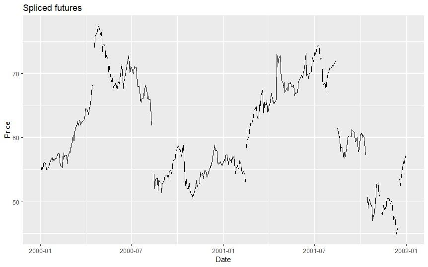

## Table of Contents

## What are futures contracts and why are they important in financial markets?

Futures contracts are agreements to buy or sell an asset at a future date for a price agreed upon today. These assets can be commodities like oil or wheat, financial instruments like stocks or bonds, or currencies. The key feature of futures contracts is that they are standardized and traded on exchanges, which makes them different from forward contracts that are customized and traded over-the-counter. When someone buys a futures contract, they are obligated to buy the asset at the agreed price on the specified date, and the seller is obligated to sell it.

Futures contracts are important in financial markets for several reasons. First, they allow businesses and investors to manage risk. For example, a farmer can use futures to lock in a price for their crops, protecting against price drops. Similarly, an airline might use futures to hedge against rising fuel costs. Second, futures provide a way for speculators to bet on the future price of an asset without needing to hold the asset itself. This adds liquidity to the markets, making them more efficient. Overall, futures contracts help stabilize prices and facilitate smoother operations in various industries by providing a tool for risk management and price discovery.

## What is a continuous futures contract and how does it differ from a standard futures contract?

A continuous futures contract is a way to track the price of a futures contract over time without worrying about the contract expiring. When a standard futures contract gets close to its expiration date, traders usually switch to a new contract with a later expiration date. A continuous futures contract stitches these different contracts together, so you can see a smooth price line over time.

The main difference between a continuous futures contract and a standard futures contract is that the continuous one doesn't actually exist as a tradable product. You can't buy or sell a continuous futures contract on an exchange. It's just a tool used for analysis and charting. A standard futures contract, on the other hand, is a real contract that you can trade, and it has a specific expiration date. So, while a continuous futures contract helps you understand long-term trends, a standard futures contract is what you use if you want to actually buy or sell the asset at a future date.

## Why is backtesting important in trading and investment strategies?

Backtesting is important in trading and investment strategies because it lets you test your ideas before you use real money. Imagine you have a plan for [picking](/wiki/asset-class-picking) stocks or trading futures. Backtesting lets you see how that plan would have worked in the past. By using old data, you can see if your strategy would have made money or lost money. This helps you find out if your idea is good or if it needs changes before you risk your own cash.

Another reason [backtesting](/wiki/backtesting) is useful is that it helps you understand how your strategy might work in different market conditions. Markets can be calm or wild, and your strategy might do well in one but not the other. By testing your plan with past data, you can see how it would have handled different situations. This can make you feel more confident in your strategy because you know it's been through a lot of different scenarios. Plus, backtesting can show you where your strategy might fail, so you can fix it before you start trading for real.

## How do you construct a continuous futures contract for backtesting purposes?

To construct a continuous futures contract for backtesting, you start by choosing the futures contracts you want to track over time. These contracts have expiration dates, so you need to switch from one contract to the next before the old one expires. The way you do this is by picking a rule for when to switch, like always moving to the next contract a certain number of days before the old one expires. Once you decide on your rule, you can string together the prices of these contracts to make one long price line. This line is your continuous futures contract, and it helps you see how prices have changed over a long time without worrying about the gaps when contracts expire.

When you're building this continuous futures contract, you might notice that the price jumps a bit when you switch from one contract to another. This is normal because the prices of different contracts can be a little different. To deal with this, you can adjust the prices so that the switch is smoother. One way to do this is by adding or subtracting the difference between the old and new contract prices at the time of the switch. This way, your continuous futures contract looks more like a single, smooth line, which makes it easier to backtest your trading strategies. By using this adjusted continuous futures contract, you can test how your strategies would have worked over many years, helping you see if they are good or need changes.

## What are the common methods for rolling over futures contracts in a continuous series?

Rolling over futures contracts in a continuous series means deciding when to switch from one contract to the next. One common method is the calendar roll, where you switch to the next contract a certain number of days before the old one expires. For example, you might decide to roll over 10 days before expiration. This method is simple and helps avoid the rush and potential price jumps right at expiration. Another method is the [volume](/wiki/volume-trading-strategy)-based roll, where you switch to the new contract when its trading volume starts to become higher than the old one. This can help you stay with the contract that's most actively traded, which often has better [liquidity](/wiki/liquidity-risk-premium).

A third method is the price-based roll, where you switch based on the price difference between the current and next contract. If the difference gets too big, you might decide it's time to roll over. This method tries to minimize the price impact of rolling over. Each of these methods has its pros and cons, and the best choice can depend on what you're trying to achieve with your trading strategy. The key is to pick a method and stick to it consistently so your continuous futures contract stays smooth and useful for backtesting.

## How does the choice of roll date affect the performance of a backtested strategy?

The choice of roll date can really change how well a backtested strategy does. When you roll over to a new futures contract, the price might jump a bit. If you pick a roll date that's too close to when the old contract expires, you might get caught in a big price jump. This can make your backtested results look worse than they might be in real trading. On the other hand, if you roll over too early, you might miss out on some price movements in the old contract, which could also make your strategy seem less good than it could be.

It's important to think about what kind of market you're dealing with when picking a roll date. In calm markets, rolling over a bit earlier might not hurt much, but in wild markets, you might want to wait longer to catch more of the old contract's price action. The key is to try different roll dates in your backtests to see what works best for your strategy. By doing this, you can find a balance that makes your backtested results as close as possible to what you might see in real trading.

## What are the implications of using different roll methodologies on backtest results?

Using different roll methodologies in backtesting can make a big difference in how your strategy seems to work. If you use a calendar roll and switch to the next contract a certain number of days before the old one expires, you might miss out on some price movements if you roll too early. But if you roll too late, you might get caught in a big price jump right before expiration, which can make your backtest results look worse. On the other hand, if you use a volume-based roll and switch when the new contract's trading volume gets higher, you might stay with the most liquid contract, but the timing could still affect your results depending on how the market is behaving.

Another method, the price-based roll, lets you switch when the price difference between the old and new contract gets too big. This can help you avoid big price jumps, but it might also mean you're rolling over more often, which can add up to more small changes in your backtest results. Each method has its own way of dealing with the timing of rolling over, and this can lead to different backtest outcomes. The best choice depends on what you're trying to achieve with your strategy and how the market usually behaves. Trying out different roll methods in your backtests can help you see which one gives you the most realistic and useful results for your trading plan.

## How can you adjust for the impact of contango and backwardation in continuous futures backtesting?

When you're backtesting with continuous futures, you need to think about contango and backwardation. Contango is when the futures price is higher than the expected future spot price, and backwardation is when it's lower. These can mess up your backtest results because they change how much you pay or get when you roll over to a new contract. If you're in contango, you'll lose a bit of money each time you roll over because you're selling the old contract at a lower price and buying the new one at a higher price. In backwardation, you make a bit of money because you're selling high and buying low.

To adjust for contango and backwardation, you can use a method called "backward adjustment" or "forward adjustment." In backward adjustment, you change the prices of the old contracts so that they line up smoothly with the new ones. This means you add or subtract the difference between the old and new contract prices at the time of the roll. Forward adjustment does the opposite; it changes the prices of the new contracts to match the old ones. Both methods help make your continuous futures contract look like one smooth line, which makes your backtest results more accurate. By doing this, you can see how your strategy would really work over time, without the ups and downs from rolling over in contango or backwardation messing things up.

## What are the best practices for handling price gaps and discontinuities in continuous futures data?

When you're working with continuous futures data, you need to be careful about price gaps and discontinuities. These happen when you switch from one futures contract to the next. The prices might not line up perfectly, so you see a jump. To fix this, you can use a method called "smoothing." This means you adjust the prices so that the switch looks smoother. You can do this by adding or subtracting the difference between the old and new contract prices at the time you switch. This way, your continuous futures data looks like one smooth line, which makes it easier to see the real trends without the jumps messing things up.

Another way to handle price gaps is by picking a good time to roll over to the next contract. If you roll over too close to the expiration date, you might get caught in a big price jump. But if you roll over too early, you might miss out on some price movements. You need to find a balance that works for your strategy. Testing different roll dates can help you see what works best. By doing this, you can make your backtest results more accurate and useful. It's all about making sure your continuous futures data gives you a clear picture of how your strategy would work over time.

## How do you validate the accuracy and reliability of a continuous futures backtest?

To make sure your continuous futures backtest is accurate and reliable, you need to check it against real data. Start by comparing your backtest results to what actually happened in the market. If your backtest shows big wins or losses that don't match up with real market moves, something might be off. Also, look at how well your backtest handles different market conditions. If it does great in calm markets but falls apart when things get wild, you might need to tweak your strategy or how you roll over contracts.

Another way to validate your backtest is by using different roll methods and seeing if your results stay the same. If your strategy works well no matter when you roll over, that's a good sign. But if changing the roll date or method makes a big difference, you might need to think about how you're handling those switches. It's also smart to test your strategy on different time periods and with different assets. If it keeps working well across the board, you can feel more confident that your backtest is giving you a true picture of how your strategy might do in real trading.

## What advanced statistical techniques can enhance the analysis of continuous futures backtesting?

Using advanced statistical techniques can make your continuous futures backtesting better. One way is by using something called Monte Carlo simulation. This means you run your strategy many times with different random changes to see how it might do in all sorts of situations. This can help you understand if your strategy is good in many different market conditions, not just the ones you tested. Another technique is called bootstrapping, where you take parts of your old data and mix them up to make new data sets. This lets you test your strategy over and over with different data, which can show you if your results are just a lucky guess or if they're really good.

You can also use something called walk-forward optimization to make your backtesting more reliable. This means you split your data into two parts. You use the first part to build your strategy, and then you test it on the second part to see if it still works. This helps you avoid making a strategy that only works on the data you already know. Lastly, using statistical tests like the Sharpe Ratio or the Sortino Ratio can help you see how good your strategy is at making money compared to the risk it takes. These tools can give you a clearer picture of how well your strategy might work in real trading, making your backtesting more accurate and helpful.

## How do you integrate continuous futures backtesting results into a broader trading or investment strategy?

When you use continuous futures backtesting results in your overall trading or investment strategy, it's like using a map to plan a trip. The backtesting shows you how your strategy might have worked in the past, which can help you see if it's good or if you need to make changes. But remember, past results don't promise future success. So, after you backtest, you should test your strategy in a real market without using real money first. This helps you see if it works like your backtest said it would. If it does, you can feel more confident about using it with your actual money.

Also, it's smart to keep an eye on how the market is doing and adjust your strategy as things change. Markets can be calm one day and wild the next, so your strategy might need to change too. Use the backtesting results to guide you, but don't be afraid to try new things or make small changes if the market isn't acting like it did in your tests. By combining your backtesting results with real-time market watching and some flexibility, you can build a strong trading or investment plan that helps you reach your goals.

## What is Quantpedia's Methodology?

Quantpedia employs a strategic methodology for constructing continuous futures, which combines the first-of-month roll method with the backward ratio adjustment method. This approach is aimed at creating a seamless and accurate depiction of percentage-based performance, essential for evaluating trading strategies. By rolling the contracts on the first of each month, Quantpedia ensures that the transition from the expiring contract to the next is well-aligned with typical trading cycles, attempting to maintain liquidity and minimize slippage.

The backward ratio adjustment method is key to managing the discontinuities often observed at contract rollovers. This technique involves adjusting past price data to align proportionately with the new contract's prices. For example, if $P_1$ and $P_2$ are the prices of the expiring and new contracts, respectively, the adjusted price $P'$ for historical data using the backward ratio method is calculated as:

$$
P' = P_{\text{historical}} \times \left( \frac{P_2}{P_1} \right)
$$

This adjustment ensures that historical price series remain consistent, thus preventing artificial price jumps or drops that could skew performance assessments.

Quantpedia's strategies are seamlessly integrated with platforms like QuantConnect, which provides a robust backtesting environment. This integration facilitates the development and evaluation of strategies that rely on sound data practices. The accuracy and reliability emphasized by this methodology play a crucial role in informed trading decisions, allowing traders and analysts to assess the viability and profitability of their strategies with a higher degree of confidence.

Quantpedia maintains in-house continuous futures data, ensuring a high standard of data integrity necessary for reliable backtesting results. Their systematic approach underlines the necessity for precise and well-adjusted datasets, which are vital in forestalling misleading outcomes in strategy performance analysis. By combining the first-of-month roll and backward ratio adjustment methods, Quantpedia provides a reliable framework for traders aiming for strategic insights grounded in accurate historical data.

## References & Further Reading

[1]: Back, K. (2010). ["Asset Pricing and Portfolio Choice Theory."](https://academic.oup.com/book/43509) Princeton University Press.

[2]: Carver, R. (2019). ["Leveraged Trading: A professional approach to trading FX, stocks on margin, CFDs, spread bets and futures for all traders."](https://www.amazon.com/Leveraged-Trading-professional-approach-trading-ebook/dp/B07Z81R6WL) Harriman House.

[3]: Pfaff, B. (2016). ["Financial Risk Modelling and Portfolio Optimization with R."](https://onlinelibrary.wiley.com/doi/book/10.1002/9781119119692) John Wiley & Sons, Inc.

[4]: Hull, J. C. (2018). ["Options, Futures, and Other Derivatives."](https://www.semanticscholar.org/paper/Options%2C-Futures%2C-and-Other-Derivatives-Hull/89bdee500c8623864fc9eb7a471546aa713acc44) Pearson.

[5]: Chan, E. P. (2009). ["Quantitative Trading: How to Build Your Own Algorithmic Trading Business."](https://github.com/ftvision/quant_trading_echan_book) Wiley Trading.

[6]: Lopez de Prado, M. (2018). ["Advances in Financial Machine Learning."](https://www.amazon.com/Advances-Financial-Machine-Learning-Marcos/dp/1119482089) Wiley.