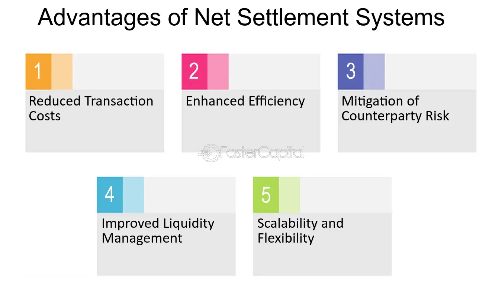

## Table of Contents

## What is Continuous Net Settlement (CNS)?

Continuous Net Settlement (CNS) is a process used by the National Securities Clearing Corporation (NSCC) to streamline the settlement of securities trades. When you buy or sell stocks, instead of each trade being settled individually, CNS groups together all the trades made by a member firm on a particular day. It then calculates a net position, which means figuring out the total number of shares the firm needs to buy or sell after all the buying and selling is taken into account. This makes the process much simpler and more efficient because it reduces the number of transactions that need to be settled.

For example, if a firm buys 100 shares of a stock in one trade and sells 80 shares of the same stock in another trade, CNS would net these transactions to show that the firm only needs to buy 20 shares overall. This netting process helps reduce the risk and costs associated with settling trades. By using CNS, the NSCC can handle a huge number of trades every day more smoothly, making the whole system of buying and selling stocks work better for everyone involved.

## How does Continuous Net Settlement work?

Continuous Net Settlement, or CNS, is a system used by the National Securities Clearing Corporation (NSCC) to make settling stock trades easier. When people buy and sell stocks, instead of settling each trade one by one, CNS groups all the trades made by a member firm on a single day. It then calculates a net position, which means figuring out the total number of shares the firm needs to buy or sell after considering all their buying and selling. This makes things simpler because it reduces the number of transactions that need to be settled.

For example, if a firm buys 100 shares of a stock in one trade and sells 80 shares of the same stock in another trade, CNS would net these transactions to show that the firm only needs to buy 20 shares overall. This process of netting helps lower the risk and costs of settling trades. By using CNS, the NSCC can handle a huge number of trades every day more smoothly, making the whole system of buying and selling stocks work better for everyone involved.

## What are the main components of a CNS system?

The main parts of a Continuous Net Settlement (CNS) system are the trade matching process, the netting engine, and the settlement process. When someone buys or sells stocks, the CNS system first matches all the trades that happened that day. This means it looks at all the buying and selling done by a firm and pairs them up. After matching the trades, the CNS system uses a netting engine. This is like a big calculator that figures out the total number of shares a firm needs to buy or sell after looking at all their trades. If a firm bought 100 shares and sold 80 shares of the same stock, the netting engine would say they only need to buy 20 shares in the end.

Then comes the settlement process. This is where the actual buying and selling happens based on what the netting engine figured out. The CNS system makes sure that the right number of shares gets moved from one place to another. It does all this work behind the scenes so that the firms don't have to handle each trade one by one. This makes everything easier and less risky. By grouping all the trades together and settling them as one big transaction, the CNS system helps keep the stock market running smoothly and efficiently.

## Who typically uses Continuous Net Settlement?

Continuous Net Settlement (CNS) is mainly used by member firms of the National Securities Clearing Corporation (NSCC). These firms include big banks, broker-dealers, and other financial institutions that buy and sell stocks for their clients. When these firms trade stocks, they rely on CNS to make the process of settling these trades easier and less risky.

By using CNS, these firms don't have to settle each trade separately. Instead, CNS groups all their trades together and calculates a net position. This means the firms only need to handle one big transaction at the end of the day, which saves them time and money. This system helps keep the stock market running smoothly for everyone involved.

## What are the primary benefits of using CNS for businesses?

Using Continuous Net Settlement (CNS) helps businesses save time and money. Instead of settling each stock trade one by one, CNS groups all the trades a firm makes in a day and calculates a net position. This means the firm only needs to handle one big transaction at the end of the day, which makes things much simpler and less costly. It's like doing all your shopping in one trip instead of many small ones.

CNS also reduces risk for businesses. When trades are settled individually, there's a higher chance something could go wrong, like a delay or a mistake in the transaction. But with CNS, all the trades are netted together, which lowers the number of transactions and, in turn, the risk of errors. This makes the whole process of buying and selling stocks smoother and more reliable for the firms using it.

## How does CNS improve operational efficiency?

CNS helps businesses work more efficiently by grouping all their stock trades together instead of settling each one separately. Imagine if you had to go to the store every time you needed to buy something. It would take a lot of time and effort. But if you could do all your shopping in one trip, it would be much easier. That's what CNS does for businesses. It looks at all the buying and selling a firm does in a day and figures out the total number of shares they need to buy or sell. This way, the firm only has to handle one big transaction at the end of the day, which saves them a lot of time and effort.

CNS also makes things less risky for businesses. When trades are settled one by one, there's a higher chance something could go wrong, like a delay or a mistake. But with CNS, all the trades are combined into one big transaction, which means fewer chances for errors. This makes the whole process of buying and selling stocks smoother and more reliable. By using CNS, businesses can focus more on their main work instead of worrying about settling each trade individually.

## What are the risks associated with Continuous Net Settlement?

While Continuous Net Settlement (CNS) makes settling stock trades easier, it can also bring some risks. One risk is that if a big firm that uses CNS runs into financial trouble, it could affect the whole system. Since CNS groups all trades together, if one firm can't pay what they owe, it might cause problems for other firms that are part of the same net settlement.

Another risk is that CNS relies a lot on technology. If there's a problem with the computer systems or if there's a cyber attack, it could mess up the whole process of settling trades. This could lead to delays or mistakes in the transactions, which could be costly for the firms involved. So, while CNS helps make things more efficient, it's important for firms to be aware of these risks and have plans in place to deal with them.

## How does CNS impact liquidity management?

Continuous Net Settlement (CNS) helps with [liquidity](/wiki/liquidity-risk-premium) management by reducing the amount of cash and securities a firm needs to have on hand at any given time. When a firm buys and sells stocks, CNS groups all those trades together and calculates a net position. This means the firm only needs to settle one big transaction at the end of the day, instead of many smaller ones. By doing this, CNS makes it easier for firms to manage their cash flow because they don't have to worry about having enough money or stocks for each individual trade.

However, CNS can also affect liquidity in other ways. If a big firm that uses CNS has financial problems, it could cause issues for the whole system. Because all trades are grouped together, if one firm can't meet its obligations, it might affect the liquidity of other firms that are part of the same net settlement. So, while CNS generally helps with liquidity management, firms need to be careful and make sure they have good plans in place to handle any potential risks.

## What are the technological requirements for implementing CNS?

To use Continuous Net Settlement (CNS), firms need strong computer systems. These systems have to handle a lot of trades quickly and accurately. They need to be able to match all the buying and selling that happens in a day, figure out the net position, and then settle everything in one big transaction. This means the systems need to be fast and reliable, with good software that can do all these things without making mistakes.

Also, because CNS relies so much on technology, firms need to make sure their systems are safe from cyber attacks. They need to use strong security measures to protect their data and keep the whole process running smoothly. This includes having backup plans in case something goes wrong with the technology, so they can keep settling trades without any big problems.

## How does CNS compare to other settlement methods like Real-Time Gross Settlement (RTGS)?

Continuous Net Settlement (CNS) and Real-Time Gross Settlement (RTGS) are two different ways to handle the settling of stock trades. CNS groups all the trades made by a firm in a day and calculates a net position, which means it figures out the total number of shares the firm needs to buy or sell after considering all their buying and selling. This makes the process simpler because the firm only has to handle one big transaction at the end of the day. It's like doing all your shopping in one trip instead of many small ones. CNS helps firms save time and money, and it also reduces the risk of errors because there are fewer transactions to settle.

On the other hand, RTGS settles each trade individually and in real-time, which means as soon as the trade happens. This method is more immediate and can be useful when firms need to make sure a trade is settled right away. However, RTGS can be more complicated and costly because it involves handling each trade one by one. It's like going to the store every time you need to buy something. While RTGS can provide more immediate settlement, CNS is often preferred for its efficiency and lower risk when settling a large number of trades.

In summary, CNS and RTGS serve different needs. CNS is better for firms that do a lot of trading and want to simplify the settlement process, while RTGS is better for situations where immediate settlement is necessary. Both methods have their place in the financial world, but CNS is generally more efficient for handling high volumes of trades.

## What are some real-world examples of CNS implementation?

One real-world example of Continuous Net Settlement (CNS) is how it's used by the National Securities Clearing Corporation (NSCC) in the United States. The NSCC helps make sure that when people buy and sell stocks, everything goes smoothly. They use CNS to group all the trades that happen in a day and figure out the total number of shares each firm needs to buy or sell. This makes it easier for big banks and broker-dealers to handle their trades without having to settle each one separately. It's like doing all your shopping in one trip instead of many small ones.

Another example is how CNS is used by the Depository Trust & Clearing Corporation (DTCC). The DTCC is a big company that helps settle trades for lots of different financial products, not just stocks. They use CNS to make the process of settling trades more efficient and less risky. By grouping all the trades together and calculating a net position, the DTCC can handle a huge number of trades every day more smoothly. This helps keep the whole financial system running well and makes it easier for firms to manage their buying and selling.

## What future developments can we expect in Continuous Net Settlement systems?

In the future, Continuous Net Settlement systems are likely to become even more advanced with the use of new technology. One big change we might see is the use of [artificial intelligence](/wiki/ai-artificial-intelligence) and [machine learning](/wiki/machine-learning). These technologies could help make the process of matching trades and calculating net positions even faster and more accurate. They could also help predict and prevent problems before they happen, making the whole system safer and more reliable. Another thing that might happen is the use of blockchain technology. Blockchain could make the settlement process more secure and transparent, which would be a big help for firms that use CNS.

We might also see CNS systems becoming more connected with other financial systems around the world. This could help make international trading easier and more efficient. As more countries and firms start using CNS, it could become a standard way of settling trades everywhere. This would make it easier for firms to do business with each other, no matter where they are located. Overall, these future developments could make CNS even better at helping firms save time and money while reducing the risks of settling trades.

## References & Further Reading

[1]: DTCC. (n.d.). ["Understanding Continuous Net Settlement."](https://www.dtcc.com/clearing-and-settlement-services/equities-clearing-services/cns) 

[2]: Hasbrouck, J., & Saar, G. (2009). "Technological Change and the Evolution of the Financial Market Place." *Journal of Finance*, 64(4), 1933-1956.

[3]: Hull, J. C. (2018). ["Options, Futures, and Other Derivatives."](https://www.semanticscholar.org/paper/Options%2C-Futures%2C-and-Other-Derivatives-Hull/89bdee500c8623864fc9eb7a471546aa713acc44) Pearson Education.

[4]: MacKenzie, D. (2019). ["Material Markets: How Economic Agents are Constructed."](https://academic.oup.com/book/52341) Oxford University Press.

[5]: National Securities Clearing Corporation (NSCC). (n.d.). ["Standard Position Service/Continuous Net Settlement."](https://www.dtcc.com/about/businesses-and-subsidiaries/nscc) 

[6]: Man, A. (2017). ["Algorithmic Trading and DMA: An Introduction to Direct Access Trading Strategies."](https://www.semanticscholar.org/paper/Algorithmic-trading-%26-DMA-%3A-an-introduction-to-Johnson/aa5de1ab883d5e23b6651faa7c1807586d688e4b) 4Myeloma Press.

[7]: Casey, M.J., Crane, J., Gensler, G., Johnson, S., & Narula, N. (2018). ["The Impact of Blockchain Technology on Finance: A Catalyst for Change."](https://cepr.org/publications/books-and-reports/geneva-21-impact-blockchain-technology-finance-catalyst-change) World Economic Forum.