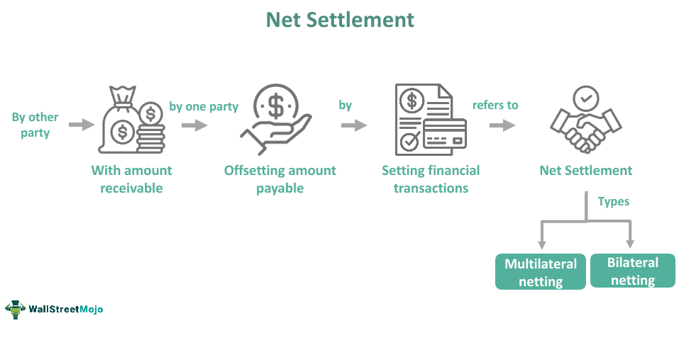

In today's fast-paced financial markets, efficiency and risk management are of utmost importance. The rapid evolution of technology has transformed the landscape of trading, leading to significant innovations in the processes of securities clearing and settlement. Among these innovations is Continuous Net Settlement (CNS), a crucial process that facilitates seamless clearing and settlement, thereby mitigating the risks associated with high-volume financial transactions. CNS, primarily used by the National Securities Clearing Corporation (NSCC), is designed to optimize and streamline transactions by netting trades and minimizing the reciprocal exchange of securities between trading parties. This not only bolsters the efficiency of financial markets but also enhances their stability by reducing counterparty risk.

In parallel, algorithmic trading has emerged as a cornerstone in modern financial markets. Utilizing sophisticated algorithms to automate trading, it executes orders at speeds and frequencies far beyond human capability. This method of trading heavily depends on advanced clearing mechanisms like CNS to manage and process the enormous volume of trades generated, ensuring that they are executed correctly and efficiently. As a result, algorithmic trading leverages CNS to maintain fluidity and stability across markets, minimizing the potential for errors and enhancing the overall market efficiency.



The intricate relationship between algorithmic trading, financial transactions, and continuous net settlement highlights the critical role each plays in modern finance. This article will explore these interconnected elements, examining how they collectively contribute to the robustness and reliability of today's financial ecosystem.

## Table of Contents

## Understanding Continuous Net Settlement (CNS)

Continuous Net Settlement (CNS) is a pivotal mechanism administered by the National Securities Clearing Corporation (NSCC) to optimize the clearing and settlement of securities transactions. This process is integral to maintaining the fluidity and reliability of financial markets. By centralizing and netting the various member transactions, CNS significantly reduces the necessity for direct exchanges of securities among counterparties. 

The primary function of CNS is the netting of trades, where the NSCC aggregates all transactions of its participants, distilling them into a singular net position. This netting process occurs continuously, meaning that buy and sell positions are consolidated into either a single net long or net short position. By engaging in this process, the NSCC minimizes the volume of securities and cash that must change hands, thereby enhancing both efficiency and liquidity in the market. For example, if a participant has multiple buy and sell orders for a specific security, CNS calculates the net difference, reducing the gross settlement obligation to one net position.

The NSCC serves as a central counterparty (CCP) to each trade, which is a critical component of CNS. This role involves the assumption of counterparty credit risk, transferring it from individual market participants to the clearinghouse itself. By centralizing counterparty risk, the NSCC ensures stability and confidence in the trading process, effectively eliminating the default risk associated with bilateral transactions. This function helps stabilize the financial ecosystem by providing certainty of settlement and reducing potential systemic risk.

CNS provides several benefits to the financial market ecosystem. Firstly, it enhances operational efficiency by reducing the number of deliverables and thereby lowering transaction costs for participants. Secondly, by facilitating a central netting process, CNS decreases the [liquidity](/wiki/liquidity-risk-premium) needs of market participants, as they are only required to settle their net position. This is crucial in fostering a well-functioning capital market, especially in times of [volatility](/wiki/volatility-trading-strategies) when transaction volumes can surge.

Furthermore, CNS supports compliance with regulatory requirements by maintaining detailed records of transactions and settlements. As global financial markets are subjected to stringent regulations, the automated processes and record-keeping capabilities of CNS are invaluable for regulatory transparency and reporting.

Overall, Continuous Net Settlement plays a significant role in streamlining financial transactions, enhancing liquidity, and mitigating risks. Its efficient netting process and role as a central counterparty contribute significantly to the robustness and reliability of modern financial markets.

## The Role of Securities Clearing in Financial Transactions

Securities clearing is an essential function in financial markets, acting as a critical step that ensures the accuracy and validity of trade transactions prior to their settlement. It is at this juncture that clearinghouses, such as the Depository Trust & Clearing Corporation (DTCC) and the National Securities Clearing Corporation (NSCC), play a pivotal role.

Firstly, these clearinghouses provide mechanisms to manage the inherent risks in financial markets by implementing a series of processes, including trade matching, confirmation, netting, and collateral management. Trade matching involves re-confirming the details of trades submitted by both parties to eliminate any discrepancies. This ensures that by the time a trade reaches the settlement phase, all its details have been accurately verified.

Netting is another critical function performed by clearinghouses. In this context, netting refers to the consolidation of multiple trade positions into a single net position, thereby reducing the number of transactions that need to be settled. This reduction in transaction [volume](/wiki/volume-trading-strategy) directly lowers the operational and financial costs associated with trade settlements. Mathematically, if a firm has several buy and sell orders, netting simplifies these transactions by calculating the net buy or sell position. For example, if a firm buys 100 shares and sells 40, netting results in a single net position of 60 shares to settle.

Moreover, clearing processes incorporate the use of collateral management to secure trades. This entails the requirement of margin deposits from member firms to mitigate potential default risks. The collateral serves as a financial guarantee that reinforces market integrity, especially in volatile trading conditions.

The effectiveness of these clearing functions is heightened by Continuous Net Settlement (CNS). CNS supports the systematic flow of large trade volumes, particularly critical for [algorithmic trading](/wiki/algorithmic-trading) systems known for executing high-frequency transactions. By continuously updating and offsetting positions, CNS enhances liquidity management and minimizes the risk of trade settlements. Consequently, the seamless integration of CNS with clearing operations ensures that massive volumes of trades facilitated by algorithmic trading systems are processed efficiently and accurately.

In summary, securities clearing facilitated by clearinghouses is vital for maintaining the efficiency and accuracy of financial transactions. Through carefully structured processes such as trade matching, netting, and collateral management, these institutions safeguard market stability. The role of CNS further amplifies these benefits, providing the infrastructure necessary for handling and streamlining the high-frequency transactions characteristic of contemporary algorithmic trading environments.

## Algorithmic Trading and its Impact on Market Efficiency

Algorithmic trading, a method characterized by the deployment of computer algorithms to execute trades, has revolutionized the speed and efficiency with which orders are processed in financial markets. These algorithms are designed to monitor markets, analyze data, and execute orders at speeds far exceeding human capabilities, thereby capitalizing on even the smallest market inefficiencies. High-frequency trading ([HFT](/wiki/high-frequency-trading-strategies)), a subset of algorithmic trading, particularly exemplifies the demand for rapid order execution and effective handling of large trade volumes.

The interplay between high-frequency strategies and continuous net settlement (CNS) is crucial for maintaining market efficiency. CNS plays a vital role in ensuring that the clearing and settlement of these trades occur smoothly and without delay. This integration provides a robust framework for handling the substantial volume of transactions characteristic of algorithmic trading. By netting positions into smaller, manageable batches, CNS mitigates counterparty risk, which is elevated in environments with high trading velocity. Consequently, this netting process enhances liquidity management and reduces settlement costs.

The automation inherent in algorithmic trading significantly contributes to market efficiency. It reduces human error, optimizes the use of real-time data, and applies sophisticated analytics to make informed trading decisions. This level of automation allows traders to swiftly respond to market shifts, improving the liquidity and overall stability of financial markets. The use of predictive models and [machine learning](/wiki/machine-learning) techniques further refines these trading algorithms, ensuring they adapt to changing market conditions dynamically.

The integration of algorithmic trading and CNS brings about enhanced market fluidity. As trades are executed and settled more swiftly, the market experiences fewer disruptions, thereby fostering an environment of greater stability. The real-time processing capabilities of CNS, when combined with the speed of algorithmic trading, ensure that markets remain resilient even during periods of high volatility. This synergy is vital in today’s financial markets, where the volume of trades continues to grow, necessitating efficient and reliable systems to uphold market integrity.

In conclusion, algorithmic trading, supported by continuous net settlement, has increased the efficiency and robustness of financial markets. This combination ensures that large volumes of trades are handled smoothly, reducing risks and costs associated with trading activities. As these technologies evolve, they will likely further enhance the capacity and resilience of trading systems, reinforcing their indispensable role in modern financial markets.

## Advantages and Challenges of Continuous Net Settlement

Continuous Net Settlement (CNS) is a key process in modern financial markets that provides several advantages while also presenting certain challenges. By netting member positions into single long and short positions, CNS effectively reduces counterparty and settlement risks, which are critical components in maintaining the safety and efficiency of financial transactions. The National Securities Clearing Corporation (NSCC), as a central counterparty, plays a vital role in the execution of CNS by ensuring the seamless flow of money and securities among counterparties, thereby diminishing the risk of default.

One major advantage of CNS is its ability to significantly decrease the volume of payments required during the settlement process. Through netting, CNS aggregates multiple transactions into a single position, which minimizes the number of securities and cash movements needed. This process enhances liquidity management by reducing the overall demand for cash settlements, allowing market participants to allocate their capital more effectively and maintain higher liquidity levels.

However, CNS also presents certain challenges, particularly due to its reliance on centralized systems. This centralization introduces a potential single point of failure, which, in the event of a disruption, could have widespread implications for the financial system. The integrity and resilience of the systems operated by entities like the NSCC are therefore paramount to mitigate these risks. Furthermore, as financial markets continue to evolve, the need for technological advancements becomes increasingly essential. Continuous updates and enhancements to the technology underpinning CNS are necessary to address these emerging challenges and ensure the system remains robust against potential cyber threats.

Despite these challenges, the benefits of CNS in enhancing the efficiency and security of securities clearing and settlement processes are substantial. By streamlining the settlement process, CNS supports high-frequency trading strategies and large trade volumes typical in modern algorithmic trading environments. This, in turn, contributes to the stability of financial markets by ensuring that transactions are completed promptly and accurately.

In conclusion, while Continuous Net Settlement offers considerable advantages by mitigating risks and improving liquidity management, the reliance on centralized infrastructures necessitates ongoing focus on technological improvements to sustain its efficacy and adaptability. As financial markets continue to advance, the evolution of CNS will remain integral to the broader landscape of securities clearing and settlement.

## Technological Innovations in Clearing and Settlement

Emerging technologies are driving significant transformations in the clearing and settlement processes, essential components of the financial trading ecosystem. Notably, blockchain and [artificial intelligence](/wiki/ai-artificial-intelligence) (AI) are leading this technological revolution, promising enhanced efficiency, security, and transparency.

Blockchain technology, a decentralized ledger system, offers a powerful alternative to traditional clearing mechanisms. By providing a tamper-proof and transparent ledger, blockchain reduces the need for intermediaries, thereby lowering transaction costs and settlement times. Smart contracts, an integral aspect of blockchain, automate contractual processes, ensuring that transactions meet predefined criteria before execution. This automation minimizes human error and enhances the reliability of settlements, particularly beneficial for algorithmic trading where speed and accuracy are critical.

For example, in a typical securities transaction, blockchain can eliminate the two-day settlement period, known as T+2, by enabling real-time settlements. This is achieved through the removal of reconciliation processes and the need for separate clearing and settlement entities, thus drastically accelerating liquidity and reducing counterparty risk. A simple Python code using a blockchain framework can illustrate how a real-world transaction might look:

```python
class BlockchainTransaction:
    def __init__(self, sender, receiver, amount):
        self.sender = sender
        self.receiver = receiver
        self.amount = amount

    def execute_transaction(self, blockchain):
        if self.verify_funds():
            blockchain.add_block(self)
            return "Transaction successful"
        else:
            return "Insufficient funds"

    def verify_funds(self):
        # Implement necessary checks with the sender's balance
        return True

class Blockchain:
    def __init__(self):
        self.chain = []

    def add_block(self, transaction):
        self.chain.append(transaction)
```
This exemplifies a simplistic view where transactions are verified and added to a blockchain, showcasing how blockchain can facilitate seamless and immediate settlements.

Artificial intelligence complements blockchain by enhancing the predictive and decision-making capabilities of algorithmic trading. AI algorithms can analyze vast quantities of market data in real-time, identifying patterns and anomalies that inform trading decisions and optimize settlement processes. Moreover, AI's ability to predict market trends and potential operational risks aids clearinghouses in managing and mitigating risks proactively.

These innovations hold substantial promise not only for streamlining current processes but also for paving the way toward more adaptive and responsive financial systems. The integration of blockchain and AI is gradually reshaping how clearing and settlement are conducted, aligning with the demands of a rapidly evolving financial landscape driven by algorithmic trading. According to reports by the World Economic Forum, adopting such technologies could lead to savings of billions of dollars annually by reducing operational inefficiencies and enhancing transparency across financial networks.

In conclusion, technological advancements in blockchain and artificial intelligence are revolutionizing the clearing and settlement landscape. Their integration is crucial for supporting the efficiencies demanded by modern trading environments, ensuring a secure, transparent, and cost-effective financial system suitable for high-frequency and algorithmically driven markets.

## Conclusion

Continuous Net Settlement (CNS) serves as a critical mechanism in the financial trading ecosystem, enhancing both its integrity and efficiency. By acting as a central counterparty to trades, CNS significantly mitigates counterparty risk and streamlines settlements, ensuring that trades are processed smoothly and reliably. This system primarily functions by aggregating buy and sell orders into net positions, thereby reducing the number of transactions that need settlement. Consequently, this not only simplifies the operational aspects of trading but also supports large-scale trade volumes inherent in modern financial markets.

The integration of CNS with securities clearing houses and algorithmic trading strategies forms a robust framework capable of handling enormous transaction volumes. Clearinghouses provide essential services such as risk management, trade confirmation, and collateral management, all of which supplement the performance of CNS. Algorithmic trading, which relies on rapid execution and real-time data, benefits from the streamlined transaction processes offered by CNS, ultimately enhancing market liquidity and stability.

Looking ahead, technological advancements are poised to further optimize clearing and settlement practices. The integration of blockchain and artificial intelligence could provide real-time settlement capabilities and advanced risk analytics, further reducing costs and enhancing transparency. Additionally, increased automation and innovation in technologies like distributed ledger systems might offer new methods to decentralize processes, potentially diminishing central points of failure and bolstering system resilience.

Regulatory support will play a pivotal role in the continued refinement and adoption of these technologies, ensuring they meet the evolving demands of global financial markets. As technology progresses, the continual evolution of CNS and related systems will be integral to maintaining market stability and fostering a secure trading environment.

## References & Further Reading

[1]: DTCC. (n.d.). ["Understanding Continuous Net Settlement."](https://www.dtcc.com/clearing-and-settlement-services/equities-clearing-services/cns) 

[2]: Hasbrouck, J., & Saar, G. (2009). "Technological Change and the Evolution of the Financial Market Place." *Journal of Finance*, 64(4), 1933-1956.

[3]: Hull, J. C. (2018). ["Options, Futures, and Other Derivatives."](https://www.semanticscholar.org/paper/Options%2C-Futures%2C-and-Other-Derivatives-Hull/89bdee500c8623864fc9eb7a471546aa713acc44) Pearson Education.

[4]: MacKenzie, D. (2019). ["Material Markets: How Economic Agents are Constructed."](https://academic.oup.com/book/52341) Oxford University Press.

[5]: National Securities Clearing Corporation (NSCC). (n.d.). ["Standard Position Service/Continuous Net Settlement."](https://www.dtcc.com/about/businesses-and-subsidiaries/nscc) 

[6]: Man, A. (2017). ["Algorithmic Trading and DMA: An Introduction to Direct Access Trading Strategies."](https://www.semanticscholar.org/paper/Algorithmic-trading-%26-DMA-%3A-an-introduction-to-Johnson/aa5de1ab883d5e23b6651faa7c1807586d688e4b) 4Myeloma Press.

[7]: Casey, M.J., Crane, J., Gensler, G., Johnson, S., & Narula, N. (2018). ["The Impact of Blockchain Technology on Finance: A Catalyst for Change."](https://cepr.org/publications/books-and-reports/geneva-21-impact-blockchain-technology-finance-catalyst-change) World Economic Forum.