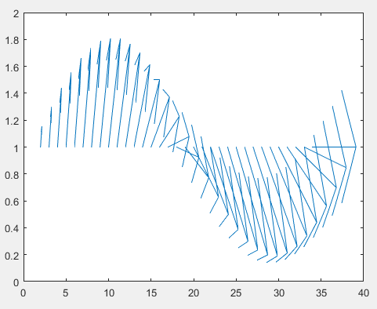

## Table of Contents

## What is a Continuous Quiver Graph?

A Continuous Quiver Graph is a way to show how things are connected in a mathematical model. Imagine you have a bunch of points, and these points are connected by arrows. Each arrow can represent a relationship or a flow between the points. In a Continuous Quiver Graph, these arrows can be smooth and continuous, not just straight lines. This makes it useful for modeling things that change smoothly over time or space, like the flow of water in a river or the spread of information in a network.

These graphs are used in areas like physics, biology, and computer science. They help scientists understand complex systems where things are always changing and moving. For example, in biology, a Continuous Quiver Graph could show how nutrients move through an ecosystem. In physics, it could model how energy flows in a system. By using these graphs, researchers can predict how changes in one part of the system might affect the whole thing, making it easier to study and understand complex, dynamic processes.

## How does a Continuous Quiver Graph differ from a traditional graph?

A Continuous Quiver Graph is different from a traditional graph because it uses smooth, continuous arrows instead of just straight lines or edges. In a traditional graph, you might see points connected by simple lines, like a map showing roads between cities. But in a Continuous Quiver Graph, the arrows can curve and bend, showing how things change smoothly over time or space. This makes it better for showing things like the flow of water in a river or how information spreads through a network.

Another big difference is that Continuous Quiver Graphs are often used to model complex systems that are always changing. Traditional graphs are great for showing static relationships, like who is friends with whom on a social media platform. But if you want to understand how those friendships might change over time, or how information moves through the network, a Continuous Quiver Graph can show that better. It helps scientists predict how changes in one part of a system might affect the whole thing, making it a powerful tool for studying things like ecosystems or energy flows.

## What are the basic components of a Continuous Quiver Graph?

A Continuous Quiver Graph has two main parts: vertices and edges. Vertices are like points on a map. They represent things like places, people, or ideas. Edges are the arrows that connect these points. In a Continuous Quiver Graph, these arrows can be curved and smooth, not just straight lines. This helps show how things move or change in a smooth way between the points.

These edges are important because they show the relationships or flows between the vertices. For example, an edge could show how water moves from one part of a river to another, or how information spreads from one person to another in a network. The direction of the arrow tells you which way the flow is going. By using these smooth, continuous arrows, a Continuous Quiver Graph can help scientists understand complex systems better, like how changes in one part of a system might affect the whole thing.

## Can you explain the mathematical foundation of Continuous Quiver Graphs?

The mathematical foundation of Continuous Quiver Graphs builds on the idea of a quiver, which is a directed graph where each edge has a direction shown by an arrow. In a Continuous Quiver Graph, these arrows are not just straight lines but can be smooth and continuous curves. This allows the graph to represent smooth changes and flows between the points, or vertices, in the graph. The vertices can represent anything from places and people to more abstract concepts like states in a system. The edges, or arrows, show how these things are connected and how things move or change between them.

To make these graphs work mathematically, we use concepts from differential geometry and topology. Differential geometry helps us understand the smooth curves of the arrows, while topology helps us see how the whole graph is connected. These tools let us describe the graph in a way that can handle the complexities of real-world systems. For example, we can use equations to describe how the arrows change direction and how the vertices interact with each other. This mathematical framework makes Continuous Quiver Graphs a powerful tool for modeling and understanding dynamic systems where things are always changing and moving.

## What are some common applications of Continuous Quiver Graphs?

Continuous Quiver Graphs are used in many different fields to help people understand how things change and move over time or space. In biology, scientists use these graphs to study how nutrients flow through an ecosystem. They can see how energy moves from plants to animals and back again, helping them understand how changes in one part of the ecosystem might affect the whole system. In physics, Continuous Quiver Graphs are great for modeling how energy flows in a system. They can show how heat moves through different materials or how electricity flows through a circuit, making it easier to predict what will happen if something in the system changes.

In computer science, these graphs help with understanding how information spreads through a network. They can show how data moves from one computer to another, helping to design better networks and predict where problems might happen. In economics, Continuous Quiver Graphs can model how money and goods move through an economy. They help economists see how changes in one part of the economy, like a new law or a change in consumer behavior, might affect other parts, like prices or employment. By using these graphs, people in many fields can better understand and predict the behavior of complex, changing systems.

## How do you construct a Continuous Quiver Graph?

To construct a Continuous Quiver Graph, you start by identifying the points or vertices you want to include. These points can represent anything from places and people to more abstract concepts like states in a system. Next, you draw arrows or edges between these points to show how they are connected. Unlike regular graphs where the lines are straight, in a Continuous Quiver Graph, these arrows can be smooth and curved. This helps show how things move or change smoothly between the points. You decide the direction of each arrow based on how the flow or relationship goes, like how water flows in a river or how information spreads in a network.

Once you have your vertices and edges set up, you need to define the mathematical rules for how the arrows behave. This involves using equations from differential geometry to describe how the arrows can curve and change direction. You also use topology to understand how the whole graph is connected. By putting all this together, you create a model that can show how changes in one part of the system affect the whole thing. This makes the Continuous Quiver Graph a powerful tool for studying and predicting the behavior of complex, dynamic systems.

## What are the advantages of using Continuous Quiver Graphs over other graph types?

Continuous Quiver Graphs have a big advantage over other types of graphs because they can show how things change and move smoothly over time or space. In regular graphs, the lines between points are straight and don't change. But in Continuous Quiver Graphs, the arrows can curve and bend, which is great for showing things like the flow of water in a river or how information spreads in a network. This makes them really useful for studying complex systems where things are always changing, like ecosystems or energy flows.

Another advantage is that Continuous Quiver Graphs use math to describe how the arrows move and change. This means scientists can use equations to predict how changes in one part of a system might affect the whole thing. Regular graphs can't do this as well because they don't show smooth changes. By using Continuous Quiver Graphs, researchers can understand and predict the behavior of dynamic systems better, which helps them in fields like biology, physics, and computer science.

## How can Continuous Quiver Graphs be used to model dynamic systems?

Continuous Quiver Graphs are great for modeling dynamic systems because they can show how things change smoothly over time or space. Imagine you want to study how water moves in a river. In a regular graph, you might just see straight lines between points, but that doesn't show how the water flows smoothly from one place to another. With a Continuous Quiver Graph, you can draw curved arrows that follow the path of the river, making it easier to see how the water moves and changes. This helps scientists understand how changes in one part of the river, like a dam being built, might affect the whole river system.

These graphs are also useful for understanding other types of dynamic systems, like how information spreads in a network or how energy flows in a machine. In a computer network, for example, information doesn't just jump from one computer to another in a straight line. It flows through the network in a smooth way. A Continuous Quiver Graph can show this flow with curved arrows, helping network designers predict where problems might happen or how to improve the network. By using these graphs, scientists and engineers can better understand and predict the behavior of complex systems where things are always moving and changing.

## What are the current research trends in Continuous Quiver Graphs?

Current research in Continuous Quiver Graphs is focused on making them better at showing how things change in real-world systems. Scientists are working on new ways to use math to describe how the arrows in these graphs can bend and curve more accurately. This helps them model things like the spread of diseases or the flow of traffic in a city. By improving the math behind the graphs, researchers can make better predictions about how changes in one part of a system might affect the whole thing.

Another big trend is using computers to help with these graphs. Researchers are developing software that can create and analyze Continuous Quiver Graphs more easily. This makes it possible to study really big and complex systems, like how information moves through the internet or how energy flows in a power grid. By using computers, scientists can run simulations to see how different changes might play out, helping them find the best ways to manage and improve these systems.

## How do you analyze and interpret data within a Continuous Quiver Graph?

To analyze and interpret data within a Continuous Quiver Graph, you start by looking at the vertices and the smooth, curved arrows connecting them. Each vertex represents a point in your system, like a place or an idea, and the arrows show how things move or change between these points. By studying the direction and shape of the arrows, you can see patterns and flows in the system. For example, if you're looking at how water moves in a river, the arrows will show you where the water is flowing fastest or where it's slowing down. This helps you understand how the whole system works and how changes in one part might affect other parts.

Once you have a good understanding of the basic patterns, you can use math to dig deeper into the data. The equations that describe the curves of the arrows can help you predict what will happen if something in the system changes. For instance, if you're studying how information spreads in a network, you can use these equations to see how a new piece of information might travel through the network. By running simulations with different scenarios, you can test how the system might respond to changes, helping you make better decisions about how to manage or improve the system. This makes Continuous Quiver Graphs a powerful tool for understanding and predicting the behavior of complex, dynamic systems.

## What are the limitations and challenges associated with Continuous Quiver Graphs?

One of the main challenges with Continuous Quiver Graphs is that they can be hard to understand and work with because they use a lot of complex math. The smooth, curved arrows need special equations from differential geometry and topology to describe them. This means you need to know a lot about math to use these graphs well. Also, because they show how things change smoothly over time or space, they can be tricky to set up and use correctly. If you make a mistake with the math, your model might not show the real behavior of the system you're studying.

Another limitation is that Continuous Quiver Graphs can be hard to use with really big and complex systems. It takes a lot of computer power to create and analyze these graphs, especially when you're trying to model something like the internet or a big city's traffic system. Even with powerful computers, it can be tough to run simulations and make predictions quickly. This means that while Continuous Quiver Graphs are great for understanding dynamic systems, they can be challenging to use in practice, especially for people who don't have a strong background in math or access to high-powered computers.

## Can you discuss any advanced techniques for optimizing Continuous Quiver Graphs?

One advanced technique for optimizing Continuous Quiver Graphs is using computer algorithms to help with the math. These algorithms can quickly solve the equations that describe how the arrows curve and change. This makes it easier to set up the graph and run simulations to see how the system behaves. By using computers, scientists can handle really big and complex systems, like how information spreads through the internet or how traffic moves in a city. This helps them make better predictions and find the best ways to manage these systems.

Another technique is simplifying the graph while keeping its important features. Sometimes, a Continuous Quiver Graph can get too complicated with too many vertices and arrows. By finding ways to simplify the graph without losing the main patterns and flows, scientists can make it easier to work with. This might mean grouping similar vertices together or using simpler equations to describe the arrows. By doing this, they can still get good results without needing as much computer power or math knowledge.

## References & Further Reading

[1]: Preskill, J. (2018). ["Quantum Computing in the NISQ era and beyond."](https://arxiv.org/abs/1801.00862) Quantum 2, 79.

[2]: Childs, A. M., & van Dam, W. (2010). ["Quantum Algorithms for Algebraic Problems."](https://link.aps.org/doi/10.1103/RevModPhys.82.1) Reviews of Modern Physics.

[3]: Newman, M. E. J. (2010). ["Networks: An Introduction."](https://academic.oup.com/book/27303) Oxford University Press.

[4]: Farrelly, T. (2020). ["A Review of Quantum Algorithms."](https://quantum-journal.org/papers/q-2020-11-30-368/) Communications in Mathematical Physics.

[5]: Stein, C., & Steiglitz, K. (2021). ["Algorithmic Trading: Advanced Concepts and Techniques."](https://www.semanticscholar.org/paper/Combinatorial-Optimization:-Algorithms-and-Papadimitriou-Steiglitz/1565c128b727550a73bc4e105a3353420112485d) John Wiley & Sons.

[6]: Nielsen, M. A., & Chuang, I. L. (2010). ["Quantum Computation and Quantum Information."](https://www.cambridge.org/highereducation/books/quantum-computation-and-quantum-information/01E10196D0A682A6AEFFEA52D53BE9AE) Cambridge University Press.

[7]: Mantegna, R. N., & Stanley, H. E. (1999). ["Introduction to Econophysics: Correlations and Complexity in Finance."](https://assets.cambridge.org/052162/0082/sample/0521620082WS.pdf) Cambridge University Press.