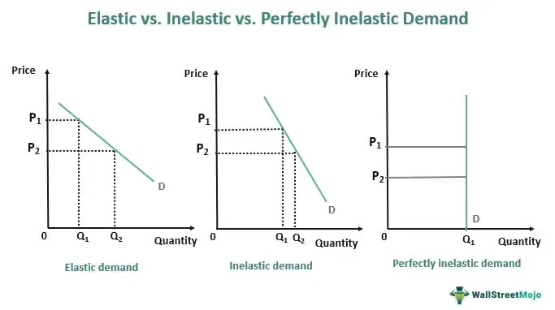

The intersection of quantum mechanics, graph theory, CQG, and algorithmic trading represents an exciting frontier in the financial sector. This integration of cutting-edge technologies is revolutionizing trading strategies, providing a new paradigm for market analysis and decision-making. At its core, this intersection leverages the computational power of quantum computing, the structural insights of graph theory, and the sophisticated functionalities of CQG (Continuum Global Solutions), a trading platform renowned for its advanced market data and analysis tools.

Quantum computing introduces concepts such as qubits, superposition, and entanglement. Unlike classical bits, qubits can exist simultaneously in multiple states, enabling profound advancements in data processing capabilities. This is particularly beneficial in financial markets, where vast amounts of data must be analyzed rapidly to identify profitable trading opportunities. The implications are vast, from enhancing speed and accuracy in financial modeling to offering robust solutions for encryption and data security challenges faced in today’s markets.



Graph theory, a branch of mathematics focused on the properties of graphs, finds significant applicability in modeling complex financial systems. It aids in predicting market trends and optimizing trading paths, providing traders with a framework to decipher interconnections and relationships within market data. By employing graph theoretical models, traders can visualize and anticipate market movements, leading to more informed and strategic trading decisions.

CQG stands as a pivotal tool in this technological amalgamation. Its suite of offerings, including advanced trade routing, real-time market data, and comprehensive analysis tools, provide a seamless interface for implementing high-frequency algorithmic trades. By integrating with advanced algorithms, traders can execute strategies with precision and reduced latency, thus optimizing performance.

The synthesis of quantum computing and graph theory within the CQG ecosystem promises unprecedented enhancements in trade execution, efficiency, and market insights. This convergence not only empowers traders with novel analytical capabilities but also paves the way for innovative trading methodologies that push beyond current limitations. Through the application of these advanced technologies, traders are equipped to navigate the complexities of modern markets with greater agility and foresight, transforming the landscape of algorithmic trading and setting a new standard for future developments.

## Table of Contents

## Understanding Quantum Mechanics in Trading

Quantum computing represents a paradigm shift from classical computing by harnessing the principles of quantum mechanics. At its core are qubits, which are the basic units of quantum information. Unlike classical bits that exist in a binary state of 0 or 1, qubits exploit the superposition principle, allowing them to exist in a combination of states simultaneously. This intrinsic property exponentially expands the computational capabilities of quantum systems as compared to classical computers. Moreover, quantum entanglement, a phenomenon where qubits become interconnected such that the state of one qubit can instantaneously influence another, offers opportunities for complex, parallelized data processing.

In the context of trading, these quantum principles can significantly enhance data processing and analysis. The superposition property facilitates the simultaneous examination of multiple market scenarios, potentially leading to faster and more comprehensive assessments of trading strategies. For instance, a quantum algorithm can evaluate complex option pricing models or simulate entire financial markets in a fraction of the time required by classical algorithms. The parallelism inherent in quantum computing could improve the efficiency of analyzing vast datasets and optimizing portfolio allocations by finding global optima in complex, multi-variable systems.

Furthermore, quantum computing has profound implications for encryption and data security within financial markets. Current cryptographic protocols are primarily based on the difficulty of factoring large numbers or solving discrete logarithms, tasks that classical computers find infeasible. However, quantum algorithms, such as Shor's algorithm, can perform integer factorization exponentially faster, posing a threat to existing encryption schemes. As a result, there is a growing interest in quantum-resistant algorithms that can safeguard sensitive financial information in this new computational era.

Quantum computing, therefore, stands to revolutionize trading not just through enhanced computational power, but by reshaping the foundations of data security and encryption, necessitating a reevaluation of both strategies and protocols within financial markets.

## Graph Theory and Algorithmic Trading

Graph theory is a branch of mathematics that studies the relationships between objects, which is particularly useful in modeling and analyzing complex financial systems. It represents financial markets as networks or graphs, where the nodes might signify financial instruments, and the edges between these nodes can represent various relationships such as transactions, correlations, or influence among assets. This abstraction allows for the application of numerous mathematical tools and algorithms to uncover patterns and predict market behavior.

One primary application of graph theory in trading is the prediction of market trends. This can be achieved through techniques such as community detection and clustering, where markets or sections of them are divided into communities of highly correlated assets. By identifying how these communities interact and evolve over time, traders can predict shifts in market trends. For example, a trader may observe that a particular community of assets is starting to move together in a certain direction, which could indicate a broader market shift.

Graph theory also enables the optimization of trading paths through techniques like the shortest path algorithm. In [algorithmic trading](/wiki/algorithmic-trading), where speed and efficiency are paramount, determining the optimal trading path can significantly reduce transaction costs and execution time. By using graph theory models, traders can optimize the sequence and timing of trades to minimize costs and maximize returns.

Integrating graph theory with quantum algorithms presents an opportunity to enhance decision-making processes in trading. Quantum algorithms, with their ability to process information in parallel and handle complex calculations more efficiently than classical counterparts, can solve graph-based problems at significantly increased speeds. For instance, quantum algorithms can efficiently solve optimization problems like the Max-Cut problem, which is applicable in portfolio optimization where the goal is to divide a set of securities into two groups to minimize correlation and risk.

Here is a Python example illustrating a simple application of graph theory in algorithmic trading to model and analyze financial networks using the `networkx` library:

```python
import networkx as nx

# Create a directed graph
G = nx.DiGraph()

# Add nodes representing financial assets
G.add_nodes_from(["Stock A", "Stock B", "Stock C", "Stock D"])

# Add edges with weights representing transaction relationships or correlations
G.add_edge("Stock A", "Stock B", weight=0.5)
G.add_edge("Stock B", "Stock C", weight=0.8)
G.add_edge("Stock A", "Stock C", weight=0.1)
G.add_edge("Stock C", "Stock D", weight=0.3)

# Analyze the shortest path for optimal trading path from Stock A to Stock D
shortest_path = nx.shortest_path(G, source="Stock A", target="Stock D", weight='weight')
print("Shortest path from Stock A to Stock D:", shortest_path)
```

This code snippet setups a directed graph of stocks and identifies the optimal (shortest-weighted) path from one stock to another, illustrating how graph theory can simplify complex decision-making tasks in trading.

In summary, graph theory's ability to model and analyze complex interdependencies makes it a valuable tool in predicting market trends and optimizing trading strategies. Its integration with advanced computational techniques like quantum algorithms offers promising enhancements to existing algorithmic trading models, potentially leading to faster, more accurate trading decisions.

## The Role of CQG in Modern Trading

CQG, Inc. is recognized as a leading provider of sophisticated trading solutions designed to meet the needs of modern financial markets. It delivers a range of tools and services focused on enhancing the trading experience through advanced technology. Among its core offerings are trade routing capabilities, comprehensive market data services, and robust analysis tools, all of which are tailored to support and optimize trading strategies for various market participants.

Trade routing is a prominent feature of CQG's services, allowing traders to efficiently execute orders across global markets. By leveraging a network of alliances with major exchanges and market centers, CQG ensures that orders are routed swiftly and accurately, minimizing execution times and slippage. This capability is crucial for traders engaged in high-frequency trading ([HFT](/wiki/high-frequency-trading-strategies)), where success is measured in milliseconds, and any delay can result in substantial financial loss.

Alongside trade routing, CQG provides access to extensive market data, which is vital for informed decision-making. Real-time data feeds are delivered with a high degree of reliability and minimal latency, covering a broad spectrum of asset classes including equities, commodities, and derivatives. This data allows traders to conduct thorough market analyses and develop strategies based on the latest market movements and trends. Advanced charting tools and technical indicators included in CQG's platform further enhance the analysis process, enabling traders to visualize market dynamics and identify potential trading opportunities.

One of the significant benefits of CQG's platform is its seamless integration with advanced trading algorithms. CQG provides a robust API, allowing developers to connect algorithmic trading models directly to the platform. This integration supports the automation of complex trading strategies, enabling real-time deployment and execution without manual intervention. By harnessing the power of automated trading, traders can perform rapid analysis and react instantly to market changes, which is essential in maintaining a competitive edge in high-speed trading environments.

The use of CQG technology in executing high-frequency algorithmic trades offers several advantages. First, the streamlined trade routing and low-latency data delivery allow algorithms to function at optimal speeds, ensuring orders are placed ahead of market movements. Second, the reliability and accuracy of CQG’s market data reduce the risk of erroneous trades due to outdated or incorrect information. Finally, the integration with advanced analytical tools empowers traders to refine their algorithms further, adapting to new trends and patterns in the market.

In conclusion, CQG's offerings of trade routing, market data, and analysis tools constitute vital components in modern trading strategies, especially for high-frequency and algorithmic traders. Its ability to integrate with cutting-edge trading algorithms helps maintain efficiency and accuracy in trading operations, providing users with a technology-forward approach to navigating the complexities of contemporary financial markets.

## Integrating Quantum Mechanics and Graph Theory with CQG

The integration of quantum mechanics and graph theory with CQG tools offers significant potential for revolutionizing algorithmic trading. Utilizing the advanced capabilities of quantum computing, such as superposition and entanglement, combined with the robust modeling techniques of graph theory, this integration aims to enhance trading strategies by increasing computational efficiency and improving decision-making processes.

**Potential of Integration:**

Quantum mechanics, with its ability to process complex datasets through quantum algorithms, can significantly reduce the computation time required for analyzing massive volumes of trading data. This capability is particularly crucial in high-frequency trading environments where speed and accuracy are paramount. Quantum computing algorithms, such as Grover's search algorithm, can optimize search processes, thus expediting the identification of profitable trading opportunities within CQG’s datasets.

Graph theory complements this by providing a structure to model the intricate networks within financial markets. By representing market elements as nodes and their interactions as edges, traders can visualize and interpret complex relationships. This is especially beneficial for identifying trends and potential points of market disruption, which can be quickly analyzed using quantum-enhanced algorithms.

**Real-World Scenarios and Benefits:**

Consider a scenario where a trading firm employs a quantum algorithm combined with graph theory to analyze market sentiment data retrieved through CQG's data feed. The quantum algorithm could efficiently process and visualize sentiment data, allowing the trading firm to preemptively adjust its strategies in response to market shifts. This integration could lead to improved prediction accuracy for market movements, optimizing trade execution timing and reducing slippage.

In another example, the integration could assist in developing more precise risk management strategies. Quantum algorithms can quickly calculate Value at Risk (VaR) for complex portfolios, while graph theory helps map and analyze intricate asset correlations and dependencies. Together with CQG's advanced analytical tools, traders gain comprehensive insights into potential risks and optimal mitigation strategies.

**Impact on Trade Execution and Market Insights:**

The cohesive integration of these technologies within the CQG ecosystem promises to enhance trade execution efficiency by minimizing latency issues. Quantum-enhanced algorithms can swiftly react to real-time market data, facilitating quicker execution of trades with reduced manual intervention. This speed not only improves the profitability of trades but also enhances the trader's ability to exploit fleeting market opportunities.

Moreover, the fusion of these disciplines can generate deeper market insights. For instance, graph-based models showcase the topology of market dynamics and [liquidity](/wiki/liquidity-risk-premium) flows. When processed by quantum systems, these models can reveal hidden patterns and correlations, leading to sophisticated trading strategies that adapt to evolving market conditions with greater precision.

In conclusion, the synergy of quantum mechanics with graph theory within the CQG framework has the potential to transform algorithmic trading by delivering high-performance solutions that address the critical needs of speed, accuracy, and insightful analysis in modern financial markets.

## Challenges and Future Directions

Adopting quantum and graph-based methodologies in trading presents notable challenges. One significant obstacle is the current limitations of quantum computing hardware. Quantum computers are still in nascent stages, with qubits prone to errors and decoherence. This instability can complicate the deployment of quantum algorithms in real-time trading environments, where precision and speed are imperative. Developing error-correction mechanisms and stability enhancements remains a crucial field of study to ensure the reliable use of quantum computing in financial markets.

Graph theory, while offering powerful tools for modeling and predicting market behaviors, faces challenges in processing vast and dynamic datasets typical of financial systems. The integration of graph-based algorithms with existing trading platforms needs optimization to manage the large-scale computations within time-sensitive trading windows. Ensuring compatibility with established systems and minimizing computational latency are key concerns.

Future technological advancements hold promise in overcoming these hurdles. Quantum hardware is expected to become more robust and accessible, enhancing its practical applicability in trading. Quantum advantage, where quantum computers outperform classical counterparts, could revolutionize data analysis in trading. Simultaneously, advancements in [machine learning](/wiki/machine-learning) may synergize with graph theory to provide enhanced predictive analytics and decision-making capabilities, allowing traders to navigate complex market conditions more effectively.

Regulatory frameworks will play a vital role in the adoption and application of these technologies. As quantum computing and graph theory methodologies gain traction, regulatory bodies must establish guidelines to ensure investor protection and market integrity. These include setting standards for data handling and maintaining transparency in algorithmic decision-making processes.

Furthermore, cybersecurity measures are imperative in protecting sensitive trading data. The potential vulnerability of quantum algorithms to novel cyber threats requires robust encryption and security frameworks. With the advent of quantum-resistant algorithms, financial institutions must prepare to defend against potential breaches, safeguarding both proprietary trading strategies and confidential market information.

In conclusion, while challenges in implementing quantum and graph-based methodologies in trading are evident, future technological advancements promise to address these issues. Regulatory and cybersecurity frameworks must evolve in tandem to support these innovations, ensuring that they contribute positively to the trading landscape.

## Conclusion

The integration of quantum mechanics, graph theory, and CQG into algorithmic trading has the potential to fundamentally alter the dynamics of financial markets. Quantum computing introduces concepts such as qubits, superposition, and entanglement, which allow for unprecedented processing speeds and data analysis capabilities. These tools can drastically expedite complex computations and optimize decision-making processes in real-time trading environments, providing a significant edge over classical computing techniques.

Graph theory offers a sophisticated framework for modeling the intricate web of relationships within financial networks. Its use in identifying optimal trading paths and predicting market trends can improve the precision and reliability of trading algorithms. When combined with the quantum algorithms capable of processing vast amounts of data simultaneously, traders can experience enhanced analytical capabilities, making more informed and strategic decisions.

CQG's robust platform, renowned for its trade routing, market data provision, and analytical tools, serves as the ideal foundation for integrating these emerging technologies. By leveraging CQG's seamless connectivity and advanced functionalities, traders can execute high-frequency trades with remarkable accuracy and minimal latency, while also harnessing the full potential of quantum computing and graph theory. This integration provides a competitive advantage by enhancing trade execution efficiency, reducing errors, and generating actionable market insights.

The synergy between quantum mechanics, graph theory, and CQG technology represents a transformative leap in algorithmic trading. As these technologies continue to evolve, they promise to reshape the trading landscape, enabling traders to navigate markets with greater speed, precision, and insight. The future of trading will likely be defined by these cutting-edge innovations, pushing the boundaries of what is possible in financial markets.

## References & Further Reading

[1]: Preskill, J. (2018). ["Quantum Computing in the NISQ era and beyond."](https://arxiv.org/abs/1801.00862) Quantum 2, 79.

[2]: Childs, A. M., & van Dam, W. (2010). ["Quantum Algorithms for Algebraic Problems."](https://link.aps.org/doi/10.1103/RevModPhys.82.1) Reviews of Modern Physics.

[3]: Newman, M. E. J. (2010). ["Networks: An Introduction."](https://academic.oup.com/book/27303) Oxford University Press.

[4]: Farrelly, T. (2020). ["A Review of Quantum Algorithms."](https://quantum-journal.org/papers/q-2020-11-30-368/) Communications in Mathematical Physics.

[5]: Stein, C., & Steiglitz, K. (2021). ["Algorithmic Trading: Advanced Concepts and Techniques."](https://www.semanticscholar.org/paper/Combinatorial-Optimization:-Algorithms-and-Papadimitriou-Steiglitz/1565c128b727550a73bc4e105a3353420112485d) John Wiley & Sons.

[6]: Nielsen, M. A., & Chuang, I. L. (2010). ["Quantum Computation and Quantum Information."](https://www.cambridge.org/highereducation/books/quantum-computation-and-quantum-information/01E10196D0A682A6AEFFEA52D53BE9AE) Cambridge University Press.

[7]: Mantegna, R. N., & Stanley, H. E. (1999). ["Introduction to Econophysics: Correlations and Complexity in Finance."](https://assets.cambridge.org/052162/0082/sample/0521620082WS.pdf) Cambridge University Press.