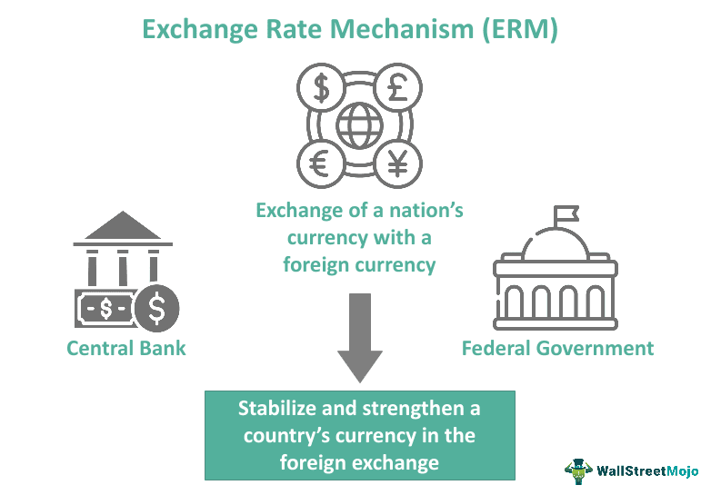

The modern financial markets are undergoing a transformative shift, increasingly characterized by advanced trading mechanisms that enhance efficiency and speed. At the forefront of this evolution are continuous trading and algorithmic trading (algo trading), which have fundamentally changed how securities are bought and sold. Continuous trading enables the seamless execution of orders throughout the trading day, as opposed to batch processing, which occurs at discrete intervals. This method is crucial for maintaining liquidity and market efficiency, allowing instantaneous matching of buy and sell orders.

Algorithmic trading, on the other hand, involves sophisticated software algorithms that execute trades based on pre-set criteria. This level of automation introduces both speed and precision, minimizing human error and removing emotional bias from trading decisions. Algo trading has grown in prominence, being a significant force in global markets due to its capacity to handle vast volumes of trades quickly.



This article aims to explore the key concepts of continuous trading, the various mechanisms by which trading is conducted, and the pivotal role that algorithmic trading plays in today's financial landscape. We will examine the operational dynamics of these systems and their impact on market efficiency and trading behaviors. By providing a comprehensive overview, this article seeks to enhance understanding of these critical components of modern financial markets, highlighting their significance and the challenges they introduce. Through this exploration, we emphasize the importance of staying informed on these developments for those engaged in or affected by financial markets.

## Table of Contents

## Understanding Continuous Trading

Continuous trading is a fundamental mechanism of modern financial markets, allowing for the execution of security orders throughout the trading day continuously. This contrasts with batch trading, where orders are accumulated and processed at specific times. Continuous trading is prevalent in major stock exchanges worldwide, including the New York Stock Exchange (NYSE) and the London Stock Exchange (LSE).

The primary advantage of continuous trading lies in its ability to ensure swift execution of buy and sell orders, which is vital for maintaining liquidity and market efficiency. By enabling trades to occur at any time during market hours, it allows prices to adjust in real-time to new information, reducing price volatility that might occur when trades are batched.

In continuous trading, orders can be placed as market orders, where the transaction is executed immediately at the current market price, or as limit orders, where the trade is only executed if the market reaches a specified price. The immediacy of market orders in continuous trading ensures that participants can quickly respond to market movements. Limit orders allow traders to target specific price levels, providing a mechanism to manage risk and optimize trading outcomes.

Major exchanges implement continuous trading using advanced electronic systems. These systems match buy and sell orders in real-time, employing sophisticated algorithms to ensure the best possible execution prices. The architecture of these systems is designed to handle thousands of trades per second, supporting the demands of high-frequency trading and other advanced trading strategies.

Market makers play a crucial role in facilitating continuous trading. They provide [liquidity](/wiki/liquidity-risk-premium) by continuously quoting buy and sell prices for securities, ensuring that there is always a counterparty available for a trade. This activity helps narrow the bid-ask spread, making it cheaper for investors to buy and sell securities and contributing to overall market efficiency.

While continuous trading has many benefits, it also presents challenges such as increased complexity and the need for robust trading infrastructure. Exchanges must balance speed and accuracy, ensuring that their systems can handle the large volumes of transactions typical of continuous trading environments without errors or delays.

Overall, continuous trading is essential for the smooth functioning of modern financial markets. By providing a platform where trades can occur seamlessly throughout the day, it supports the dynamic nature of trading activities, contributing to effective price discovery and enhanced liquidity.

## Key Trading Mechanisms in Financial Markets

Financial markets employ a range of trading mechanisms designed to facilitate the smooth and efficient exchange of securities between buyers and sellers. These mechanisms vary in complexity and are tailored to serve different functions and advantages, primarily ensuring liquidity, transparency, and fairness in market operations.

Market orders represent one of the simplest and most direct forms of trading. They are instructions to buy or sell a security immediately at the best available current price. The primary advantage of market orders is their execution speed, as they guarantee the order's execution but not its price, which can be beneficial in fast-moving markets. However, this speed comes with a trade-off against price certainty, leading potential exposure to market [volatility](/wiki/volatility-trading-strategies).

Limit orders, in contrast, specify the maximum or minimum price at which an investor is willing to buy or sell a security. This conditional instruction ensures that a trade will only occur at the pre-set limit price or better. While limit orders provide price protection, they may not always be executed if the market never reaches the specified limit price. This can prove advantageous in volatile markets where rapid price fluctuations could otherwise lead to adverse trade execution for the investor.

Conditional orders, such as stop-loss and stop-limit orders, add further sophistication by incorporating criteria that trigger the order based on specific market conditions. A stop-loss order becomes a market order when the designated stop price is reached, thereby helping to protect against further losses in a declining market. Meanwhile, a stop-limit order combines characteristics of both stop and limit orders, providing a targeted mechanism to control both risk exposure and acceptable trading price.

Batch trading and continuous trading serve as collective trade execution systems with contrasting methodologies. Batch trading groups multiple orders and processes them at predetermined intervals. This approach can help stabilize prices by lessening the impact of sudden market moves and is often used in less liquid markets. Continuous trading, however, allows for the execution of trades in real-time throughout the trading day. It provides increased liquidity and immediate order fulfillment, reflecting real-time price movements and generally enhancing market efficiency. 

The efficiency and fairness of trading mechanisms are vital for healthy market dynamics. Trading mechanisms ensure fair pricing by facilitating the matching of buy and sell orders effectively, thereby reducing bid-ask spreads. This efficiency is critical for maintaining market liquidity, which in turn reduces volatility. However, the choice and execution of specific order types can influence market behavior significantly. For example, large volumes of market orders in a volatile market may lead to rapid price swings, whereas strategic use of limit orders can provide stability by anchoring prices around specified limits.

Ultimately, trading mechanisms are designed not just to facilitate transactions, but also to support the broader economic function of price discovery and market equilibrium. By balancing the multiple needs of speed, efficiency, and risk management, these mechanisms help maintain a robust and resilient financial market structure.

## Algorithmic Trading: Overview and Importance

Algorithmic trading, often abbreviated as algo trading, utilizes complex software algorithms to automate the process of trading securities based on predetermined criteria. This practice has significantly transformed financial markets by introducing speed, efficiency, and the elimination of human emotions from trading decisions.

The fundamentals of [algorithmic trading](/wiki/algorithmic-trading) are rooted in the development of computer technology and quantitative finance. Initially, trading decisions were made manually by traders on exchange floors, but the advent of electronic trading platforms has paved the way for algorithmic systems. These systems can analyze multiple markets and execute trades at speeds that exceed human capability, often in fractions of a second.

One of the main advantages of algorithmic trading is its ability to execute orders with speed and precision that humans cannot match. Algorithms can process vast amounts of data in real time, identifying trading opportunities and executing trades based on complex mathematical models. This speed allows traders to capitalize on fleeting market opportunities, often before human traders are even aware of them.

Moreover, algorithmic trading minimizes the impact of human emotions, such as fear and greed, which can adversely affect trading decisions. By sticking to predefined rules and strategies, algorithms ensure that trading is consistent and less prone to the psychological biases that often influence human traders.

Several common strategies are employed in algorithmic trading, each with specific objectives and methods. High-frequency trading ([HFT](/wiki/high-frequency-trading-strategies)) is one such strategy, focusing on executing a large number of orders at extremely high speeds. These trades often capitalize on small price discrepancies across different markets or securities. For example, if a stock is slightly underpriced in one market and overpriced in another, an algorithm can quickly buy in the cheaper market and sell in the more expensive one, profiting from the price difference.

Another popular strategy is trend-following, where algorithms analyze historical price movements to identify and trade in the direction of established market trends. These algorithms might use technical indicators such as moving averages to determine trend direction and generate trading signals.

The importance of data analysis in algorithmic trading cannot be overstated. Algorithms rely on historical and real-time data to make informed trading decisions. Tools and software are used to backtest strategies on historical data to ensure their viability before deployment in live markets. This rigorous testing process includes simulating trades and assessing a strategy's performance across various market conditions.

Data analysis is complemented by advancements in technology, providing algorithms with real-time information from various sources. These sources include price feeds, news articles, social media, and economic reports, allowing algorithms to assess the market's state and adapt their strategies quickly.

As algorithmic trading continues to evolve, its role in shaping global markets becomes increasingly significant. Advances in [machine learning](/wiki/machine-learning) and [artificial intelligence](/wiki/ai-artificial-intelligence) are driving the development of more sophisticated algorithms capable of learning from data patterns and improving their performance over time. This evolution enhances the ability of traders and institutions to navigate complex financial landscapes, making algorithmic trading a critical component of modern market operations.

## Popular Algo Trading Strategies and Tools

Algorithmic trading has revolutionized the way transactions are executed in financial markets by automating buying and selling processes based on well-defined criteria. Several strategies underpin algorithmic trading, offering varying levels of complexity and effectiveness.

### Trend-Following

Trend-following is a straightforward yet widely adopted algo trading strategy. It capitalizes on the inertia in price [momentum](/wiki/momentum), assuming that assets moving in a specific direction will continue to do so. Technical indicators like moving averages are commonly utilized to identify trends. For instance, a simple moving average crossover strategy may involve buying an asset when a short-term moving average surpasses a long-term average and selling when the reverse occurs.

```python
# Python code for a simple moving average crossover strategy
import pandas as pd

# Example stock price data (closing prices)
data = {'Price': [101, 102, 103, 108, 110, 112, 115, 113, 110, 108]}
df = pd.DataFrame(data)

# Calculate moving averages
df['Short_MA'] = df['Price'].rolling(window=3).mean()
df['Long_MA'] = df['Price'].rolling(window=5).mean()

# Generate buy/sell signals
signals = []
for i in range(len(df)):
    if df['Short_MA'].iloc[i] > df['Long_MA'].iloc[i]:
        signals.append('Buy')
    else:
        signals.append('Sell')
df['Signal'] = signals

print(df)
```

### Mean Reversion

The mean reversion strategy is predicated on the notion that asset prices fluctuate around a mean or average price level. Therefore, deviations from this average are seen as opportunities to trade. When the price veers too far from the mean, it’s expected to revert, allowing traders to capitalize on the anticipated correction. Tools like Bollinger Bands are frequently employed to set entry and [exit](/wiki/exit-strategy) points based on statistical volatility.

### Statistical Arbitrage

Statistical [arbitrage](/wiki/arbitrage), or stat arb, leverages statistical methods to exploit pricing inefficiencies between related financial instruments. This approach often involves complex mathematical models and necessitates high transaction speeds and volumes. Pairs trading is a common form, where two historically correlated assets are traded against each other to capture any divergence in their price relationship.

### Trading Platforms and Tools

Numerous platforms support algorithmic trading, ranging from general-purpose environments like Python and R, equipped with statistical libraries, to specialized trading platforms such as MetaTrader and QuantConnect. These platforms offer essential features like data feed integration, real-time trading simulation, and extensive [backtesting](/wiki/backtesting) capabilities, enabling traders to refine their algorithms before live deployment.

### Backtesting and Risk Management

Backtesting serves as a critical phase in the development of an algorithmic trading system, allowing traders to validate and optimize strategy performance using historical data. It involves simulating trades on past market conditions to ensure the strategy yields satisfactory returns. Effective risk management practices, including stop-loss orders and position sizing, are indispensable to mitigate potential losses.

### Notable Success Stories

Several algorithmic trading strategies have gained notoriety for their success. Renaissance Technologies, a [hedge fund](/wiki/hedge-fund-trading-strategies) known for its Medallion Fund, is famed for deploying complex mathematical models to achieve high returns consistently. Another example is Two Sigma Investments, which employs machine learning and distributed computing technologies to enhance its trading operations.

In summary, understanding and employing varied algorithmic trading strategies can significantly improve trading efficacy. Continued innovation in algorithmic trading tools and techniques will likely advance this field further, offering both opportunities and challenges for market participants.

## Challenges and Future of Trading Mechanisms

Continuous and algorithmic trading are not without their challenges, as they operate in highly dynamic and complex environments. Despite the advantages in speed and efficiency, these trading mechanisms are subject to regulatory scrutiny and risk management issues, primarily due to their potential to induce both market volatility and systemic risks.

Flash crashes are prime examples of the risks associated with high-frequency trading (HFT)—a form of algorithmic trading characterized by extremely rapid trade execution. These events occur when an automated trading activity leads to extreme price volatility, often in a matter of seconds. Once initiated, the rapid sequence of automated trades can amplify market movements, leading to abrupt and significant fluctuations in asset prices. One notable incident occurred on May 6, 2010, when the Dow Jones Industrial Average plunged approximately 1,000 points, only to recover most of the loss within minutes.

Regulatory bodies such as the Securities and Exchange Commission (SEC) in the United States and the European Securities and Markets Authority (ESMA) in Europe actively scrutinize these trading mechanisms. Their evolving regulations aim to mitigate the risks associated with high-speed trading, ensuring market stability and integrity. Measures include implementing circuit breakers, which temporarily halt trading during significant price movements, and mandating minimum resting times for orders, thereby reducing the frequency with which trades can be placed and canceled.

Looking ahead, the landscape of trading mechanisms continues to evolve. The integration of artificial intelligence (AI) in algorithmic strategies is a burgeoning trend. AI-driven algorithms can process vast amounts of data and adapt to dynamic market conditions better than traditional models. This adaptability can enhance decision-making for traders by identifying patterns and trends that might otherwise remain undiscovered to human analysts.

In addition, blockchain technology is poised to revolutionize trading by providing enhanced transparency and security. Blockchain allows for the decentralized recording of transactions, which ensures data integrity and reduces the possibility of fraudulent activity. This innovation could streamline trading operations, increase efficiency, and build trust in the financial markets.

Traders and financial institutions are preparing for these future trends by investing in advanced analytical tools and machine learning capabilities. They are developing robust risk management frameworks to address potential challenges posed by rapid technological advancements. This proactive approach is essential for navigating the complex and fast-evolving world of modern financial markets.

The future of trading mechanisms will likely be shaped by the convergence of technology and regulation, driving both innovation and vigilance. As these mechanisms continue to develop, maintaining a balance between efficiency gains and risk management will be crucial for market participants.

## Conclusion

Continuous trading and algorithmic trading have become essential elements of contemporary financial markets, delivering the speed and efficiency needed in today's fast-paced trading environment. Their integration into market operations has not only optimized the execution of trades but has also resulted in a series of challenges that necessitate diligent handling. These challenges include regulatory concerns, the risk of market disruptions, and technological dependencies.

Understanding these trading mechanisms is crucial for traders and investors aiming to thrive in complex markets. By gaining insight into how continuous and algorithmic trading operate, market participants can better anticipate fluctuations and craft strategies that align with trading trends. The knowledge of these systems serves as a tool to mitigate risks and capitalize on opportunities, thus enhancing one's ability to succeed.

As markets continue to evolve, the role of continuous and algorithmic trading in shaping trading environments remains significant. They represent a dynamic shift towards automation and data-driven decision-making, marking a departure from traditional trading methodologies. This evolution underscores a future where technology and trading are increasingly intertwined, pointing to advancements such as AI-driven trading algorithms and blockchain-based mechanisms.

For investors, staying abreast of these trends is indispensable. The ability to interpret and react to market changes driven by these technologies offers a competitive edge, aiding in making informed investment decisions. By being updated on the latest developments, traders and institutions are better prepared to adapt to the shifting landscape of financial markets, ensuring both resilience and opportunity in navigating future market conditions.

## References & Further Reading

[1]: Aldridge, I. (2013). ["High-Frequency Trading: A Practical Guide to Algorithmic Strategies and Trading Systems."](https://www.amazon.com/High-Frequency-Trading-Practical-Algorithmic-Strategies/dp/1118343506) Wiley.

[2]: Narang, R. K. (2013). ["Inside the Black Box: A Simple Guide to Quantitative and High-Frequency Trading."](https://onlinelibrary.wiley.com/doi/book/10.1002/9781118662717) Wiley.

[3]: Bouchaud, J.-P., & Potters, M. (2003). ["Theory of Financial Risk and Derivative Pricing: From Statistical Physics to Risk Management."](https://www.cambridge.org/core/books/theory-of-financial-risk-and-derivative-pricing/5BBBA04CE72ED9E5E7C1C028D9A94FCB) Cambridge University Press.

[4]: Hasbrouck, J. (2007). ["Empirical Market Microstructure: The Institutions, Economics, and Econometrics of Securities Trading."](https://archive.org/details/empiricalmarketm0000hasb) Oxford University Press.

[5]: Cartea, Á., Jaimungal, S., & Penalva, J. (2015). ["Algorithmic and High-Frequency Trading."](https://assets.cambridge.org/97811070/91146/frontmatter/9781107091146_frontmatter.pdf) Cambridge University Press.