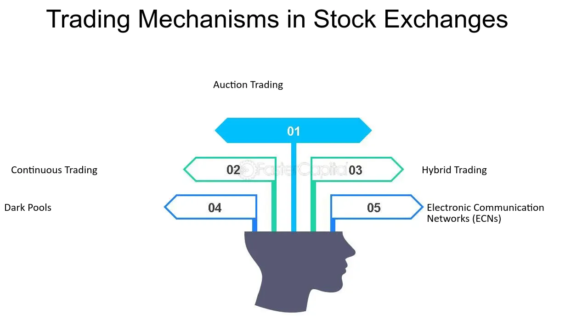

## Table of Contents

## What is continuous trading?

Continuous trading is a method used in stock markets where buying and selling of stocks happens all the time during the trading day. Instead of waiting for specific times to trade, people can make trades whenever they want, as long as the market is open. This makes it easier for people to buy and sell stocks quickly, and it helps keep the market active and lively.

In continuous trading, the prices of stocks can change a lot because they are based on what people are willing to pay at that moment. If more people want to buy a stock, its price might go up. If more people want to sell, the price might go down. This system helps make sure that the prices of stocks are fair and reflect what people think they are worth right now.

## How does continuous trading differ from traditional trading sessions?

Continuous trading and traditional trading sessions work differently. In traditional trading, there are set times when people can buy and sell stocks. These times are called trading sessions, and they usually happen at specific times during the day. For example, a stock market might open for trading at 9 AM and close at 4 PM, and you can only trade during those hours. During these sessions, all the buy and sell orders are collected and matched at certain times, which can lead to big changes in stock prices when the market opens or closes.

On the other hand, continuous trading lets people buy and sell stocks all day long, as long as the market is open. There are no set times for trading; you can make a trade whenever you want. This means that the prices of stocks can change more smoothly and frequently because they are always being updated based on what people are willing to pay at that moment. Continuous trading can make the market more active and can help people react quickly to news or changes in the market.

## What are the key mechanisms that facilitate continuous trading?

The main thing that makes continuous trading work is something called an [order book](/wiki/order-book-trading-strategies). An order book is like a list that keeps track of all the buy and sell orders people want to make. When someone wants to buy or sell a stock, their order goes into this list. The order book matches buyers with sellers based on the prices they are willing to pay or accept. If someone wants to buy a stock at a price that someone else is willing to sell it for, the trade happens right away. This matching happens all the time, which is why it's called continuous trading.

Another important part of continuous trading is the use of electronic trading platforms. These are computer systems that let people trade stocks from anywhere, as long as they have an internet connection. These platforms can handle a lot of trades very quickly, which makes continuous trading possible. They also show real-time information about stock prices and the order book, so people can make smart decisions about when to buy or sell. Together, the order book and electronic trading platforms make it easy for people to trade stocks all day long.

## Can you explain the role of electronic trading platforms in continuous trading?

Electronic trading platforms play a big role in making continuous trading work. They are like special computer programs that let people buy and sell stocks from anywhere, as long as they have an internet connection. These platforms can handle lots of trades very quickly, which is important for continuous trading because it means people can trade all day long without waiting. They also show real-time information about stock prices and the order book, which is a list of all the buy and sell orders people want to make. This helps people see what is happening in the market right now, so they can decide when to buy or sell.

Another way electronic trading platforms help with continuous trading is by making the process of matching buyers and sellers easier and faster. When someone wants to buy a stock, their order goes into the order book on the platform. If there is someone who wants to sell the stock at the price the buyer is willing to pay, the platform matches them up, and the trade happens right away. This matching happens all the time, which is what makes trading continuous. Without these electronic platforms, it would be much harder to keep the market active and lively all day long.

## What are the benefits of continuous trading for individual investors?

Continuous trading gives individual investors more freedom and flexibility. They can buy and sell stocks whenever they want during the trading day, not just at specific times. This means they can react quickly to news or changes in the market. For example, if a company announces good news, investors can buy its stock right away without waiting for a trading session to start. This can help them take advantage of opportunities as soon as they come up.

Another benefit is that continuous trading can lead to fairer prices for stocks. Because trades happen all the time, the prices of stocks are always being updated based on what people are willing to pay at that moment. This means that the prices are more likely to reflect what the stock is really worth right now. For individual investors, this can make it easier to buy and sell stocks at prices they feel are fair. Plus, because the market is more active, it can be easier to find someone to trade with, which means less waiting and more trading.

## How does continuous trading impact market liquidity?

Continuous trading makes the market more liquid. Liquidity means how easy it is to buy or sell something without affecting its price too much. In continuous trading, people can trade all day long, so there are always buyers and sellers ready to make trades. This means that if you want to buy or sell a stock, you can usually find someone to trade with right away. This makes it easier for people to get in and out of their investments quickly, which is good for the overall health of the market.

Because trades happen all the time in continuous trading, the market stays active and lively. When the market is active, there are more chances for people to trade, which means more [liquidity](/wiki/liquidity-risk-premium). If the market were only open for short periods, like in traditional trading sessions, people might have to wait longer to make a trade. This could make the market less liquid because there would be fewer chances to buy and sell. So, continuous trading helps keep the market liquid by making it easier for people to trade whenever they want.

## What are the potential risks associated with continuous trading?

Continuous trading can make the market more exciting and active, but it also comes with some risks. One big risk is that prices can change a lot and very quickly. Because people can trade all day long, news or rumors can cause big swings in stock prices. This can be scary for investors because their investments can lose value fast. It can also make it hard for them to make good decisions because they might feel pressured to act quickly.

Another risk is that continuous trading can make the market more complicated. With trades happening all the time, it can be harder for people to keep track of what's going on. This can be especially tough for new investors who might not understand everything that's happening. Also, because the market is always open, people might feel like they need to watch it all the time, which can be stressful and lead to bad decisions.

## How do regulatory bodies monitor and manage continuous trading?

Regulatory bodies keep a close eye on continuous trading to make sure everything is fair and safe for investors. They use special computer systems and rules to watch the market all the time. These systems can spot strange trading patterns or big price changes that might be signs of problems, like people trying to cheat or make the market go up or down on purpose. If they see something that doesn't look right, they can step in and do things like stop trading for a while or ask for more information from the people involved.

Besides watching the market, regulatory bodies also make rules that everyone has to follow. These rules are there to stop bad behavior and protect investors. For example, they might set limits on how much the price of a stock can change in a short time, or they might require people to report big trades. By making and enforcing these rules, regulatory bodies help keep the market honest and make sure that continuous trading works well for everyone.

## What advanced strategies can traders employ in a continuous trading environment?

In a continuous trading environment, traders can use a strategy called [scalping](/wiki/gamma-scalping). Scalping means making lots of small trades throughout the day to take advantage of tiny changes in stock prices. Traders who use this strategy need to be quick and pay close attention to the market all the time. They might use special computer programs to help them find the best times to buy and sell. This strategy can be good for making small profits often, but it can also be risky because the market can change quickly.

Another strategy is algo-trading, which stands for [algorithmic trading](/wiki/algorithmic-trading). This is when traders use computer programs, called algorithms, to make trades automatically. These programs can look at lots of information very quickly and make decisions based on what they see. Traders might use algo-trading to buy and sell stocks at the best possible prices or to take advantage of patterns in the market. It's a bit like having a smart robot that trades for you, but you need to be careful because the market can still surprise you.

Traders can also use a strategy called high-frequency trading ([HFT](/wiki/high-frequency-trading-strategies)). This is a type of algo-trading where trades happen very fast, often in fractions of a second. High-frequency traders use powerful computers to buy and sell stocks quickly, hoping to make small profits from tiny price changes. This strategy can be very profitable, but it also needs a lot of technology and can make the market more volatile. It's important for traders to understand these risks and have good systems in place to manage them.

## How does continuous trading affect global financial markets?

Continuous trading has made global financial markets more connected and active. Because people can trade all day long, markets in different countries can influence each other more easily. For example, if something big happens in the U.S. market, it can affect markets in Europe and Asia right away, even if it's the middle of the night there. This means that news and events can have a bigger and faster impact on stock prices around the world. It also means that investors need to pay attention to what's happening in other countries, not just their own.

Another way continuous trading affects global financial markets is by making them more liquid. When markets are open all the time, it's easier for people to buy and sell stocks whenever they want. This makes it easier for investors from different countries to trade with each other, which can help keep the market moving smoothly. But it also means that the market can be more unpredictable because prices can change quickly. So, while continuous trading can make the market more lively and easier to trade in, it also comes with more risks that investors need to be aware of.

## What technological infrastructure is required to support continuous trading?

To support continuous trading, you need a strong technological setup. This includes powerful computers and servers that can handle a lot of trades very quickly. These computers need to be connected through fast and reliable internet connections so that people can trade from anywhere. The systems also need to be able to process a lot of information at the same time, like keeping track of all the buy and sell orders in the order book and updating stock prices in real-time. Without this kind of technology, it would be hard to keep the market open and active all day long.

Another important part of the technological infrastructure is the software that runs the electronic trading platforms. This software needs to be very good at matching buyers and sellers and making sure trades happen smoothly and fairly. It also needs to be safe and secure, so that people's information and money are protected. The software should be able to handle lots of users at the same time and keep working even if something goes wrong. All of these things together help make continuous trading possible and keep the market running smoothly.

## What future developments might we see in continuous trading mechanisms and their implications?

In the future, continuous trading might get even better with new technology. One thing we might see is more use of [artificial intelligence](/wiki/ai-artificial-intelligence) (AI) and [machine learning](/wiki/machine-learning). These technologies can help traders make smarter decisions by looking at a lot of data very quickly. They can find patterns in the market that people might miss and help make trades happen faster. Another possible development is the use of blockchain technology. Blockchain can make trading more secure and transparent, which means it's easier to trust that trades are fair and that no one is cheating. These new technologies could make continuous trading even more efficient and safe for everyone.

The implications of these future developments could be big. With AI and machine learning, the market might become more predictable, but it could also become more complicated for regular people to understand. Traders who use these technologies might have an advantage, which could make the market more competitive. On the other hand, blockchain could help build more trust in the market, which is good for everyone. It could also make it easier for people from different countries to trade with each other, making the market more global. Overall, these changes could make continuous trading more exciting and active, but they also come with new challenges that people will need to figure out.

## References & Further Reading

[1]: Aldridge, I. (2013). ["High-Frequency Trading: A Practical Guide to Algorithmic Strategies and Trading Systems."](https://www.amazon.com/High-Frequency-Trading-Practical-Algorithmic-Strategies/dp/1118343506) Wiley.

[2]: Narang, R. K. (2013). ["Inside the Black Box: A Simple Guide to Quantitative and High-Frequency Trading."](https://onlinelibrary.wiley.com/doi/book/10.1002/9781118662717) Wiley.

[3]: Bouchaud, J.-P., & Potters, M. (2003). ["Theory of Financial Risk and Derivative Pricing: From Statistical Physics to Risk Management."](https://www.cambridge.org/core/books/theory-of-financial-risk-and-derivative-pricing/5BBBA04CE72ED9E5E7C1C028D9A94FCB) Cambridge University Press.

[4]: Hasbrouck, J. (2007). ["Empirical Market Microstructure: The Institutions, Economics, and Econometrics of Securities Trading."](https://archive.org/details/empiricalmarketm0000hasb) Oxford University Press.

[5]: Cartea, Á., Jaimungal, S., & Penalva, J. (2015). ["Algorithmic and High-Frequency Trading."](https://assets.cambridge.org/97811070/91146/frontmatter/9781107091146_frontmatter.pdf) Cambridge University Press.