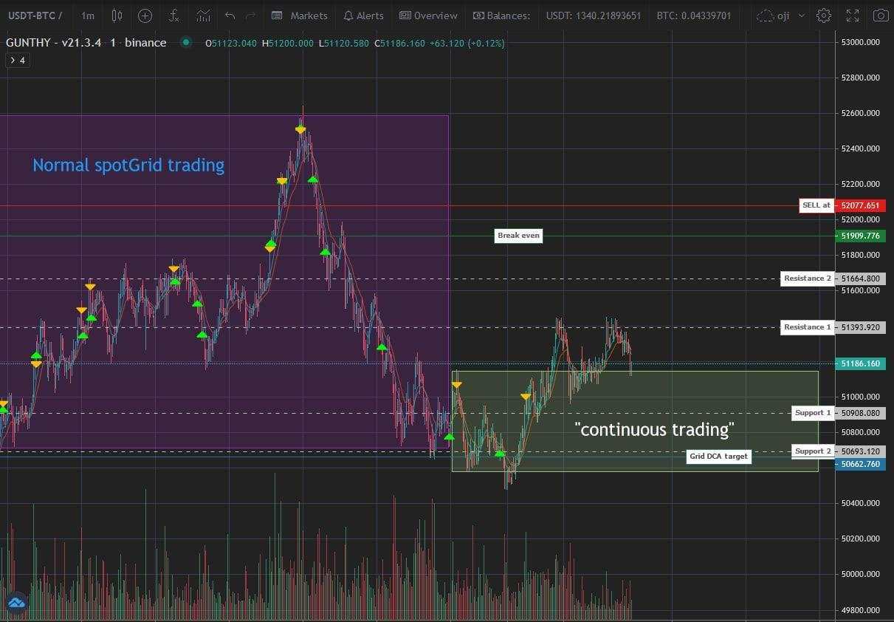

## Table of Contents

## What is continuous trading?

Continuous trading is a way of buying and selling stocks and other financial products throughout the trading day. Instead of waiting for a specific time to trade, like at the opening or closing of the market, you can trade anytime the market is open. This means you can react quickly to news or changes in the market, making it easier to buy or sell when you want.

In continuous trading, the prices of stocks can change a lot during the day. They go up and down based on what people are willing to pay or sell for. This system is used in many big stock markets around the world, like the New York Stock Exchange and the NASDAQ. It helps make the market more active and gives people more chances to trade.

## How does continuous trading differ from traditional trading sessions?

Continuous trading and traditional trading sessions work differently. In traditional trading, there are set times when you can buy and sell stocks. For example, there might be an opening session in the morning and a closing session in the afternoon. During these times, everyone can trade, but if you miss these windows, you have to wait until the next session. This can be frustrating if you want to react quickly to news or changes in the market.

On the other hand, continuous trading lets you buy and sell stocks all day long, as long as the market is open. This means you don't have to wait for specific times to trade. You can make a trade whenever you want, which gives you more flexibility. It's like having a store that's always open instead of one that only opens at certain times. This can be really helpful if you need to make quick decisions based on what's happening in the market.

## What are the benefits of continuous trading for investors?

Continuous trading gives investors more freedom to buy and sell stocks whenever they want during the trading day. This means they don't have to wait for specific times to make trades, which can be really helpful if they need to act quickly on new information or market changes. For example, if a company announces good news, investors can buy its stock right away instead of waiting for the next trading session.

Another big benefit is that continuous trading can lead to more active markets. Because people can trade all day, there's usually more buying and selling happening, which can make it easier to find someone to trade with. This can help investors get better prices for their stocks because there's more competition among buyers and sellers. Overall, continuous trading can make the market more lively and give investors more chances to make money.

## What types of financial instruments are typically available for continuous trading?

Continuous trading usually includes stocks, which are shares in companies that you can buy and sell. These are the most common financial instruments you'll find in markets like the New York Stock Exchange or NASDAQ. Stocks can be traded all day long, so if you want to buy or sell a company's stock, you can do it whenever the market is open.

Besides stocks, you can also trade exchange-traded funds (ETFs) in continuous trading. ETFs are like baskets of different investments, and they can be traded just like stocks. This means you can buy and sell ETFs throughout the day, which gives you a lot of flexibility if you're interested in investing in a variety of assets without having to wait for specific trading times.

Some markets also allow for continuous trading of certain types of options and futures. Options give you the right to buy or sell something at a certain price in the future, while futures are agreements to buy or sell something at a set price on a specific date. These can also be traded all day, which helps investors manage risk and take advantage of market movements as they happen.

## How does the technology behind continuous trading work?

The technology behind continuous trading relies on advanced computer systems and networks that connect buyers and sellers around the world. When someone wants to buy or sell a stock, they use a trading platform, which is like a special website or app designed for trading. This platform sends the order to a central system at the stock exchange, where it matches the order with someone else who wants to make the opposite trade. All of this happens very quickly, often in just a few seconds, thanks to powerful computers that can handle a lot of information at once.

To make sure everything runs smoothly, stock exchanges use sophisticated software to manage all the orders coming in. This software keeps track of the prices and makes sure that trades are done fairly. It also helps prevent mistakes and fraud by keeping a close eye on all the activity. The whole system is designed to be fast and reliable, so investors can trade whenever they want without worrying about delays or technical problems.

## What are the risks associated with continuous trading?

Continuous trading can be risky because it lets people trade all day long. This means the prices of stocks can change a lot during the day. If you're not careful, you might buy a stock at a high price and then see its value drop quickly. It can be hard to keep up with all the changes, and if you make a quick decision without thinking it through, you could lose money. Also, because trading is happening all the time, there's more chance for mistakes or problems with the trading systems, which could affect your trades.

Another risk is that continuous trading can make the market more unpredictable. Since people can react to news right away, the market can get very busy and prices can swing a lot. This can be stressful if you're trying to make smart choices about when to buy or sell. It's also important to remember that just because you can trade all day doesn't mean you should. Trading too much can lead to bad decisions and bigger losses, so it's important to have a plan and stick to it.

## How do market makers function in a continuous trading environment?

In a continuous trading environment, market makers play an important role. They are like helpers who make sure there are always buyers and sellers for stocks. When you want to buy or sell a stock, market makers step in to make the trade happen. They do this by always being ready to buy or sell stocks at certain prices. This helps keep the market running smoothly because it means there's always someone to trade with, even if not many people are trading at that moment.

Market makers also help keep the prices of stocks stable. They do this by setting a price they're willing to buy at, called the "bid," and a price they're willing to sell at, called the "ask." The difference between these two prices is called the "spread." By carefully managing these prices, market makers can help prevent big, sudden changes in stock prices. This makes the market feel more predictable and helps investors feel more confident when they're trading.

## What regulatory considerations are important in continuous trading?

In continuous trading, there are important rules that help keep everything fair and safe. Regulators make sure that the trading systems work properly and that everyone follows the rules. They watch out for things like fraud or cheating, which can hurt investors. They also make sure that the information about stocks is correct and that everyone has a fair chance to trade. This helps keep the market honest and trustworthy.

Another big part of regulation in continuous trading is making sure that the technology works well. Regulators check that the trading platforms and systems can handle a lot of trades without slowing down or making mistakes. They also set rules about how quickly trades should happen and how to handle problems if they come up. This helps keep the market running smoothly and makes sure that investors can trade whenever they want without worrying about technical issues.

## How does liquidity impact continuous trading?

Liquidity is really important in continuous trading. It means how easy it is to buy or sell a stock without changing its price too much. When there's a lot of [liquidity](/wiki/liquidity-risk-premium), it's easier for investors to trade because there are more buyers and sellers. This means you can quickly buy or sell a stock at a fair price. In a continuous trading environment, good liquidity helps keep the market active and makes it easier for everyone to trade whenever they want.

On the other hand, if there's not much liquidity, it can be harder to trade. You might have to wait longer to find someone to trade with, and the price of the stock might change a lot when you finally make a trade. This can be frustrating and risky for investors. In continuous trading, having enough liquidity is key to making sure the market works well and that people can trade smoothly all day long.

## What strategies are effective for trading in a continuous market?

In a continuous market, one good strategy is to use limit orders instead of market orders. A limit order lets you set the price you want to buy or sell a stock at, so you don't have to worry about the price changing suddenly. This can help you get a better deal and avoid big losses if the market moves quickly. Another strategy is to stay informed about news and events that might affect the stocks you're interested in. Since you can trade all day, you can react quickly to new information, but you need to be careful not to make rushed decisions based on the latest news.

Another effective strategy is to use technical analysis to look at charts and patterns to predict where the stock price might go next. This can help you decide when to buy or sell. It's also important to set clear goals and stick to a trading plan. Continuous trading can be exciting, but it's easy to get caught up in the moment and make too many trades. By having a plan and sticking to it, you can avoid making bad decisions and keep your trading under control.

## How do global events influence continuous trading?

Global events can have a big impact on continuous trading. When something important happens in the world, like a big election or a natural disaster, it can change how people feel about the market. If the news is good, people might want to buy more stocks, which can make prices go up. But if the news is bad, people might want to sell their stocks, which can make prices go down. Since you can trade all day in a continuous market, you can react to these events right away. This means the market can change quickly based on what's happening around the world.

For example, if there's a big economic report from another country, traders in a continuous market can buy or sell stocks as soon as they see the news. This can lead to a lot of activity and big changes in stock prices during the day. It's important for traders to keep an eye on global news and be ready to make quick decisions. But they also need to be careful not to make rushed choices just because of the latest news. Understanding how global events can affect the market helps traders make better decisions in a continuous trading environment.

## What future trends might affect the development of continuous trading?

In the future, technology will play a big role in how continuous trading develops. As computers get faster and smarter, trading platforms will become even better at handling lots of trades quickly. This could mean that trading happens even faster and more smoothly. Also, new technologies like [artificial intelligence](/wiki/ai-artificial-intelligence) might help traders make better decisions by analyzing lots of data and spotting trends. This could make the market more efficient and help people trade more effectively.

Another trend that might affect continuous trading is the growth of global markets. As more countries join the world economy, there will be more opportunities to trade stocks from different places. This could make the market busier and more exciting, with more chances to make money. But it also means traders will need to keep up with news and events from all over the world, which can be challenging. Overall, these trends could make continuous trading even more important and dynamic in the future.

## References & Further Reading

[1]: Black, F., & Scholes, M. (1973). ["The Pricing of Options and Corporate Liabilities."](https://www.cs.princeton.edu/courses/archive/fall09/cos323/papers/black_scholes73.pdf) The Journal of Political Economy, 81(3), 637-654.

[2]: ["Algorithmic Trading: Winning Strategies and Their Rationale"](https://www.amazon.com/Algorithmic-Trading-Winning-Strategies-Rationale-ebook/dp/B00CY5HC0U) by Ernie Chan

[3]: Aldridge, I. (2013). ["High-Frequency Trading: A Practical Guide to Algorithmic Strategies and Trading Systems."](https://www.amazon.com/High-Frequency-Trading-Practical-Algorithmic-Strategies/dp/1118343506) John Wiley & Sons.

[4]: ["Next Generation in Algorithmic Trading"](https://nurp.com/wisdom/trading-algorithms-in-2025-the-game-changing-upgrades-set-to-revolutionize-financial-markets/) by QuantInsti

[5]: Narang, R. K. (2013). ["Inside the Black Box: A Simple Guide to Quantitative and High-Frequency Trading."](https://onlinelibrary.wiley.com/doi/book/10.1002/9781118662717) John Wiley & Sons.

[6]: Pardo, R. (2011). ["The Evaluation and Optimization of Trading Strategies."](https://onlinelibrary.wiley.com/doi/book/10.1002/9781119196969) Wiley Trading.

[7]: Lopez de Prado, M. (2018). ["Advances in Financial Machine Learning."](https://books.google.com/books/about/Advances_in_Financial_Machine_Learning.html?id=oU9KDwAAQBAJ) John Wiley & Sons.

[8]: ["Artificial Intelligence in Financial Markets: Cutting Edge Applications for Risk Management, Portfolio Optimization, and Economics"](https://link.springer.com/book/10.1057/978-1-137-48880-0) by Christian L. Dunis, Peter W. Middleton, Andreas Karathanasopolous, and Konstantinos Theofilatos