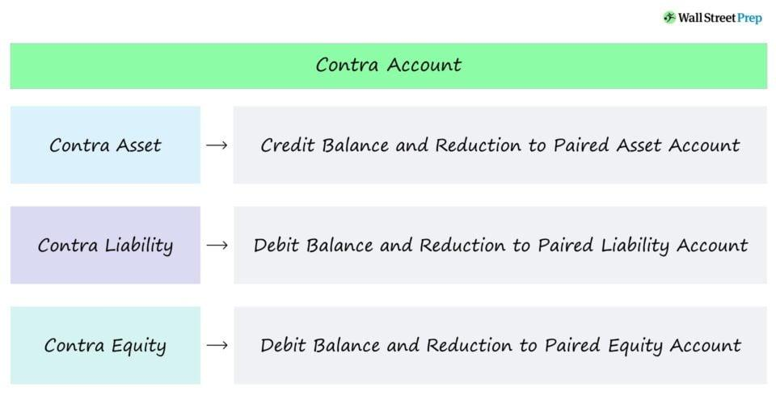

## Table of Contents

## What is a contra account in accounting?

A contra account is a type of account in accounting that reduces the value of a related account. It's like a helper account that works against the main account to show a more accurate picture of a company's finances. For example, if a company has a big machine that loses value over time, they might use a contra account to show how much the machine's value has gone down.

Contra accounts are important because they help businesses keep track of things like depreciation, returns, or discounts. They don't show up on their own on financial statements but are subtracted from the related account. This way, people looking at the financial statements can see a clearer and more honest view of the company's assets or revenues.

## What is the purpose of using contra accounts?

The main purpose of using contra accounts is to provide a more accurate picture of a company's financial situation. When a company has an asset, like a piece of equipment, it might lose value over time. Instead of just showing the original cost of the equipment, a contra account can show how much the equipment has depreciated. This way, anyone looking at the financial statements can see the current, more realistic value of the asset.

Contra accounts are also useful for tracking things like returns or discounts on sales. If a company sells a lot of products but also has to deal with returns, a contra account can show the total sales minus the returns. This gives a clearer view of the actual revenue the company is making. By using contra accounts, businesses can make sure their financial reports are more honest and useful for decision-making.

## Can you provide examples of common contra accounts?

A common contra account is Accumulated Depreciation. This account is used with fixed assets like buildings or machinery. When a company buys a machine, it records the cost of the machine as an asset. But over time, the machine gets older and loses value. Accumulated Depreciation is a contra account that shows how much value the machine has lost. On the balance sheet, the machine's original cost is shown, but then the Accumulated Depreciation is subtracted to show the machine's current value.

Another example is Allowance for Doubtful Accounts. This contra account is used with Accounts Receivable. When a company sells goods on credit, it records the amount as Accounts Receivable, expecting to get paid later. But sometimes, customers don't pay back what they owe. Allowance for Doubtful Accounts estimates how much money the company might not get back. On the balance sheet, the total Accounts Receivable is shown, but then the Allowance for Doubtful Accounts is subtracted to show a more realistic amount of money the company expects to receive.

A third example is Sales Returns and Allowances. This contra account is used with Sales Revenue. When a company makes sales, it records the total amount as Sales Revenue. But if customers return products or get discounts, the company uses Sales Returns and Allowances to track these amounts. On the income statement, the total Sales Revenue is shown, but then Sales Returns and Allowances is subtracted to show the actual revenue the company earned.

## How do contra accounts affect financial statements?

Contra accounts help make financial statements more accurate and honest. They do this by showing the real value of things like assets or the actual amount of money a company makes from sales. For example, if a company has a big machine, it might show the original cost of the machine on the balance sheet. But because the machine loses value over time, the company also shows how much it has depreciated using a contra account called Accumulated Depreciation. When you subtract this from the machine's original cost, you get a more realistic idea of what the machine is worth now.

Contra accounts also affect the income statement. When a company sells things, it records all the sales as revenue. But if customers return products or get discounts, these amounts are tracked in a contra account called Sales Returns and Allowances. This account is subtracted from the total sales to show the real amount of money the company made. By using contra accounts, financial statements give a clearer picture of a company's financial health, making it easier for people to understand how well the company is doing.

## What is the difference between a contra asset account and a regular asset account?

A regular asset account shows the total value of something a company owns, like cash, buildings, or equipment. It's the original cost of these items when the company bought them. For example, if a company buys a machine for $10,000, that amount goes into the regular asset account as the machine's value.

A contra asset account, on the other hand, works against the regular asset account to show a more accurate current value. It's used to track things that reduce the value of the asset over time, like depreciation or expected bad debts. For instance, if that $10,000 machine loses $2,000 in value over a year, the contra asset account called Accumulated Depreciation would show this $2,000. When you look at the financial statements, you subtract the contra asset account from the regular asset account, so the machine's value is shown as $8,000, which is a more realistic picture of what it's worth now.

## How should a contra account be recorded in the general ledger?

When you record a contra account in the general ledger, you need to use a separate account that's related to the main account it's working against. For example, if you have a machine that's losing value over time, you'd have a regular asset account for the machine's original cost and a contra asset account called Accumulated Depreciation to track how much the machine has depreciated. To record depreciation, you'd make an entry in the general ledger that increases the Accumulated Depreciation account and decreases the machine's value on the balance sheet.

The way you record these entries is by making a journal entry. Let's say the machine depreciated by $2,000 in a year. You'd debit the Depreciation Expense account by $2,000 because it's an expense that reduces your profit. At the same time, you'd credit the Accumulated Depreciation account by $2,000. This credit increases the contra asset account. When you look at the balance sheet, you'll see the machine's original cost, but then you'll subtract the Accumulated Depreciation to show the machine's current, lower value. This helps everyone see a more honest picture of what the company owns.

## What are the steps to set up a contra account in an accounting system?

Setting up a contra account in an accounting system involves a few important steps. First, you need to decide what kind of contra account you need, like Accumulated Depreciation for assets that lose value over time, or Allowance for Doubtful Accounts for money you might not get back from customers. Once you know the type, you create a new account in your accounting software or ledger. Make sure to name it clearly, like "Accumulated Depreciation - Machinery" so everyone knows what it's for. Then, you set it up as a contra account by marking it as such in the system, which might involve choosing a specific account type or setting a negative balance indicator.

After setting up the account, you need to start using it correctly. When you have transactions that affect the contra account, like recording depreciation or estimating bad debts, you make journal entries. For example, if a machine loses $2,000 in value, you'd debit the Depreciation Expense account and credit the Accumulated Depreciation account by $2,000. This keeps the contra account updated and ensures that your financial statements show the right values. Regularly reviewing and updating these accounts helps keep your financial reports accurate and useful.

## How does the use of contra accounts impact the balance sheet?

Contra accounts help make the balance sheet more accurate by showing the real value of a company's assets. When a company buys something like a machine, it puts the cost of the machine on the balance sheet as an asset. But over time, the machine loses value, and that's where a contra account like Accumulated Depreciation comes in. This account shows how much the machine has depreciated. On the balance sheet, you see the original cost of the machine, but then you subtract the amount in the Accumulated Depreciation account. This way, everyone can see what the machine is really worth now, not just what it cost when it was new.

Contra accounts also help with other things on the balance sheet, like money the company expects to get from customers. If a company sells things on credit, it records this as Accounts Receivable. But not everyone pays back what they owe, so the company uses a contra account called Allowance for Doubtful Accounts to estimate how much money might not come back. On the balance sheet, you see the total Accounts Receivable, but then you subtract the Allowance for Doubtful Accounts. This gives a more honest picture of how much money the company really expects to receive. By using contra accounts, the balance sheet shows a clearer and more realistic view of the company's financial situation.

## What are the best practices for managing contra accounts?

Managing contra accounts well is important for keeping your financial reports accurate and honest. You should always make sure to update these accounts regularly. For example, if you have a machine that loses value over time, you need to record how much it depreciates every year. This means making journal entries to increase the Accumulated Depreciation account and decrease the machine's value on the balance sheet. Keeping these accounts up to date helps everyone see a true picture of what your company owns and how much things are really worth.

Another good practice is to use clear and specific names for your contra accounts. This makes it easier for anyone looking at your financial statements to understand what each account is for. For instance, instead of just calling it "Accumulated Depreciation," you could name it "Accumulated Depreciation - Machinery." Also, it's a good idea to check your contra accounts often to make sure they're correct. If you find mistakes, fix them right away to keep your financial reports as accurate as possible. By following these practices, you can make sure your financial statements are clear and trustworthy.

## How do contra accounts relate to the concept of net realizable value?

Contra accounts help show the net realizable value of things a company owns. Net realizable value is what you can really get for something after you take away costs like depreciation or money you might not get back from customers. For example, if a company sells things on credit, it records this as Accounts Receivable. But not everyone pays back what they owe, so the company uses a contra account called Allowance for Doubtful Accounts to estimate how much money might not come back. When you subtract this contra account from the total Accounts Receivable, you get the net realizable value of what the company expects to actually receive.

In another case, if a company has a big machine, it records the cost of the machine as an asset. But over time, the machine loses value, which is called depreciation. To show this, the company uses a contra account called Accumulated Depreciation. When you subtract the Accumulated Depreciation from the original cost of the machine, you get the net realizable value of the machine. This helps everyone see what the machine is really worth now, not just what it cost when it was new. By using contra accounts, companies can give a more honest picture of their assets' values on their financial statements.

## Can you explain the tax implications of using contra accounts?

Using contra accounts can affect a company's taxes because they change how much things are worth on the financial statements. For example, when a company uses a contra account like Accumulated Depreciation to show how much a machine has lost value, it can claim this depreciation as an expense on its tax return. This means the company can lower its taxable income because expenses like depreciation reduce the profit that's taxed. So, by using contra accounts, a company can pay less in taxes.

Another way contra accounts can impact taxes is through the Allowance for Doubtful Accounts. This contra account is used to estimate how much money the company might not get back from customers. When a company sets up this allowance, it can sometimes claim a tax deduction for the amount it thinks it won't receive. This also lowers the company's taxable income. But, tax rules can be different in different places, so it's important for a company to follow the tax laws where it operates and maybe talk to a tax expert to make sure everything is done right.

## What advanced strategies can businesses employ with contra accounts to optimize financial reporting?

Businesses can use contra accounts in smart ways to make their financial reports clearer and more useful. One strategy is to use contra accounts to show how much things like machines or buildings are really worth now, not just what they cost when they were new. This helps everyone see a more honest picture of what the company owns. For example, by regularly updating the Accumulated Depreciation account, a business can show investors and lenders a more accurate value of its assets, which can make the company look more reliable and trustworthy.

Another strategy is to use contra accounts to plan for the future. If a company knows that some customers might not pay back what they owe, it can use the Allowance for Doubtful Accounts to estimate this. By doing this, the company can show on its financial statements how much money it really expects to get, which helps in making better plans and decisions. This also helps the company manage its cash flow better, because it knows how much money it can really count on. By using contra accounts in these ways, businesses can make their financial reports more accurate and useful for everyone who looks at them.

## What are the types of contra accounts?

Contra accounts are specialized accounts used to reduce the value of related accounts on financial statements, providing a more accurate representation of a company's financial status. There are four principal types of contra accounts:

1. **Contra Asset Accounts**: These accounts are instrumental in decreasing the carrying value of related assets. A prevalent example is 'Accumulated Depreciation,' which tracks the total depreciation of a company's assets over time. This concept is pivotal as it reflects how much of an asset's value has been expensed since its acquisition. For instance:
$$
   \text{Net Book Value} = \text{Historical Cost} - \text{Accumulated Depreciation}

$$

   This equation helps ascertain the current book value of the asset, offering a realistic assessment by accounting for depreciation as an economic expense.

2. **Contra Liability Accounts**: Contra liabilities reduce the balance of corresponding liabilities. A common instance is discounts on notes payable, which represents reductions in the amount to be repaid on issued notes. By accounting for these discounts, companies can present a clearer picture of their actual liability obligations.

3. **Contra Equity Accounts**: These accounts primarily involve transactions that lead to reductions in shareholders’ equity. A prime example is treasury stock, which records the cost of shares repurchased by the company. When a corporation buys back its shares, it essentially reduces overall shareholder equity, thus adjusting the equity on the balance sheet.

4. **Contra Revenue Accounts**: Contra revenue accounts are utilized to account for any decrease in gross revenue, providing clarity on net income. Typical examples include sales returns and allowances. By recording these figures:
$$
   \text{Net Revenue} = \text{Gross Revenue} - \text{Sales Returns and Allowances}

$$

   This formula ensures that financial statements reflect the actual revenue realized, excluding the impact of returned goods or other deductions from gross sales.

Understanding these contra accounts is crucial for effective financial analysis and reporting, as they ensure that financial data accurately mirrors economic realities. Their proper utilization allows businesses to maintain transparency and comply with accounting standards.

## How do you record and report contra accounts?

Accurate recording of contra accounts is essential for maintaining true financial records. Contra accounts, by design, provide clarity and transparency in accounting by offsetting the balances of related accounts. An exemplary method for managing such accounts is the allowance method, particularly relevant when estimating bad debts. This approach involves predicting uncollectible accounts receivable and creating a contra asset account termed "Allowance for Doubtful Accounts." This account effectively reduces the total accounts receivable on the balance sheet to reflect only the amounts expected to be collected.

For example, suppose a company has an accounts receivable total of $100,000, and it estimates $5,000 of that will be uncollectible. The journal entry would be as follows:

```plaintext
  Bad Debt Expense        $5,000
     Allowance for Doubtful Accounts    $5,000
```

This entry ensures that the net accounts receivable value on the balance sheet is a realistic representation of anticipated cash inflows, thus enhancing the accuracy of financial reporting.

Accumulated depreciation is another significant contra account that plays a vital role in financial reporting. It represents the total depreciation of a company's fixed assets, such as machinery or buildings, over time. By pairing with the original asset account, accumulated depreciation provides an adjusted net book value of the asset, aiding stakeholders in understanding the asset's current worth. For instance, if an asset is purchased for $50,000 with an estimated useful life of ten years, and using straight-line depreciation, the annual depreciation expense would be:

$$

\text{Annual Depreciation Expense} = \frac{\text{Cost of Asset} - \text{Salvage Value}}{\text{Useful Life}} 
$$

Assuming a salvage value of $0, the annual depreciation would be $5,000 ($50,000/10 years). The journal entry to record this would be:

```plaintext
  Depreciation Expense    $5,000
     Accumulated Depreciation          $5,000
```

Reporting this on the balance sheet shows the asset at its depreciated value, contributing to transparent and truthful asset representation.

Examples of how contra accounts are reported also involve using effective accounting software tools. These tools streamline the recording process by automating the allocation of expenses to contra accounts, updating financial statements in real-time, and providing analytical insights into revenue and expenses. For instance, software can automatically calculate and apply depreciation, reducing human error and increasing efficiency.

In conclusion, accurate recording and reporting of contra accounts allow businesses to reflect their true financial position. Techniques like the allowance method and examples like accumulated depreciation demonstrate their utility in achieving financial transparency. Employing advanced accounting software further enhances the precision and efficiency of managing these accounts, ultimately supporting sound business decision-making.

## References & Further Reading

[1]: ["Financial Accounting: An Introduction"](https://biz.libretexts.org/Bookshelves/Accounting/Introduction_to_Financial_Accounting_(Dauderis_and_Annand)/01%3A_Introduction_to_Financial_Accounting) by Pauline Weetman

[2]: ["Advances in Financial Machine Learning"](https://www.amazon.com/Advances-Financial-Machine-Learning-Marcos/dp/1119482089) by Marcos Lopez de Prado

[3]: ["Algorithms for Hyper-Parameter Optimization"](https://papers.nips.cc/paper/4443-algorithms-for-hyper-parameter-optimization.pdf) by J. Bergstra, R. Bardenet, Y. Bengio, & B. Kégl, Advances in Neural Information Processing Systems 24.

[4]: ["Quantitative Trading: How to Build Your Own Algorithmic Trading Business"](https://www.amazon.com/Quantitative-Trading-Build-Algorithmic-Business/dp/1119800064) by Ernest P. Chan

[5]: ["Machine Learning for Algorithmic Trading"](https://github.com/stefan-jansen/machine-learning-for-trading) by Stefan Jansen