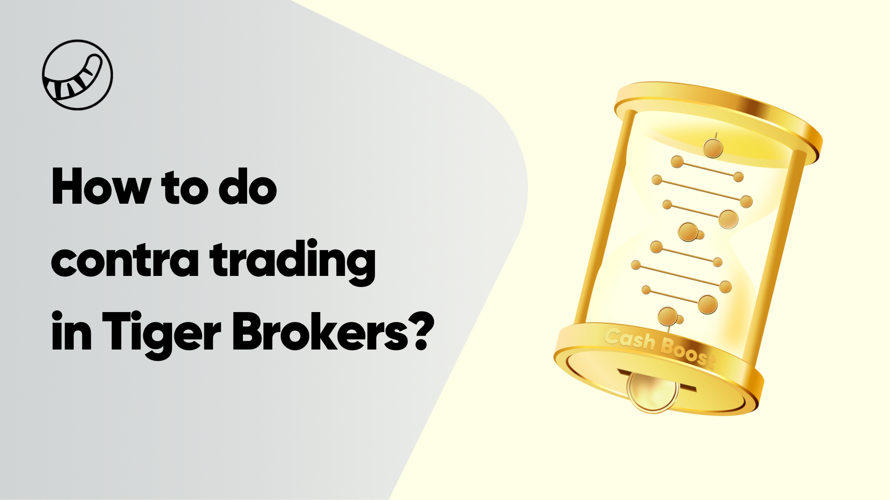

## Table of Contents

## What is a Contra Broker?

A Contra Broker is a term used in the stock market. It refers to a broker who is on the other side of a trade from you. When you buy a stock, the contra broker is the one who is selling that stock to you. They work for the firm that is selling the stock.

Contra brokers are important because they help make sure that trades happen smoothly. They make sure that the price and the number of shares are correct. This helps keep the stock market working well. Without contra brokers, it would be harder to buy and sell stocks.

## How does a Contra Broker function in financial markets?

A Contra Broker is someone who helps make trades happen in the stock market. When you want to buy a stock, the Contra Broker is the person who sells it to you. They work for the company that is selling the stock. Their job is to make sure that the trade goes smoothly. They check that the price is right and that the number of shares is correct.

Contra Brokers are important because they help keep the stock market running smoothly. Without them, it would be harder for people to buy and sell stocks. They make sure that when you want to buy a stock, there is someone ready to sell it to you at the right price. This helps everyone who wants to trade stocks.

## What are the primary responsibilities of a Contra Broker?

A Contra Broker's main job is to be on the other side of a trade in the stock market. When you want to buy a stock, the Contra Broker is the one who sells it to you. They work for the company that is selling the stock. Their job is to make sure that the trade goes smoothly. They check that the price is right and that the number of shares is correct.

Contra Brokers are important because they help keep the stock market running smoothly. Without them, it would be harder for people to buy and sell stocks. They make sure that when you want to buy a stock, there is someone ready to sell it to you at the right price. This helps everyone who wants to trade stocks.

## Can you explain the role of a Contra Broker in a trade?

A Contra Broker is someone who helps make trades happen in the stock market. When you want to buy a stock, the Contra Broker is the person who sells it to you. They work for the company that is selling the stock. Their job is to make sure that the trade goes smoothly. They check that the price is right and that the number of shares is correct.

Contra Brokers are important because they help keep the stock market running smoothly. Without them, it would be harder for people to buy and sell stocks. They make sure that when you want to buy a stock, there is someone ready to sell it to you at the right price. This helps everyone who wants to trade stocks.

## What is the difference between a Contra Broker and a Prime Broker?

A Contra Broker and a Prime Broker are two different types of brokers in the financial world. A Contra Broker is someone who is on the other side of a trade from you. When you want to buy a stock, the Contra Broker is the one selling it to you. They make sure the trade goes smoothly by checking the price and the number of shares. Their main job is to help make sure that there is someone ready to sell when you want to buy.

A Prime Broker, on the other hand, provides a lot more services to big investors like hedge funds. They help with things like lending money, managing cash, and even helping with the trading process. Prime Brokers are more like a one-stop shop for big investors, offering them many services to help them manage their investments better. While a Contra Broker focuses on the other side of a single trade, a Prime Broker helps with many aspects of an investor's overall strategy.

## How does a Contra Broker facilitate trade execution?

A Contra Broker helps make trades happen in the stock market. When you want to buy a stock, the Contra Broker is the person who sells it to you. They work for the company that is selling the stock. Their job is to make sure that the trade goes smoothly. They check that the price is right and that the number of shares is correct. By doing this, they help make sure that the trade can happen quickly and correctly.

Contra Brokers are important because they help keep the stock market running smoothly. Without them, it would be harder for people to buy and sell stocks. They make sure that when you want to buy a stock, there is someone ready to sell it to you at the right price. This helps everyone who wants to trade stocks. By being on the other side of the trade, Contra Brokers help make the whole process work better.

## What are the benefits of using a Contra Broker for traders?

Using a Contra Broker can make trading easier for traders. When you want to buy a stock, the Contra Broker is the one who sells it to you. They make sure the price is right and the number of shares is correct. This helps the trade happen quickly and smoothly. Without a Contra Broker, it might be harder to find someone to sell you the stock you want.

Contra Brokers also help keep the stock market running well. They make sure there is always someone ready to sell when you want to buy. This helps keep the market balanced and makes it easier for everyone to trade. By having a Contra Broker, traders can feel more confident that their trades will go through without problems.

## What are the potential risks associated with using a Contra Broker?

Using a Contra Broker can come with some risks. One risk is that there might be a mistake in the trade. Even though Contra Brokers check the price and the number of shares, sometimes errors can happen. If there's a mistake, it could mean you pay more than you should or get fewer shares than you wanted.

Another risk is that the Contra Broker might not always have the stock you want to buy. If they can't find the stock, your trade might not happen. This can be frustrating and might make you miss out on a good opportunity to buy or sell a stock. It's important to know these risks so you can be ready for them when you trade.

## Can you provide a real-world example of how a Contra Broker operates?

Imagine you want to buy 100 shares of a company called ABC Corp. You place your order with your broker, saying you want to buy the shares at $50 each. Your broker then looks for someone who wants to sell those shares. This is where the Contra Broker comes in. The Contra Broker works for the firm that is selling the shares of ABC Corp. They see your order and agree to sell you the 100 shares at $50 each.

The Contra Broker makes sure everything is correct before the trade happens. They check that the price is right and that they have the 100 shares to sell to you. Once everything is confirmed, the trade goes through. You get your 100 shares of ABC Corp, and the Contra Broker's firm gets the money from the sale. This whole process happens quickly and smoothly, thanks to the Contra Broker's role in making sure there is someone ready to sell when you want to buy.

## How do regulatory requirements impact the operations of a Contra Broker?

Regulatory requirements play a big role in how Contra Brokers do their job. They have to follow rules set by groups like the Securities and Exchange Commission (SEC) to make sure trades are fair and honest. These rules say that Contra Brokers must check the price and the number of shares carefully before a trade happens. They also have to keep good records of all trades. If they don't follow these rules, they could get in trouble and might have to pay fines or lose their license to work as a broker.

These regulations help keep the stock market safe for everyone. They make sure that Contra Brokers are doing their job the right way and not cheating or making mistakes that could hurt traders. By following the rules, Contra Brokers help make sure that when you buy or sell a stock, everything goes smoothly and fairly. This is important because it helps people trust the stock market and feel confident when they trade.

## What technological tools do Contra Brokers use to enhance their services?

Contra Brokers use different computer programs and tools to make their work easier and faster. They use trading platforms that help them see what stocks people want to buy and sell. These platforms show the prices and how many shares are available. They also use special software to check that the prices and numbers are correct before the trade happens. This helps them make sure everything goes smoothly and quickly.

Another tool they use is called an order management system. This system helps them keep track of all the orders they are working on. It makes sure they don't miss any important details and helps them finish the trades on time. By using these tools, Contra Brokers can do their job better and help the stock market run smoothly.

## How can one evaluate the performance and efficiency of a Contra Broker?

To evaluate the performance and efficiency of a Contra Broker, you can look at how quickly they can complete trades. If they can match buyers and sellers fast, it means they are doing a good job. You can also check how often they make mistakes with the price or the number of shares. If they rarely make mistakes, it shows they are careful and efficient. Another way to evaluate them is by seeing how happy their clients are. If clients are happy and keep coming back, it means the Contra Broker is doing well.

You can also look at how well they follow the rules set by groups like the SEC. If they follow the rules closely and keep good records, it shows they are responsible and trustworthy. By looking at these things, you can get a good idea of how well a Contra Broker is performing and how efficient they are in their job.

## References & Further Reading

[1]: Marcos Lopez de Prado. ["Advances in Financial Machine Learning."](https://www.amazon.com/Advances-Financial-Machine-Learning-Marcos/dp/1119482089) John Wiley & Sons, 2018.

[2]: Stefan Jansen. ["Machine Learning for Algorithmic Trading: Second Edition."](https://github.com/PacktPublishing/Machine-Learning-for-Algorithmic-Trading-Second-Edition) Packt Publishing, 2020.

[3]: Ernest P. Chan. ["Quantitative Trading: How to Build Your Own Algorithmic Trading Business."](https://www.amazon.com/Quantitative-Trading-Build-Algorithmic-Business/dp/0470284889) John Wiley & Sons, 2008.

[4]: David Aronson. ["Evidence-Based Technical Analysis: Applying the Scientific Method and Statistical Inference to Trading Signals."](https://www.amazon.com/Evidence-Based-Technical-Analysis-Scientific-Statistical/dp/0470008741) John Wiley & Sons, 2007.

[5]: Haim Bodek. ["The Problem of HFT: Collected Writings on High-Frequency Trading & Stock Market Structure Reform."](https://www.semanticscholar.org/paper/The-Problem-of-HFT-Collected-Writings-on-High-%26-Bodek/e0eea35bfe661bec03823c4d137922781864177a) CreateSpace Independent Publishing Platform, 2013. 

[6]: Securities and Exchange Commission (SEC). ["Regulation of Exchanges and Alternative Trading Systems."](https://www.sec.gov/foia-services/frequently-requested-documents/alternative-trading-system-ats-list) December 1998. 

[7]: Financial Industry Regulatory Authority (FINRA). ["About FINRA."](https://www.finra.org/about) 

[8]: Interactive Brokers. ["TWS API v9.72+: Introduction and Installation."](https://interactivebrokers.github.io/tws-api/introduction.html) 