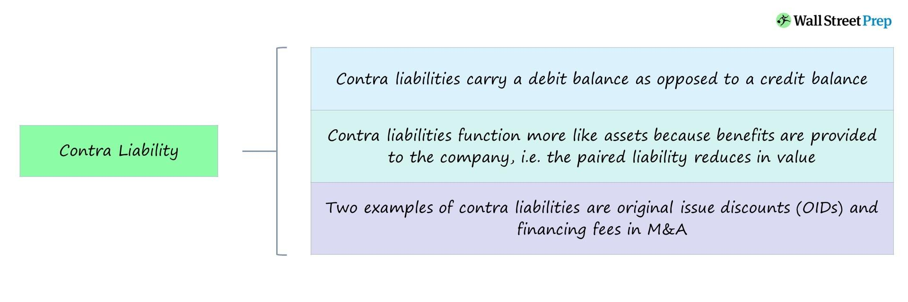

## Table of Contents

## What is a contra liability account?

A contra liability account is a special type of account that reduces the value of a company's liabilities. It is called "contra" because it works against or opposite to the normal liability accounts. For example, if a company has a loan, the loan would be recorded as a liability. But if the company also has a discount on that loan, the discount would be recorded in a contra liability account, which would decrease the total liability amount.

These accounts are important because they help give a more accurate picture of a company's financial health. By showing both the liability and any reductions to it, people looking at the company's financial statements can see the net effect. Common examples of contra liability accounts include discounts on bonds payable and unamortized bond issue costs. These accounts are usually shown on the balance sheet as a deduction from the related liability.

## How does a contra liability account differ from a regular liability account?

A contra liability account is different from a regular liability account because it reduces the total amount of liabilities a company has. A regular liability account shows how much a company owes, like loans or money it needs to pay back. On the other hand, a contra liability account decreases that amount. For example, if a company has a loan, that's a regular liability. But if they got a discount on that loan, the discount goes into a contra liability account, making the total amount they owe less.

These accounts help give a clearer picture of a company's financial situation. When people look at a company's financial statements, they can see the full amount of the liabilities and also any reductions to those liabilities. This makes it easier to understand the real amount the company owes. Common examples of contra liability accounts are discounts on bonds and costs related to issuing bonds that haven't been fully accounted for yet. These accounts are shown on the balance sheet as a deduction from the related liability.

## Can you provide examples of contra liability accounts?

Contra liability accounts are used to reduce the value of a company's liabilities. A common example is a discount on bonds payable. When a company issues bonds at a discount, it means they are sold for less than their face value. The discount is recorded in a contra liability account, which lowers the total liability shown on the balance sheet. This helps show that the company will actually pay back less than the full amount of the bond when it matures.

Another example is unamortized bond issue costs. When a company issues bonds, it might have to pay fees and other costs. These costs are recorded in a contra liability account and are spread out over the life of the bond. This way, the costs reduce the total liability each year until the bond is paid off. By using a contra liability account, the company can show a more accurate picture of what it owes over time.

## What is the purpose of using a contra liability account?

The purpose of using a contra liability account is to show a more accurate picture of a company's financial situation. It does this by reducing the total amount of liabilities shown on the balance sheet. For example, if a company has a loan but also got a discount on that loan, the discount goes into a contra liability account. This helps people see that the company will pay back less than the full loan amount.

Using contra liability accounts helps give a clearer and more honest view of what a company owes. It's important for people who look at the company's financial statements, like investors or creditors, to understand the real amount the company is responsible for. By showing both the full liability and any reductions, like discounts on bonds or costs related to issuing bonds, the company can better explain its financial health.

## How are contra liability accounts presented on the balance sheet?

Contra liability accounts are shown on the balance sheet in a way that makes the total amount of liabilities clearer. If a company has a loan but also got a discount on that loan, the discount goes into a contra liability account. This account is listed right next to the loan on the balance sheet, but it's subtracted from the loan's total amount. This helps everyone see that the company will pay back less than the full loan amount because of the discount.

For example, if a company has a bond they need to pay back, and they got a discount on that bond, the discount is recorded in a contra liability account. On the balance sheet, you'll see the full amount of the bond listed as a liability, and right below it, the discount in the contra liability account will be subtracted. This way, anyone looking at the balance sheet can easily see the real amount the company owes after the discount is taken into account.

## What are the journal entries for recording transactions in a contra liability account?

When a company records a transaction in a contra liability account, they use journal entries to show the reduction in their liabilities. For example, if a company issues bonds at a discount, they would debit the discount on bonds payable account, which is a contra liability account, and credit the cash or bonds payable account. The debit to the contra liability account reduces the total liability shown on the balance sheet. This shows that the company will pay back less than the face value of the bond when it matures.

Another example is when a company incurs costs to issue bonds. These costs are recorded in a contra liability account called unamortized bond issue costs. The company would debit the unamortized bond issue costs account and credit cash or another asset account. Over time, these costs are amortized, meaning they are gradually moved from the contra liability account to an expense account. This process reduces the total liability on the balance sheet each year until the bond is paid off, giving a more accurate picture of what the company owes.

## How do contra liability accounts affect the overall financial statements?

Contra liability accounts make a company's financial statements more clear and honest. They help show the real amount a company owes by reducing the total liabilities on the balance sheet. For example, if a company has a loan but got a discount on it, the discount goes into a contra liability account. This account is subtracted from the loan amount, so people can see that the company will pay back less than the full loan.

These accounts also affect the income statement over time. For example, if a company has costs from issuing bonds, these costs go into a contra liability account called unamortized bond issue costs. Over time, these costs are slowly moved to an expense account, which reduces the company's net income each year. This way, the financial statements show a more accurate picture of the company's financial health, helping investors and creditors understand the true financial situation.

## What are the tax implications of using a contra liability account?

When a company uses a contra liability account, it can affect how much tax they have to pay. For example, if a company issues bonds at a discount, the discount goes into a contra liability account. This discount reduces the total amount of the bond on the balance sheet. When the bond matures, the company pays back less than the face value, which means they have less interest expense to report. Less interest expense can mean less tax to pay because interest expense is usually deductible on the company's tax return.

Over time, if a company has costs to issue bonds, these costs are put into a contra liability account called unamortized bond issue costs. These costs are slowly moved to an expense account, which reduces the company's taxable income each year. By spreading out these costs, the company can lower its tax bill a little bit each year instead of taking a big hit all at once. This way, using contra liability accounts can help manage a company's tax situation more smoothly.

## How do you calculate the net liability using a contra liability account?

To calculate the net liability using a contra liability account, you start with the full amount of the liability, like a loan or a bond. Then, you subtract the amount in the contra liability account, which could be a discount on the bond or costs related to issuing the bond. For example, if a company has a bond worth $1,000,000 but got a $50,000 discount, the discount goes into the contra liability account. You subtract the $50,000 from the $1,000,000, and the net liability becomes $950,000.

This calculation helps show a more accurate picture of what the company really owes. By using a contra liability account, the financial statements reflect the actual amount the company will pay back, which is important for anyone looking at the company's finances. It's a simple way to make sure everyone understands the real financial situation of the company.

## What are the common mistakes to avoid when managing contra liability accounts?

One common mistake when managing contra liability accounts is not updating them regularly. If a company has costs related to issuing bonds, these costs need to be moved from the contra liability account to an expense account over time. If they forget to do this, the balance sheet won't show the right amount of liabilities. This can make the company's financial situation look different than it really is.

Another mistake is mixing up contra liability accounts with regular liability accounts. They are different because contra liability accounts reduce the total amount of liabilities. If a company records a discount on a bond in the wrong account, it can make the company look like it owes more money than it actually does. Keeping these accounts separate and clear helps everyone understand the real financial picture of the company.

## How do contra liability accounts interact with other financial accounts?

Contra liability accounts work together with other financial accounts to give a clear picture of a company's money situation. They reduce the total amount of liabilities a company has. For example, if a company has a loan but got a discount on it, the discount goes into a contra liability account. This account is then subtracted from the loan amount on the balance sheet. This helps everyone see that the company will pay back less than the full loan.

These accounts also connect with the income statement over time. If a company has costs from issuing bonds, these costs go into a contra liability account called unamortized bond issue costs. Over time, these costs are slowly moved to an expense account, which reduces the company's net income each year. This way, the financial statements show a more accurate picture of the company's financial health, helping investors and creditors understand the true financial situation.

## What are the advanced strategies for optimizing the use of contra liability accounts in financial management?

One advanced strategy for optimizing the use of contra liability accounts is to carefully time the amortization of bond issue costs. By spreading these costs over the life of the bond, a company can manage its expenses and taxable income more effectively. For example, if a company knows it will have higher profits in certain years, it can adjust the amortization schedule to offset those profits, reducing the tax burden. This strategy requires good planning and understanding of future financial performance, but it can help smooth out the company's financial statements and tax obligations.

Another strategy is to use contra liability accounts to negotiate better terms on loans or bonds. If a company can show potential lenders or bondholders that it has managed its liabilities well by using contra accounts, it might be able to secure discounts or lower interest rates. This can be particularly useful in times of financial stress or when the company is looking to refinance existing debt. By demonstrating a clear and honest picture of its liabilities, the company can build trust with investors and creditors, potentially leading to more favorable financial terms.

## References & Further Reading

For further insights into the intricacies of accounting and [algorithmic trading](/wiki/algorithmic-trading), several key texts provide comprehensive coverage and detailed explanations. "Financial Accounting: An Introduction" by Pauline Weetman is an invaluable resource for understanding fundamental accounting principles, including the role and management of contra accounts. It offers foundational knowledge necessary for mastering financial statements and accounting practices essential for accurate financial reporting and analysis.

For those interested in algorithmic trading, "Quantitative Trading" by Ernest P. Chan is a highly recommended read. This book investigates into developing and implementing algorithmic trading strategies, focusing on mathematical and statistical models. It provides practical guidance on integrating financial accounting data into trading algorithms, enhancing decision-making processes and improving market analysis accuracy. Chan's work is particularly useful for those seeking to bridge the gap between accounting principles and modern trading techniques.

Both [books](/wiki/algo-trading-books) serve as excellent starting points for finance professionals aiming to deepen their understanding of accounting and algorithmic trading, equipping them with the necessary skills to navigate today's complex financial landscape.

