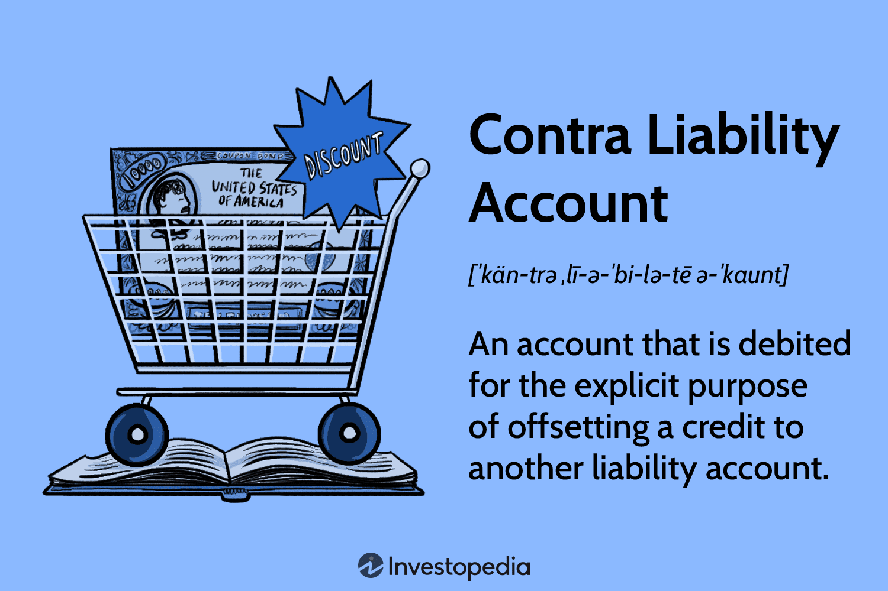

In today's complex financial landscape, professionals in the finance sector are required to have a deep understanding of accounting, financial statements, and algorithmic trading. These elements form the backbone of sound financial decision-making and strategic planning. This article specifically examines contra liability accounts within financial statements and their significance when integrated with algorithmic trading strategies.

Contra liability accounts are ledger accounts used to make necessary adjustments to liabilities presented within financial records. This adjustment ensures a more accurate representation of a company's financial position, an essential aspect in a world where financial transparency and precision are paramount. Such accounts typically have a debit balance and are used to reflect reductions in liabilities, such as the discounts granted on bonds payable.



Algorithmic trading, which involves using computer algorithms to automate and enhance trading processes, relies extensively on accurate and transparent financial data. Leveraging the adjustments made by contra accounts, algorithmic trading systems can better evaluate company valuations and assess associated market risks. By merging classical accounting principles with automated trading methodologies, finance professionals can craft strategies that are both innovative and grounded in fundamental financial analysis.

This comprehensive overview aims to illustrate the harmonious relationship between the traditional practices of accounting and the advanced mechanisms of modern trading. By mastering both domains, professionals can adapt to ongoing developments in finance, ensuring their strategies remain robust, precise, and effective in an ever-evolving market landscape.

## Table of Contents

## Understanding Contra Liability Accounts

A contra liability account serves to adjust the value of liabilities in financial records, providing a clearer depiction of an organization's financial situation. Unlike typical liability accounts that hold a credit balance, contra liability accounts carry a debit balance. This characteristic is essential as it effectively reduces the net value of the corresponding liability. For instance, when a company issues bonds, it may offer these at a discount to encourage purchase. This discount is recorded as a contra liability account because it decreases the total value of the bonds payable, reflecting the actual financial obligation more accurately.

The utilization of contra accounts promotes transparency in financial statements. By accurately reflecting the adjusted liability values, stakeholders—including investors, analysts, and regulatory bodies—gain a comprehensive understanding of a company's real obligations. This transparency is crucial for informed decision-making, as stakeholders rely on precise financial data to assess a company's financial stability and performance.

In practice, the role of a contra liability account is straightforward: it is subtracted from the associated liability account to calculate the net liability. For example, if a company has bonds payable of $500,000 and an associated bond discount of $20,000, the net bonds payable reported in financial statements would be $480,000. This accounting treatment is essential for compliance with accounting principles and standards, ensuring that financial reports provide a true and fair view of the company's financial obligations.

## Types and Examples of Contra Accounts

Contra accounts are specialized accounts that serve to adjust or offset the balances of specific general ledger accounts, providing a more accurate representation of a company's financial status. They fall into several categories, each serving distinct functions:

1. **Contra Asset Accounts**: These accounts reduce the gross amounts of assets on the balance sheet. A prime example is accumulated depreciation. Accumulated depreciation collects the depreciation expense over time and offsets the original cost of an asset, reflecting its reduced value. For instance, if an asset costs $100,000 and the accumulated depreciation is $30,000, the net book value of the asset would be $70,000. Another example is allowance for doubtful accounts, which offsets accounts receivable to account for potential non-collection.

2. **Contra Liability Accounts**: These are used to decrease the total liability reported on the balance sheet. For instance, discounts on bonds payable serve as a contra liability account. When bonds are issued at a discount, the liability is recorded at a reduced value compared to its nominal amount, representing the actual future obligation the company expects to settle.

3. **Contra Equity Accounts**: These accounts diminish the total equity of a company. Treasury stock is a common example, representing the cost of shares repurchased by the company and held in its own treasury. These shares are not considered outstanding and thus reduce the total shareholders' equity.

4. **Contra Revenue Accounts**: These serve to offset gross revenue, resulting in net revenue figures. Sales returns and allowances are typical examples, which include returned goods and discounts given to customers. These accounts provide insights into the actual revenue generated after accounting for such deductions.

The role of contra accounts in financial reporting is pivotal. They prevent the overstatement of financial positions and provide stakeholders with a clearer view of the company’s true financial health. By offsetting the values of associated accounts, they ensure that reported figures reflect actual economic realities, maintaining transparency and accuracy in financial statements.

## Recording and Reporting Contra Accounts

Accurate recording of contra accounts is crucial for maintaining transparent financial records. These accounts serve to provide a realistic picture of a company's financial situation by offsetting the values of associated liability, asset, revenue, or equity accounts. One notable example of this is the allowance method for estimating bad debts, which employs a contra asset account to adjust accounts receivable and depict an anticipated loss from uncollectible debts.

In practice, the allowance for doubtful accounts is debited using this method, while bad debt expense is credited. This approach ensures that the financial statements reflect a more conservative view of expected cash inflows, helping stakeholders assess financial health more accurately. The journal entries for recording the provision for doubtful debts are as follows:

```plaintext
   Bad Debt Expense      XXX
      Allowance for Doubtful Accounts      XXX
```

Here, $XXX$ represents the estimated amount of uncollectible accounts. By using this contra account, companies comply with the matching principle in accounting, ensuring that expenses are recognized in the same period as the revenues they help to generate.

In modern accounting practices, software automation plays a pivotal role in recording and reporting contra accounts. Accounting software solutions are equipped to handle the complexities involved in these processes, enhancing both accuracy and efficiency. Such software automates the calculation of estimates required for Contra Liability and Contra Asset accounts and integrates them into financial statements seamlessly.

These tools can execute an array of tasks, ranging from generating journal entries to providing real-time financial insights. The automation of contra accounts allows companies to reduce human error, maintain accurate records, and ensure compliance with accounting standards.

Both small businesses and large enterprises benefit from implementing these digital solutions, which afford finance professionals more time to focus on analysis and strategic decision-making. Accurate and efficient recording and reporting of contra accounts reflect a company's true financial position, ultimately aiding in more informed, data-driven decisions.

## Algorithmic Trading and Financial Accounting

Algorithmic trading relies heavily on accurate financial data, and contra liability accounts are a crucial component in presenting that data with precision. These accounts, which adjust the value of liabilities, provide traders with a clearer picture of a company's financial position, aiding in the assessment of valuation and risk. The transparency offered by properly integrated financial accounting data ensures that trading algorithms function based on reliable information, thus enabling better risk management and investment decisions.

Traders, utilizing programming languages such as Python, can implement sophisticated algorithms that account for financial adjustments. For example, Python's libraries like Pandas and NumPy can be used to process and analyze large datasets, including adjustments from contra accounts. This can lead to more accurate predictions and valuations. An algorithm could be coded to automatically retrieve financial statements, adjust for contra liabilities, and then use these adjusted figures as input for various trading models.

Here is a simple example of how Python can be used to integrate financial data, including contra accounts, into a trading algorithm:

```python
import pandas as pd

# Sample data representing financial statements
data = {
    'Liabilities': [1000000, 1200000, 1150000],
    'Contra Liabilities': [50000, 20000, 30000]  # Adjustments
}

# Create a DataFrame
df = pd.DataFrame(data)

# Calculate Adjusted Liabilities
df['Adjusted Liabilities'] = df['Liabilities'] - df['Contra Liabilities']

# Display the DataFrame
print(df)
```

This example demonstrates how contra liabilities are subtracted from liabilities to present a truer picture of a company's financial status. The adjusted liabilities figure is then used in various models to generate trading signals.

The integration of financial accounting data into trading algorithms not only improves the accuracy of risk assessment and company valuation but also enhances the overall efficiency and effectiveness of trading strategies. As [algorithmic trading](/wiki/algorithmic-trading) systems evolve, the ability to incorporate detailed and accurate financial data, such as adjustments from contra accounts, will become increasingly vital for finance professionals seeking to maintain a competitive edge.

## Conclusion

Understanding and implementing contra accounts is fundamental for maintaining financial accuracy and transparency. These accounts allow for a more realistic presentation of a company's financial health by adjusting the gross figures to reflect true liabilities and assets. This adjustment ensures that stakeholders have a precise understanding of a company's financial standing, which is crucial for decision-making and strategy development.

Incorporating contra accounts into algorithmic trading introduces an additional layer of precision. Trading algorithms rely on accurate financial data to evaluate company valuations and assess risk. By integrating adjustments made through contra accounts, these algorithms can refine their strategies to better reflect the actual financial condition of the companies they analyze. This improved data accuracy enhances overall trading performance by mitigating the risks associated with overstated or understated financial figures.

As technology continues to advance, finance professionals must develop proficiency in both accounting practices and automated trading systems. Mastery of these converging domains is essential, as it enables more sophisticated algorithmic models that account for financial adjustments, ultimately leading to more informed and effective trading strategies. Staying abreast of technological advancements and accounting innovations will be critical for professionals seeking to optimize their approaches to modern financial markets.

## References & Further Reading

For further insights into the intricacies of accounting and algorithmic trading, several key texts provide comprehensive coverage and detailed explanations. "Financial Accounting: An Introduction" by Pauline Weetman is an invaluable resource for understanding fundamental accounting principles, including the role and management of contra accounts. It offers foundational knowledge necessary for mastering financial statements and accounting practices essential for accurate financial reporting and analysis.

For those interested in algorithmic trading, "Quantitative Trading" by Ernest P. Chan is a highly recommended read. This book delves into developing and implementing algorithmic trading strategies, focusing on mathematical and statistical models. It provides practical guidance on integrating financial accounting data into trading algorithms, enhancing decision-making processes and improving market analysis accuracy. Chan's work is particularly useful for those seeking to bridge the gap between accounting principles and modern trading techniques.

Both [books](/wiki/algo-trading-books) serve as excellent starting points for finance professionals aiming to deepen their understanding of accounting and algorithmic trading, equipping them with the necessary skills to navigate today's complex financial landscape.

