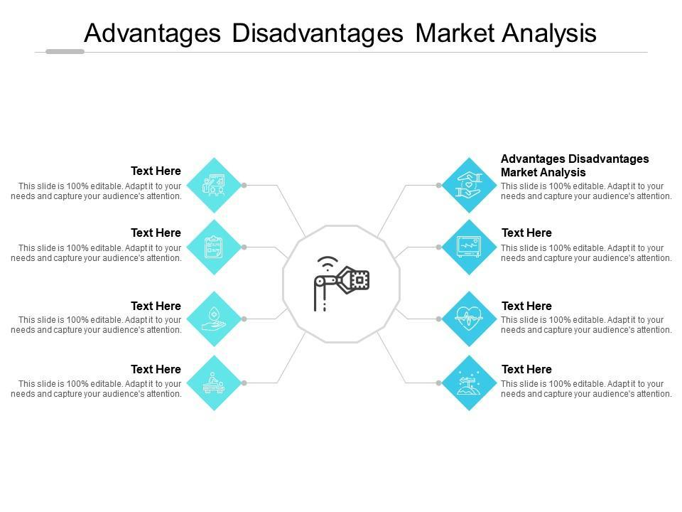

## Table of Contents

## What is a contra market?

A contra market is a situation in the financial world where the usual trends or expectations are reversed. Instead of going up when they are supposed to, prices might go down, or vice versa. This can happen because of unexpected events or changes in what people think will happen in the economy.

For example, if everyone expects a certain stock to rise because a company is doing well, but then the stock price falls, that's a contra market situation. It can be confusing and challenging for investors because it goes against what they thought would happen. Understanding contra markets can help investors make better decisions and possibly find new opportunities when things don't go as planned.

## How does a contra market differ from a traditional market?

In a traditional market, things usually work the way people expect them to. If a company is doing well, its stock price goes up. If the economy is growing, people feel confident and spend more money. It's like following a recipe where you know what to expect if you follow the steps. Investors in a traditional market often make decisions based on these predictable patterns and trends.

A contra market, on the other hand, is like cooking without a recipe. Things don't go as planned, and what usually happens doesn't happen. For instance, a company might be doing great, but its stock price could still drop. This can happen because of unexpected news, changes in what people think will happen, or other surprises. In a contra market, investors need to be ready for surprises and might find opportunities where others see problems.

## What are the basic principles of trading in a contra market?

Trading in a contra market means you need to be ready for surprises. Instead of following the usual patterns, you have to pay close attention to what's happening right now. You might see a company's stock price drop even though the company is doing well. This can happen because of unexpected news or changes in what people think will happen. So, it's important to stay informed and be ready to change your plans quickly.

Another key principle is to look for opportunities where others see problems. In a contra market, things that are usually bad signs might actually be good chances to buy. For example, if everyone is selling a stock because they're scared, it might be a good time for you to buy if you think the fear is overblown. It's like finding a bargain when everyone else is panicking. Being patient and keeping a cool head can help you make smart choices in a contra market.

## What are the potential advantages of investing in a contra market?

Investing in a contra market can give you a chance to buy things at lower prices. When everyone else is scared and selling, you might see that the fear is too much. If you believe a company is still good even though its stock price is low, you can buy its shares for less. Later, when things calm down and people see the company is doing well, the price might go up again. This means you could make a good profit by buying low and selling high.

Another advantage is that you can stand out from the crowd. Most people follow the usual trends and might miss out on good deals in a contra market. By being ready to go against what everyone else is doing, you can find opportunities that others ignore. This can help you build a diverse investment portfolio and possibly earn more money than if you just followed the traditional market trends.

## Can you explain the concept of contrarian investing?

Contrarian investing is when you decide to do the opposite of what most other investors are doing. If everyone is selling a stock because they think it's going to do badly, a contrarian investor might buy it, thinking that the fear is overblown and the stock will go up again. It's like swimming against the current, going against the popular opinion in the hope that you're right and everyone else is wrong.

This type of investing can be risky because you're betting on something that most people think will fail. But it can also be very rewarding. If you're right and the stock does well after everyone else has given up on it, you could make a lot of money. Contrarian investors need to do a lot of research and be very patient, waiting for the right moment to buy low and sell high. It's all about seeing value where others see only problems.

## What are some common strategies used in contra markets?

In a contra market, one common strategy is to look for stocks that are being sold off more than they should be. This means finding companies that are still doing well but their stock prices are low because everyone is scared. If you believe the fear is too much and the company will recover, you can buy the stock at a low price and wait for it to go back up. This is called buying the dip. It's like finding a good deal on something that's temporarily on sale.

Another strategy is to keep a cool head when everyone else is panicking. In a contra market, it's easy to get caught up in the fear and make quick decisions that you might regret later. But if you stay calm and do your research, you might see opportunities that others miss. This can mean holding onto stocks that are falling in price because you believe they will recover, or even buying more of them at a lower price. It's all about being patient and trusting your own judgment when things seem uncertain.

## How can an investor identify a contra market opportunity?

To identify a contra market opportunity, an investor needs to look for situations where the market is behaving differently than expected. This can happen when a company's stock price drops even though the company is doing well. It might be because of bad news, like a report that scares people, or because everyone is selling their stocks out of fear. By staying informed about what's happening in the news and the economy, an investor can spot these moments when the market is overreacting.

Once you see this overreaction, the next step is to do your homework. You need to check if the company is still strong, even if its stock price is low. Look at the company's financial reports, read about what experts are saying, and think about whether the fear in the market is justified. If you believe the company will recover and the stock price will go up again, that's a contra market opportunity. It's like finding a hidden gem that others are too scared to see.

## What are the risks associated with contra market investing?

Contra market investing can be risky because it goes against what most people are doing. When you invest in a contra market, you're betting that the market is wrong and that the stocks you buy will go up again. But if the market keeps going down, you could lose a lot of money. It's like standing alone against a big wave; if the wave doesn't turn around, it can knock you over.

Another risk is that it can be hard to tell if you're right about a contra market opportunity. Sometimes, the market might be right to be scared, and the stocks you buy might keep going down. It can take a long time for a stock to recover, and you need to be patient and have enough money to wait it out. If you need to sell your stocks quickly because you need the money, you might have to sell them at a loss.

## Can you provide historical examples of successful contra market investments?

One famous example of successful contra market investing happened during the 2008 financial crisis. When the housing market crashed and many big banks were failing, a lot of people were scared and selling their stocks. Warren Buffett, a famous investor, saw this as a chance to buy. He invested billions of dollars in companies like Goldman Sachs and Bank of America, even though everyone else thought it was a bad idea. His belief that these companies would recover paid off, and he made a lot of money as the market bounced back.

Another example is the dot-com bubble in the late 1990s. During this time, many internet companies were booming, and their stock prices were very high. But some investors, like Bill Miller, thought these prices were too high and that the bubble would burst. He sold his tech stocks and bought shares in companies that were not as popular, like those in the energy sector. When the dot-com bubble did burst in 2000, the tech stocks crashed, but Miller's investments in other areas did well, showing that going against the crowd can sometimes lead to big rewards.

## How do economic cycles influence contra market trends?

Economic cycles can really change how a contra market works. When the economy is doing well and growing, people feel happy and spend more money. But sometimes, even when things are good, some stocks might go down because people think they're too expensive. This can create a contra market where smart investors see a chance to buy these stocks at a lower price. They believe that even though the economy is good, the market is overreacting, and the stocks will go back up.

On the other hand, when the economy is not doing well and is in a recession, people get scared and start selling their stocks. This can make stock prices drop a lot, even for companies that are still doing okay. In this situation, a contra market can happen when investors see that the fear is too much and the stocks are a good deal. They buy these stocks, hoping that when the economy gets better, the prices will go up again. So, economic cycles can create chances for contra market investing, but it's all about understanding when the market is overreacting.

## What role do market sentiment and psychology play in contra markets?

Market sentiment and psychology are really important in contra markets. They can make a big difference in how people act and what happens to stock prices. When everyone feels scared or worried, they might start selling their stocks, even if the companies are still doing okay. This fear can make stock prices go down a lot, creating a contra market. Smart investors who understand this can see that the fear is too much and buy stocks at a low price, hoping to make money when things calm down.

On the other hand, when people are too excited and think everything is going to be great, they might buy too many stocks and push the prices up too high. If an investor thinks the excitement is too much and the prices will fall, they might sell their stocks before everyone else does. This can also create a contra market, where going against what everyone else is doing can be a good move. Understanding how people feel and think can help investors spot these chances and make smart choices in a contra market.

## How can advanced analytical tools enhance contra market investment decisions?

Advanced analytical tools can help investors make better decisions in a contra market by giving them a lot of information and helping them see patterns that are hard to spot. These tools can look at a lot of data quickly and find out if a stock is really a good deal or if it's just a bad time for the market. They can also help investors see how people are feeling about the market, which is important in a contra market where fear or excitement can make prices go up or down a lot. By using these tools, investors can make choices based on facts and not just on what everyone else is doing.

For example, tools like sentiment analysis can look at what people are saying on social media or in the news to see if everyone is scared or excited. This can help investors know if the market is overreacting. Other tools, like technical analysis software, can show investors charts and patterns that might tell them when it's a good time to buy or sell. By using these advanced tools, investors can find hidden opportunities in a contra market and make smarter choices about when to go against what everyone else is doing.

## What are the key aspects of understanding investment strategies?

Investment strategies are essential tools that guide individuals and firms in making informed financial decisions. By employing the right strategies, investors can effectively mitigate risks, maximize returns, and align their activities with long-term financial objectives. 

One of the foundational strategies is portfolio diversification. This involves spreading investments across a variety of assets to reduce the impact of any single asset's poor performance on the overall portfolio. By diversifying their holdings, investors can minimize unsystematic risk — the risk unique to a particular company or industry. Mathematically, the benefits of diversification are often captured in the correlation coefficient ($\rho$) between asset returns: 

$$

\text{Portfolio Risk} = \sqrt{\left(\frac{w_1^2 \cdot \sigma_1^2 + w_2^2 \cdot \sigma_2^2 + 2 \cdot w_1 \cdot w_2 \cdot \sigma_1 \cdot \sigma_2 \cdot \rho_{12}}{n}\right)} 
$$

where $w$ represents the weights of different assets in the portfolio, $\sigma$ the standard deviations, and $n$ the number of assets.

Risk management is another key aspect of investment strategies. It involves identifying, assessing, and prioritizing risks followed by coordinated efforts to minimize, monitor, and control the probability or impact of unfortunate events. Techniques such as stop-loss orders, hedging, and the use of derivatives enable investors to manage potential downsides effectively. For instance, options and futures contracts can be used to hedge against adverse price movements.

Tactical asset allocation is a dynamic approach where investors adjust their investment proportions across various asset classes in response to changing market conditions and trends. Unlike a static strategy where the asset mix is fixed, tactical allocation provides flexibility and allows investors to capitalize on market inefficiencies and emerging opportunities. This strategy involves systematically assessing macroeconomic conditions, market trends, and sector performance to make timely adjustments to the investment portfolio.

Each of these strategies serves a distinct purpose, and their effectiveness is enhanced when tailored to an investor's specific goals, risk tolerance, and market conditions. By systematically analyzing and applying these strategies, investors can navigate the complexities of the financial markets and achieve more favorable outcomes.

## References & Further Reading

[1]: Bergstra, J., Bardenet, R., Bengio, Y., & Kégl, B. (2011). ["Algorithms for Hyper-Parameter Optimization."](https://dl.acm.org/doi/10.5555/2986459.2986743) Advances in Neural Information Processing Systems 24.

[2]: ["Advances in Financial Machine Learning"](https://www.amazon.com/Advances-Financial-Machine-Learning-Marcos/dp/1119482089) by Marcos Lopez de Prado

[3]: ["Evidence-Based Technical Analysis: Applying the Scientific Method and Statistical Inference to Trading Signals"](https://www.amazon.com/Evidence-Based-Technical-Analysis-Scientific-Statistical/dp/0470008741) by David Aronson

[4]: ["Machine Learning for Algorithmic Trading"](https://github.com/stefan-jansen/machine-learning-for-trading) by Stefan Jansen

[5]: ["Quantitative Trading: How to Build Your Own Algorithmic Trading Business"](https://www.amazon.com/Quantitative-Trading-Build-Algorithmic-Business/dp/1119800064) by Ernest P. Chan