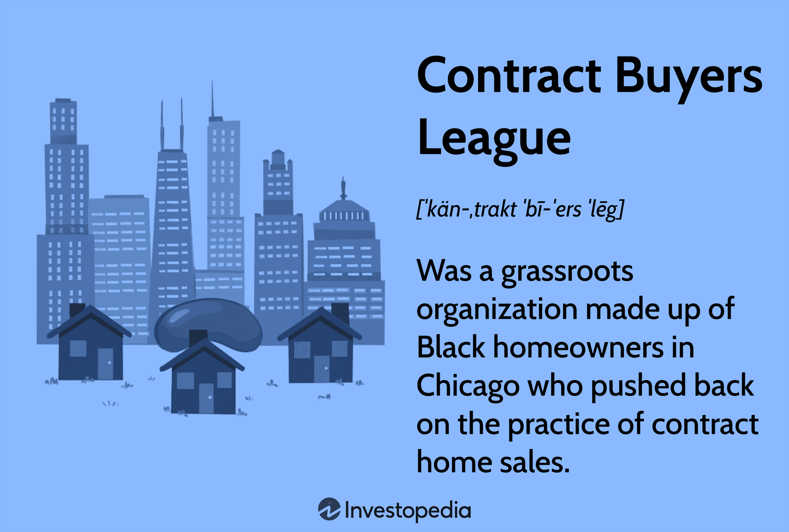

Housing discrimination is a systemic issue in which individuals or families are treated unfairly in housing transactions based on race, ethnicity, or other characteristics protected under civil rights laws. This discrimination has played a significant role in perpetuating racial and economic inequalities in the United States. The civil rights movement has historically sought to eliminate discriminatory practices and ensure equal opportunities for all citizens. Housing discrimination dates back to legal and social frameworks that marginalized African Americans and other minority communities since the early 20th century. Practices such as redlining, exclusionary zoning, and discriminatory loan lending were prevalent, creating racially segregated neighborhoods and economic disparities.

A pivotal player in the history of combating housing discrimination was the Contract Buyers League. Emerging in the 1960s, this grassroots organization arose in response to exploitative housing contracts that targeted African American homebuyers in Chicago. The League advocated for fairness and accountability, challenging real estate practices that perpetuated inequality and segregation. Their efforts not only led to significant legal victories but also raised national awareness of discriminatory housing practices, laying the groundwork for transforming housing policies and civil rights laws.

In the contemporary context, the advent of algorithmic solutions and advanced data analysis offers new avenues for civil rights advocacy. Algorithms and machine learning can analyze vast datasets to uncover patterns of discrimination and propose equitable interventions. These technologies have the potential to identify implicit bias in housing finance and market practices that have historically marginalized communities. By leveraging such tools, modern civil rights advocates can efficiently expose and address discriminatory practices.

Understanding historical movements like the Contract Buyers League is crucial in informing today's challenges. By learning from past strategies and successes, current civil rights efforts can be more effective in utilizing technology to advocate for social justice. The integration of historical insights with algorithmic advancements offers promising potential to combat housing discrimination in an increasingly digital society.

## Table of Contents

## Understanding the Contract Buyers League

The Contract Buyers League (CBL) emerged as a pivotal organization in the fight against entrenched housing discrimination practices in the United States. Formed in the late 1960s in Chicago, Illinois, the group was primarily composed of African American homeowners who had been systematically exploited through predatory housing contracts. These contracts, enforced during a period of intense housing segregation, largely ignored legal protections that should have been afforded to buyers.

The motivation behind the formation of the Contract Buyers League can be traced back to the oppressive practice known as "contract selling." In this arrangement, sellers offered homes to African American buyers in installments without transferring the title until the full amount was paid. These buyers typically faced exorbitant interest rates and restrictive terms that made defaulting almost inevitable. Unlike traditional mortgages, any missed payment could result in the loss of the home and all payments made, leaving families with neither a residence nor equity.

The CBL contested such exploitative practices, advocating for contractual equity and legislative measures to prevent future discrimination. The organization embarked on a series of protests and legal actions that targeted these unscrupulous business practices. The League's members sought not only to expose the injustices but also to pursue redress through economic boycotts and coordinated legal efforts. One of their defining legal battles involved class-action lawsuits against contract sellers, arguing that these practices violated principles of fairness and equity enshrined in ongoing civil rights discussions.

The achievements of the Contract Buyers League played a significant role in shaping modern housing laws. Through its activism, the League contributed to increased awareness of housing discrimination and influenced subsequent legislative reforms. The Fair Housing Act of 1968 was enacted during this period, offering new protections against discriminatory practices in housing and lending. Although the CBL's activities mainly concentrated on the injustices in Chicago, their ripple effects reached wider audiences and emboldened other communities to challenge discriminatory housing practices.

Their legacy extends beyond mere activism; the CBL's fight underscored the interconnectedness of economic inequality and racial discrimination. It highlighted the necessity for systemic change in both policy and practice. Modern housing laws now incorporate stronger anti-discrimination measures, crediting the efforts of organizations like the CBL in laying the groundwork for contemporary civil rights advancements. While challenges remain, including subtle biases in housing and lending, the foundational work of the Contract Buyers League continues to inspire and instruct civil rights advocates today.

## The Role of Housing Discrimination in Civil Rights

Housing discrimination refers to the practice of denying individuals or groups equal access to housing based on race, ethnicity, religion, gender, or other characteristics. It embodies not just a social injustice but also a violation of civil rights, as it infringes upon the right to equality and non-discrimination. These discriminatory practices have historically contributed to systemic inequalities within the United States, shaping the socioeconomic landscape and reinforcing racial and economic disparities.

The implications of housing discrimination on civil rights are profound, affecting not only the availability of housing but also impacting access to quality education, employment opportunities, and overall economic stability. Discriminatory housing policies, such as redlining, have segregated communities and restricted wealth accumulation for marginalized groups, primarily African Americans. Redlining, a term derived from the practice of banks and insurers outlining areas deemed risky for investment—often based on the racial composition of the area—prevented residents in these neighborhoods from obtaining mortgages and insurance. The economic disenfranchisement resulting from such practices has had intergenerational consequences, entrenching existing disparities.

Several landmark laws and policies have been enacted in an attempt to address and rectify these discriminatory housing practices. The Fair Housing Act of 1968 is one of the most significant pieces of legislation aimed at eliminating housing discrimination. It prohibits discrimination concerning the sale, rental, and financing of dwellings based on race, religion, national origin, sex, (and as amended) disability, and family status. The Act has served as a legal backbone in the fight against housing discrimination, enabling individuals to seek redress and fostering more inclusive communities.

Despite these legislative efforts, ongoing challenges persist. Implicit biases in lending, discriminatory zoning laws, and unequal enforcement of regulations continue to perpetuate housing bias and prejudice. For instance, studies have shown that people of color are often given higher loan rates and fewer loan options compared to their white counterparts, even when controlling for financial status. Discriminatory zoning laws that favor single-family homes over multi-family units limit the availability of affordable housing in desirable areas, further entrenching socioeconomic divides.

Moreover, the evolution of technology introduces new dimensions to these challenges. Algorithms used in credit scoring and mortgage approval processes can inadvertently reflect and amplify existing biases, raising ethical concerns about fairness and accountability in decision-making.

Addressing these entrenched issues requires a multifaceted approach, involving not only the enforcement of existing laws but also the continuous evaluation and adjustment of policies to ensure they meet the evolving nature of discrimination. This necessitates a collaborative effort between government entities, civil rights organizations, and increasingly, technologists, to harness data and technology to identify and mitigate discriminatory practices in housing.

## Algorithmic Trading: An Emerging Frontier

Algorithmic trading leverages computer algorithms to execute trades in financial markets, utilizing pre-defined instructions such as timing, price, or quantity. Key components include data collection, processing, decision-making algorithms, and automated execution systems. These elements enable rapid and efficient trading, minimizing human intervention and maximizing precision.

The potential of algorithmic tools extends beyond financial markets, offering insightful analyses of housing market trends. By processing vast amounts of data, algorithms can identify patterns and predict housing price changes, mortgage default risks, and market demand fluctuations. This capability can help stakeholders make informed decisions about real estate investments and policy-making.

Big data and [machine learning](/wiki/machine-learning) play pivotal roles in revealing implicit biases within housing finance. Machine learning algorithms can analyze historical lending data to detect patterns of discrimination against certain demographics. For instance, an algorithm trained on biased lending decisions might perpetuate discrimination unless carefully monitored and adjusted. By identifying such biases, institutions can take corrective actions to ensure fair treatment across all demographics.

However, employing algorithms for social justice in housing finance raises significant legal and ethical considerations. Ensuring transparency in algorithm design and implementation is critical to prevent unintended discrimination. Policymakers must establish guidelines to protect individual rights and ensure algorithms adhere to anti-discrimination laws.

Ethical frameworks should guide the development and application of algorithmic tools. Developers must address data privacy concerns and ensure unbiased data sources. Regular audits and bias detection systems can help maintain algorithmic integrity. Collaboration between technologists, legal experts, and civil rights advocates is crucial to develop fair and effective solutions for addressing housing discrimination through technology.

## Integrating Lessons from the Past with Future Technologies

The Contract Buyers League (CBL), formed in the late 1960s, utilized grassroots organizing and legal strategies to challenge discriminatory housing practices such as exploitative contracts, redlining, and segregation. This historical framework provides valuable insights into how modern digital tools can be leveraged to fight against similar injustices in today's housing sector.

**Parallels between Historical Strategies and Modern Tools**

The core strategies employed by the CBL, which included community mobilization, legal advocacy, and public awareness, can be closely aligned with the capabilities of digital tools today. Platforms for digital communication and social media can drastically amplify efforts similar to those of the CBL, reaching broader audiences and mobilizing communities quickly and efficiently. Furthermore, the data-driven approach that the CBL employed to demonstrate discriminatory practices can now be augmented by advanced analytics and algorithmic solutions capable of processing vast amounts of data at unprecedented speeds.

**Using Technology to Combat Housing Discrimination**

One of the most promising applications of technology is the use of big data and machine learning to identify patterns of discrimination within the housing market. By analyzing rental and sales listings, algorithms can spot discrepancies in pricing or availability based on location, which might suggest redlining or bias. Predictive modeling can further be used to assess the risk of discrimination based on historical data, providing a proactive mechanism to forecast and prevent potential biases.

Data visualization tools can also play a crucial role by presenting complex data in a manner that is easily understandable. Infographics and interactive maps can highlight discriminatory patterns and inform public discourse and policy-making. Moreover, blockchain technology offers a transparent and secure way to handle transactions, which can help in building trust and fairness in housing contracts.

**Empowering Communities through Civic Tech**

Civic tech initiatives, aimed at using technology for the public good, can empower communities affected by housing discrimination. Apps and platforms that facilitate the reporting of discriminatory practices or that provide legal information and resources can enable individuals to become more active participants in advocating for their own rights. For example, platforms that connect affected individuals with advocacy groups or legal aid can streamline the process of seeking justice.

Moreover, technology can create new opportunities for civic engagement and education, raising awareness of rights and resources available to combat discrimination. Workshops and webinars hosted online can reach larger audiences, educating citizens on issues like fair housing rights, while virtual reality experiences can simulate discriminatory practices, increasing empathy and understanding among broader audiences.

**Collaborations between Civil Rights Advocates and Technologists**

For meaningful breakthroughs in combating housing discrimination, collaboration between civil rights advocates and technologists is paramount. Such partnerships can lead to the development of innovative tools specifically tailored to detect and address biases in the housing market. Advocacy groups bring critical insights regarding the nuances of discrimination, while technologists contribute the skills needed to develop sophisticated algorithms and robust platforms.

Joint efforts could include hackathons focused on social justice issues, fostering an environment where diverse minds collaborate on software solutions. Development of APIs that facilitate integration between various platforms can also ensure seamless sharing of information and resources among different advocacy groups.

Incorporating feedback mechanisms within technology solutions is essential to continually adapt and improve tools based on real-world use cases and challenges faced by affected communities. Through iterative development and community involvement, technology can be fine-tuned to serve as a powerful ally in the fight against housing discrimination, building on the legacy of pioneers like the Contract Buyers League.

## Conclusion

The Contract Buyers League (CBL) has provided enduring lessons in combating housing discrimination, demonstrating the power of grassroots advocacy and legal action in addressing systemic injustices. Their strategic efforts in the 1960s and 1970s laid essential groundwork for contemporary civil rights movements by highlighting the necessity of organized community action and legal challenges to dismantle discriminatory structures. This historical example serves as a reminder of the effectiveness of collective action in achieving significant social change.

As we confront modern civil rights issues, [algorithmic trading](/wiki/algorithmic-trading) and related technologies offer promising opportunities to identify and rectify disparities in housing markets. These technologies can analyze vast quantities of data to uncover patterns and biases invisible to human investigators, making it possible to develop more equitable housing policies and practices. Algorithmic tools can thereby extend the legacy of CBL by offering new methods to fight discrimination and promote fairness.

Integrating the lessons of past advocacy with modern technology demands proactive collaboration. Policymakers, tech developers, and civil rights organizations must work together to ensure that technological solutions are used inclusively and ethically. By harnessing technology like machine learning and big data analytics, these diverse groups can create tools that not only map current disparities but also predict and prevent future discriminatory practices.

A concerted effort is required to bring together historical insights and contemporary technological capabilities. Policymakers should create frameworks that encourage the ethical use of technology in civil rights advocacy. Tech developers must commit to designing algorithms that are transparent and justice-oriented. Civil rights organizations should lead in identifying areas where technology could best serve the cause of equality.

In conclusion, the legacy of the Contract Buyers League exemplifies the profound impact of organized advocacy, offering valuable lessons for modern civil rights challenges. As we advance, leveraging algorithmic trading and other technologies can drive significant progress if we are diligent in merging these tools with the ethos of equity and justice established by pioneers like CBL. It is imperative for all stakeholders to collaborate, bridging past experiences with future innovations, ensuring a just and equitable society for all.

## References & Further Reading

[1] Satter, B. (2009). ["Family Properties: How the Struggle Over Race and Real Estate Transformed Chicago and Urban America."](https://www.amazon.com/Family-Properties-Struggle-Transformed-Chicago/dp/0805091424) Metropolitan Books.

[2] Rothstein, R. (2017). ["The Color of Law: A Forgotten History of How Our Government Segregated America."](https://books.google.com/books/about/The_Color_of_Law_A_Forgotten_History_of.html?id=SdtDDQAAQBAJ) Liveright Publishing.

[3] Coates, T.-N. (2014). ["The Case for Reparations."](http://pscourses.ucsd.edu/ps108/6%20Reparations/Coates%202014-%20The%20Case%20for%20Reparations.pdf) The Atlantic.

[4] Massey, D. S., & Denton, N. A. (1993). ["American Apartheid: Segregation and the Making of the Underclass."](https://www.jstor.org/stable/pdfplus/2781105.pdf) Harvard University Press.

[5] Shapiro, T. M. (2005). ["The Hidden Cost of Being African American: How Wealth Perpetuates Inequality."](https://www.amazon.com/Hidden-Cost-Being-African-American/dp/0195181387) Oxford University Press.

[6] U.S. Department of Housing and Urban Development. (2020). ["Office of Policy Development and Research - Discrimination in Housing."](https://en.wikipedia.org/wiki/Homelessness_in_the_United_States)

[7] Bartlett, R., Morse, A., Stanton, R., & Wallace, N. (2021). ["Consumer-Lending Discrimination in the FinTech Era."](https://www.sciencedirect.com/science/article/abs/pii/S0304405X21002403) National Bureau of Economic Research.

[8] Zuboff, S. (2019). ["The Age of Surveillance Capitalism: The Fight for a Human Future at the New Frontier of Power."](https://www.jstor.org/stable/26862460?googleloggedin=true) PublicAffairs.

[9] Noble, S. U. (2018). ["Algorithms of Oppression: How Search Engines Reinforce Racism."](https://www.jstor.org/stable/j.ctt1pwt9w5) NYU Press.