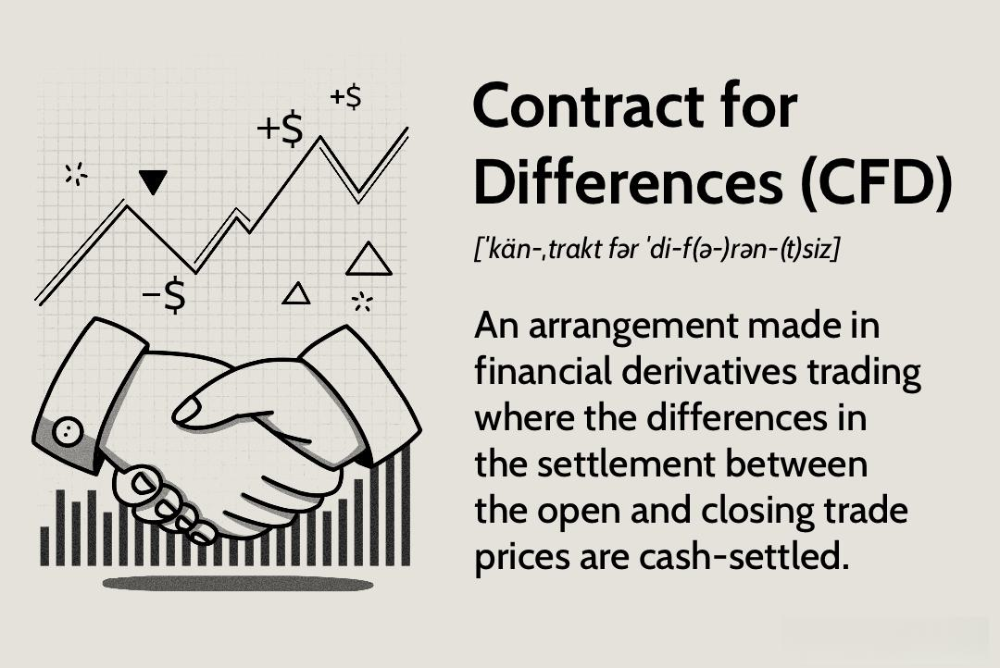

Contract for Difference (CFD) trading is a sophisticated financial instrument that allows traders to speculate on the price movements of various assets without owning them. This derivative product provides unique opportunities for investors to benefit from both rising and falling markets. CFDs are versatile, finding application across a wide array of financial markets, including stocks, commodities, indices, and recently, cryptocurrencies. By enabling investors to use leverage, CFDs amplify potential profits, but also carry the risk of significant losses, thus requiring comprehensive risk management strategies.

The integration of algorithmic trading, or algo trading, has transformed the landscape of financial markets, including CFD trading. By leveraging computer algorithms, traders can execute complex trades at a speed and frequency that surpasses human capacity, optimizing trade execution and minimizing manual intervention. Algorithmic trading uses sophisticated techniques, including machine learning and statistical analysis, to predict market trends and make informed trading decisions. This automation can lead to more precise entry and exit points, potentially improving trading outcomes.



This article focuses on CFD trading, particularly the synergy between CFD trading and algorithmic strategies. We will investigate how combining these elements can maximize investment potential, discussing the tangible benefits and inevitable risks. The exploration extends to essential trading strategies that can harness the power of algorithmic insights to improve profitability. As the financial markets continue to evolve, understanding and utilizing algorithmic trading in CFDs could provide a competitive edge for traders seeking to enhance their financial portfolios.

## Table of Contents

## Understanding Contract for Difference (CFD)

A Contract for Difference (CFD) is a financial instrument that represents an agreement between a trader and a financial institution, where they exchange the difference in the value of an underlying asset from the time the contract is opened until it is closed. Unlike traditional asset trading, where ownership of the stock, commodity, or index is acquired, CFD trading allows for speculation on price movement without the necessity of owning the asset itself. The profit or loss is determined by the difference between the opening and closing prices of the contract and the size of the position held.

CFDs are particularly attractive in volatile markets. Their high leverage characteristic allows traders to control larger positions with a relatively small amount of capital. This leverage is calculated using the margin formula:

$$
\text{Leverage} = \frac{\text{Value of the Contract}}{\text{Margin Requirement}}
$$

For instance, if a trader wants to open a CFD position with a value of $10,000 and the margin requirement is 5%, they would need to deposit only $500. This leverage can magnify profits when the market moves favorably, but it also increases the potential for substantial losses if the market moves against the position.

The flexibility of CFD trading lies in the trader's ability to enter both long and short positions. Going long involves buying a CFD with the expectation that the underlying asset's price will rise, allowing the trader to sell it at a higher price. Conversely, going short involves selling a CFD, anticipating a decline in the asset's price, and aiming to repurchase it at a lower price. This bidirectional trading capability enables traders to exploit market trends regardless of whether they move upward or downward.

Overall, CFDs offer a dynamic and accessible way for traders to benefit from market fluctuations, particularly in volatile markets. However, the leverage that they provide necessitates careful risk management to mitigate potential financial losses.

## How Algorithmic Trading Works with CFDs

Algorithmic trading in the context of CFDs employs automated systems that [carry](/wiki/carry-trading) out trades based on pre-established criteria without requiring constant human oversight. These systems offer numerous advantages to traders, particularly in CFD markets where speed and timing are crucial. Here’s how [algorithmic trading](/wiki/algorithmic-trading) operates within the framework of CFD trading:

First, these algorithms are designed to scan massive sets of market data to identify potential trading opportunities. By analyzing trends and patterns within these data arrays, they can forecast future price movements with a degree of accuracy unattainable by manual trading methods. For example, a trading algorithm might utilize a moving average crossover strategy, where it buys a CFD when a short-term moving average surpasses a long-term moving average, signaling a potential upward trend.

Moreover, the rapid execution capabilities of algorithmic systems allow for trades to be executed in milliseconds. This is particularly beneficial in the volatile CFD markets where prices can shift rapidly. High-frequency trading ([HFT](/wiki/high-frequency-trading-strategies)) algorithms, in particular, thrive on such rapid market fluctuations, executing a multitude of trades swiftly to capitalize on small price movements. The following Python snippet illustrates a simple moving average crossover strategy that could be used in algorithmic trading of CFDs:

```python
import numpy as np
import pandas as pd

def moving_average_crossover(prices, short_window=50, long_window=200):
    """
    This function calculates the moving average crossover signal.
    :param prices: A pandas Series of prices.
    :param short_window: Number of days for the short moving average.
    :param long_window: Number of days for the long moving average.
    :return: A pandas Series containing the signals.
    """
    short_ma = prices.rolling(window=short_window, min_periods=1).mean()
    long_ma = prices.rolling(window=long_window, min_periods=1).mean()
    signals = np.where(short_ma > long_ma, 1, 0)
    return pd.Series(signals, index=prices.index)
```

Algorithmic systems also leverage statistical models and [machine learning](/wiki/machine-learning) techniques to refine trading strategies over time. Machine learning algorithms can be trained on historical CFD market data to predict future trends and adjust trading methodologies accordingly. This leads to continual improvement and adaptation to the ever-changing market conditions.

The inherent efficiency of algorithmic trading reduces trading costs by minimizing the time between recognizing an opportunity and executing a trade. This quick execution not only saves on potential slippage but also improves the accuracy of trades as the algorithms are less likely to be influenced by human emotions such as fear or greed. Such efficiency is crucial in CFDs, given their margin trading nature, where small price differences can significantly impact the trading outcome.

In summary, the integration of algorithmic trading within CFD markets enhances trading efficacy through sophisticated data analysis, rapid trade execution, and dynamic strategy optimization, ultimately providing traders with a competitive edge in high-frequency, volatile environments.

## Benefits of CFD Algorithmic Trading

Algorithmic trading offers a multitude of benefits when applied to Contract for Difference (CFD) trading, significantly enhancing the trading process in various ways. A primary advantage is the capability for high-frequency trading (HFT), which is well-suited for CFD markets due to their volatile nature. HFT algorithms can execute numerous trades in fractions of a second, allowing traders to capitalize on small price fluctuations that occur over short timeframes. This is particularly advantageous in CFD trading, where slight changes in asset prices can result in substantial profits when leveraged appropriately.

Another benefit is the reduction of emotional and psychological biases that often affect human traders. Automated algorithms operate based on pre-set criteria and analytical data, eliminating impulsive decision-making caused by fear or greed. This objectivity can lead to more consistent trading outcomes, as decisions are made using logical parameters rather than emotional reactions.

The ability to backtest and optimize trading strategies using historical data is another significant advantage of algorithmic trading in the CFD context. Backtesting encompasses running a trade strategy against historical market data to evaluate its potential profitability and refine its parameters. This process allows traders to optimize their strategies before deploying them in the live market, enhancing the likelihood of success. Traders can use programming languages such as Python to simulate trading scenarios. For example:

```python
import pandas as pd
import numpy as np

# Load historical data
data = pd.read_csv('historical_cfd_data.csv')

# Simple moving average strategy
data['SMA_10'] = data['Close'].rolling(window=10).mean()
data['SMA_50'] = data['Close'].rolling(window=50).mean()

# Define trading signals
data['Signal'] = np.where(data['SMA_10'] > data['SMA_50'], 1, 0)

# Calculate returns
data['Returns'] = data['Close'].pct_change() * data['Signal'].shift(1)

# Calculate cumulative returns
data['Cumulative Returns'] = (1 + data['Returns']).cumprod()

# Display final cumulative return
print(f"Final Cumulative Return: {data['Cumulative Returns'].iloc[-1]}")
```

This Python script provides a basic framework to implement a moving average crossover strategy and evaluate its performance over a dataset of historical prices.

Finally, algorithmic trading enhances market [liquidity](/wiki/liquidity-risk-premium) and reduces slippage due to the rapid execution of trades. Liquidity refers to the ease with which assets can be bought or sold in the market without causing significant price movement. Since algorithmic systems execute trades at lightning speed, they help absorb market orders, thereby improving overall liquidity. Additionally, the swift execution minimizes slippage, which is the difference between the expected price of a trade and the actual price at which it is executed. Reduced slippage ensures that trades are executed closer to the intended price, preserving profit margins.

In conclusion, the integration of algorithmic trading into CFD markets provides traders with a powerful toolset to effectively manage trades, mitigate risks, and maximize returns through enhanced speed, precision, and data-driven strategies.

## Risks and Challenges of CFD Algorithmic Trading

Contract for Difference (CFD) algorithmic trading presents numerous opportunities for automation and efficiency, but it also involves several inherent risks and challenges. A primary concern is the leverage used in CFD trading, which significantly magnifies both potential gains and losses. This characteristic necessitates robust risk management strategies. Traders must implement stringent stop-loss mechanisms and position-sizing techniques to mitigate the risk of catastrophic financial losses. A simple Python snippet for calculating optimal position size based on risk tolerance could look like this:

```python
def calculate_position_size(account_balance, risk_percent, stop_loss_points, contract_value):
    risk_value = account_balance * risk_percent / 100
    position_size = risk_value / (stop_loss_points * contract_value)
    return position_size

# Example usage
account_balance = 10000  # Total account balance
risk_percent = 2  # Willingness to risk 2% of the account
stop_loss_points = 50  # Points at which you'll stop the loss
contract_value = 10  # Value per contract point

size = calculate_position_size(account_balance, risk_percent, stop_loss_points, contract_value)
print(f"Optimal position size: {size} contracts")
```

Another significant risk is the potential for technical failures or algorithmic errors. These could arise from coding mistakes, external data feed problems, or hardware malfunctions. Such errors may lead to unintended trades or the failure to execute trades under certain market conditions, resulting in substantial financial losses.

High market [volatility](/wiki/volatility-trading-strategies) also poses a challenge, particularly for algorithmic systems designed to operate in stable or predictable markets. During unexpected events or economic announcements, market conditions can change rapidly, disrupting the assumptions underpinning an algorithm’s strategy. This disruption can cause algorithms to execute trades at non-ideal prices, exacerbating losses.

Regulatory challenges and the lack of transparency in CFD trading add another layer of complexity for traders. Regulations vary significantly across countries, affecting the accessibility and legal status of CFDs. Traders must stay informed about local laws to ensure compliance. Additionally, the opaque nature of some CFD trades can make it difficult for traders to fully understand the costs involved or the exact execution price of their trades, increasing the risk of financial loss.

Overall, while CFD algorithmic trading can be highly lucrative, it requires careful consideration of these risks. Successful traders will utilize comprehensive risk management strategies, remain vigilant about technical infrastructure, and stay informed regarding regulatory developments.

## Essential CFD Algorithmic Trading Strategies

Momentum-based strategies in CFD algorithmic trading involve identifying CFDs with strong price trends and executing trades in the direction of these trends. Typically, these strategies use technical indicators like moving averages or the Relative Strength Index (RSI) to determine [momentum](/wiki/momentum). The logic is straightforward: buy (or go long) CFDs that are trending upwards and sell (or go short) those trending downwards. Python libraries such as TA-Lib or pandas can be employed to calculate these indicators and automate trading decisions. For example, a simple Moving Average Crossover strategy might be implemented using pandas as follows:

```python
import pandas as pd

# Sample DataFrame df with 'Close' prices
df['MA_short'] = df['Close'].rolling(window=10).mean()
df['MA_long'] = df['Close'].rolling(window=50).mean()

signals = df['MA_short'] > df['MA_long']
```

Arbitrage strategies focus on exploiting price discrepancies across different markets or financial instruments. Arbitrage in CFD trading might involve taking opposing positions in CFDs and their underlying assets or related instruments when a price imbalance occurs. This strategy requires fast execution and algorithmic precision to lock in profits before the market corrects itself. Traders may use latency [arbitrage](/wiki/arbitrage), which exploits time delays between market updates in different exchanges or platforms.

Mean reversion strategies operate on the hypothesis that prices will return to their long-term mean or average. Such strategies involve identifying securities that have deviated significantly from their historical average and initiating trades in anticipation of a reversion. This requires calculating the mean and standard deviation over a set time-frame and determining entry and [exit](/wiki/exit-strategy) points based on statistical thresholds. Bollinger Bands, for example, can serve as an indicator of mean reversion opportunities:

```python
df['20_MA'] = df['Close'].rolling(window=20).mean()
df['Upper_band'] = df['20_MA'] + 2*df['Close'].rolling(window=20).std()
df['Lower_band'] = df['20_MA'] - 2*df['Close'].rolling(window=20).std()

entry = (df['Close'] < df['Lower_band'])
exit = (df['Close'] > df['Upper_band'])
```

Scalping strategies focus on profiting from small price gaps due to order flows or bid-ask spread discrepancies. Scalpers aim to execute a high number of trades within short time frames, capitalizing on smaller, frequent price movements. This requires advanced software and infrastructure to minimize latency and execute trades with minimal spread. Scalpers often use technical indicators like the stochastic oscillator or [volume](/wiki/volume-trading-strategy) weighted average price (VWAP) to guide their trading decisions. The profitability of [scalping](/wiki/gamma-scalping) depends heavily on reducing transaction costs and maintaining high execution speed. 

In summary, these algorithmic trading strategies require robust data analysis, fast execution, and sophisticated risk management. Algorithmic systems must be continuously monitored and optimized to adapt to changing market conditions and secure profitability.

## Conclusion

Contract for Difference (CFD) algorithmic trading represents a sophisticated and efficient method of engaging in financial markets, providing both substantial opportunities and inherent risks. Understanding the comprehensive mechanics of leverage and algorithmic systems is crucial for traders who wish to venture into this domain. Leverage can amplify profits, yet it equally magnifies potential losses, necessitating meticulous risk management practices. Algorithmic systems, while powerful, can encounter failures or errors, thus requiring constant monitoring and optimization.

To potentially enhance profitability, traders should employ rigorous risk management strategies. This involves setting strict stop-loss orders, diversifying trading algorithms, and routinely evaluating the performance of these systems against evolving market conditions. Algorithmic trading with CFDs allows for high-frequency trading and rapid execution, but these benefits come with the responsibility of ensuring the reliability and robustness of the underlying systems.

As financial markets continue to evolve and embrace technological advancements, the role of algorithmic trading in CFDs is anticipated to expand significantly. This growth will likely present additional opportunities for traders globally, as algorithms become more sophisticated and capable of handling complex trading scenarios. Ultimately, by maintaining a focus on continuous improvement of trading strategies and systems, traders can be better positioned to capitalize on the dynamic nature of CFD markets.

## FAQ

### FAQ

**What is a Contract for Difference (CFD)?**

A Contract for Difference (CFD) is a type of financial derivative that allows traders to speculate on the price movements of an asset without having to own the underlying asset itself. The contract is an agreement between the trader and a financial institution to exchange the difference in the value of an asset between the time the contract is opened and when it is closed. This allows traders to profit from both rising and falling markets by taking long or short positions. CFDs are popular in markets with high volatility due to their leverage capabilities, which enable traders to control larger positions with a relatively small initial investment.

**How does algorithmic trading enhance CFD trading?**

Algorithmic trading enhances CFD trading by automating and optimizing trade execution processes. It utilizes pre-programmed algorithms that can analyze market data, identify trends, and execute trades at speeds and frequencies that surpass human capabilities. These algorithms often incorporate advanced statistical models and machine learning techniques to predict market movements and optimize trading strategies. The primary advantages of employing algorithmic trading in CFDs include improved efficiency, reduced transaction costs, and minimized human error. By reacting to market changes in real-time, algorithmic trading can achieve faster execution and potentially capitalize on fleeting market opportunities.

**What are the main risks associated with leveraged CFD trading?**

Leveraged CFD trading involves substantial risks primarily due to the magnification of both potential gains and potential losses. Some key risks include:

1. **Market Volatility**: High levels of market volatility can lead to swift and unexpected price movements that may result in significant financial losses, especially when high leverage is utilized.

2. **Technical Failures**: Algorithmic trading systems depend on technological infrastructure, and any technical glitches or system failures can lead to improper trade executions.

3. **Algorithmic Errors**: Errors in the programming or logic of trading algorithms can result in incorrect trade decisions, potentially causing notable losses.

4. **Regulatory Risks**: CFD trading is subject to varying regulations across different countries, adding layers of complexity and potential legal issues.

Traders must employ robust risk management strategies to mitigate these risks while trading CFDs with leverage.

**Can algorithmic trading strategies be customized for CFD trading?**

Yes, algorithmic trading strategies can be customized for CFD trading. Traders or developers can tailor algorithms to suit specific trading goals, risk appetites, and market conditions. Customization may involve developing unique strategies such as momentum, arbitrage, or mean reversion tailored to CFD markets. Moreover, [backtesting](/wiki/backtesting), optimization, and parameter tuning can be done using historical data to ensure the algorithms perform efficiently in real-time trading. Programming languages like Python are commonly used to develop and customize such strategies for CFDs, offering flexibility through libraries and tools designed for [quantitative trading](/wiki/quantitative-trading).

**Are CFDs legal in my country?**

The legality of CFDs varies by country. In some regions, CFD trading is regulated and permitted, whereas in others, it is restricted or banned due to the high risk associated with leverage and market volatility. It is crucial for traders to consult local financial regulations and ensure compliance before engaging in CFD trading. Regulatory bodies such as the Financial Conduct Authority (FCA) in the UK, the Australian Securities and Investments Commission (ASIC) in Australia, and the European Securities and Markets Authority (ESMA) in Europe provide guidance on the legality and regulation of CFDs within their jurisdictions.

## References & Further Reading

[1]: Bergstra, J., Bardenet, R., Bengio, Y., & Kégl, B. (2011). ["Algorithms for Hyper-Parameter Optimization."](https://dl.acm.org/doi/10.5555/2986459.2986743) Advances in Neural Information Processing Systems 24.

[2]: ["Advances in Financial Machine Learning"](https://www.amazon.com/Advances-Financial-Machine-Learning-Marcos/dp/1119482089) by Marcos Lopez de Prado

[3]: ["Evidence-Based Technical Analysis: Applying the Scientific Method and Statistical Inference to Trading Signals"](https://www.amazon.com/Evidence-Based-Technical-Analysis-Scientific-Statistical/dp/0470008741) by David Aronson

[4]: ["Machine Learning for Algorithmic Trading"](https://github.com/stefan-jansen/machine-learning-for-trading) by Stefan Jansen

[5]: ["Quantitative Trading: How to Build Your Own Algorithmic Trading Business"](https://www.amazon.com/Quantitative-Trading-Build-Algorithmic-Business/dp/1119800064) by Ernest P. Chan