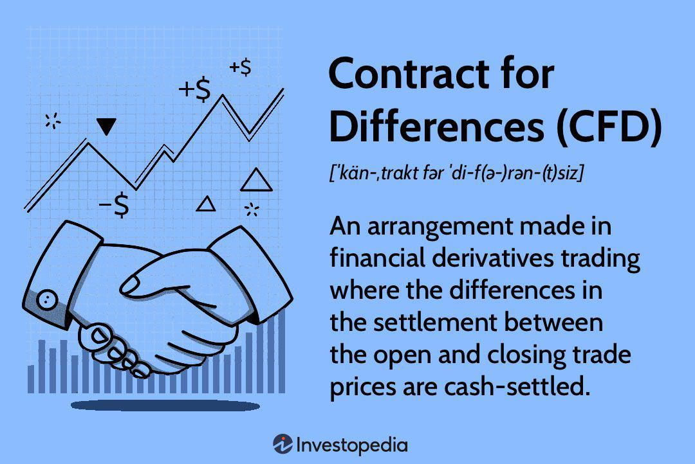

A Contract for Differences (CFD) is a financial instrument that allows traders to speculate on the price movements of various assets, such as stocks, commodities, and indices, without actually owning the underlying assets. This flexibility makes CFDs a valuable tool in modern financial trading, offering both retail and institutional investors the opportunity to engage with markets worldwide. The popularity of CFDs has surged due to their ability to provide exposure to multiple asset classes with relatively low capital outlay, thanks to the leverage offered by many brokers.

Algorithmic trading plays a pivotal role in the CFD market, allowing traders to execute orders with high speed and accuracy. By utilizing algorithms, traders can process large volumes of data and make real-time decisions that optimize trading outcomes. The use of algorithms minimizes the impact of human emotions and errors, offering a systematic approach to trading that enhances efficiency and reliability.

Globally, the potential of CFD trading continues to grow. Markets around the world are becoming increasingly interconnected, allowing traders to capitalize on macroeconomic trends with minimal geographical constraints. As technology advances, algorithmic trading strategies are becoming more sophisticated, contributing to the rising popularity of CFD trading. The accessibility of online trading platforms also plays a crucial role in CFD market expansion, providing educational resources and tools that empower traders to navigate complex market dynamics with confidence.

This article will explore various aspects of CFD financial trading, emphasizing both traditional strategies and algorithmic approaches. It aims to equip readers with a comprehensive understanding of CFDs’ mechanics, benefits, and risks, and to highlight the importance of informed decision-making in this rapidly evolving financial landscape.

## Table of Contents

## Understanding Contract for Differences (CFD)

A Contract for Differences (CFD) is a popular financial derivative that allows traders to profit from price movements without owning the underlying asset. Instead of buying or selling the actual asset, CFD traders enter into an agreement with a broker to exchange the difference in the asset's price from when the contract is opened to when it is closed. This financial instrument is widely used for its flexibility and accessibility to various global markets.

In CFD trading, the trader speculates on the future movement of asset prices. If they anticipate a price increase, they take a "buy" position, known as going long. Conversely, if they expect a price decline, they take a "sell" position, or go short. The primary advantage of this approach is that the trader is not required to purchase the actual asset, which can involve significant capital and logistical constraints.

CFDs provide access to a wide array of asset classes. These include stocks, where traders might speculate on the share prices of major companies; commodities such as gold, oil, and agricultural products; indices that reflect the performance of global stock markets; as well as currencies and cryptocurrencies. This extensive range allows traders to diversify their portfolios and exploit different market dynamics.

The legal status of CFD trading varies significantly across the globe. CFDs are legal and widely traded in many countries, including the UK, Australia, and several other European nations. However, they face strict regulatory constraints or outright bans in certain regions. In the United States, for example, CFD trading is restricted due to the regulatory environment established by the Securities and Exchange Commission (SEC) and the Commodity Futures Trading Commission (CFTC). These agencies impose rigorous standards to protect investors, resulting in limited availability of CFD products within the U.S. market. 

Internationally, regulatory authorities often impose rules requiring brokers to ensure transparency and manage leverage to safeguard traders. Such regulations are crucial in maintaining the integrity of the trading environment and protecting market participants from excessive risk.

## How CFD Trading Works

Contract for Differences (CFD) trading is a prominent method in financial markets that allows investors to speculate on price movements without owning the underlying assets. This section explains the process of opening and closing CFD positions, the concepts of leverage and margin, and the impact of the spread on trade profitability. Additionally, it provides an illustrative example to demonstrate the mechanics of CFD trading.

### Opening and Closing CFD Positions

To initiate a CFD trade, a trader opens a position with a broker by deciding whether they believe the price of an asset will rise or fall. If they anticipate a price increase, they open a long position (buy), whereas if they predict a price drop, they open a short position (sell). The trade is executed through an online platform where contracts are agreed upon. These contracts represent the change in value between the opening and closing positions of the chosen asset.

Once the desired market movement occurs or the trader wishes to realize profits (or cut losses), they close the position. A long position is closed by selling the CFDs back to the broker, while a short position is closed by buying them back.

### Leverage and Margin

Leverage is a crucial aspect of CFD trading that allows traders to control a more substantial position with a relatively smaller amount of invested capital. It is typically expressed as a ratio, such as 10:1, meaning that for every unit of currency traders need to put down, they can control ten units of their chosen asset.

For instance, if a trader wants to open a position worth $10,000 with a leverage of 10:1, they are only required to invest $1,000. Although leverage can amplify potential gains, it simultaneously increases the risk of significant losses, as losses are calculated on the full value of the position.

Margin is the fund that a trader must deposit to initiate and maintain a leveraged position. It consists of two primary components: the initial margin, required to open a position, and the maintenance margin, which must be retained to keep the position open. If the trader's balance falls below the maintenance margin due to losses, they may receive a margin call to either deposit additional funds or close positions to limit further loss.

### Importance of the Spread

The spread is the difference between the bid (buying) price and the ask (selling) price of an asset, and it directly affects the profitability of CFD trades. When opening a position, traders typically encounter the ask price, and upon closing, they receive the bid price. A wider spread means the market must move further in the trader's favor to achieve breakeven, impacting the net profit.

### Illustrative Example of a CFD Trade

Consider a scenario where a trader speculates that the price of a particular company's stock will rise. The current price of the stock is $100, with a spread of $0.50 (bid price of $99.75 and ask price of $100.25). The trader opens a long CFD position for 100 shares with a leverage ratio of 10:1.

- **Initial investment (margin):** $1,000
- **Total position value:** $10,000

If the stock's price rises to $110, the trader will close the position. Closing price at $109.75 (taking into account the spread):

- **Profit per share:** $9.50
- **Total profit:** $950

However, if the price decreases to $90, the position is closed at $89.75, resulting in a loss calculation:

- **Loss per share:** $10.25
- **Total loss:** $1,025

In this example, leverage amplifies the outcome, underscoring the need for careful consideration of risks and potential rewards. Proper understanding of leverage, margin, spread, and strategic decisions is crucial for successful CFD trading.

## Algorithmic Trading in CFDs

Algorithmic trading, often referred to as algo trading, involves the use of computer algorithms to automate trading decisions. In the world of Contract for Differences (CFDs), [algorithmic trading](/wiki/algorithmic-trading) has become increasingly prevalent due to its ability to execute orders at speeds and frequencies beyond human capability. An algorithm is essentially a set of rules or instructions given to a computer to perform specific tasks, such as monitoring market conditions, analyzing trading signals, and executing buy or sell orders. In CFD trading, these algorithms can be programmed to exploit various market opportunities by analyzing large volumes of data and executing trades based on predefined criteria.

The primary advantage of using algorithms in CFD trading is speed. Traditional manual trading cannot match the rapid execution of trades that algorithms can provide. This quick execution ensures traders capitalize on small price movements in the market, maximizing profit potential. Additionally, algorithms can process vast amounts of financial data with precision, identifying patterns or trends that may not be apparent to the human eye. This level of efficiency enables traders to make more informed decisions and reduce the influence of emotion, which can often lead to errors in judgment.

Another key benefit of algorithmic trading is the capacity for [backtesting](/wiki/backtesting). Algorithms can be tested using historical market data to evaluate their performance and refine their strategy before actual deployment in live markets. This capability allows for the continuous improvement of trading strategies, minimizing risk and enhancing profitability.

To effectively manage risks and improve trading outcomes, trading algorithms must be well-designed. This involves constructing algorithms that can adapt to changing market conditions and incorporating robust risk management techniques, such as setting stop-loss orders and adjusting leverage ratios dynamically. Properly designed algorithms can analyze real-time data and execute trades that adhere to risk management protocols, even in volatile market conditions.

Several platforms and tools are widely used for CFD algorithmic trading. MetaTrader 4 and 5 (MT4/MT5) are popular choices among traders, offering a robust environment for developing and testing automated trading strategies through their MQL scripting language. cTrader is another platform known for its compatibility with automated trading, providing features like cAlgo for algorithm development. Additionally, programming languages such as Python are often used to create more custom and sophisticated trading systems, especially given Python's extensive libraries (e.g., NumPy, pandas, and Scikit-learn) that facilitate data analysis and [machine learning](/wiki/machine-learning). Traders can leverage these tools to create bespoke algorithms tailored to their specific trading style and objectives. 

By integrating algorithmic trading in CFDs, traders harness the potential to enhance operational efficiency, execute trades swiftly, and make data-driven decisions, paving the way for potentially successful trading endeavors.

## Pros and Cons of CFD Trading

Contracts for Differences (CFDs) are popular among traders for their numerous advantages. One major benefit is flexibility. CFDs allow traders to speculate on price movements of various assets without owning them. This means that traders can take positions in both rising and falling markets. If a trader expects a price increase, they can go long by buying the CFD. Conversely, if a price decrease is anticipated, they can go short by selling the CFD.

Leverage is another significant feature of CFD trading. It enables traders to control a large position with a smaller amount of capital. For instance, a leverage ratio of 10:1 allows a trader to control a $10,000 position with just $1,000. While leverage amplifies potential gains, it also increases the risk of significant losses, making it crucial for traders to manage leverage judiciously.

CFDs offer broad market access. Traders can engage in various markets, including stocks, commodities, [forex](/wiki/forex-system), and indices, all from a single platform. This easy access to multiple markets is a considerable advantage for traders looking to diversify their portfolios.

However, despite these benefits, CFD trading carries inherent risks. High leverage can lead to substantial losses, potentially exceeding the initial investment. Traders need to employ rigorous risk management strategies to mitigate these risks, such as setting stop-loss orders.

Regulatory concerns are another risk [factor](/wiki/factor-investing). The legal status of CFD trading varies around the world. In some regions, strict regulations may impact trading activities. For example, CFDs are not allowed in the U.S., while other countries impose restrictions on leverage levels to protect traders.

A unique aspect of CFD trading is the absence of ownership of the underlying asset. This means that traders do not have shareholder rights, such as voting or dividends, even if they hold CFDs on stocks. The absence of ownership necessitates a focus on price speculation rather than traditional investment benefits. This specific trading approach can limit the strategies available to traders but provides the flexibility for more short-term, speculative trading strategies.

## Essential Strategies for CFD Trading

CFD trading offers a versatile platform for traders seeking to capitalize on price movements without owning the underlying asset. Successful trading in CFDs largely depends on effective strategies, including [trend following](/wiki/trend-following), [breakout](/wiki/breakout-trading) trading, and hedging, all underscored by robust risk management tactics.

### Key Strategies

**Trend Following**: This strategy involves identifying and capitalizing on market trends. Traders use technical analysis tools such as moving averages, the Relative Strength Index (RSI), and trend lines to anticipate and follow market directions. For example, if a stock shows a consistent upward trend, traders using this strategy might take a long position, expecting the upward movement to continue.

**Breakout Trading**: Breakout traders aim to enter the market at a critical point when a security price breaks through a defined resistance or support level. Breakouts often signal increased volatility and the start of a price trend. Traders typically look for volume spikes or unusual price behavior to confirm a breakout, which can lead to potential profit.

**Hedging**: Hedging in CFD trading is used to protect against adverse price movements, thus managing risk. By taking an opposing position in another correlated asset, traders can offset potential losses. For instance, if a trader has a long position in a CFD of a stock, they might short a CFD of an index that includes the stock to hedge against a market downturn.

### Role of Risk Management

Risk management is crucial in CFD trading due to the high leverage often employed. Setting stop-loss orders is essential to cap potential losses. A stop-loss order is a predetermined point at which a trader exits a trade to prevent further losses. For instance, if a CFD is purchased at $100, a stop-loss might be set at $95, limiting the loss to 5%.

Managing leverage is another key component. While leverage can amplify gains, it also increases exposure to risk. Traders should calculate the necessary leverage ratio that aligns with their risk tolerance. A general rule is to avoid excessive leverage—using a leverage ratio of 1:2 or 1:3 is often considered more sustainable for many trading scenarios.

### Continuous Learning and Strategy Adaptation

The dynamic nature of CFDs demands continuous learning and strategy adaptation. Markets evolve due to a myriad of factors, including economic indicators, geopolitical developments, and changes in market sentiment. Staying informed about these factors and adapting strategies accordingly is crucial for long-term success in CFD trading. Traders can use backtesting, a method of testing strategies using historical data, to refine their approach. Python libraries like `pandas` and `numpy` can be helpful for analyzing large datasets to backtest and optimize trading strategies efficiently.

Remaining agile and open to integrating new insights or tools is important for traders seeking to maintain a competitive edge. Utilizing educational resources, attending webinars, or participating in trading forums can provide valuable perspectives and innovative strategies that enhance one's trading acumen.

## Choosing the Right CFD Trading Platform

Selecting the appropriate CFD trading platform is crucial for traders to effectively engage with the market. Several factors must be considered to ensure the platform aligns with the trader’s needs and preferences.

### Considerations for Selecting a CFD Trading Platform

1. **Fees**: One of the primary factors to consider is the fee structure of the platform. This can include spreads, commissions, overnight holding fees (swap rates), and withdrawal fees. It's important to compare these costs across different platforms, as they can significantly impact net trading returns. Many platforms have a variable spread, such as 0.5 pips on major currency pairs, which can vary during market hours or under volatile conditions.

2. **Market Access**: The range of markets and instruments available is another key consideration. A comprehensive platform should provide access to a diverse array of CFDs, including stocks, indices, commodities, and forex. For instance, offering CFDs on major international indices like the S&P 500, DAX, or Nikkei can be advantageous for traders seeking global market exposure.

3. **User Interface**: The design and usability of the platform are also important. A user-friendly interface that is intuitive and easy to navigate enhances the trading experience, particularly for beginners. Features like customizable dashboards, interactive charting tools, and real-time data feeds are crucial. For example, a platform like MetaTrader 4 offers an intuitive interface with advanced charting capabilities and analytical tools.

### Role of Reputed Brokers

Reputed brokers play an integral role in providing a secure trading environment. A well-established broker, regulated by relevant financial authorities, ensures the safety and security of a trader’s funds. Regulatory bodies like the Financial Conduct Authority (FCA) in the UK or the Australian Securities and Investments Commission (ASIC) enforce stringent standards that promote transparency and protect traders from fraudulent activities.

### Popular CFD Trading Platforms

Several CFD trading platforms are renowned for their reliability and features:

- **MetaTrader 4 (MT4)**: A popular choice among CFD traders, MT4 is known for its robust features, including advanced charting tools, automated trading options through Expert Advisors, and comprehensive technical analysis capabilities.

- **MetaTrader 5 (MT5)**: Although similar to MT4, MT5 offers additional timeframes and order types, making it suitable for traders seeking a more advanced platform.

- **cTrader**: Known for its intuitive user interface and advanced order types, cTrader is favored by traders who value high-speed execution and innovative charting tools.

- **TradeStation**: This platform offers advanced analytical tools and a range of customizable features, catering primarily to experienced traders.

In conclusion, selecting the right CFD trading platform involves evaluating fees, market access, user interface, and the credibility of brokers. Platforms like MT4 and cTrader are preferred for their comprehensive features and reliability, making them popular among traders globally. As the trading landscape evolves, staying informed about platform updates and broker offerings remains crucial for optimized trading outcomes.

## Tax Implications of CFD Trading

The tax treatment of Contracts for Differences (CFDs) can vary significantly across different jurisdictions, impacting how traders approach their financial strategies and obligations. Understanding these variations is crucial for traders who wish to maintain compliance and manage their tax liabilities effectively.

**Jurisdictional Differences in Tax Treatment**

In the United Kingdom, CFD profits are typically subject to Capital Gains Tax (CGT) rather than income tax, as CFD trading is generally considered a form of speculative investment activity. However, when trading is the primary source of income or conducted frequently as a business, profits might be taxed under income tax regulations. Costs associated with trading, such as interest and commission, may also be deductible, reducing the taxable amount.

In Australia, the treatment of CFD profits is slightly different. Under Australian tax law, CFDs are treated as a type of financial contract. Profits from CFDs are typically regarded as part of a taxpayer's assessable income, and thus are taxed at the individual’s marginal tax rate. Losses incurred, on the other hand, can be used to offset other income, providing there is a clear distinction between capital and revenue for tax purposes.

In the European Union, the approach can vary from country to country. For example, in Germany, CFD trading is subject to income tax, and traders are responsible for calculating and declaring their income from these activities accurately. All trading profits must be reported, and losses can be cautiously offset against other financial income.

The United States takes a more prohibitive stance; CFD trading is largely restricted for retail traders under the Dodd-Frank Act, and as such, the tax implications are not directly applicable for U.S. residents. However, U.S.-based traders participating through offshore brokers must ensure adherence to both domestic and international tax regulations.

**Importance of Understanding Local Tax Regulations**

For traders, having a comprehensive understanding of the local tax implications of CFD trading is essential. Non-compliance, whether through oversight or deliberate evasion, can result in penalties, fines, and legal complications. Traders must familiarize themselves with local taxation rules, seek professional advice if necessary, and regularly monitor any changes in tax policies that may affect their trading activities.

**Managing Tax Obligations**

Effective management of tax obligations begins with accurate record-keeping. Traders should maintain detailed records of all trades, associated expenses, and income from CFD activity to facilitate easy tax reporting. Utilizing software tailored for trading activities can streamline this process by categorizing income and expenditures, calculating potential tax liabilities, and preparing necessary documentation for tax filings.

Traders should also consider the timing of trades and how these may impact their tax liability. For example, balancing profitable trades with those that generate losses can optimize the tax outcome by utilizing allowable offsets. Furthermore, being proactive in tax planning can help mitigate future liabilities and enable better financial forecasting.

Lastly, traders should seek advice from tax professionals who specialize in financial markets. This ensures not only compliance but also the optimization of tax positions, potentially leading to greater overall profitability from trading activities.

By understanding and applying the relevant tax regulations effectively, CFD traders can navigate the complexities of tax compliance and potentially enhance the net gains from their trading endeavors.

## Conclusion

In conclusion, Contract for Differences (CFD) trading represents a dynamic area of modern financial markets, closely intertwined with the advent of algorithmic trading. The detailed exploration of CFDs highlights their unique nature, allowing traders to speculate on price movements without owning the underlying assets. This characteristic opens up vast opportunities across various asset classes, including stocks, commodities, and indices.

Algorithmic trading has significantly enhanced the efficiencies of CFD trading. By leveraging advanced algorithms, traders can process immense volumes of data rapidly, leading to more informed trading decisions. This speed and precision are crucial in the volatile environments typical of CFD markets.

However, the potential for significant rewards in CFD trading is balanced by substantial risks. High leverage offers amplified gains but also magnifies losses, emphasizing the critical need for effective risk management. Traders must approach CFD trading thoughtfully, employing robust risk management strategies such as setting stop-loss orders and controlling leverage to mitigate potential downsides.

Keeping abreast of market trends and regulatory developments is essential for participants in the CFD markets. Regulatory changes can impact trading conditions significantly, affecting everything from leverage limits to trading restrictions in different jurisdictions. Therefore, staying informed helps traders navigate these evolving landscapes while capitalizing on potential opportunities.

Success in CFD trading hinges on a combination of technical acumen, strategic execution, and regulatory awareness. As such, traders should continuously enhance their knowledge and adapt their strategies to maintain competitiveness and ensure sustainable trading outcomes.

## FAQ

**FAQ**

1. **Are U.S. citizens eligible for CFD trading?**

   U.S. citizens generally cannot trade CFDs due to regulations enforced by the Securities and Exchange Commission (SEC) and the Commodity Futures Trading Commission (CFTC). These regulatory bodies prohibit CFDs because they are over-the-counter (OTC) products, which means they don't trade on regulated exchanges. Consequently, many U.S. brokers do not offer CFD trading, and foreign brokers are often restricted from providing CFD services to U.S. citizens.

2. **What are common misconceptions about leverage and margin requirements in CFD trading?**

   A frequent misconception is that leverage in CFD trading only amplifies potential profits without understanding that it equally magnifies potential losses. Leverage allows traders to control larger positions with a smaller capital outlay, but it increases risk. Reflecting on this with a margin requirement example:
$$
   \text{Leverage} = \frac{1}{\text{Margin Requirement}}

$$

   If a broker offers 10:1 leverage, a $1,000 investment controls $10,000 worth of CFDs. However, a 10% adverse price movement could entirely wipe out the initial investment, illustrating the amplified risk.

3. **Is CFD trading safe and profitable?**

   CFD trading's safety and profitability largely depend on the trader's knowledge, experience, and risk management practices. While CFDs provide opportunities for high returns through leverage and market diversity, they are inherently high-risk due to market [volatility](/wiki/volatility-trading-strategies) and the potential for significant losses. Effective CFD trading necessitates robust risk management strategies, such as setting stop-loss orders and maintaining realistic leveraged positions. Traders must also stay informed about market conditions and regulatory updates, as these can significantly impact trading outcomes.

Remember, while CFDs offer enticing opportunities due to their leverage and diverse market access, they are not suitable for all investors, particularly those unfamiliar with complex financial instruments or without a sound risk management strategy. Always ensure you are educated about the mechanics and risks before engaging in CFD trading.

## References & Further Reading

[1]: Bergstra, J., Bardenet, R., Bengio, Y., & Kégl, B. (2011). ["Algorithms for Hyper-Parameter Optimization."](https://dl.acm.org/doi/10.5555/2986459.2986743) Advances in Neural Information Processing Systems 24.

[2]: ["Advances in Financial Machine Learning"](https://www.amazon.com/Advances-Financial-Machine-Learning-Marcos/dp/1119482089) by Marcos Lopez de Prado

[3]: ["Evidence-Based Technical Analysis: Applying the Scientific Method and Statistical Inference to Trading Signals"](https://www.amazon.com/Evidence-Based-Technical-Analysis-Scientific-Statistical/dp/0470008741) by David Aronson

[4]: ["Machine Learning for Algorithmic Trading"](https://github.com/PacktPublishing/Machine-Learning-for-Algorithmic-Trading-Second-Edition) by Stefan Jansen

[5]: ["Quantitative Trading: How to Build Your Own Algorithmic Trading Business"](https://www.amazon.com/Quantitative-Trading-Build-Algorithmic-Business/dp/0470284889) by Ernest P. Chan