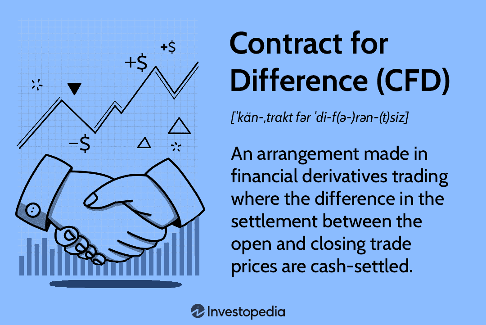

## Table of Contents

## What is a Contract for Difference (CFD)?

A Contract for Difference, or CFD, is a type of financial agreement where you can bet on whether the price of something, like a stock or a commodity, will go up or down without actually owning it. When you enter into a CFD, you agree with a broker to exchange the difference in the price of an asset from when you open the contract to when you close it. If the price moves in your favor, you make money; if it moves against you, you lose money.

CFDs are popular because they allow traders to use leverage, which means you can trade with more money than you actually have in your account. This can lead to bigger profits, but it also increases the risk of bigger losses. Because of this, CFDs can be risky and are not suitable for everyone. It's important to understand the risks and have a good trading strategy before you start trading CFDs.

## How does a CFD work?

A CFD works by letting you bet on the price movement of an asset without actually owning it. You make a deal with a broker where you agree to pay them the difference in the asset's price from when you start the contract to when you end it. If the price goes up and you bet on it going up, you make money. If it goes down and you bet on it going up, you lose money. It's like betting on a sports game, but with stocks or other things.

When you trade CFDs, you can use something called leverage. This means you can trade with more money than you have in your account. For example, if you have $100, you might be able to trade with $1,000. This can make your profits bigger if you're right, but it can also make your losses bigger if you're wrong. That's why CFDs can be risky. It's important to know what you're doing and be ready to lose money before you start trading CFDs.

## What are the main components of a CFD?

A CFD has a few main parts that you need to know about. First, there's the underlying asset. This is the thing you're betting on, like a stock, a commodity, or a currency. You don't actually own this asset when you trade a CFD, but its price movements are what determine whether you make or lose money. Second, there's the contract size. This tells you how much of the underlying asset the CFD represents. For example, if you're trading a CFD on a stock, the contract size might be 100 shares.

Then, there's the price at which you open and close the CFD. When you start the contract, you agree on an opening price with your broker. When you decide to end the contract, you agree on a closing price. The difference between these two prices is what decides if you make a profit or a loss. Finally, there's leverage. This lets you trade with more money than you actually have in your account. It can make your profits bigger, but it can also make your losses bigger, so it's something to be careful about.

Understanding these components is important because they all affect how much money you can make or lose with a CFD. The underlying asset and contract size set the stage for your trade, while the opening and closing prices determine the outcome. Leverage can amplify your results, but it's a double-edged sword that needs to be handled with care.

## What are the benefits of trading with CFDs?

One big benefit of trading with CFDs is that you can use leverage. This means you can trade with more money than you actually have in your account. For example, if you have $100, you might be able to trade with $1,000. This can make your profits bigger if you're right about which way the price will move. Another good thing about CFDs is that you can bet on prices going both up and down. This means you can make money even when the market is falling, which you can't do if you're just buying stocks.

Another advantage is that CFDs let you trade a lot of different things without having to own them. You can trade stocks, commodities, currencies, and more, all in one place. This makes it easier to diversify your trading and try out different markets. Plus, trading CFDs usually has lower costs than buying and selling the actual assets. You don't have to pay as many fees, which can save you money in the long run.

## What are the risks associated with CFDs?

One big risk with CFDs is that they use leverage. This means you can trade with more money than you actually have, which can make your losses bigger if things don't go your way. If the price moves against you, you could lose more money than you put in. This is called a margin call, and it can happen fast. It's like borrowing money to bet on a game, but if you lose, you have to pay back more than you borrowed.

Another risk is that CFDs can be hard to understand. They're complicated financial products, and if you don't know what you're doing, you can make big mistakes. The market can be unpredictable, and even if you think you know what's going to happen, you might be wrong. This can lead to big losses, especially if you're using a lot of leverage. It's important to learn as much as you can and maybe even practice with a demo account before you start trading with real money.

Lastly, CFDs can be affected by things like overnight fees and market gaps. Overnight fees are what you pay to keep your position open overnight, and they can add up over time. Market gaps happen when the price jumps suddenly, and this can make your losses bigger if it goes against you. These extra costs and risks can make CFD trading even more challenging, so it's important to be aware of them and plan accordingly.

## How can someone start trading CFDs?

To start trading CFDs, first, you need to find a good broker. A broker is like a middleman who helps you make trades. Look for a broker that is regulated by a financial authority, which means they follow certain rules to keep your money safe. Once you choose a broker, you'll need to open an account with them. This usually involves filling out some forms and maybe sending in some documents to prove who you are. After your account is set up, you'll need to put some money into it. This is called your trading capital, and it's what you'll use to make trades.

Once your account is funded, you can start trading. Most brokers have a platform where you can see prices and make trades. You'll need to decide what you want to trade, like stocks, commodities, or currencies. Then, you'll choose whether you think the price will go up or down. If you think it will go up, you'll buy a CFD. If you think it will go down, you'll sell one. Remember, you can use leverage, which means you can trade with more money than you have in your account. This can make your profits bigger, but it can also make your losses bigger, so be careful. It's a good idea to start small and learn as you go, maybe even practicing with a demo account first.

## What are the common strategies used in CFD trading?

One common strategy in CFD trading is called [trend following](/wiki/trend-following). This means you look at the price of something over time and try to figure out if it's going up or down. If you see that the price has been going up, you might buy a CFD, hoping it will keep going up. If you see the price going down, you might sell a CFD, hoping it will keep going down. It's like trying to ride a wave. The key is to spot the trend early and get out before it changes direction.

Another strategy is called [scalping](/wiki/gamma-scalping). This is when you make a lot of small trades in a short time, trying to make small profits from tiny price movements. It's like [picking](/wiki/asset-class-picking) up pennies off the ground. You need to be quick and pay close attention to the market because things can change fast. Scalping can be risky, but if you're good at it, you can add up those small profits over time.

A third strategy is called hedging. This is when you use CFDs to protect yourself from losing money on something else you own. For example, if you own some stocks and you're worried their price might go down, you could sell a CFD on those stocks. If the price does go down, you'll lose money on your stocks, but you'll make money on the CFD, which can help balance things out. It's like having an insurance policy for your investments.

## How do leverage and margin affect CFD trading?

Leverage and margin are big parts of CFD trading. Leverage lets you trade with more money than you have in your account. For example, if you have $100 and use leverage, you might be able to trade with $1,000. This can make your profits bigger if you're right about which way the price will move. But it also makes your losses bigger if you're wrong. So, leverage is like a double-edged sword - it can help you make more money, but it can also make you lose more money.

Margin is the money you need to put up to open a leveraged position. It's like a deposit that shows the broker you can handle the trade. If the trade goes against you and your losses get too big, you might get a margin call. This means you have to put more money into your account or close your position. Margin calls can happen fast, and if you don't have enough money, you could lose more than you put in. So, it's important to understand both leverage and margin and use them carefully when trading CFDs.

## What are the tax implications of trading CFDs?

When you trade CFDs, you need to know about taxes. In many places, the money you make from CFDs is treated as income. This means you have to pay tax on your profits, just like you would on money you earn from a job. The tax rate can be different depending on where you live and how much money you make. It's a good idea to keep good records of all your trades so you can report your income correctly when you do your taxes.

Sometimes, there can be other taxes too. For example, in some countries, you might have to pay a stamp duty if you're trading CFDs on stocks. This is a tax you pay when you buy certain financial products. Also, if you lose money trading CFDs, you might be able to use those losses to lower your taxes on other income. But the rules about this can be complicated, so it's smart to talk to a tax professional to make sure you're doing everything right.

## How do CFDs compare to other financial instruments like futures and options?

CFDs, futures, and options are all ways to bet on the price of something without actually owning it, but they work a bit differently. CFDs are contracts where you agree with a broker to exchange the difference in the price of an asset from when you open the contract to when you close it. You can use leverage with CFDs, which means you can trade with more money than you have, but this can also make your losses bigger. CFDs are flexible because you can trade a lot of different things and bet on prices going both up and down.

Futures are agreements to buy or sell an asset at a set price on a specific date in the future. They're often used by businesses to lock in prices and avoid surprises. Like CFDs, futures use leverage, but they're usually traded on exchanges, which can be more formal and have different rules. Options give you the right, but not the obligation, to buy or sell an asset at a set price before a certain date. They're a bit like insurance because they can protect you from big losses, but they can be more complicated and have their own set of rules and costs.

Each of these financial instruments has its own pros and cons. CFDs are good for short-term trading and can be easier to get started with, but they're risky because of leverage. Futures are more standardized and often used for longer-term planning, but they can be less flexible. Options can be used for both protection and speculation, but they require a good understanding of how they work. Choosing the right one depends on what you're trying to do and how much risk you're willing to take.

## What regulatory considerations should be taken into account when trading CFDs?

When you trade CFDs, you need to pay attention to the rules set by financial regulators. Different countries have different rules, but they all want to make sure trading is fair and safe. In many places, CFD brokers have to be licensed and follow strict rules. This helps protect traders from fraud and makes sure brokers are honest about the risks. Some countries have even banned CFD trading for regular people because it's so risky. It's important to check the rules in your country and make sure your broker is following them.

Another thing to think about is how much money you need to start trading CFDs. Some regulators set a minimum amount to make sure traders know what they're doing and can handle the risk. They might also limit how much leverage you can use, which is how much you can borrow to trade. This is to stop people from losing too much money too fast. Knowing the rules can help you stay safe and make smarter choices when you trade CFDs.

## Can you provide real-world examples of CFD trades and their outcomes?

Imagine you think the price of gold is going to go up. You decide to buy a CFD on gold with $1,000, using leverage so you can trade with $10,000. A few days later, the price of gold goes up by 5%. You close your CFD and make a profit of $500, which is 50% of your original $1,000. That's a big win! But if the price of gold had gone down by 5% instead, you would have lost $500, which is half of your money. This shows how leverage can make your wins and losses bigger.

Now, let's say you think the price of a company's stock is going to drop. You decide to sell a CFD on that stock with $500, using leverage so you can trade with $5,000. A week later, the stock price goes down by 3%. You close your CFD and make a profit of $150, which is 30% of your original $500. That's a nice gain! But if the stock price had gone up by 3% instead, you would have lost $150, which is a big chunk of your money. This example shows how you can make money when prices go down with CFDs, but also how quickly things can go wrong.

## What are the Frequently Asked Questions?

**FAQ**

1. **Are U.S. citizens eligible for CFD trading?**

   U.S. citizens generally cannot trade CFDs due to regulations enforced by the Securities and Exchange Commission (SEC) and the Commodity Futures Trading Commission (CFTC). These regulatory bodies prohibit CFDs because they are over-the-counter (OTC) products, which means they don't trade on regulated exchanges. Consequently, many U.S. brokers do not offer CFD trading, and foreign brokers are often restricted from providing CFD services to U.S. citizens.

2. **What are common misconceptions about leverage and margin requirements in CFD trading?**

   A frequent misconception is that leverage in CFD trading only amplifies potential profits without understanding that it equally magnifies potential losses. Leverage allows traders to control larger positions with a smaller capital outlay, but it increases risk. Reflecting on this with a margin requirement example:
$$
   \text{Leverage} = \frac{1}{\text{Margin Requirement}}

$$

   If a broker offers 10:1 leverage, a $1,000 investment controls $10,000 worth of CFDs. However, a 10% adverse price movement could entirely wipe out the initial investment, illustrating the amplified risk.

3. **Is CFD trading safe and profitable?**

   CFD trading's safety and profitability largely depend on the trader's knowledge, experience, and risk management practices. While CFDs provide opportunities for high returns through leverage and market diversity, they are inherently high-risk due to market [volatility](/wiki/volatility-trading-strategies) and the potential for significant losses. Effective CFD trading necessitates robust risk management strategies, such as setting stop-loss orders and maintaining realistic leveraged positions. Traders must also stay informed about market conditions and regulatory updates, as these can significantly impact trading outcomes.

Remember, while CFDs offer enticing opportunities due to their leverage and diverse market access, they are not suitable for all investors, particularly those unfamiliar with complex financial instruments or without a sound risk management strategy. Always ensure you are educated about the mechanics and risks before engaging in CFD trading.

## References & Further Reading

[1]: Bergstra, J., Bardenet, R., Bengio, Y., & Kégl, B. (2011). ["Algorithms for Hyper-Parameter Optimization."](https://dl.acm.org/doi/10.5555/2986459.2986743) Advances in Neural Information Processing Systems 24.

[2]: ["Advances in Financial Machine Learning"](https://www.amazon.com/Advances-Financial-Machine-Learning-Marcos/dp/1119482089) by Marcos Lopez de Prado

[3]: ["Evidence-Based Technical Analysis: Applying the Scientific Method and Statistical Inference to Trading Signals"](https://www.amazon.com/Evidence-Based-Technical-Analysis-Scientific-Statistical/dp/0470008741) by David Aronson

[4]: ["Machine Learning for Algorithmic Trading"](https://github.com/PacktPublishing/Machine-Learning-for-Algorithmic-Trading-Second-Edition) by Stefan Jansen

[5]: ["Quantitative Trading: How to Build Your Own Algorithmic Trading Business"](https://www.amazon.com/Quantitative-Trading-Build-Algorithmic-Business/dp/0470284889) by Ernest P. Chan