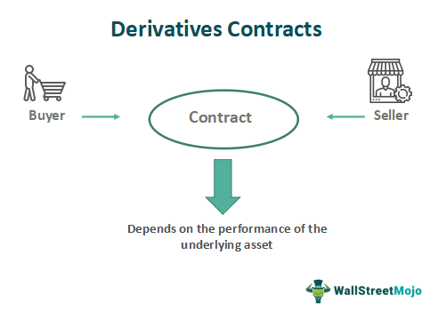

## Table of Contents

## What is a contract market?

A contract market is a place where people can buy and sell futures contracts. Futures contracts are agreements to buy or sell something at a future date, like crops or oil. These markets are usually run by organizations called futures exchanges. They make sure that trading is fair and that everyone follows the rules.

These markets are important because they help people manage risk. For example, a farmer can sell a futures contract to lock in a price for their crops before they are even harvested. This way, they know how much money they will get, even if prices go down later. On the other hand, someone who needs to buy those crops can use the futures market to lock in a price too, protecting them if prices go up.

## How does a contract market function?

A contract market works by bringing together people who want to buy and sell futures contracts. These contracts are agreements to buy or sell something at a future date, like wheat or oil. The market is usually run by a futures exchange, which is like a big organization that makes sure everyone follows the rules. When someone wants to buy or sell a futures contract, they go to the exchange and place an order. The exchange matches buyers with sellers, and the trade happens.

The main reason people use contract markets is to manage risk. For example, a farmer might want to sell their wheat in the future, but they're worried that the price might go down. So, they can sell a futures contract now to lock in a good price. This way, they know how much money they'll get, no matter what happens to the price later. On the other side, someone who needs to buy wheat can use the futures market to lock in a price too. This protects them if prices go up. By using the contract market, both the farmer and the buyer can feel more secure about their future deals.

## What are the main types of contracts traded in these markets?

The main types of contracts traded in these markets are futures contracts and options contracts. Futures contracts are agreements to buy or sell something at a set price on a future date. They are used a lot by people who want to manage the risk of price changes. For example, a farmer might use a futures contract to lock in a price for their crops before they are harvested. On the other hand, a company that needs those crops can use a futures contract to make sure they don't pay more if prices go up.

Options contracts are a bit different. They give the buyer the right, but not the obligation, to buy or sell something at a set price before a certain date. This means the buyer can choose to use the contract if it's good for them, but they don't have to if it's not. Options are often used by people who want to protect themselves from price changes without being locked into a deal. For example, an investor might buy an option to buy a stock at a certain price, and if the stock price goes up, they can use the option to make a profit. If the price goes down, they can just let the option expire without using it.

## Who are the primary participants in contract markets?

The primary participants in contract markets are hedgers and speculators. Hedgers are people or businesses that use the market to protect themselves from price changes. For example, a farmer might sell a futures contract to lock in a price for their crops, so they know how much money they will get even if the market price goes down later. On the other hand, a company that needs to buy those crops might buy a futures contract to make sure they don't pay more if prices go up. Hedgers use the market to reduce their risk and make their future business deals more predictable.

Speculators are people who trade in the market to make a profit from price changes. They don't produce or use the goods themselves, but they try to guess where prices are going and buy or sell contracts based on those guesses. For example, if a speculator thinks the price of oil will go up, they might buy a futures contract now and sell it later at a higher price. Speculators help make the market more active and liquid, which means it's easier for everyone to buy and sell contracts. While they take on more risk than hedgers, they also have the chance to make more money if their guesses about price changes are correct.

## What is the historical origin of contract markets?

Contract markets started a long time ago, back in the 17th century in Japan. Farmers and merchants needed a way to manage the risk of price changes for rice. So, they created a place where they could trade rice futures contracts. These contracts let them agree on a price for rice that would be delivered in the future. This was the start of what we now call futures exchanges. The first official futures exchange was set up in Osaka, Japan, in 1730, and it was called the Dojima Rice Exchange.

Later, in the 19th century, contract markets spread to the United States and Europe. In the U.S., farmers and traders faced the same problems with price changes for crops like wheat and corn. They needed a way to lock in prices for their goods. So, in 1848, the Chicago Board of Trade (CBOT) was created. It was the first futures exchange in the U.S., and it helped farmers and buyers manage their risks. Over time, more futures exchanges were set up around the world, and they started trading contracts for all kinds of things, from oil to gold. Today, contract markets are a big part of the global economy, helping people manage risk and make their business deals more predictable.

## How have contract markets evolved over time?

Contract markets have changed a lot since they started in Japan in the 17th century. At first, they were just for trading rice futures to help farmers and merchants deal with price changes. The first official futures exchange, the Dojima Rice Exchange, was set up in 1730 in Osaka, Japan. Later, in the 19th century, these markets spread to the United States and Europe. The Chicago Board of Trade (CBOT) was created in 1848, and it was the first futures exchange in the U.S. It helped farmers and buyers manage their risks with crops like wheat and corn. Over time, more futures exchanges were set up around the world, and they started trading contracts for all sorts of things, not just farm products.

As time went on, contract markets grew and became more complex. They started using technology to make trading easier and faster. In the late 20th century, electronic trading platforms were introduced, which let people trade from anywhere, not just at the exchange. This made the markets more accessible and efficient. Today, contract markets are a big part of the global economy. They help people manage risk and make their business deals more predictable. They trade futures and options contracts for things like oil, gold, and even financial products like stocks and bonds. The evolution of contract markets shows how important they are for managing risk and supporting economic growth.

## What role do contract markets play in the economy?

Contract markets play a big role in the economy by helping people manage risk. Farmers, businesses, and investors use these markets to protect themselves from price changes. For example, a farmer can sell a futures contract to lock in a price for their crops before they are even harvested. This way, they know how much money they will get, even if prices go down later. On the other hand, a company that needs to buy those crops can use the futures market to lock in a price too, protecting them if prices go up. By using contract markets, both buyers and sellers can make their future deals more predictable and feel more secure.

Contract markets also help the economy by making it easier to buy and sell things. When people trade futures and options contracts, they make the market more active and liquid. This means it's easier for everyone to find someone to trade with. Speculators, who trade to make a profit, add to this activity. They help keep the market running smoothly by buying and selling contracts based on their guesses about future prices. Overall, contract markets are important for the economy because they help manage risk, make trading easier, and support economic growth.

## What are some key historical events that have impacted contract markets?

Contract markets have been shaped by many important events over time. One big event was the creation of the Dojima Rice Exchange in Japan in 1730. This was the first official futures exchange in the world, and it helped farmers and merchants manage the risk of price changes for rice. Another key event happened in 1848 when the Chicago Board of Trade (CBOT) was set up in the United States. This was the first futures exchange in the U.S., and it let farmers and buyers lock in prices for crops like wheat and corn. These early exchanges laid the groundwork for today's contract markets.

In the 20th century, technology started to change contract markets a lot. In the late 1900s, electronic trading platforms were introduced. This made it easier and faster for people to trade from anywhere, not just at the exchange. This change made the markets more accessible and efficient. Another important event was the financial crisis in 2008. It showed how important contract markets are for managing risk, but it also led to new rules to make sure trading was fair and safe. These events have helped shape contract markets into what they are today, playing a big role in the global economy.

## How do regulations affect contract markets?

Regulations are really important for contract markets. They help make sure that trading is fair and safe for everyone. Rules set by governments and organizations like the Commodity Futures Trading Commission (CFTC) in the U.S. make sure that people trading in these markets follow certain standards. These rules stop people from doing things that could hurt the market, like cheating or making false trades. They also make sure that the exchanges and brokers are honest and open about what they do. This helps keep the market running smoothly and keeps people's trust in it.

Regulations also change how contract markets work. After big events like the financial crisis in 2008, new rules were made to make the markets safer. These rules can limit how much risk people can take or require more information to be shared. While some people might think that too many rules can slow down trading, they are important for keeping the market stable and protecting everyone involved. Without regulations, the contract markets could become less trustworthy and more risky, which could hurt the whole economy.

## What are the differences between traditional and modern contract markets?

Traditional contract markets started a long time ago, with people meeting in person to trade things like rice or wheat. They used futures contracts to lock in prices for the future. These early markets, like the Dojima Rice Exchange in Japan and the Chicago Board of Trade in the U.S., were physical places where traders would shout and use hand signals to make deals. The trading was slower and could only happen during certain times when the exchange was open. These markets helped people manage risk, but they were limited by where and when trading could happen.

Modern contract markets are very different because of technology. Now, people can trade from anywhere using electronic platforms. This makes trading faster and easier, and it's not limited to certain times or places. Modern markets also trade a lot more things, like oil, gold, and even financial products like stocks and bonds. They have more rules to make sure trading is fair and safe. These changes have made contract markets a big part of the global economy, helping people manage risk and make their business deals more predictable.

## What advanced strategies are used by experts in contract market trading?

Experts in contract market trading use a lot of different strategies to make money and manage risk. One common strategy is called hedging. Hedging is when someone uses futures or options contracts to protect themselves from price changes. For example, a farmer might sell a futures contract to lock in a good price for their crops. This way, they don't lose money if the price goes down later. Another strategy is called speculation. Speculators try to guess where prices are going and buy or sell contracts based on those guesses. If they guess right, they can make a lot of money, but if they're wrong, they can lose a lot too.

Another advanced strategy is called spread trading. This is when someone buys one futures contract and sells another at the same time. They do this to take advantage of the price difference between the two contracts. For example, they might buy a contract for wheat that will be delivered in June and sell a contract for wheat that will be delivered in December. If the price difference changes in their favor, they can make a profit. Experts also use technical analysis to help them make decisions. This means they look at charts and patterns to try to predict where prices are going. By using these strategies, experts can manage risk and try to make money in the contract markets.

## How do global economic trends influence contract markets?

Global economic trends have a big impact on contract markets. When the world economy is doing well, people are more likely to trade in these markets. They feel confident about the future and want to invest in things like oil, gold, or crops. On the other hand, if the economy is not doing well, people might be more careful. They might use contract markets to protect themselves from losing money if prices go down. Things like interest rates, inflation, and big events like wars or natural disasters can also change how people trade in contract markets.

For example, if interest rates go up, it can make borrowing money more expensive. This might make people less likely to invest in futures contracts because they have to pay more to borrow the money they need to trade. Inflation can also affect contract markets. If prices are going up a lot, people might buy futures contracts to lock in prices now before they go up even more. Big events, like a war in a country that produces a lot of oil, can make oil prices go up or down a lot. This can make people trade more in the contract markets to try to make money from the price changes or to protect themselves from them.

## References & Further Reading

[1]: Harris, L. (2003). ["Trading and Exchanges: Market Microstructure for Practitioners."](https://www.amazon.com/Trading-Exchanges-Market-Microstructure-Practitioners/dp/0195144708) Oxford University Press.

[2]: Aldridge, I. (2013). ["High-Frequency Trading: A Practical Guide to Algorithmic Strategies and Trading Systems."](https://www.amazon.com/High-Frequency-Trading-Practical-Algorithmic-Strategies/dp/1118343506) Wiley.

[3]: Mackenzie, D. (2015). ["Material Markets: How Economic Agents Are Constructed."](https://academic.oup.com/book/52341) Oxford University Press.

[4]: Narang, R. K. (2013). ["Inside the Black Box: A Simple Guide to Quantitative and High-Frequency Trading."](https://onlinelibrary.wiley.com/doi/book/10.1002/9781118662717) Wiley.

[5]: Jones, C. M. (2013). ["What Do We Know About High-Frequency Trading?"](https://papers.ssrn.com/sol3/papers.cfm?abstract_id=2236201) Columbia Business School Research Paper No. 13-11.