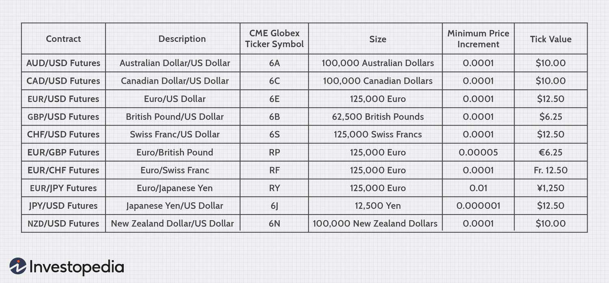

## Table of Contents

## What is a contract size in trading?

A contract size in trading refers to the specific amount of an asset that is included in one trading contract. This is important because it determines how much of the asset you are buying or selling when you enter into a trade. For example, in futures trading, one contract might represent 100 ounces of gold or 5,000 bushels of corn. Knowing the contract size helps traders understand the scale of their investment and manage their risk accordingly.

Different markets and types of contracts have different standard sizes. For instance, in the stock market, one contract of stock options usually represents 100 shares of the underlying stock. In forex trading, a standard lot size is typically 100,000 units of the base currency. Understanding these sizes is crucial for traders to accurately calculate potential profits and losses, and to ensure they are trading in amounts that fit their investment strategy and risk tolerance.

## How is contract size determined in different markets?

In different markets, the contract size is set by the exchange or the organization that oversees trading. For example, in the futures market, the Chicago Mercantile Exchange (CME) decides how much of a commodity, like gold or oil, is in one contract. They pick a size that makes it easy for traders to buy and sell. This size stays the same so everyone knows what they are trading. For stocks, the Options Clearing Corporation (OCC) says that one options contract is for 100 shares of a stock. This makes it simple for everyone to understand and trade options.

In [forex](/wiki/forex-system) trading, the contract size is usually set by the broker. A standard lot is often 100,000 units of the base currency, but brokers can also offer mini lots (10,000 units) or micro lots (1,000 units). This helps traders of all sizes to participate in the market. The size of the contract in forex helps traders know how much money they are using and how much they could win or lose. Each market has its own way of setting contract sizes, but the goal is always to make trading clear and easy for everyone involved.

## Can you provide examples of standard contract sizes in futures markets?

In the futures market, different commodities have different standard contract sizes. For example, if you want to trade gold futures, one contract on the Chicago Mercantile Exchange (CME) represents 100 troy ounces of gold. This means when you buy or sell one gold futures contract, you are dealing with 100 ounces of gold. Another example is crude oil futures, where one contract on the New York Mercantile Exchange (NYMEX) is for 1,000 barrels of oil. So, trading one oil futures contract means you are trading 1,000 barrels of oil.

Another common futures contract is for corn, where one contract on the Chicago Board of Trade (CBOT) represents 5,000 bushels of corn. This means if you trade one corn futures contract, you are dealing with 5,000 bushels. Soybeans also have a standard contract size on the CBOT, where one contract equals 5,000 bushels of soybeans. These standard sizes help traders know exactly what they are buying or selling, making it easier to plan their trades and manage risk.

## What are the advantages of standardized contract sizes?

Standardized contract sizes make trading easier for everyone. When all traders know that one gold futures contract is always 100 ounces, they can plan their trades without confusion. This helps traders know exactly how much they are buying or selling, which makes it easier to figure out how much money they might make or lose. It also means that traders can easily compare prices and trade with each other, no matter where they are from.

Another big advantage is that standardized sizes help keep the market fair and organized. When everyone uses the same contract sizes, it's easier for the exchange to keep track of trades and make sure everything is done correctly. This helps prevent mistakes and fraud, making the market safer for everyone. Plus, it makes it easier for new traders to learn and start trading, because they don't have to worry about different sizes for each trade.

## What are the disadvantages of standardized contract sizes?

Standardized contract sizes can make it hard for smaller traders to join in. For example, if a gold futures contract is always 100 ounces, a small trader might not have enough money to buy that much gold. This means only bigger traders can play, which can make the market less fair for everyone.

Also, these fixed sizes can make it tough to match your trading to what you really want. If you need just a little bit of something, like only 50 ounces of gold, you can't buy that amount because the contract is always 100 ounces. This can force traders to buy more than they need, which can lead to more risk and less control over their trading.

## How does contract size affect trading strategies?

Contract size can really change how traders make their plans. If a contract is big, like 100 ounces of gold, traders need to think about if they have enough money to buy it. Big contracts can mean big risks, so traders might need to be more careful and use strategies to protect themselves from losing too much money. They might also choose to trade less often or use different tools to manage their risks, like stop-loss orders.

On the other hand, if a trader wants to trade small amounts, big contract sizes can be a problem. They might not be able to trade at all because they can't afford the whole contract. This can make traders look for other ways to trade, like using smaller contracts if they are available, or even switching to different markets where the sizes fit better with their plans. Knowing the contract size helps traders pick the right strategies and markets for their goals and how much risk they want to take.

## What role does contract size play in risk management?

Contract size is really important for managing risk in trading. When you know how big a contract is, you can figure out how much money you might win or lose. If a contract is big, like 100 ounces of gold, it can be riskier because you're dealing with a lot more of the asset. This means you need to be careful and maybe use tools like stop-loss orders to protect your money. By understanding the contract size, you can plan your trades better and make sure you're not taking on too much risk.

On the other hand, if the contract size is too big for you, it might stop you from trading at all. You might not have enough money to buy the whole contract, which can make it hard to manage your risk. In this case, you might need to look for smaller contract sizes or different markets where the sizes fit better with what you can afford. Knowing the contract size helps you pick the right trades and manage your risk in a way that keeps your money safe.

## How can traders adjust to different contract sizes?

Traders can adjust to different contract sizes by choosing the right markets and tools for their needs. If a contract size is too big, like 100 ounces of gold, a trader might look for smaller contract sizes offered by some exchanges or brokers. For example, in forex trading, they might use mini or micro lots instead of standard lots. This way, they can still trade without taking on too much risk. Another way to adjust is by using different trading strategies, like spreading their money across more trades with smaller sizes, which can help manage risk better.

Understanding the contract size also helps traders use risk management tools effectively. For instance, if a trader knows the size of a contract, they can set stop-loss orders at the right levels to limit their losses. They can also calculate how much money they might win or lose more accurately, which helps them plan their trades better. By being aware of contract sizes and adjusting their approach, traders can make smarter decisions and keep their trading safe and profitable.

## What are mini and micro contracts, and how do they differ from standard contracts?

Mini and micro contracts are smaller versions of standard contracts. They let traders buy or sell less of an asset than what a standard contract offers. For example, in forex trading, a standard lot is 100,000 units of the base currency, but a mini lot is 10,000 units, and a micro lot is just 1,000 units. This means traders can trade smaller amounts, which can be easier for people who don't have a lot of money to start with.

These smaller contracts help traders manage their risk better. If a standard contract is too big and risky, mini and micro contracts let traders get into the market without putting too much money on the line. They can still trade the same assets, like gold or oil, but with less risk. This makes trading more accessible to more people and can help traders learn and grow their skills without big losses.

## How do contract sizes impact liquidity and market participation?

Contract sizes can really affect how easy it is to buy and sell things in the market, which we call liquidity. If a contract size is too big, it can be hard for smaller traders to join in. They might not have enough money to buy a whole contract, so they can't trade as much. This can make the market less liquid because fewer people are trading. When fewer people are trading, it can be harder to find someone to buy or sell from, and prices can move around more.

On the other hand, smaller contract sizes can make the market more liquid and open to more people. Mini and micro contracts let more traders join in because they can afford to trade smaller amounts. This means more people are buying and selling, which makes it easier to find someone to trade with. More traders also mean the market can be more active and stable, which is good for everyone. So, smaller contract sizes can help bring more people into the market and make trading smoother for everyone.

## What are the implications of contract size on margin requirements?

Contract size can change how much money you need to start trading, which is called the margin requirement. If a contract is big, like 100 ounces of gold, you might need to put down more money as a deposit to trade it. This is because the exchange or broker wants to make sure you can cover your losses if the trade goes bad. So, bigger contract sizes mean bigger margin requirements, which can make it harder for smaller traders to get started.

On the other hand, smaller contract sizes, like mini or micro contracts, can lower the margin requirements. This makes it easier for more people to trade because they don't need as much money to start. By using smaller contracts, traders can manage their money better and take on less risk. This can help more people join the market and make trading more accessible to everyone.

## How do regulatory bodies influence contract sizes in financial markets?

Regulatory bodies play a big role in deciding contract sizes in financial markets. They set rules to make sure trading is fair and safe for everyone. For example, in the United States, the Commodity Futures Trading Commission (CFTC) helps decide how big futures contracts should be. They want to make sure that the sizes are easy for traders to understand and use. This helps keep the market organized and stops people from getting confused or cheated.

Sometimes, regulatory bodies might change contract sizes to help more people trade. If they see that a contract size is too big and keeps smaller traders out, they might make smaller versions like mini or micro contracts. This makes it easier for more people to join in and trade without needing a lot of money. By doing this, regulators can make the market more open and fair, which is good for everyone who wants to trade.

## What is the understanding of contract size?

Contract size refers to the predetermined quantity of the underlying asset specified in a futures or options contract. It plays a pivotal role in the trading environment, particularly within algorithmic trading systems, due to its standardization. The standardization offers multiple benefits, including facilitating the comprehension and execution of trades while contributing to trading efficiency. 

The standardization of contract sizes is primarily aimed at lowering the complexity associated with trading transactions. For example, in futures contracts, this standardization dictates the amount of the underlying asset that needs to be delivered at contract maturity. This helps traders easily calculate margins, potential profits, and losses. For instance, if a futures contract specifies a contract size of 100 barrels of [crude oil](/wiki/crude-oil), any calculations for price variations, profits, or losses can be predictably associated with that fixed quantity.

Additionally, standardized contract sizes ensure consistency across different markets and trading platforms, enhancing their compatibility with automated trading systems. This is critical for algorithmic traders who rely on precise data inputs to make informed decisions. Without standardization, systems would struggle to handle diverse quantities and variable contract specifications, dramatically increasing computational complexity and reducing efficiency.

**Standardization of Contract Sizes**

The process of standardizing contract sizes involves regulatory bodies and exchanges that set these sizes based on the historical consumption and trading volumes of the particular asset. For example, in the Chicago Mercantile Exchange (CME), E-mini S&P 500 futures have a contract size representing $50 times the S&P 500 index. This standardization aligns trading practices and provides benchmarks for [liquidity](/wiki/liquidity-risk-premium) analysis and risk management.

Implementing standard contract sizes also streamlines the assessment of required margins and capital commitments. In [algorithmic trading](/wiki/algorithmic-trading), it's essential to calculate the initial and maintenance margins accurately. The known contract size facilitates these calculations. For instance, the margin required for a specific position can be easily determined using the formula:

$$
\text{Margin Requirement} = \text{Contract Size} \times \text{Price} \times \text{Margin Percentage}
$$

This predictable framework is especially beneficial when applying algorithmic strategies that require the quick assessment of numerous positions.

**Impact on Trading Efficiency**

The impact of standardized contract sizes extends to the overall efficiency of the trading market. By minimizing the ambiguities and disparate calculations involved with irregular contract specifications, standardization promotes a more streamlined trading process. Automated trading systems can thus execute trades faster and with greater accuracy, reducing latency and slippage.

In conclusion, the understanding and application of standardized contract sizes are fundamental to achieving trading efficiency, especially in algorithmic systems. This element of the trading environment allows for simplified calculations and a structured framework that aids in consistent decision-making and efficient trade execution.

## What are examples of contract size?

In the trading world, understanding the structure of contract sizes in financial instruments is essential for executing effective trades, especially in the context of algorithmic trading. Let's examine two prominent examples: the S&P 500 E-mini futures and standard gold futures, to understand their impact on trading strategies and financial commitments.

The S&P 500 E-mini futures contracts are a popular choice among traders due to their smaller size compared to the standard S&P 500 futures. Each E-mini contract represents one-fifth of the standard S&P 500 futures contract. The contract size is typically $50 times the S&P 500 index value. For instance, if the S&P 500 index is valued at 4,500, the notional value of one E-mini contract would be:

$$
\text{Notional Value} = 50 \times 4500 = 225,000
$$

This smaller contract size attracts a diverse range of investors, including those engaged in high-frequency trading and algorithmic systems. E-mini contracts offer flexibility and the ability to enter the futures market with a lower capital requirement compared to the larger standard contracts. This makes them an attractive option for algorithmic trading strategies that require scalability and efficient capital use.

Standard gold futures contracts, traded on exchanges such as the COMEX, represent another significant example. Traditionally, a standard gold futures contract covers 100 troy ounces of gold. Therefore, if the gold price is $1,800 per ounce, the contract's notional value would be:

$$
\text{Notional Value} = 100 \times 1800 = 180,000
$$

This substantial notional value requires a significant financial commitment from investors. While the fixed contract size of gold futures ensures market standardization, it may impose constraints on traders looking to diversify or hedge in smaller quantities due to the higher financial commitment required. Algorithmic trading systems must account for these larger positions and manage risk appropriately, which can influence the choice of trading strategies.

In conclusion, the S&P 500 E-mini and standard gold futures exemplify the diversity in contract sizes within various markets. They illustrate how contract sizes can dictate the level of financial commitment and influence trading strategy selection in algorithmic trading. As traders and algorithmic systems consider these contracts, understanding their structure and financial implications is crucial for optimizing trading operations and achieving strategic objectives.

## What are the pros of different contract sizes in algorithmic trading?

Standardized contract sizes play a significant role in facilitating algorithmic trading by ensuring consistency and predictability in trades. Such standardization is instrumental for automated trading systems that rely on precise calculations and efficient execution.

One of the primary advantages of standardized contracts is their ability to simplify the calculation of potential profits and losses. This is crucial for automated trading models, which often operate on slim margins and require exact calculations to function effectively. For example, in futures trading, knowing the tick value (smallest price movement) helps in determining potential financial outcomes. The relationship can be expressed as follows:

$$
\text{Profit/Loss} = (\text{Sell Price} - \text{Buy Price}) \times \text{Contract Size} \times \text{Number of Contracts}
$$

Such formulas underpin the predictability that algorithmic systems demand, allowing for the rapid assessment of trade viability based on real-time data.

Additionally, standardized contracts streamline trading processes, a substantial benefit to high-frequency trading ([HFT](/wiki/high-frequency-trading-strategies)). HFT strategies involve executing a large number of orders at extraordinarily high speeds, often in fractions of a second. With standardized contracts, trading algorithms do not require frequent recalibration for different contract specifications, which lessens computational overhead and reduces latency. As a result, traders can analyze the market and execute trades with increased speed and accuracy.

The standardized nature of these contracts also makes it easier to deploy algorithms across various markets without requiring significant adjustments. For example, an algorithm designed to trade S&P 500 E-mini futures can be adapted to trade similar indexes or futures contracts with minimal changes. This portability extends the reach of trading systems, enhancing their versatility and efficiency.

In summary, the consistency and predictability of standardized contract sizes afford algorithmic traders a robust framework for executing trades. These features optimize trading models, ensuring that they function correctly and efficiently, thereby supporting the objectives of high-frequency and automated trading systems.

## References & Further Reading

[1]: Marcos Lopez de Prado. ["Advances in Financial Machine Learning"](https://www.amazon.com/Advances-Financial-Machine-Learning-Marcos/dp/1119482089). Wiley.

[2]: David Aronson. ["Evidence-Based Technical Analysis: Applying the Scientific Method and Statistical Inference to Trading Signals"](https://www.amazon.com/Evidence-Based-Technical-Analysis-Scientific-Statistical/dp/0470008741). Wiley.

[3]: Stefan Jansen. ["Machine Learning for Algorithmic Trading"](https://github.com/stefan-jansen/machine-learning-for-trading). Packt Publishing.

[4]: Ernest P. Chan. ["Quantitative Trading: How to Build Your Own Algorithmic Trading Business"](https://www.amazon.com/Quantitative-Trading-Build-Algorithmic-Business/dp/0470284889). Wiley.

[5]: J. Bergstra, R. Bardenet, Y. Bengio, & B. Kégl. ["Algorithms for Hyper-Parameter Optimization."](https://dl.acm.org/doi/10.5555/2986459.2986743) Advances in Neural Information Processing Systems 24.