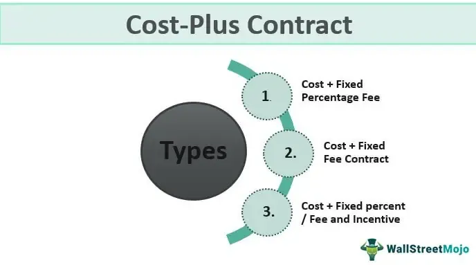

The world of financial instruments trading has undergone a transformative evolution with the integration of algorithmic trading. This article examines the pivotal elements of trading contract units and the crucial function of algorithms in augmenting trading efficiency. For contemporary traders, grasping the fundamental principles of contract units and algo trading is indispensable. This discussion will clarify what contract units entail, their operational mechanics, and their significance in the derivatives markets. Additionally, algorithmic trading strategies' operational methods and their transformative impact on the financial trading landscape will be explored.

Algorithmic trading, a methodology that employs computer algorithms to execute trading decisions based on pre-established rules, has modernized traditional trading methods, allowing for more precise and efficient trade executions. By automating the trading process, these algorithms facilitate the analysis of massive datasets to identify trading opportunities swiftly, often without human intervention. This systematized approach not only enhances the execution speed but also minimizes human biases and errors, radically changing how financial markets operate.



Within this context, trading contract units—specifically in derivatives markets—serve as standardized measures that specify the quantity of the underlying asset in a contract. These units are integral to establishing the framework for futures contracts, ensuring that trading terms are consistent and reliable across exchanges. Standardization provided by contract units enables traders to manage substantial positions without ambiguity, thus fostering an orderly trading environment. By understanding both contract units and algorithmic trading, traders can better navigate and capitalize on the advanced and opportunities-rich landscape of modern financial markets.

## Table of Contents

## What are Financial Instruments Trading Contract Units?

A financial instruments trading contract unit refers to the specified quantity of the underlying asset that is defined within a derivatives contract. In derivatives trading, these units are crucial as they determine the size of the transaction and ensure uniformity across trades. By setting a standard for the quantity of the asset, contract units facilitate the trading process, allowing both buyers and sellers to communicate effectively and trade with confidence.

These contract units are standardized across exchanges to maintain consistent trading terms, which helps in mitigating potential discrepancies that might arise if varying quantities were used. For example, in commodity futures, a contract unit might specify a standard amount, such as 1,000 barrels of [crude oil](/wiki/crude-oil) or 5,000 bushels of corn. This standardization is critical because it allows the exchange to offer a clear and common set of rules and specifications that participants can rely on when entering into contracts.

Contract units are particularly pivotal in determining the size and specifications of futures contracts. The standardized nature of these units helps to ensure that all parties involved have a precise understanding of the contract size, which is paramount in executing trades efficiently. This precision is necessary to facilitate liquidity and price discovery in the market. Without such standardization, trading financial instruments would likely become disorganized and inefficient, as parties could easily encounter misunderstandings regarding the quantity of the asset being traded.

Understanding the contract unit is essential for traders, as it informs them how much of the underlying asset they are contracting to buy or sell. This knowledge is vital for effective risk management since traders can assess their exposure and align their trading strategies accordingly. It is also important for calculating the margin requirements, potential profit, and loss: 

$$
\text{Potential Profit or Loss} = (\text{Selling Price - Buying Price}) \times \text{Contract Size}
$$

In summary, by establishing a standardized measurement for trading, contract units play a critical role in enhancing the efficiency and functionality of derivatives markets. They provide a structured approach that simplifies the trading process and allows a diverse range of participants to engage confidently.

## How Contract Units Work

In derivatives markets, contract units are pivotal in standardizing transactions, thereby mitigating risks associated with pricing discrepancies and counterparty exposure. A contract unit defines a specific quantity of the underlying asset agreed upon in a derivatives contract, providing clarity and uniformity in trading procedures. This standardization is crucial as it allows entities to engage in significant trades with minimized transaction costs, owing to the reduced ambiguity about the trade size and asset specification.

One of the critical benefits of contract units is their role in reducing counterparty risk. This is often achieved through the use of clearinghouses, which acts as intermediaries between traders, guaranteeing the completion of trades even if one party defaults. By reducing the direct exposure between trading parties, clearinghouses enhance security and promote the participation of both industrial and financial traders.

Furthermore, the uniformity provided by standardized contract units attracts a diverse range of market participants. Increased participation due to standardized transactions leads to higher market [liquidity](/wiki/liquidity-risk-premium) and efficiency, as a greater [volume](/wiki/volume-trading-strategy) of trades can be conducted smoothly without significant price impacts. This liquidity is essential for maintaining market stability, especially in times of market stress when the ability to trade large volumes quickly is critical.

To cater to different types of traders, exchanges might offer variations of standard contract units, such as mini or micro contracts. These smaller contracts allow individual or small-scale traders to participate in the derivatives markets without the need for large capital investments. By doing so, exchanges not only broaden their participant base but also enhance overall market liquidity. These smaller contract sizes can be particularly advantageous in volatile markets where flexibility and the ability to manage exposure incrementally can provide significant strategic benefits.

The effectiveness of contract units in derivatives trading demonstrates the importance of standardization in financial markets, facilitating efficient and secure trading practices that benefit a wide array of market participants.

## Algorithmic Trading: Revolutionizing Trading Practices

Algorithmic trading, often abbreviated as algo trading, is the method of executing trades through computer algorithms that automatically perform trading activities based on a set of predefined criteria. This approach leverages the power of technology to process immense volumes of data quickly, greatly diminishing the need for human intervention and allowing for trades to be executed at speeds impossible for human traders.

The essence of [algorithmic trading](/wiki/algorithmic-trading) lies in its ability to eliminate human error and emotional decision-making, replacing them with data-driven rationality. Algorithmic systems are designed to respond to market conditions with precision, executing trades at the most opportune times. This is especially important in volatile markets, where prices can change rapidly and opportunities might be fleeting.

One notable advantage is the speed and efficiency that algorithmic trading offers. Computers can analyze data and place trades in fractions of a second, a crucial capability in fast-paced environments like those found in trading floors for equities, commodities, or foreign exchange. By operating at such high speeds, algorithms can take advantage of even the smallest price discrepancies, a practice commonly referred to as high-frequency trading ([HFT](/wiki/high-frequency-trading-strategies)).

Algorithmic trading is widely implemented in various strategies, standing out prominently in market-making, [trend following](/wiki/trend-following), and statistical [arbitrage](/wiki/arbitrage). Market-making involves providing liquidity to markets by automatically quoting buy and sell prices, making it easier for other participants to transact. To illustrate, a simple market-making algorithm might continuously offer to buy a stock slightly below the current market price and sell it slightly above, profiting from the bid-ask spread.

Trend-following strategies focus on capturing gains through the analysis of the price directions over time. An algorithm operating under this strategy would buy securities showing an upward trend and sell them when they start declining. This strategy relies on the persistence of trends and can be expressed in Python, for example, as:

```python
import numpy as np

def moving_average_strategy(prices, window_size):
    moving_averages = np.convolve(prices, np.ones(window_size)/window_size, 'valid')
    signals = []
    for i in range(1, len(moving_averages)):
        if moving_averages[i] > moving_averages[i-1]:
            signals.append(1)  # Signal to buy
        else:
            signals.append(-1)  # Signal to sell
    return signals
```

Statistical arbitrage involves exploiting price discrepancies between financial instruments that theoretically should not deviate from each other significantly. These algorithms identify statistical patterns or correlations between asset prices and capitalize on price anomalies, aiming to generate profits when these anomalies resolve.

In conclusion, algorithmic trading revolutionizes the process by which financial markets operate, offering unparalleled advantages in terms of speed, accuracy, and the elimination of emotion-based decision-making. Its widespread application across different asset classes and strategies underscores its role as a transformative force in modern financial markets.

## Benefits and Challenges of Algorithmic Trading

Algorithmic trading, or algo trading, significantly enhances market efficiency and liquidity, which are essential components for ensuring smooth market operations. By automating trading processes, algorithms offer the advantage of executing orders at speeds and frequencies that surpass human capabilities. This speed not only fosters a more dynamic and responsive market but also attracts a broader pool of participants, increasing overall liquidity.

One of the primary benefits of algorithmic trading is the elimination of emotional and psychological biases from the trading process. Traditional trading often involves human emotion, such as fear and greed, which can lead to irrational decision-making. Automated systems execute trades based on pre-defined logic and data-driven analysis. This reliance on logic helps ensure consistent and rational trading decisions, improving the accuracy and efficiency of the trades.

Nonetheless, the complexity and potential [volatility](/wiki/volatility-trading-strategies) associated with algorithmic trading introduce several challenges that traders must navigate to maximize its advantages. The development and implementation of trading algorithms require robust risk management strategies to mitigate potential losses due to unforeseen market movements or algorithmic malfunctions. Effective risk management can involve diversifying trading strategies, setting stop-loss limits, and constantly monitoring trading systems.

High-Frequency Trading (HFT), a subset of algorithmic trading, exemplifies the rapid execution of trades within microseconds or milliseconds. This method enables traders to capitalize on minute price discrepancies in the market. However, HFT demands substantial technological infrastructure, including powerful computing systems, sophisticated algorithms, and advanced network connectivity to exchanges. Developing and maintaining this infrastructure require significant financial and technical resources, presenting a barrier to entry for smaller firms or individual traders.

In conclusion, while algorithmic trading offers distinct advantages such as enhancing market efficiency, liquidity, and eliminating emotional bias, it also involves challenges that necessitate meticulous risk management and technological investment. Traders looking to harness the power of algorithmic trading must balance these benefits and challenges to ensure successful trading operations.

## Real-World Applications and Examples

Algorithmic trading, or algo trading, is increasingly prevalent across various financial markets, including equities, bonds, commodities, and foreign exchange ([forex](/wiki/forex-system)). By leveraging advanced algorithms, traders can execute large volumes of trades with precision and speed, significantly enhancing the efficiency of these markets.

In futures and commodities markets, algorithmic trading has brought about substantial improvements. These markets often involve large volumes of contracts, where swift execution is crucial to exploit the slight price differences and market fluctuations that can occur within short time frames. Algorithms can quickly analyze vast datasets, detect opportunities for arbitrage, and execute trades without the delays associated with human decision-making. This rapid execution not only maximizes potential profits but also helps in maintaining market liquidity, which is essential for stable market operations.

Traders in options and derivatives markets also reap significant benefits from algorithmic trading. These financial instruments often involve complex pricing models and intricate strategies that are challenging to manage manually. By using computer algorithms, traders can model various scenarios, optimize strategies, and execute trades in milliseconds. This is particularly beneficial in options trading, where the pricing can be influenced by a multitude of variables, such as the underlying asset price, volatility, and time decay. Algorithms can rapidly assess these factors, allowing traders to adapt their strategies dynamically to the market conditions, thereby optimizing their trading outcomes.

Additionally, algorithmic trading is instrumental in high-frequency trading (HFT), where traders seek to capitalize on small price differentials by executing a large number of trades in seconds or fractions of a second. HFT relies heavily on low-latency execution capabilities and sophisticated algorithms that can identify micro-arbitrage opportunities across various markets. However, it also requires significant technological resources and robust risk management due to the rapid execution speeds and potential for large trading volumes.

Overall, the integration of algorithmic trading across diverse financial markets underscores its role in enhancing trade efficiency, liquidity, and market stability. Its ability to handle complex transaction sets and execute strategies swiftly makes it an indispensable tool for modern traders operating in today's fast-paced trading environments.

## Conclusion

Algorithmic trading has fundamentally transformed the trading of contract units and various financial instruments, fostering new opportunities and efficiencies for traders. By leveraging sophisticated algorithms, traders can execute strategies with precision and speed that were once unattainable through manual processes. This technological advancement enables professionals to optimize their trading performance and manage risks more effectively.

Understanding the critical roles of contract units and algorithmic strategies is essential for modern traders. Contract units, as standardized measures, provide a framework that simplifies the trading of derivatives by ensuring consistency across exchanges. This standardization reduces transaction costs and mitigates counterparty risks, contributing to a more stable and liquid market environment.

Similarly, algorithmic trading strategies eliminate emotional and psychological biases, allowing for decisions based solely on data and logic. This data-driven approach increases market efficiency and liquidity, providing traders with a competitive edge. Algorithms continuously process vast datasets to identify trading opportunities, adapting swiftly to market changes and executing trades in milliseconds.

As technology progresses, it is imperative for traders to stay informed and adaptive to harness these advancements effectively. Embracing the evolution of trading technologies, from [machine learning](/wiki/machine-learning) to [artificial intelligence](/wiki/ai-artificial-intelligence), requires ongoing education and a willingness to integrate new tools and methods. By staying abreast of technological developments, traders can maintain a strategic advantage in increasingly complex and dynamic financial markets.

## References & Further Reading

[1]: Bergstra, J., Bardenet, R., Bengio, Y., & Kégl, B. (2011). ["Algorithms for Hyper-Parameter Optimization."](https://dl.acm.org/doi/10.5555/2986459.2986743) Advances in Neural Information Processing Systems 24.

[2]: ["Advances in Financial Machine Learning"](https://www.amazon.com/Advances-Financial-Machine-Learning-Marcos/dp/1119482089) by Marcos Lopez de Prado

[3]: ["Evidence-Based Technical Analysis: Applying the Scientific Method and Statistical Inference to Trading Signals"](https://www.amazon.com/Evidence-Based-Technical-Analysis-Scientific-Statistical/dp/0470008741) by David Aronson

[4]: ["Machine Learning for Algorithmic Trading"](https://github.com/stefan-jansen/machine-learning-for-trading) by Stefan Jansen

[5]: ["Quantitative Trading: How to Build Your Own Algorithmic Trading Business"](https://www.amazon.com/Quantitative-Trading-Build-Algorithmic-Business/dp/1119800064) by Ernest P. Chan