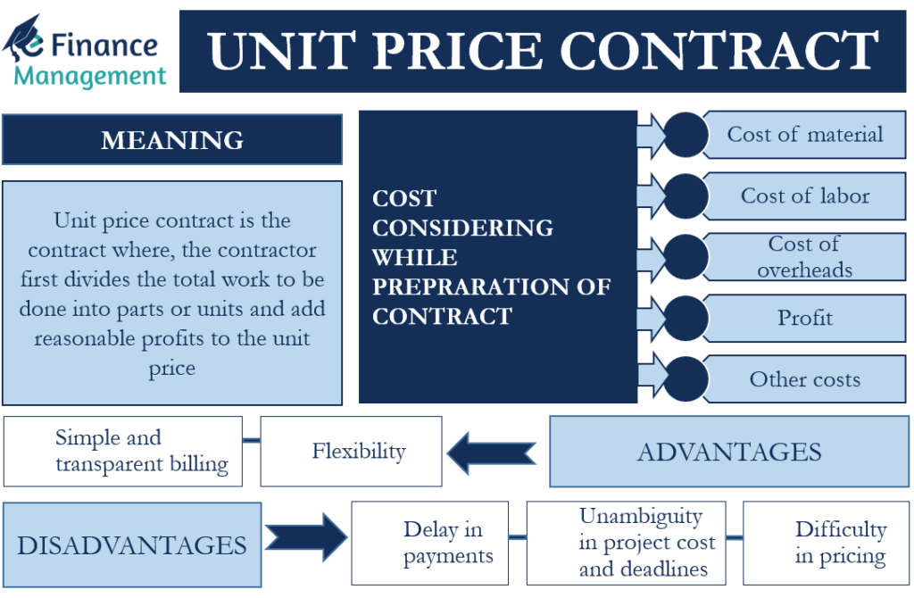

## Table of Contents

## What is a contract unit?

A contract unit is a specific amount of a commodity or service that is agreed upon in a contract. It helps both the buyer and the seller understand exactly what is being bought or sold. For example, in a contract for oil, a contract unit might be 1,000 barrels of oil. This makes it clear how much oil the buyer will get and how much the seller needs to provide.

Contract units are important because they make agreements clear and easy to follow. Without them, there could be confusion about the amount of the commodity or service involved. By setting a specific unit, both parties know what to expect, which helps prevent disagreements and makes business dealings smoother.

## Why are contract units important in trading?

Contract units are important in trading because they make sure everyone knows exactly what they are buying or selling. When people trade, they need to be clear about the amount of the thing they are dealing with. For example, if you are trading wheat, the contract unit might be 5,000 bushels. This way, both the buyer and the seller know they are talking about the same amount, which helps avoid confusion and disagreements.

Having clear contract units also makes trading easier and more efficient. When everyone understands the contract unit, they can plan better and make decisions faster. This is good for the whole market because it helps keep things running smoothly. Without clear contract units, trading could be messy and slow, which would make it harder for people to do business.

## How does a contract unit differ from a trading lot?

A contract unit is the specific amount of a commodity or service that is set in a contract. It tells both the buyer and the seller exactly how much they are dealing with. For example, if you are buying oil, the contract unit might be 1,000 barrels. This makes sure everyone knows what to expect.

A trading lot, on the other hand, is the standard amount of a commodity that can be traded on an exchange. It is used to make trading easier and more organized. For example, if you want to trade gold, a trading lot might be 100 ounces. While a contract unit is specific to a single contract, a trading lot is a general standard used across many trades.

## Can you explain the standard size of a contract unit for different types of assets?

The standard size of a contract unit can vary depending on the type of asset. For example, in the oil market, a common contract unit is 1,000 barrels of oil. This means if you buy one contract, you are buying 1,000 barrels. In the gold market, a contract unit is often 100 troy ounces. So, if you buy a gold contract, you are buying 100 ounces of gold. These sizes help make trading clear and easy to understand.

For agricultural products like wheat or corn, a contract unit is usually 5,000 bushels. This means if you trade a wheat contract, you are dealing with 5,000 bushels of wheat. In the stock market, a contract unit for stock options is usually 100 shares of stock. So, if you buy an option contract, you are buying the right to buy or sell 100 shares of a company's stock. These standard sizes help traders know exactly what they are buying or selling.

## What role does a contract unit play in determining the value of a futures contract?

A contract unit helps decide the value of a futures contract by setting the amount of the thing being traded. For example, if you have a futures contract for oil and the contract unit is 1,000 barrels, the value of the contract will depend on the price of 1,000 barrels of oil. If the price of oil goes up, the value of the contract goes up too, because you are now buying or selling a more valuable amount of oil.

The contract unit makes it clear and easy to figure out how much the futures contract is worth. Without a clear contract unit, it would be hard to know what the contract is worth. By having a standard amount, traders can quickly understand the value of the contract and make better decisions about buying or selling. This helps keep the market running smoothly and makes it easier for everyone to trade.

## How do contract units affect the margin requirements for traders?

Contract units affect the margin requirements for traders because they set the amount of the thing being traded. The margin is the money traders need to put down to open a futures contract. If the contract unit is bigger, like 1,000 barrels of oil instead of 100, the margin requirement will be higher. This is because the trader is dealing with a larger amount of the commodity, so there is more risk involved.

When traders know the contract unit, they can figure out how much money they need to start trading. For example, if the contract unit for gold is 100 ounces and the price of gold goes up, the margin requirement might go up too. This is because the value of the contract is higher, and the exchange wants to make sure traders have enough money to cover possible losses. Understanding contract units helps traders plan their finances and manage their risks better.

## What are the implications of contract unit sizes on trading strategies?

Contract unit sizes have a big impact on trading strategies. If the contract unit is large, like 1,000 barrels of oil, traders need more money to start trading. This means they need to be careful about how much they buy or sell. A big contract unit can make it harder for small traders to get into the market because they might not have enough money to cover the margin requirements. On the other hand, if the contract unit is small, like 100 ounces of gold, it can be easier for more people to trade because they don't need as much money to start.

Traders also need to think about how contract unit sizes affect their risk. A larger contract unit means more risk because if the price moves against them, they could lose more money. For example, if the price of oil drops, a trader with a contract for 1,000 barrels will lose more money than a trader with a contract for 100 barrels. So, traders might choose different strategies based on the contract unit size. Some might stick to smaller units to manage their risk better, while others might go for bigger units if they are willing to take on more risk for potentially bigger rewards.

## How can understanding contract units help in managing risk?

Understanding contract units can help traders manage their risk better. When you know the size of the contract unit, you know how much of the commodity or asset you are dealing with. This helps you figure out how much money you need to start trading and how much you could lose if things go wrong. For example, if you are trading oil and the contract unit is 1,000 barrels, you know that a big change in the price of oil could mean a big loss or gain for you. By knowing this, you can decide if you want to take that risk or if you should trade a smaller amount.

Also, knowing the contract unit size helps you plan your trading strategy. If the contract unit is big, you might want to be more careful and trade less often because each trade involves more risk. On the other hand, if the contract unit is small, you might feel more comfortable trading more often because the risk is lower. This way, you can choose strategies that fit your risk level and financial situation, making your trading safer and more controlled.

## What are some common mistakes traders make regarding contract units?

One common mistake traders make with contract units is not understanding how big they are. They might think they are trading a small amount when they are actually dealing with a lot more. For example, if someone buys a futures contract for oil without realizing it's for 1,000 barrels, they could end up with a much bigger position than they planned. This can lead to big losses if the price of oil goes down.

Another mistake is not checking the contract unit size before trading. Traders might assume all contracts are the same size, but they can be different for different commodities. If someone trades wheat without knowing that the contract unit is 5,000 bushels, they could be surprised by the amount they have to buy or sell. This can cause problems with their trading plans and lead to unexpected costs or risks.

## How do contract units vary across different financial markets?

Contract units can be different in various financial markets. In the commodities market, like oil or wheat, the contract units are usually big. For example, one contract unit for oil might be 1,000 barrels, and for wheat, it could be 5,000 bushels. This means that when you trade these commodities, you are dealing with large amounts. In the metals market, like gold or silver, the contract units are often smaller. For gold, a contract unit might be 100 troy ounces, which is less than the oil or wheat contract units.

In the stock market, contract units for options are usually 100 shares of stock. So, if you buy an option contract, you are buying the right to buy or sell 100 shares of a company's stock. This makes it easier for people to trade stocks because the contract unit is smaller than in some commodity markets. Different markets have different contract unit sizes to fit the needs of the traders and the nature of the asset being traded. Understanding these differences helps traders plan their strategies and manage their risks better.

## Can you provide an example of how contract units function in a real trading scenario?

Imagine a farmer named John who grows wheat. John wants to sell his wheat in the future, so he decides to use futures contracts. The contract unit for wheat is 5,000 bushels. John agrees to sell 10 contracts, which means he will sell 50,000 bushels of wheat at a set price when the contract expires. This helps John know exactly how much wheat he needs to deliver and how much money he will get. If the price of wheat goes up, John might miss out on some extra money, but he is happy because he knows he will get the agreed-upon price.

Now let's look at a trader named Sarah who wants to trade gold. The contract unit for gold is 100 troy ounces. Sarah buys one contract, which means she is buying 100 ounces of gold. The price of gold is $2,000 per ounce, so her contract is worth $200,000. Sarah needs to put down a margin to start trading, which is a smaller amount of money to cover the risk. If the price of gold goes up, Sarah's contract becomes more valuable, and she can make a profit. If the price goes down, she might lose money. Knowing the contract unit helps Sarah understand how much she is trading and how much risk she is taking.

## What advanced considerations should expert traders take into account regarding contract units?

Expert traders need to think carefully about how contract units can affect their trading plans. They should consider how big the contract unit is and how it fits with their goals. For example, if they want to trade a lot of a commodity but the contract unit is big, they might need more money to start. This can change their strategy because they might need to trade less often or use different ways to manage their money. Also, knowing the contract unit size can help them decide if they want to take on more risk or play it safe. If the unit is big, they might be more careful because a small change in price can mean a big change in how much they win or lose.

Another thing expert traders should think about is how contract units can be different in different markets. They need to check the contract unit size for each market they trade in because it can change how they trade. For example, the contract unit for oil might be different from the contract unit for gold. This can affect how much they need to buy or sell and how they manage their risk. By understanding these differences, expert traders can make better choices about when to trade and how much to trade. This helps them plan better and be more successful in their trading.

## What are Financial Instruments Trading Contract Units?

A financial instruments trading contract unit refers to the specified quantity of the underlying asset that is defined within a derivatives contract. In derivatives trading, these units are crucial as they determine the size of the transaction and ensure uniformity across trades. By setting a standard for the quantity of the asset, contract units facilitate the trading process, allowing both buyers and sellers to communicate effectively and trade with confidence.

These contract units are standardized across exchanges to maintain consistent trading terms, which helps in mitigating potential discrepancies that might arise if varying quantities were used. For example, in commodity futures, a contract unit might specify a standard amount, such as 1,000 barrels of [crude oil](/wiki/crude-oil) or 5,000 bushels of corn. This standardization is critical because it allows the exchange to offer a clear and common set of rules and specifications that participants can rely on when entering into contracts.

Contract units are particularly pivotal in determining the size and specifications of futures contracts. The standardized nature of these units helps to ensure that all parties involved have a precise understanding of the contract size, which is paramount in executing trades efficiently. This precision is necessary to facilitate liquidity and price discovery in the market. Without such standardization, trading financial instruments would likely become disorganized and inefficient, as parties could easily encounter misunderstandings regarding the quantity of the asset being traded.

Understanding the contract unit is essential for traders, as it informs them how much of the underlying asset they are contracting to buy or sell. This knowledge is vital for effective risk management since traders can assess their exposure and align their trading strategies accordingly. It is also important for calculating the margin requirements, potential profit, and loss: 

$$
\text{Potential Profit or Loss} = (\text{Selling Price - Buying Price}) \times \text{Contract Size}
$$

In summary, by establishing a standardized measurement for trading, contract units play a critical role in enhancing the efficiency and functionality of derivatives markets. They provide a structured approach that simplifies the trading process and allows a diverse range of participants to engage confidently.

## References & Further Reading

[1]: Bergstra, J., Bardenet, R., Bengio, Y., & Kégl, B. (2011). ["Algorithms for Hyper-Parameter Optimization."](https://dl.acm.org/doi/10.5555/2986459.2986743) Advances in Neural Information Processing Systems 24.

[2]: ["Advances in Financial Machine Learning"](https://www.amazon.com/Advances-Financial-Machine-Learning-Marcos/dp/1119482089) by Marcos Lopez de Prado

[3]: ["Evidence-Based Technical Analysis: Applying the Scientific Method and Statistical Inference to Trading Signals"](https://www.amazon.com/Evidence-Based-Technical-Analysis-Scientific-Statistical/dp/0470008741) by David Aronson

[4]: ["Machine Learning for Algorithmic Trading"](https://github.com/stefan-jansen/machine-learning-for-trading) by Stefan Jansen

[5]: ["Quantitative Trading: How to Build Your Own Algorithmic Trading Business"](https://www.amazon.com/Quantitative-Trading-Build-Algorithmic-Business/dp/1119800064) by Ernest P. Chan