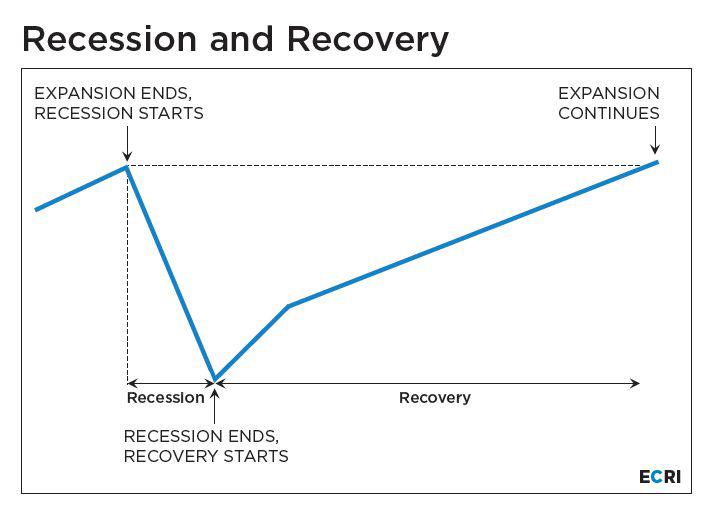

Algorithmic trading has transformed the financial markets by enabling trades to be executed at unprecedented speeds and with remarkable precision. This technologically driven approach leverages complex algorithms, which process vast amounts of data to identify trading opportunities and execute transactions without human intervention. The efficiency and speed of algorithmic trading provide significant advantages, such as reduced transaction costs and the ability to capitalize on fleeting market conditions.

However, with these advantages come various forms of risk. A thorough understanding of financial risk is vital to ensure the stability and success of trading strategies. Financial risk encompasses potential losses stemming from market volatility, credit defaults, and liquidity challenges. These risks are inherent to all types of trading, but they are particularly pronounced in algorithmic contexts where trades are executed rapidly and automatically.



Contraction risk, a specific kind of financial risk, plays a crucial role in investments, especially within fixed-income securities. This risk arises when borrowers repay their debts earlier than expected, thereby impacting projected interest income. It becomes particularly significant in environments where interest rates are declining. For investors engaged in algorithmic trading, recognizing the nuances of contraction risk and its implications for returns is essential.

This article examines the intricacies of financial risk, including contraction risk, in the algorithmic trading landscape. It also discusses effective strategies for managing these risks, providing practical examples to demonstrate the application of risk management principles. By understanding and addressing these risks, traders can enhance their ability to safeguard investments and maintain profitable trading operations.

## Table of Contents

## Understanding Financial Risk

Financial risk refers to the possibility of losing money on an investment or business venture. It is an inherent part of the financial ecosystem, encompassing a variety of factors that can lead to potential losses. Key components of financial risk include market fluctuations, credit defaults, and liquidity issues.

Market fluctuations involve the change in the market price of securities, influenced by various factors such as economic changes, political events, and investor sentiment. These fluctuations can lead to significant losses if not properly managed. For instance, a sudden drop in stock prices can erode the value of an investment portfolio.

Credit risk, or credit default risk, is the risk of a borrower failing to meet their contractual obligations, resulting in a loss to the lender. This risk is particularly pronounced in lending environments, where the default of a borrower can lead to the loss of both principal and interest income.

Liquidity risk arises when an investor is unable to sell an asset quickly enough in the market without a significant price concession. Such risk is particularly troubling during financial crises when market participants rush to liquidate their holdings, causing a shortage of buyers.

To mitigate financial risk, several strategies are commonly employed:

1. **Diversification**: Spreading investments across various asset classes, sectors, and geographies minimizes the impact of a poor performance in any single investment. The rationale is that different investments will react differently to the same economic event, stabilizing overall portfolio returns.

2. **Hedging**: This involves using financial instruments such as options, futures, or derivatives to offset potential losses in investments. By taking an opposite position in a related asset, investors can protect themselves against unfavorable market movements.

3. **Utilization of Financial Instruments**: Instruments such as swaps and forward contracts allow investors to lock in prices or rates, providing certainty in cash flows and reducing exposure to adverse price movements.

To quantify financial risk, statistical measures are deployed:

- **Standard Deviation** is a measure of the dispersion or variability of returns. A higher standard deviation indicates a higher level of risk, reflecting greater volatility in an asset's returns.

   \[ \sigma = \sqrt{\frac{1}{N}\sum_{i=1}^N (X_i - \mu)^2}
$$

   where $\sigma$ is the standard deviation, $N$ is the number of observations, $X_i$ represents each value, and $\mu$ is the mean of these values.

- **Value at Risk (VaR)** quantifies the maximum loss an investment portfolio is likely to face over a specific period (usually 1 day or 10 days) under normal market conditions, at a given confidence level. VaR is often used for portfolios to anticipate potential losses and help decide on the capital reserves needed.

   A simple VaR calculation might be expressed for normally distributed returns as:

   \[ \text{VaR}_\alpha = \mu + Z_\alpha \times \sigma
$$

   where $\text{VaR}_\alpha$ is the VaR at the $\alpha\%$ confidence level, $Z_\alpha$ is the Z-score corresponding to that confidence level, $\mu$ is the mean return, and $\sigma$ is the standard deviation.

Given these elements, robust financial risk management strategies are essential to safeguarding investments and ensuring the stability of portfolios in an ever-changing market landscape. Understanding and applying these methods allow investors to make informed decisions, enhancing resilience against potential financial upheavals.

## Contraction Risk in Fixed-Income Securities

Contraction risk is a critical consideration for investors in fixed-income securities, especially when assessing investments in mortgage-backed securities and corporate bonds. This risk emerges when a borrower opts to repay their debt earlier than anticipated. Early repayments can lead to a reduction in the interest income expected from these investments, altering the cash flow dynamics for investors.

A major driver of contraction risk is the fluctuation of interest rates. When interest rates fall, borrowers may decide to refinance their loans at the lower rates, leading to an increase in prepayments. Consequently, investors receive their principal back sooner than expected and may have to reinvest these funds at the prevailing lower rates, potentially leading to diminished returns.

This risk forms a substantial component of prepayment risk, impacting the predictability of cash flows for investors. Mortgage loans are particularly susceptible since homeowners may refinance when interest rates decrease, returning the principal earlier and reducing expected interest payments over time. Similarly, corporate bonds with callable features may be redeemed by the issuer ahead of the maturity date if the market conditions are favorable for refinancing.

Investors who rely on a consistent stream of payments face significant challenges with contraction risk. The unpredictable reduction in interest income requires the deployment of strategies to manage exposure. Diversification across various asset classes and [interest rate](/wiki/interest-rate-trading-strategies) environments can help mitigate the impacts. Analyzing prepayment models and incorporating scenario analysis into investment decisions can provide further insights into managing contraction risk efficiently.

## Algorithmic Trading and Its Risks

Algorithmic trading represents a technological advancement in financial markets by enabling the execution of trades at exceptionally high speeds and efficiencies. At its core, it utilizes algorithms—sets of rules or instructions performed by computers—to automatically decide on trade timing, price, or quantity. These algorithms can analyze vast datasets much faster than humanly possible, identifying profitable opportunities in milliseconds and executing trades without manual intervention. 

However, while [algorithmic trading](/wiki/algorithmic-trading) offers substantial profitability potential, it also ushers in a variety of risks that need careful examination. One primary concern is system errors. These can result from coding mistakes, hardware failures, or unforeseen software glitches. An example is the Knight Capital Group incident in 2012, where a software error resulted in a $440 million loss in just 45 minutes. These errors can lead to significant financial losses and erode confidence in algorithmic systems.

Moreover, algorithmic trading can contribute to increased market [volatility](/wiki/volatility-trading-strategies). Algorithms can act on incomplete or faulty data, amplifying price swings instead of stabilizing the market. The infamous "Flash Crash" of May 6, 2010, serves as a pertinent example, where the Dow Jones Industrial Average plummeted about 1,000 points and then recovered mere minutes later. Such incidents illustrate how algos can rapidly alter market dynamics, often in destabilizing ways.

Unintended cascading effects present another significant risk. These occur when one algorithm triggers reactions in others, creating a domino effect that might disrupt the market. Such responses can exacerbate market declines or ascensions, leading to a disconnect between asset prices and their intrinsic values.

To mitigate these risks, developing comprehensive and effective risk management strategies is critical. Traders and firms can implement robust testing environments to simulate market conditions and identify potential pitfalls in their algorithms. Continuous monitoring of algorithm performance, alongside real-time data analysis, enables immediate detection of anomalies, reducing the potential for large-scale losses. An iterative cycle of evaluation, feedback, and adjustments helps algorithms adapt to market changes and maintain their efficiency and effectiveness.

In summary, while algorithmic trading leverages technology to maximize trading opportunities, it equally necessitates a nuanced understanding of its inherent risks. Proper management and adaptation strategies are essential to safeguard against volatile market reactions and ensure sustained profitability.

## Managing Risks in Algorithmic Trading

Effective risk management in algorithmic trading is paramount for maintaining stability and ensuring consistent profits. Among the fundamental strategies are stop-loss orders, hedging, and diversification.

Stop-loss orders are predetermined levels set to automatically close a trade when an asset reaches a specific price, limiting potential losses. This mechanism is vital in fast-moving markets where prices can fluctuate significantly in a short period. By setting stop-loss orders, traders can manage downside risk without needing constant market supervision.

Hedging involves taking offsetting positions to mitigate risk exposure. For example, a trader might go long on a stock and simultaneously take a short position in a related security or an index to protect against adverse price movements. This technique helps balance potential losses in primary trades with gains in hedging positions.

Diversification is another cornerstone of risk management. By spreading investments across various assets or trading strategies, traders can reduce the impact of a single negative event on the portfolio. This principle is encapsulated by the correlation coefficient, $\rho$, which measures the degree to which two securities move in relation to each other; lower correlation among assets in a portfolio generally implies better diversification benefits.

Advancement in [machine learning](/wiki/machine-learning) algorithms has further enhanced risk prediction in algorithmic trading. Techniques such as supervised learning algorithms can analyze historical data to predict future price movements and volatility, thereby assisting traders in making more informed decisions. For instance, using regression models to predict price trends or employing classification algorithms to assess the likelihood of market events can significantly bolster risk management efforts.

A Python example for basic linear regression to predict future prices might look like this:

```python
import numpy as np
from sklearn.model_selection import train_test_split
from sklearn.linear_model import LinearRegression

# Sample data: past prices
X = np.array([1, 2, 3, 4, 5]).reshape((-1, 1))
y = np.array([2, 4, 6, 8, 10])

# Splitting data
X_train, X_test, y_train, y_test = train_test_split(X, y, test_size=0.2)

# Creating linear regression model
model = LinearRegression().fit(X_train, y_train)

# Predicting future prices
future_price = model.predict(X_test)
print(f"Predicted Future Prices: {future_price}")
```

Moreover, continuous monitoring and adaptation to market changes are essential for maintaining robust and responsive trading strategies. This involves regularly updating models and strategies to reflect current market conditions and employing [backtesting](/wiki/backtesting) to validate the effectiveness of these models. Implementing automated systems for real-time market analysis allows traders to quickly respond to abnormal trading conditions or to take advantage of emerging opportunities, thereby strengthening the resilience and adaptability of their trading operations.

## Contraction Risk in Algorithmic Trading: Examples

Contraction risk in algorithmic trading primarily originates from the likelihood of borrowers repaying loans ahead of schedule, especially when interest rates decline. This early repayment alters the expected cash flows from an investment in fixed-income securities, potentially impacting the portfolio's return. An illustrative example of this is the refinancing of a loan during a period of falling interest rates. Borrowers are incentivized to refinance at lower rates, leading to early loan repayments. For investors, this shortens the duration of their investment, thereby reducing the income that would have been received had the loan been paid according to its original schedule.

In the context of algorithmic trading, understanding and predicting these repayment dynamics becomes crucial. Sophisticated algorithms can be developed to detect patterns and signals that precede these prepayments. For instance, by tracking macroeconomic indicators and interest rate trends, algorithms can predict periods of increased refinancing activity. This predictive ability enables traders to adjust their strategies promptly, thereby mitigating the adverse impact on their investment returns.

To manage this risk, algorithmic trading systems often incorporate models that assess the probability of early repayments. These models can use historical data and machine learning to predict borrower behavior in coming periods of changing interest rates. Traders may employ hedging strategies as well, such as using interest rate swaps, to offset the potential loss in yield caused by contractive prepayment activity.

Moreover, algorithmic strategies can be designed to adjust the composition of fixed-income portfolios, ensuring diversification of risk across multiple instruments and maturities. This can be achieved through constant portfolio rebalancing based on real-time data analysis and market changes. For example, a Python script might run continuously, adapting the portfolio's exposure to prepayment risk as interest rate forecasts and economic indicators fluctuate:

```python
import numpy as np
from sklearn.linear_model import LinearRegression

# Sample data: interest rates and prepayment activity
interest_rates = np.array([[2.0], [1.9], [1.8], [1.7], [1.6]])  # Interest rates over time
prepayments = np.array([100, 150, 200, 250, 300])  # Prepayments activity corresponding to rates

# Simple linear regression model to predict prepayment
model = LinearRegression().fit(interest_rates, prepayments)

# Predict potential prepayments if the interest rate falls further
predicted_prepayment = model.predict(np.array([[1.5]]))
print(f"Predicted Prepayment at 1.5% Interest: {predicted_prepayment[0]}")
```
As demonstrated, such predictive modeling aids in refining trading strategies, stabilizing returns, and safeguarding portfolios against the contraction risks arising from changing interest rate environments. The continuous refinement of these algorithms ensures they remain responsive to market conditions, preserving investment stability despite inherent contraction risks.

## Conclusion

Risk analysis and management are crucial for the success of algorithmic trading. Financial risk encompasses numerous factors, such as market volatility, credit risk, and [liquidity](/wiki/liquidity-risk-premium) concerns, which can adversely impact investment outcomes. Contraction risk, particularly in the context of fixed-income securities, poses a specific challenge due to potential early debt repayments. Algorithmic trading magnifies these risks due to high-speed trade execution and complex algorithms, necessitating diligent risk management strategies to mitigate potential losses.

To safeguard investments effectively, traders must develop a comprehensive understanding of financial and contraction risks. This understanding allows for the formulation of robust strategies, such as diversification, hedging, and the incorporation of stop-loss orders, which are instrumental in mitigating adverse impacts. Moreover, leveraging advancements in technology, such as machine learning, can significantly enhance the prediction and management of these risks. These technologies offer traders more refined tools for analyzing market trends and behaviors, leading to more informed decision-making processes.

Continuous adaptation remains an essential component of successful algorithmic trading. The financial markets are inherently dynamic, requiring traders to be agile in their approach, constantly revising and refining their strategies in response to evolving market conditions. This adaptability ensures that trading strategies remain effective and responsive, reducing the likelihood of substantial losses.

Compliance with regulatory and ethical standards further strengthens trading resilience. Adhering to these standards not only safeguards traders from legal repercussions but also enhances the credibility and integrity of trading operations. By fostering a culture of ethical trading practices, traders promote a more stable and reliable market environment.

In conclusion, a thorough grasp of financial and contraction risks, coupled with strategic risk management and adherence to regulations, is imperative for the prosperity of algorithmic trading. These elements create a foundation that supports the resilience and longevity of trading activities, securing investments against the multifaceted risks inherent in the financial markets.

## References & Further Reading

[1]: Bergstra, J., Bardenet, R., Bengio, Y., & Kégl, B. (2011). ["Algorithms for Hyper-Parameter Optimization."](https://dl.acm.org/doi/10.5555/2986459.2986743) Advances in Neural Information Processing Systems 24.

[2]: ["Advances in Financial Machine Learning"](https://www.amazon.com/Advances-Financial-Machine-Learning-Marcos/dp/1119482089) by Marcos Lopez de Prado

[3]: ["Evidence-Based Technical Analysis: Applying the Scientific Method and Statistical Inference to Trading Signals"](https://www.amazon.com/Evidence-Based-Technical-Analysis-Scientific-Statistical/dp/0470008741) by David Aronson

[4]: ["Machine Learning for Algorithmic Trading"](https://github.com/stefan-jansen/machine-learning-for-trading) by Stefan Jansen

[5]: ["Quantitative Trading: How to Build Your Own Algorithmic Trading Business"](https://www.amazon.com/Quantitative-Trading-Build-Algorithmic-Business/dp/1119800064) by Ernest P. Chan