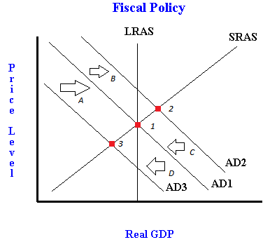

## Table of Contents

## What is contractionary fiscal policy?

Contractionary fiscal policy is when the government tries to slow down the economy. They do this by raising taxes or cutting spending. The goal is to reduce the amount of money people have to spend, which can help control inflation.

When there's too much money chasing too few goods, prices go up. This is called inflation. By using contractionary fiscal policy, the government can take some of that extra money out of the economy. This helps to keep prices stable and prevent the economy from overheating.

## How does contractionary fiscal policy work?

Contractionary fiscal policy works by reducing the total amount of money that people and businesses have to spend. The government does this by either increasing taxes or cutting its own spending. When taxes go up, people have less money left over after paying them, so they spend less. When the government spends less, it means less money is being pumped into the economy. Both of these actions take money out of circulation, which slows down economic activity.

The goal of this policy is to cool down an economy that is growing too fast and causing inflation. Inflation happens when there's too much money chasing too few goods, which drives up prices. By taking some of that extra money out of the economy, contractionary fiscal policy helps to keep prices stable. It's like putting the brakes on a car that's going too fast; it helps to prevent the economy from overheating and keeps things running smoothly.

## What is the goal of implementing contractionary fiscal policy?

The main goal of using contractionary fiscal policy is to slow down an economy that is growing too quickly. When an economy grows too fast, it can lead to a problem called inflation. Inflation happens when there is too much money and not enough goods, which makes prices go up. By using contractionary fiscal policy, the government tries to take some of that extra money out of the economy. This helps to keep prices from rising too much and keeps the economy stable.

Contractionary fiscal policy works by either raising taxes or cutting government spending. When taxes go up, people have less money to spend, so they buy fewer things. When the government spends less, it means less money is going into the economy. Both of these actions help to reduce the total amount of money that people and businesses have to spend. By doing this, the government can slow down the economy and prevent it from overheating. This helps to keep everything running smoothly and keeps prices stable.

## What is crowding out in economics?

Crowding out in economics happens when the government spends a lot of money and this makes it harder for businesses and people to borrow money. When the government needs to borrow money, it usually does this by selling bonds. If the government sells a lot of bonds, there are fewer bonds left for businesses and people to buy. This can make interest rates go up because there is more demand for the remaining bonds. When interest rates go up, it becomes more expensive for businesses and people to borrow money. This means they might decide not to borrow as much or at all, which can slow down the economy.

This effect is called crowding out because the government's borrowing is "crowding out" the borrowing that businesses and people would have done. It's like when a big group of people takes up all the seats in a movie theater, leaving fewer seats for everyone else. In the economy, when the government takes up a lot of the available money by borrowing, it leaves less money for everyone else. This can be a problem because businesses might not be able to grow or start new projects, and people might not be able to buy homes or start businesses. So, crowding out can make the economy less active and slow down growth.

## How does contractionary fiscal policy lead to crowding out?

Contractionary fiscal policy can lead to crowding out when the government decides to cut its spending. When the government spends less, it means they are taking less money from the economy. This can make interest rates go up because there's more money left for people to save and invest. When interest rates go up, it becomes more expensive for businesses and people to borrow money. They might decide not to borrow as much or at all, which can slow down the economy. This is called crowding out because the government's actions are making it harder for others to borrow and spend.

Even though contractionary fiscal policy usually means less government spending, sometimes the government might still need to borrow money to cover other costs. When the government borrows a lot, it sells bonds. If they sell a lot of bonds, there are fewer bonds left for businesses and people to buy. This can also make interest rates go up because there's more demand for the remaining bonds. When interest rates go up, borrowing becomes more expensive, and businesses and people might cut back on their plans. This is another way that contractionary fiscal policy can lead to crowding out, making it harder for the economy to grow.

## Can you explain the relationship between government borrowing and interest rates in the context of crowding out?

When the government needs money, it borrows by selling bonds. If the government sells a lot of bonds, there are fewer bonds left for businesses and people to buy. This means there's more demand for the remaining bonds, which can make their prices go up. When bond prices go up, the interest rates they offer go down. But if there are too many bonds being sold by the government, the interest rates might go up instead because people want a higher return for their money.

When interest rates go up, it becomes more expensive for businesses and people to borrow money. They might decide not to borrow as much or at all. This can slow down the economy because businesses might not start new projects or grow, and people might not buy homes or start businesses. This effect is called crowding out because the government's borrowing is taking up space that businesses and people would have used. It's like when a big group of people takes up all the seats in a movie theater, leaving fewer seats for everyone else.

## What are the different types of crowding out effects?

Crowding out can happen in different ways. One way is through financial crowding out. When the government borrows a lot of money by selling bonds, it can make interest rates go up. This happens because there are fewer bonds left for businesses and people to buy, so the ones that are left become more valuable. When interest rates go up, it becomes more expensive for businesses and people to borrow money. They might decide not to borrow as much or at all, which can slow down the economy. This is called financial crowding out because the government's borrowing is making it harder for others to borrow money.

Another type of crowding out is called resource crowding out. This happens when the government spends a lot of money on things like building roads or hiring workers. When the government uses a lot of resources, like labor and materials, there are fewer resources left for businesses to use. This can make it harder for businesses to grow or start new projects because they can't find the workers or materials they need. This type of crowding out is about the government using up resources that businesses would have used, which can slow down the economy in a different way.

There is also a third type called tax crowding out. When the government raises taxes to pay for its spending, people and businesses have less money to spend or invest. If they have less money, they might not be able to buy as many goods or start new businesses. This can slow down the economy because there is less money moving around. Tax crowding out happens because the government is taking money away from people and businesses, which makes it harder for them to spend and invest.

## How does contractionary fiscal policy affect private investment?

Contractionary fiscal policy can make it harder for businesses to invest. When the government uses this policy, it either raises taxes or cuts its own spending. If taxes go up, businesses have less money left over after paying them. This means they might not have enough money to invest in new projects or expand their operations. If the government cuts its spending, it can also affect businesses because there might be fewer government contracts or less money flowing into the economy. This can make businesses less confident about the future, so they might decide to hold off on making big investments.

When the government cuts its spending, it might need to borrow less money. But if it still needs to borrow, it can make interest rates go up. Higher interest rates mean it's more expensive for businesses to borrow money. When borrowing becomes more expensive, businesses might decide not to take out loans for new projects or to grow their business. This is called crowding out, where the government's actions make it harder for businesses to invest. Overall, contractionary fiscal policy can slow down private investment by making it more expensive and reducing the amount of money businesses have to spend.

## What are the potential impacts of crowding out on economic growth?

Crowding out can slow down economic growth. When the government borrows a lot of money, it can make interest rates go up. This makes it more expensive for businesses to borrow money. If businesses can't borrow as much, they might not start new projects or grow. This means fewer jobs and less money moving around in the economy. When businesses don't invest, the economy doesn't grow as fast.

Crowding out can also happen when the government uses up resources that businesses need. If the government spends a lot of money on things like building roads or hiring workers, there might not be enough resources left for businesses. This can make it hard for businesses to grow or start new projects. When businesses can't get the workers or materials they need, they might not be able to produce as much. This can slow down the economy because there are fewer goods and services being made.

## How can the severity of crowding out be measured or assessed?

To measure or assess the severity of crowding out, economists look at how much the government is borrowing and what happens to interest rates. If the government borrows a lot of money, it can make interest rates go up. Economists can compare these interest rates to what they were before the government started borrowing more. They can also look at how much businesses are borrowing and investing. If businesses are borrowing less and investing less, it might be a sign that crowding out is happening.

Another way to assess crowding out is by looking at the overall economy. If the economy is growing slowly and there are fewer new jobs being created, it could be because of crowding out. Economists can also look at how much the government is spending and what resources it is using. If the government is using a lot of resources like labor and materials, it might be making it hard for businesses to get what they need. By looking at all these things together, economists can get a good idea of how severe crowding out is and how it's affecting the economy.

## What are some historical examples where contractionary fiscal policy led to significant crowding out?

In the early 1980s, the United States used contractionary fiscal policy to fight high inflation. The government raised taxes and cut spending to slow down the economy. This led to crowding out because the government was borrowing a lot of money to cover its costs. When the government borrowed so much, it made interest rates go up. This made it harder and more expensive for businesses to borrow money. As a result, businesses invested less in new projects and the economy grew more slowly. This is a good example of how contractionary fiscal policy can lead to crowding out and slow down economic growth.

Another example happened in the United Kingdom during the late 1970s and early 1980s. The government used contractionary fiscal policy to control inflation. They raised taxes and cut spending, which took money out of the economy. This made interest rates go up because the government was borrowing a lot of money. When interest rates went up, businesses found it harder to borrow money for new projects. This led to less investment and slower economic growth. The crowding out effect was clear because businesses couldn't get the money they needed to grow, and the economy suffered as a result.

## What are the debates or criticisms surrounding the theory of crowding out in relation to contractionary fiscal policy?

Some people argue that crowding out might not be as big a problem as others think. They say that if the economy is not doing well, the government can spend more money without pushing up interest rates too much. This is because there might be a lot of money sitting around that people are not using. When the government spends this money, it can help the economy grow without making it harder for businesses to borrow. These people believe that in bad times, the government can help the economy without causing too much crowding out.

On the other hand, some people think crowding out is a big deal. They say that when the government borrows a lot of money, it always makes interest rates go up. This makes it harder for businesses to borrow money and invest. They argue that even when the economy is not doing well, the government should be careful about how much it borrows. If the government borrows too much, it can slow down the economy and make it harder for businesses to grow. These people believe that crowding out is a real problem that the government needs to watch out for.

## What is Understanding Contractionary Fiscal Policy?

Contractionary fiscal policy represents a strategic approach by governments to address budget imbalances, primarily through the modulation of tax revenues and public expenditures. The primary objective of this policy is to mitigate inflationary pressures and stabilize an economy that exhibits signs of overheating. This often involves either increasing taxes or decreasing government spending.

When a government opts to implement contractionary fiscal measures, the immediate consequence is a reduction in aggregate demand. Aggregate demand ($AD$) can be expressed as:

$$

AD = C + I + G + (X - M) 
$$

where $C$ represents consumption, $I$ stands for investment, $G$ is government spending, and $(X - M)$ is net exports. By decreasing $G$ or increasing taxes (thereby indirectly reducing $C$ and $I$), there is a noteworthy decline in $AD$. This decrease in aggregate demand can lead to several economic outcomes.

One of the direct impacts is a reduction in gross domestic product (GDP). GDP is often used as a measure of the overall economic activity within a country. A contractionary fiscal policy can be associated with lower levels of GDP because reduced government spending or higher taxes diminish consumer spending and business investment, both critical components of GDP. This relationship can be articulated using the expenditure approach to calculating GDP:

$$

GDP = C + I + G + (X - M) 
$$

With a decline in $G$, and potentially $C$ and $I$, GDP is likely to decrease.

In addition, contractionary fiscal policies can lead to increased unemployment. This is because reduced demand for goods and services often results in lower production levels, prompting businesses to curtail their labor force. As consumption decreases and businesses potentially hold back on investments due to reduced profits, unemployment can rise, leading to an increase in the unemployment rate.

The timing and magnitude of these effects are contingent upon several factors, including the current economic environment, the structure of the economy, and existing economic policies. Policymakers must weigh these factors carefully when deciding to implement contractionary fiscal measures to ensure they achieve the desired outcome without causing undue hardship to the economy.

## What is the Crowding Out Effect?

The crowding out effect is a significant concept in fiscal policy analysis, occurring when increased government borrowing competes with private sector entities for limited financial resources, leading to higher interest rates. This rise in interest rates can dampen private investment, as borrowing costs become prohibitive for businesses and individuals. Typically associated with expansionary fiscal policies, where governments spend more or lower taxes to stimulate economic growth, the crowding out effect can inadvertently stifle private sector activity by making capital more expensive.

Mathematically, the crowding out effect can be illustrated by the supply and demand dynamics in the credit market. As the government demands more financial resources, the demand curve shifts to the right, elevating the equilibrium [interest rate](/wiki/interest-rate-trading-strategies), as depicted in economic models such as the IS-LM (Investment-Saving, Liquidity preference-Money supply) framework. This increase in interest rates is quantified by:

$$
i = i_0 + \frac{G}{M}\Delta G
$$

where $i$ is the interest rate, $i_0$ is the initial interest rate, $G$ is government spending, $M$ represents money supply elasticity, and $\Delta G$ indicates the change in government borrowing.

Contrastingly, under contractionary fiscal policies—where the government reduces spending or increases taxes to control inflationary pressures—this effect may reverse. As government borrowing decreases, the supply of financial resources available for private investment increases, potentially lowering interest rates. This scenario, often termed "crowding in," can encourage private sector investment as the cost of borrowing declines, thereby partially offsetting the reduction in aggregate demand caused by contractionary measures.

Understanding the dynamics between crowding out and crowding in is essential for policymakers to gauge the broader economic implications of fiscal policy adjustments. The balance between the two impacts the overall effectiveness of fiscal interventions, influencing economic variables such as GDP growth, inflation, and employment levels. Hence, careful calibration of fiscal policies is critical to ensuring that fiscal expansions do not excessively burden the private sector and that contractions allow for sufficient private sector recovery and investment.

## What is the impact of contractionary policy on algorithmic trading?

Contractionary fiscal policy, characterized by measures such as reducing government spending or increasing taxes, can significantly impact financial markets by introducing volatility. This volatility arises as traders and algorithmic trading systems adjust their strategies in response to anticipated changes in interest rates and economic conditions. When a government implements contractionary policies, it generally aims to decrease the money supply and control inflationary pressures, often resulting in higher interest rates. This shift can lead to rapid asset repricing as investors reassess the present value of future cash flows.

Algorithmic trading systems, which execute trades based on predefined criteria and market data, are particularly sensitive to such economic indicators. These algorithms are designed to react swiftly to changes in interest rates or macroeconomic signals, often amplifying market movements due to their high-speed trading capabilities. For instance, an abrupt rise in interest rates may trigger a cascade of sell orders from algorithms programmed to liquidate positions under such conditions, thereby exacerbating downward price pressure in asset markets.

Consider a simplified model where an algorithm adjusts the asset allocation between stocks and bonds based on changes in interest rates, $r$. Let the allocation to stocks, $S$, and bonds, $B$, be defined by:

$$
S = \alpha - \beta \times r
$$
$$
B = \gamma + \delta \times r
$$

Where $\alpha, \beta, \gamma,$ and $\delta$ are predetermined parameters that denote the sensitivity of the asset allocation to interest rate changes. In a contractionary environment, as $r$ increases, the algorithm reduces $S$ and increases $B$, leading to potential sudden shifts in market liquidity and asset prices.

The rapid execution of trades by algorithmic systems can also lead to increased bid-ask spreads and price slippage, further contributing to market instability. This phenomenon highlights the importance of understanding how these systems respond to fiscal policy measures. Policymakers need to be aware of these dynamics to anticipate market reactions and, if necessary, implement regulatory measures to curb excessive volatility. Similarly, traders must enhance risk management protocols to handle the fast-paced adjustments induced by algorithms, ensuring that systemic risks are minimized and market integrity is maintained. This underscores the critical intersection of fiscal policy and technological advancements in contemporary financial markets, necessitating a coordinated approach to policy formulation and market regulation.

## References & Further Reading

[1]: Bernheim, B. Douglas. "Ricardian Equivalence: An Evaluation of Theory and Evidence." In NBER Macroeconomics Annual 1987, Volume 2, edited by Stanley Fischer, 263-304. MIT Press.

[2]: Mishkin, Frederic S. "The Economics of Money, Banking, and Financial Markets." Pearson Education, 2019. (Provides insights into fiscal policy impacts on financial markets).

[3]: Barth, James R., et al. "Algorithmic Trading and Market Dynamics: From Visual Inspection to Automated Trading." International Review of Financial Analysis, 2012. (Discusses the role of algorithmic trading in financial markets).

[4]: ["Advances in Financial Machine Learning"](https://www.amazon.com/Advances-Financial-Machine-Learning-Marcos/dp/1119482089) by Marcos Lopez de Prado.

[5]: Tobin, James. "A General Equilibrium Approach to Monetary Theory." Journal of Money, Credit and Banking, 1969. 1(1): 15-29. (Explains the IS-LM model and its applications in fiscal policy).

[6]: ["Dynamic Effects of Fiscal Policy"](https://www.jstor.org/stable/2296781) by Olivier Blanchard and Roberto Perotti. The Quarterly Journal of Economics, 2002. (Studies the dynamic effects of fiscal policy on the economy).