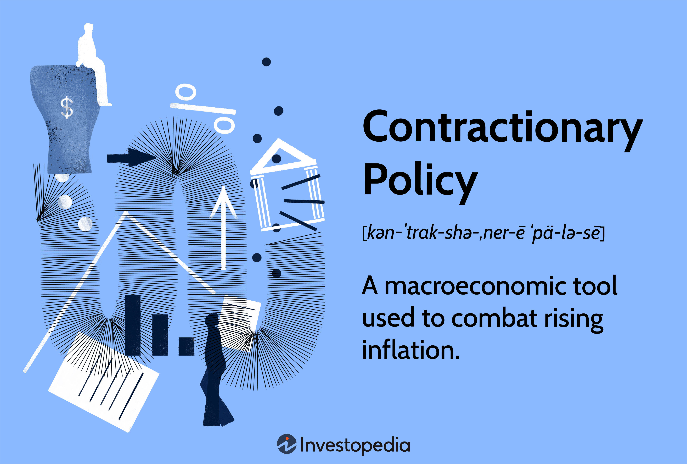

In today's complex economic landscape, understanding the various tools and strategies used by governments and financial entities is crucial for investors and policymakers alike. Economic policies, such as contractionary policy and monetary policy, play pivotal roles in steering the macroeconomic environment. Contractionary policies, for instance, are designed to reduce inflation by decreasing money supply and curbing excessive economic growth, while monetary policies aim to achieve economic objectives such as stable growth and full employment through various tools like interest rates and reserve requirements.

Algorithmic trading, often seen as a modern financial tool, leverages these policies to make informed decisions, illustrating the intersection of economic theory and technological advancement. By utilizing sophisticated computer algorithms, traders can automate strategies that respond to policy shifts and economic indicators, enhancing trading efficiency and accuracy. The algorithms incorporate real-time data to execute transactions at optimal times, demonstrating how financial technology can adapt to economic strategies.



This article aims to unpack the nuances of contractionary and monetary policies and their relevance to algorithmic trading. It will examine how these economic policies influence financial markets and how algorithmic trading systems incorporate policy changes to optimize trading performance. Through exploring these intersections, the article will provide insight into the dynamics of modern financial systems and the strategic importance of understanding economic policies in the context of technology-driven trading avenues.

## Table of Contents

## Understanding Contractionary Policy

Contractionary policy serves as a macroeconomic mechanism designed to combat excessive inflation and overheated economic conditions. This policy is predominantly implemented by central banks to mitigate the risk of economic bubbles and sustain long-term economic stability. To achieve these objectives, contractionary policy employs several instruments, including adjusting interest rates, modifying reserve requirements, and executing open market operations such as selling government securities.

Raising interest rates is a common tactic used under contractionary policy. By increasing the cost of borrowing, central banks aim to reduce consumer and business spending, thus decreasing aggregate demand. High interest rates also encourage savings over consumption, further diminishing immediate spending pressures in the economy.

Adjusting reserve requirements is another method to influence the money supply. Central banks may increase the proportion of deposits that banks must hold in reserve rather than lend out. This action effectively reduces the capacity of commercial banks to create credit, directly impacting the level of economic activity and dampening inflation.

Open market operations, specifically the selling of government securities, provide another avenue to withdraw excessive [liquidity](/wiki/liquidity-risk-premium) from the market. By selling securities, central banks absorb cash from the banking system, tightening the money supply. This reduction in liquidity helps to temper inflationary pressures by restraining consumption and investment activities.

The ultimate goal of contractionary policy is to address economic distortions that arise in overheated economies. By carefully calibrating these policy tools, central banks strive to maintain price stability and prevent the negative effects of unchecked inflation, such as eroded purchasing power and distorted spending patterns. This balance is crucial for fostering a sustainable economic environment conducive to steady growth.

## Monetary Policy and Its Mechanisms

Monetary policy encompasses the strategic actions undertaken by a country's central bank to regulate the money supply and achieve macroeconomic objectives, such as stable economic growth and the maximization of employment. Central banks employ a variety of instruments to influence economic conditions.

One of the primary tools is the manipulation of interest rates. By adjusting the policy rate, central banks can influence borrowing costs across the economy. For instance, a reduction in interest rates typically lowers the cost of borrowing, spurring economic activity, whereas an increase in rates makes borrowing more expensive, potentially cooling an overheated economy. The central bank's policy rate often serves as a benchmark for short-term interest rates in the economy.

Another key instrument is conducting open market operations (OMOs). This involves the buying and selling of government securities in the open market to influence the level of bank reserves and the short-term interest rates. For example, when a central bank purchases government securities, it injects liquidity into the financial system, reducing interest rates and encouraging lending and investment. Conversely, selling securities withdraws liquidity, elevates interest rates, and restrains economic activity.

Central banks also impose reserve requirements on commercial banks, dictating the minimum reserves a bank must hold against deposits. Adjusting these requirements directly impacts the money supply; lowering reserve requirements increases banks' capacity to create loans, thereby expanding the money supply, while tightening them reduces this capacity.

These mechanisms function synergistically to maintain monetary stability within an economy. An effective monetary policy ensures that inflation remains within target levels and employment rates sustain equilibrium, thereby supporting sustainable economic growth over the long term. According to studies and historical data, the calibration of these tools requires precise timing and deep analysis of economic indicators to avoid unintended economic fluctuations.

## Algorithmic Trading and Economic Policies

Algorithmic trading, or algo trading, employs sophisticated computer algorithms to execute trades based on pre-established criteria, frequently leveraging economic indicators and responding to policy changes. This approach allows traders to efficiently adjust to evolving market conditions, utilizing data-driven models to inform their strategies. By understanding and integrating monetary policy adjustments, these algorithms can make informed decisions that enhance trading outcomes.

Algorithms in trading are typically programmed to recognize recurring patterns and signals that align with specific monetary policy actions, such as changes in interest rates, which can influence asset prices and market [volatility](/wiki/volatility-trading-strategies). For instance, a reduction in interest rates by a central bank might be coded as a buy signal within a trading algorithm, based on the historical correlation between lower interest rates and rising asset prices. Conversely, an increase in interest rates could signal a sell event, given the potential for asset depreciation.

The ability of algorithms to incorporate economic policy changes provides a significant advantage. By automatically adjusting their strategies in response to economic data releases and central bank policy announcements, algo trading systems can anticipate market movements with a speed and precision unattainable by human traders. For example, when the Federal Reserve announces a shift in its monetary policy stance, algorithmic systems can rapidly interpret and act on this information, executing trades in milliseconds.

Understanding the nuances of monetary policy is essential for optimizing these models. By analyzing historical data on [interest rate](/wiki/interest-rate-trading-strategies) changes and their impact on market dynamics, algorithm developers can refine their models to better predict market responses to future policy alterations. This predictive capability is crucial for capitalizing on economic cycles, as different phases of the cycle may present varying opportunities for profit.

Incorporating economic indicators such as GDP growth rates, unemployment figures, and inflation data into algorithmic models enhances their predictive accuracy. These indicators are frequently used in conjunction with [machine learning](/wiki/machine-learning) techniques to create adaptive algorithms. Machine learning models can be trained on historical data to recognize complex patterns linked to economic conditions, allowing them to forecast future market trends more effectively.

Here is a simple Python pseudocode example demonstrating how economic indicators might be incorporated into an [algorithmic trading](/wiki/algorithmic-trading) strategy:

```python
import pandas as pd
from sklearn.linear_model import LinearRegression

# Load historical economic data
data = pd.read_csv('economic_indicators.csv')

# Select relevant features
features = data[['interest_rates', 'gdp_growth', 'inflation']]
target = data['asset_prices']

# Train a linear regression model
model = LinearRegression().fit(features, target)

# Predict future asset prices based on predicted economic indicators
future_economic_indicators = pd.DataFrame({'interest_rates': [0.05], 'gdp_growth': [0.03], 'inflation': [0.02]})
predicted_asset_price = model.predict(future_economic_indicators)

# Determine trading action
if predicted_asset_price > data['asset_prices'].iloc[-1]:
    action = 'buy'
else:
    action = 'sell'
```

In this example, the algorithm uses a linear regression model to predict asset prices based on economic indicators. If the predicted price exceeds the current price, the algorithm might generate a buy signal, indicating anticipated growth. Successful algorithmic trading relies on precise modeling of economic interactions, highlighting the intersection of financial strategies and economic policy understanding.

## Case Studies: Real-World Applications

History provides several notable examples of contractionary policy's effectiveness, such as the measures implemented in the early 1980s under Federal Reserve Chair Paul Volcker. During the late 1970s, the United States faced rampant inflation, commonly referred to as "stagflation," which combined high inflation with economic stagnation. To address this, Volcker adopted a strict contractionary monetary policy aimed at reducing the money supply and curbing inflation. 

The primary tool used was a significant increase in interest rates. The Federal Funds Rate, which is the interest rate at which depository institutions trade federal funds with each other overnight, was increased drastically. By raising the cost of borrowing, the Federal Reserve effectively reduced consumer spending and business investments, which helped to lower inflation rates. Although this policy strategy initially led to a recession, it ultimately succeeded in stabilizing the economy and maintaining low inflation rates in subsequent years. This period underscored the capacity of contractionary policies to tackle severe inflationary pressures effectively.

In contrast, the recent COVID-19 pandemic prompted widespread monetary policy adjustments across global economies, highlighting the dynamic interactions between monetary policy and economic activities. Central banks around the world, including the U.S. Federal Reserve, adopted expansive monetary policies, like slashing interest rates to near zero and implementing quantitative easing programs to increase the money supply. These measures were designed to support economic activity and mitigate the economic downturn caused by the pandemic.

Additionally, central banks engaged in large-scale asset purchases to ensure liquidity in the financial system and to lower longer-term interest rates. These expansive policies aimed to stimulate borrowing and spending, thereby fostering economic recovery. However, the long-term impacts of such extensive monetary interventions are still being evaluated, as central banks now face the challenge of gradually unwinding these measures without destabilizing economic growth.

Both historical instances illustrate how contractionary and expansionary monetary policies can be tailored to address specific economic challenges. The effectiveness of these policies depends on timely implementation, clear communication with markets, and an understanding of the broader economic context. As a result, they are vital tools in maneuvering through varying economic cycles, influencing trading activities and broader market dynamics.

## Contractionary vs. Expansionary Policies

Contractionary and expansionary policies are fundamental instruments utilized by governments and central banks to manage economic cycles, ensure stability, and foster growth. These policies serve differing purposes and are implemented through various monetary and fiscal measures.

Contractionary policies are primarily enacted to combat inflation and overheating economies. They achieve this by reducing the money supply or decreasing government spending, effectively cooling down economic activity. Central banks, such as the Federal Reserve or the European Central Bank, typically employ contractionary monetary policies by increasing interest rates. This makes borrowing more expensive, discouraging consumer spending and business investments. Additionally, central banks may increase reserve requirements for commercial banks, compelling them to hold a larger share of their deposits as reserves, thus reducing their lending capacity. Another tool is open market operations, where central banks sell government securities, thereby extracting liquidity from the financial system.

In contrast, expansionary policies aim to stimulate economic growth, especially during periods of recession or economic stagnation. These policies involve increasing the money supply or enhancing government spending to boost overall demand. Central banks can lower interest rates to make borrowing more attractive, encouraging spending and investment. Similarly, reducing reserve requirements allows banks to extend more credit. In fiscal terms, expansionary policy might include increased government expenditure on infrastructure projects or tax cuts, effectively putting more money into consumers' hands.

Both contractionary and expansionary policies have significant impacts on key economic variables such as GDP, unemployment rates, and inflation. While contractionary policies help stabilize an overheated economy by controlling inflation, they might also slow down economic growth temporarily. Conversely, expansionary policies can lead to growth and reduced unemployment, but if used excessively, they may trigger inflationary pressures.

Balancing these policies is crucial for maintaining macroeconomic stability. It requires careful evaluation of the economic environment to decide when to switch from one policy stance to another. This balancing act is vital for ensuring sustainable economic development without triggering undesirable side effects like hyperinflation or prolonged recessions. In modern economic management, the interplay between these policies forms the backbone of central banking strategy.

## Conclusion

In today's dynamic economic environment, the interplay between contractionary policies, monetary strategies, and algorithmic trading forms a crucial triad influencing financial markets. Contractionary policy, which includes strategies like increasing interest rates to control inflation, directly impacts liquidity and investment decisions. Monetary policy, through mechanisms like open market operations and interest rate adjustments, shapes the fundamental economic landscapes that financial markets and trading algorithms operate within.

For investors and policymakers, a deep understanding of these macroeconomic tools is essential. The ability to anticipate and react to policy shifts is not just beneficial but necessary for effective navigation of the global financial markets. Algorithmic trading, with its growing prevalence, leverages these economic insights, optimizing trading strategies to align with policy-driven market movements. Algorithms are increasingly designed to ingest economic data and respond to changes swiftly, highlighting the critical need for integrating economic policy insights into trading paradigms.

Looking ahead, the fusion of algorithmic trading with nuanced economic analysis will likely define the next wave of trading innovation. As markets evolve, so too will the sophistication needed in algorithms to incorporate complex economic variables. Mastery of the interconnectedness of these components will be a competitive edge, guiding successful investment strategies and policy development in an ever-changing global economy.

## References & Further Reading

[1]: ["Advances in Financial Machine Learning"](https://www.amazon.com/Advances-Financial-Machine-Learning-Marcos/dp/1119482089) by Marcos Lopez de Prado

[2]: ["Monetary Policy, Inflation, and the Business Cycle: An Introduction to the New Keynesian Framework"](https://press.princeton.edu/books/hardcover/9780691164786/monetary-policy-inflation-and-the-business-cycle) by Jordi Galí

[3]: ["Algorithmic and High-Frequency Trading"](https://www.amazon.com/Algorithmic-High-Frequency-Trading-Mathematics-Finance/dp/1107091144) by Álvaro Cartea, Sebastian Jaimungal, and José Penalva

[4]: ["Evidence-Based Technical Analysis: Applying the Scientific Method and Statistical Inference to Trading Signals"](https://www.amazon.com/Evidence-Based-Technical-Analysis-Scientific-Statistical/dp/0470008741) by David Aronson

[5]: ["The Age of Turbulence: Adventures in a New World"](https://www.amazon.com/Age-Turbulence-Adventures-New-World/dp/1594201315) by Alan Greenspan

[6]: ["Quantitative Trading: How to Build Your Own Algorithmic Trading Business"](https://www.amazon.com/Quantitative-Trading-Build-Algorithmic-Business/dp/1119800064) by Ernest P. Chan