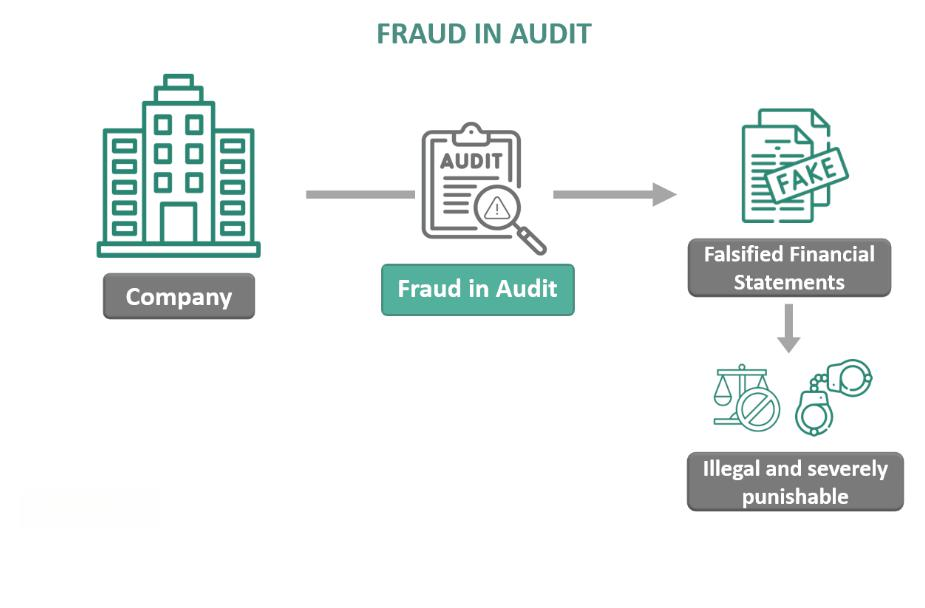

Contractor fraud presents a significant challenge, impacting both consumers and professionals across a wide array of industries. This issue arises when individuals or companies engaged in construction or home improvement projects employ deceitful practices to gain financial advantages. These unethical actions not only lead to financial losses for victims but also undermine trust in legitimate business relationships.

The mechanisms of contractor fraud can vary, encompassing numerous tactics and strategies aimed at exploiting unsuspecting clients. Common methods include the usage of substandard materials, inflating prices, or abandoning projects before completion. Such fraudulent activities often result in victims having to pay twice: initially for the faulty or unfinished work, and subsequently to a legitimate contractor to rectify the deficiencies left by the fraudulent party.



Recognizing contractor fraud involves identifying specific warning signs. These may include contractors demanding large upfront payments, refusing to provide a detailed written contract, or suggesting that necessary permits are unnecessary. Understanding these red flags is critical for consumers, enabling them to avoid falling prey to fraudulent schemes.

As we explore contractor fraud, attention will also be given to preventative strategies. These strategies play an essential role in safeguarding financial resources and ensuring the trustworthiness of business transactions. By emphasizing due diligence, such as verifying licenses, seeking customer reviews, and consulting reliable sources like the Better Business Bureau, individuals can better protect themselves from potential fraud.

Furthermore, the integration of technology and algorithmic trading offers novel approaches to fraud prevention. Through sophisticated algorithms capable of identifying unusual patterns indicative of fraudulent activities, these technological advancements enhance the capabilities of institutions in detecting and preventing fraud.

By increasing awareness and providing valuable insights into these mechanisms, this article is designed to empower readers to protect their investments. An informed and vigilant approach not only mitigates the risks associated with contractor fraud but also fosters healthy and trustworthy business relationships. As we begin, it is imperative to define what contractor fraud entails and explore the most common forms it takes.

## Table of Contents

## Understanding Contractor Fraud

Contractor fraud is a pervasive issue characterized by unethical and illegal practices employed by contractors engaged in home improvement or construction projects. These fraudulent activities can take a variety of forms, each harmful to consumers and detrimental to the integrity of professional contracting. Understanding the nuances of contractor fraud is essential for both consumers looking to protect their investments and for regulators aiming to uphold industry standards.

One of the most pervasive tactics in contractor fraud involves the use of substandard materials. Contractors may opt for cheaper, lower-quality products while charging clients for more expensive, higher-quality materials. This deception not only compromises the structural integrity and longevity of a project but also results in financial losses for the homeowner who paid a premium for goods that were not provided.

Overcharging is another common scheme used by fraudulent contractors. This may involve inflating the cost of labor, materials, or other expenditures beyond what was initially quoted or required. This tactic can leave homeowners bearing unforeseen costs, sometimes double what was originally necessary, thereby disrupting financial plans and causing significant stress.

In more severe cases, contractors may fail to complete the promised work, leaving projects unfinished and homeowners in a difficult position. These contractors may disappear after receiving payment, leaving the client to seek out and pay a new contractor to take over and complete the project. This results in a financial double-hit, as funds already paid are often unrecoverable, and additional costs are incurred to remedy the situation.

Fraudulent practices can manifest in subtle yet damaging ways. Misleading clients about the necessity of certain repairs or upgrades is a tactic employed by some dishonest contractors, convincing homeowners to invest in unnecessary work through false claims or exaggerated assessments. This exploits the client's lack of specialist knowledge, leading them to allocate funds toward nonessential improvements under false pretenses.

The subtlety of these deceptive practices often makes them difficult to detect until significant damage has occurred. Consequently, recognizing the warning signs of contractor fraud is crucial, as is taking preemptive steps to verify the legitimacy and credibility of potential contractors. Being informed and vigilant can significantly reduce the likelihood of falling victim to these fraudulent schemes, helping maintain both financial stability and trust in contractual relationships.

## Signs of Contractor Fraud

Recognizing the signs of contractor fraud is essential for preventing potential financial loss and stress. One of the most common red flags is when contractors demand large upfront payments. Legitimate contractors typically require a reasonable deposit, often around 10-15% of the total project cost. Demanding a significantly higher percentage can be indicative of fraudulent intent, as some contractors may never return to complete the work once they receive the payment.

Another concerning practice is the refusal to provide a written contract. A written contract serves as a formal agreement that outlines the scope of work, timeline, cost, and other critical details of the project. Contractors who avoid executing such contracts may do so to maintain flexibility for deceitful alterations in project scope or cost.

Additionally, some fraudulent contractors may persuade clients to bypass necessary permits for a job. While obtaining permits can indeed slow down the commencement of work, they are crucial for ensuring that projects meet all safety and regulatory standards. Skipping permits can lead to significant legal and financial complications for the homeowner, often uncovering the fraud only when issues arise with the unpermitted work.

Unexpected cost increases are another common sign of contractor fraud. While some cost overruns are typical due to unforeseen circumstances, excessive and unjustified increases are often a tactic used to extract more money from the client. It is crucial to have a clear understanding and agreement on how changes or additional costs will be handled in advance.

Lastly, be wary of unsolicited offers of leftover materials at discounted rates. This can be a tactic to unload poor-quality or stolen materials. Such offers can sometimes sound appealing but can lead to substandard work or involvement in further legal issues if the materials are linked to theft.

Being vigilant about these warning signs can help individuals protect themselves from contractor fraud. By demanding a clear, written contract, ensuring that all necessary permits are obtained, and being cautious of demands for large upfront payments or unjustified cost increases, consumers can mitigate the risk of falling victim to fraudulent contractors.

## Preventing Contractor Fraud

Preventing contractor fraud requires a proactive approach that involves thorough research and due diligence before committing to any construction or home improvement project. Here are several essential steps to help minimize the risk of falling prey to contractor fraud:

1. **Conduct Thorough Research**: Prior to hiring a contractor, it is crucial to verify their credentials. Checking for valid licenses and insurance is essential, as these are standard requirements for legitimate contractors. Licensing ensures that the contractor has met specific professional standards and regulatory criteria. Insurance provides protection against potential liabilities or damages that may arise during the project. Additionally, reading customer reviews and ratings on trusted websites can offer insight into the contractor's reputation and reliability. Websites such as Yelp or specialized platforms like Angie's List and HomeAdvisor can be valuable resources for this purpose.

2. **Demand a Written Contract**: A detailed, written contract is a vital tool in safeguarding against fraud. The contract should outline the scope of work, including specific tasks to be performed, timelines, and materials to be used. It should also include detailed cost estimates and a payment schedule. By having these terms officially documented, both parties have clear expectations, reducing the risk of misunderstandings. Moreover, a written contract serves as a legal document that can be referenced in case of disputes.

3. **Consult Reputable Sources**: Reputable organizations such as the Better Business Bureau (BBB) can assist in verifying a contractor's credibility. The BBB provides ratings based on customer complaints, business practices, and transparent dealings. A contractor with an excellent BBB rating is typically more trustworthy. Furthermore, local trade associations often have directories of licensed and professional contractors who adhere to industry standards and ethical practices.

4. **Regular Audits and Oversight**: Implementing periodic audits and oversight during the project can significantly reduce the risk of fraud, especially for larger projects. These checks should review the project's progress against the contract terms, ensuring compliance with the agreed scope, quality standards, and timelines. Hiring an independent inspector or a project manager can provide an additional layer of supervision to confirm that all work is up to standard and that materials billed correspond to what has been delivered and used.

By adhering to these preventative strategies, individuals can effectively protect themselves from contractor fraud. These precautions not only safeguard financial resources but also promote a healthier, trust-based relationship between clients and contractors.

## Role of Algorithmic Trading in Fraud Prevention

Algorithmic trading utilizes computer systems to perform transactions based on predefined rules and criteria. While primarily used in financial transactions to enhance efficiency and profitability, its principles are increasingly being adapted for the detection and prevention of fraudulent activities.

In the context of fraud prevention, algorithmic systems are designed to identify anomalies or unusual patterns that may suggest fraudulent behavior. These systems analyze vast datasets in real-time, which allows institutions to spot irregular transactions quickly. For instance, algorithms might be employed to detect transactions that deviate significantly from historical patterns or that are highly atypical when compared to recognized legitimate activity.

A basic example of an algorithmic approach involves statistical techniques such as anomaly detection. Anomaly detection methods, such as clustering or predictive modeling, can identify data points that do not conform to expected behavior. Consider a simple example using Python:

```python
import numpy as np
from sklearn.ensemble import IsolationForest

# Random dataset with outliers
data = np.array([[10, 2], [12, 3], [10, 2.5], [1000, 1]])  # The last point is an outlier

# Isolation Forest model for anomaly detection
model = IsolationForest(contamination=0.25)  # Assuming 25% of the data could be anomalous
model.fit(data)

# Predict anomalies
anomalies = model.predict(data)
print("Anomalies detected at indices:", np.where(anomalies == -1))
```

In this example, the `IsolationForest` algorithm identifies the outlier within the data set that may suggest a fraudulent transaction.

Financial institutions leverage these technologies not only to enhance their fraud detection capabilities but also to reduce false positives – alerts that incorrectly identify legitimate transactions as fraudulent. This balance is crucial; while it is important to promptly identify fraudulent activities, excessive false positives can erode trust with consumers and increase operational costs.

Understanding [algorithmic trading](/wiki/algorithmic-trading) and its application in fraud prevention reveals a broader strategy of using technology to safeguard assets. By automating the process of fraud detection and integrating these systems with human oversight, organizations can achieve a more robust and efficient defense against fraud.

The advances in [machine learning](/wiki/machine-learning) and neural networks further push the boundaries of what these systems can accomplish. By training models on large datasets of historical fraud cases, it is possible to improve their predictive capabilities, potentially anticipating fraudulent strategies before they manifest at scale. As this technology evolves, its role in fraud prevention promises to expand, offering newer, more efficient tools to combat illicit activity.

## Conclusion

Contractor fraud poses a substantial threat, but recognizing warning signs and implementing precautionary measures can significantly reduce the risk. By staying vigilant, consumers and professionals alike can prevent deceitful practices from jeopardizing their financial security. Algorithmic trading and similar technological innovations are transforming the landscape of fraud prevention by introducing sophisticated tools for early detection. These advances in technology offer unprecedented opportunities to identify and address fraudulent activities with greater accuracy and efficiency.

For individuals looking to protect themselves, staying informed is crucial. This involves conducting thorough due diligence, checking contractor credentials, and utilizing available resources such as consumer protection agencies and reviews. Embracing technological advancements in fraud detection can further enhance security measures.

Ultimately, a combination of knowledge, caution, and technology empowers individuals to safeguard their investments and maintain trust in business interactions. By adopting these strategies, parties involved in contractual agreements can substantially mitigate risks associated with contractor fraud, ensuring that both financial interests and professional relationships remain intact.

## References

- Federal Trade Commission. "How to Avoid a Home Improvement Scam." Available at [www.consumer.ftc.gov](https://www.consumer.ftc.gov/articles/how-avoid-home-improvement-scam)

- Better Business Bureau. "BBB Tip: Hire a Reliable and Trustworthy Contractor." Available at [www.bbb.org](https://www.bbb.org/article/tips/14081-bbb-tip-hire-a-reliable-and-trustworthy-contractor)

- Investopedia. "Contractor Fraud: What it is, Signs of it, Avoiding it." Available at [www.investopedia.com](https://www.investopedia.com/contractor-fraud-what-it-is-signs-of-it-and-avoiding-it-5180009)

## References & Further Reading

[1]: Federal Trade Commission. ["How to Avoid a Home Improvement Scam."](https://consumer.ftc.gov/articles/how-avoid-home-improvement-scam)

[2]: Better Business Bureau. ["BBB Tip: Hire a Reliable and Trustworthy Contractor."](https://www.bbb.org/all/home-improvement/how-to-hire-a-reliable-and-trustworthy-general-contractor)

[3]: Investopedia. ["Contractor Fraud: What it is, Signs of it, Avoiding it."](https://www.investopedia.com/terms/c/contractor-fraud.asp)

[4]: Jansen, S. ["Machine Learning for Algorithmic Trading"](https://github.com/stefan-jansen/machine-learning-for-trading)

[5]: Chan, E. P. ["Quantitative Trading: How to Build Your Own Algorithmic Trading Business"](https://github.com/ftvision/quant_trading_echan_book)