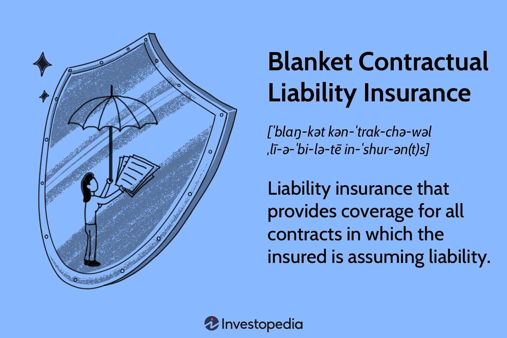

In an increasingly complex business world, understanding different forms of insurance coverage is crucial, especially when it deals with contractual agreements and liabilities. Businesses today face a myriad of challenges that require them to safeguard their financial health and operational stability. Contractual coverage and liability insurance play pivotal roles in this safeguarding process. These insurance types provide protection against potential legal liabilities that may arise from business contracts, ensuring that unforeseen legal claims do not disrupt financial continuity.

Due to the digital transformation of financial markets, algorithmic trading has become a significant component of contemporary business operations. This method leverages computer algorithms to execute trades at speeds and volumes unmanageable by human traders, presenting both new opportunities and risks. The intersection of algorithmic trading with insurance creates a unique landscape where financial and legal protections must evolve to meet emerging challenges.

This article explores the intricate relationships between contractual coverage, liability insurance, and algorithmic trading—essential areas in today’s business and economic environment. By examining each component, the article provides insights into their respective roles and how they intersect, offering a comprehensive overview for business professionals and investors. Understanding these intersections is vital for businesses to navigate the complexities of global markets and protect their interests against liabilities stemming from contractual obligations and sophisticated trading strategies.

## Table of Contents

## Understanding Contractual Coverage and Liability Insurance

Contractual liability insurance serves as a vital component of a business's risk management strategy. This insurance type is designed to provide coverage for liabilities that a business may assume under the terms of a contract. Businesses frequently engage in contractual relationships that delineate specific responsibilities and obligations. When these contracted duties lead to unforeseen legal and financial liabilities, contractual liability insurance can offer protection.

At its core, contractual liability insurance safeguards businesses from claims arising from the breach of a contractual obligation. It encompasses a range of situations where a business may be liable for third-party claims due to an assumed contractual responsibility. A typical scenario would be a service provider entering into an agreement with a client, where the contract explicitly states the provider's liability for any damages or losses incurred by the client stemming from the service provider’s actions.

The coverage scope of contractual liability insurance typically includes indemnification clauses within contracts where one party agrees to compensate another party for any losses that arise from certain events specified in the contract. For instance, if a business has agreed to indemnify a partner for damages incurred from a service failure, contractual liability insurance can cover the financial obligation for such indemnities.

A critical aspect of managing contractual liability is understanding the difference between typical general liability insurance and contractual liability insurance. While standard general liability policies may exclude coverage for contractual obligations, contractual liability insurance fills this gap, ensuring businesses are protected where general policies fall short. This specialized insurance becomes indispensable when contracts include specific ‘hold harmless’ agreements, which obligate one party to protect another from certain liabilities.

The importance of contractual liability insurance is underscored by the potential financial impact of litigation and damage claims arising from contractual breaches. Without this insurance, businesses might face significant financial burdens, damaging not only their finances but also their reputation in the industry. Consequently, careful consideration and acquisition of appropriate contractual liability coverage are pivotal for businesses engaging in constant contractual interactions. This coverage acts as a safety net, safeguarding against a myriad of legal challenges that could jeopardize a company's operations and stability.

In conclusion, understanding and implementing robust contractual liability insurance is essential for businesses aiming to protect their interests against unforeseen contractual legalities. The strategic incorporation of this insurance type into a company’s risk management framework can be a decisive [factor](/wiki/factor-investing) in maintaining operational continuity and financial health, ensuring that companies navigate the often intricate legal landscape of business contracts with confidence.

## How Contractual Liability Insurance Works

Contractual liability insurance is essential for safeguarding businesses against obligations that arise from contractual agreements. This type of insurance is particularly crucial when a business assumes liability in a contract, which can lead to potentially significant financial exposure. Understanding what this insurance covers and excludes, alongside practical applications, is vital for informed business operations.

**Coverage Scope and Exclusions**

Contractual liability insurance primarily covers liabilities that a business assumes through a contract. This includes indemnification obligations where one party agrees to cover the losses of another party. For instance, if a contractor agrees to indemnify a property owner from any liability arising from the contractor's work, the insurance would cover the associated legal costs and damages, subject to policy limits.

However, not all liabilities are covered. Exclusions typically include liabilities arising from the negligence of the party seeking coverage, intentional misrepresentations, or illegal acts. For example, if a business enters into a contract that involves illegal activities and assumes liability for any arising issues, the contractual liability insurance will not cover those liabilities.

**Hold Harmless vs. Indemnify Clauses**

Two prevalent clauses in business contracts are 'hold harmless' and 'indemnify'. A 'hold harmless' clause is an agreement that protects one party from any legal liability resulting from the actions of another party. In contrast, an 'indemnify' clause is a commitment to reimburse another party for any incurred losses or damages. While both aim to shift risk, indemnity clauses often involve compensating another party for specific losses, whereas hold harmless clauses are broader, aiming to prevent any legal claim against a party.

**Practical Applications**

Real-world applications of contractual liability insurance are abundant. Consider a scenario where a construction firm enters a contract with a property developer. The construction firm agrees to indemnify the developer against any liabilities due to construction-related accidents. If an accident occurs, leading to property damage or injury, the contractual liability policy would cover the legal defense and any settlements or judgments, up to policy limits.

Another case involves technology firms in collaborative agreements. If a software company contracts another firm to integrate their system, they may include a hold harmless clause to protect against data breaches or system failures during integration. Contractual liability insurance can help manage potential financial losses resulting from these obligations.

In summary, understanding the mechanics of contractual liability insurance is vital for managing business risk effectively. Businesses need to comprehend the scope of coverage and carefully consider the inclusion of hold harmless and indemnify clauses in their contracts to mitigate potential liabilities. By examining real-world scenarios, businesses can better appreciate how such policies apply to daily operations, ultimately aiding in the management of contractual risks.

## Limitations and Considerations

Contractual liability insurance is essential for covering liabilities that arise from contractual agreements. However, it has limitations that business professionals must understand. Firstly, these policies might exclude coverage in certain situations, such as liabilities resulting from fraud, deliberate wrongdoing, or reckless conduct. Understanding these exclusions is paramount to avoid unexpected out-of-pocket costs if an excluded event occurs.

Standard contractual liability insurance policies might have gaps left by general liability insurance. For instance, general liability policies typically do not cover liabilities assumed under a contract unless they would have existed in the absence of the contract. This is where specialized policies become important. They can fill these gaps by providing coverage for specific contractual obligations, thereby offering a more comprehensive risk management approach.

When considering specialized insurance policies, businesses must assess their specific needs. Factors to consider include the nature of contractual obligations, the industry in which the business operates, and the potential financial impact of uncovered liabilities. Tailoring a liability policy involves ensuring that it is flexible enough to account for unique business activities and potential risks.

Policyholders should carefully review the specific terms and conditions of their insurance policies. Engaging with insurance professionals can provide invaluable insights and assistance in crafting a policy that aligns with the business's operational realities and risk exposure. This approach helps ensure that the business remains protected and that its insurance coverage is responsive to the risks it might face.

## Algorithmic Trading: An Intersection with Insurance

Algorithmic trading refers to the use of computer algorithms to automate trading decisions and execute orders based on predefined criteria, significantly impacting the efficiency and dynamics of financial markets. This technology-driven approach has gained substantial attention due to its ability to process vast quantities of data at high speeds, enabling traders to exploit market opportunities with precision.

The risks associated with [algorithmic trading](/wiki/algorithmic-trading) are multifaceted. Among these risks are technical failures such as system crashes, erroneous code, and network latency, which can lead to substantial financial losses. Moreover, algorithms can behave unpredictably in extreme market conditions, potentially exacerbating [volatility](/wiki/volatility-trading-strategies) and creating additional liabilities for businesses engaged in trading operations. These scenarios underscore the importance of contractual liability insurance as a vital component in risk management strategies.

Contractual liability insurance can play a protective role by covering liabilities that arise from unforeseen events, errors, or omissions related to software and hardware failures. This type of insurance might protect businesses from financial consequences resulting from a breach of contractual obligations due to algorithm malfunctions or incorrect trade executions caused by coding errors.

Businesses involved in algorithmic trading can leverage insurance policies as a means to mitigate financial risks. By obtaining coverage that addresses specific aspects of algorithmic trading, businesses can safeguard themselves against potential liabilities that stem from unforeseen operational disruptions. Insurers may offer bespoke policies that reflect the unique risk profile of trading entities, ensuring that coverage is comprehensive and tailored to the intricacies of algorithmic operations.

Moreover, risk assessment should be an ongoing process. Adapting coverage to align with the evolving technological landscape and the increasing sophistication of trading algorithms is crucial. By doing so, businesses can maintain robust protection against emerging threats, reinforcing their operational resilience in fast-paced financial markets.

In summary, the integration of insurance with algorithmic trading operations provides a strategic safety net, allowing businesses to navigate the complexities of modern trading environments while minimizing exposure to financial risks.

## Risk Management Strategies

Incorporating contractual liability insurance into a comprehensive risk management strategy ensures that businesses are adequately protected from legal and financial challenges. To achieve effective integration, several best practices should be followed. 

Firstly, it is essential for businesses to regularly assess and adjust their insurance coverage. The dynamic nature of market environments, especially in the financial sector, necessitates adaptability to evolving risks. For companies involved in algorithmic trading, this means continuously monitoring the trading algorithms and understanding their exposure to potential liabilities. Analyzing historical trading data can help identify patterns and potential risks, allowing businesses to make informed adjustments to their policies. For instance, if a company observes a trend toward increased market volatility, it might augment its coverage accordingly to mitigate possible financial repercussions.

Businesses should also focus on effectively managing contracts to ensure that they are aligned with their insurance policies. This involves meticulously drafting contract terms, paying particular attention to 'hold harmless' and 'indemnify' clauses, which define the extent of liability assumed by each party. By doing so, firms can ensure that their contractual obligations are covered by their liability insurance, thus minimizing exposure to unforeseen liabilities.

Here are some strategies to reduce exposure through effective contract management:

1. **Regular Reviews of Contracts and Policies**: Businesses should periodically review the terms of their contracts and insurance policies, ensuring that the coverage aligns with current operations and risk profiles.

2. **Detailed Risk Assessment**: Carry out a comprehensive risk assessment to identify potential areas of liability and ensure that these are addressed in both contracts and the corresponding insurance coverage.

3. **Clear Communication with Insurers**: Maintain open lines of communication with insurance providers to clarify what is covered under the current policies and discuss any necessary adjustments as risks evolve.

4. **Leveraging Technology**: Utilize software tools to automate contract management and compliance tracking. This can help in identifying contractual obligations and corresponding insurance needs swiftly and accurately. For example, using Python scripts to scan contracts for specific liability terms can enhance accuracy and efficiency.

5. **Training and Awareness**: Develop training programs for employees involved in drafting and negotiating contracts, ensuring they understand the implications of liability clauses and the importance of aligning them with insurance policies.

By implementing these strategies, businesses can effectively manage their contractual liabilities and ensure that their insurance coverage adequately mitigates their exposure to risk. This proactive approach not only safeguards the company’s financial health but also enhances its operational resilience in the face of changing economic conditions.

## Conclusion

The article has explored crucial aspects of contractual coverage and liability insurance, emphasizing their roles in safeguarding businesses within complex contractual landscapes. Understanding the intricacies of contractual liability insurance is vital for businesses aiming to protect themselves against unforeseen legal challenges. It offers a specialized layer of protection that fills gaps not typically covered by general liability policies, especially in situations involving breach of contract or unintended liabilities arising from contractual obligations.

Moreover, as business operations intersect with modern innovations like algorithmic trading, the significance of appropriate insurance coverage becomes even more pronounced. Algorithmic trading introduces unique risks that require careful management through tailored insurance strategies. By integrating contractual liability insurance into broader risk management frameworks, businesses can mitigate potential financial impacts from both traditional and emerging risks in the trading sector.

In light of these insights, it is important for businesses to recognize the strategic value of contractual liability insurance in protecting their interests and ensuring long-term stability. However, developing an effective insurance strategy requires expertise and a deep understanding of specific business needs. Therefore, it is highly recommended that businesses consult with experienced insurance professionals. Tailoring insurance policies to meet the particular requirements of a business not only addresses existing vulnerabilities but also prepares the business to adapt to evolving risks in the future. This proactive engagement with insurance experts is vital for achieving comprehensive and effective coverage, aligning operational goals with risk management strategies, and ultimately safeguarding business interests in an ever-changing economic environment.

## References & Further Reading

[1]: "Algorithmic Trading and DMA: An Introduction to Direct Access Trading Strategies" by Barry Johnson.

[2]: A. Madhavan, "Algorithmic Trading: The Future of Trading." Journal of Trading, vol. 1, no. 1, pp. 1-9, 2006.

[3]: "The Handbook of Trading: Strategies for Navigating and Profiting from Currency, Bond, and Stock Markets" by Greg N. Gregoriou.

[4]: "Financial Risk Management: A Practitioner's Guide to Managing Market and Credit Risk" by Steve L. Allen.

[5]: R. Kishore, "Liability Insurance: Regulatory and Economic Aspects," Journal of Economics and Public Finance, 2020.

[6]: "Machine Trading: Deploying Computer Algorithms to Conquer the Markets" by Ernest P. Chan.

[7]: M. Lopez de Prado, "The 10 Reasons Most Machine Learning Funds Fail," Journal of Financial Data Science, vol. 1, no. 1, pp. 10-24, 2019.

[8]: "Introduction to Risk Management and Insurance" by Dorfman, Mark S., and Cather, David A.