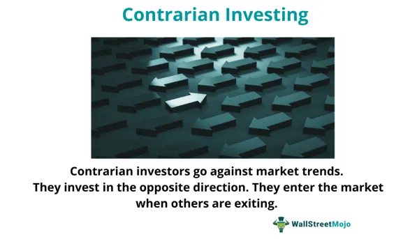

In the world of finance, market downturns can be daunting. However, these periods of uncertainty also present unique opportunities for investors willing to navigate through fear and negative sentiment. During such times, contrarian investing emerges as a powerful strategy that leverages market psychology to gain an edge when others shy away. This approach involves going against the prevailing market trends by identifying undervalued assets poised for recovery. The essence of contrarian investing is encapsulated in the famous adage by Warren Buffett: be "fearful when others are greedy, and greedy when others are fearful."

Simultaneously, algorithmic trading has revolutionized the financial landscape by offering precision and speed in executing investment strategies, particularly during volatile market conditions. Through the use of computer algorithms based on predefined criteria, traders can make rapid, data-driven decisions that optimize their portfolios even as stock prices fluctuate wildly. The integration of technology in trading has allowed for more systematic and quantifiable approaches to investment strategies, reducing the emotional and psychological biases human traders might typically encounter.



This article explores how these two distinct yet complementary strategies—contrarian investing and algorithmic trading—can become powerful tools in your financial strategy during market downturns. By combining the insights from market psychology with the efficiency of technology-driven trading, investors can enhance their potential to capitalize on opportunities that arise from market fear.

Join us to explore the concepts, strategies, and benefits of investing against the crowd, as well as how to harness these methods to turn market adversities into opportunities.

## Table of Contents

## Understanding Market Downturns

Market downturns occur when stock prices fall significantly across a wide portion of the market. These declines, often felt throughout major stock indices such as the S&P 500 or NASDAQ, can be influenced by multiple factors. Economic recessions, marked by decreases in GDP, rising unemployment, and reduced consumer spending, are one potential catalyst. For instance, during a recession, companies may experience lower earnings, leading to reduced stock valuations.

Geopolitical tensions, such as conflicts or trade wars, can also spark downturns. These events often lead to uncertainty regarding economic policies, supply chain disruptions, or changes in trade dynamics, which can negatively impact investor confidence and result in stock sell-offs. Global pandemics, like the COVID-19 crisis, serve as another example, where the spread of disease led to widespread economic shutdowns and subsequent market declines.

Investors tend to panic during these downturns, driven by fear of escalating losses, which may lead to rapid sell-offs and further depreciation in stock prices. This phenomenon is often characterized by heightened [volatility](/wiki/volatility-trading-strategies) and the potential for a negative feedback loop, wherein declining prices trigger more selling.

However, historical trends indicate that markets often recover over time. The Dow Jones Industrial Average (DJIA) and the S&P 500, for instance, have demonstrated resilience by eventually surpassing previous highs after significant downturns. This recovery tends to follow the cyclical nature of markets, characterized by periods of expansion and contraction. Recognizing these cycles is key for investors aiming to benefit from downturns, as they can provide opportunities to purchase undervalued assets that may offer substantial returns in subsequent market recoveries.

Understanding these factors behind market downturns equips investors to recognize early warning signs and potentially capitalize on the opportunities these periods create, while also navigating the challenges that arise during such volatile times.

## The Contrarian Investing Philosophy

Contrarian investing is an investment strategy that involves making decisions contrary to prevailing market trends. This approach focuses on purchasing undervalued assets that the broader market might overlook. Rather than following the crowd, contrarian investors seek opportunities where market sentiment leads to asset mispricing.

One prominent advocate of this philosophy is Warren Buffett, who famously advised investors to be 'fearful when others are greedy, and greedy when others are fearful.' This perspective encourages investors to exploit market psychology and recognize opportunities where the market's fear or over-optimism distorts asset values.

The contrarian approach requires a high level of patience, extensive research, and the courage to act against the grain. Investors must identify situations where market perception has diverged from fundamental asset value. This might involve conducting thorough financial analysis, scrutinizing company financial statements, and understanding broader economic indicators. Tools like discounted cash flow analysis or Benjamin Graham's intrinsic value formulas can be particularly useful in assessing whether an asset is undervalued.

Example scenarios where contrarian investing shines are during periods of market panic or distress. During such times, investor behavior may lead to irrational selling, causing stock prices to plummet below their intrinsic value. By maintaining a long-term perspective and focusing on the asset’s inherent worth rather than its current market price, contrarian investors can capitalize on these temporary market inefficiencies.

While this investment philosophy can be rewarding, it is not without its risks. Making investment choices counter to market trends requires a degree of independence and resilience, as there is no guarantee that sentiment or valuations will converge in the expected time frame. However, for those with the discipline to conduct rigorous analysis and withstand short-term market volatility, contrarian investing can offer lucrative opportunities that are often missed by trend-following strategies.

## Case Studies in Contrarian Investing

John Templeton and Michael Burry are notable figures in the world of contrarian investing, each having capitalized on market downturns by identifying undervalued assets during times of widespread panic.

Sir John Templeton made his mark during the Great Depression, one of the most severe economic downturns in history. In 1939, at the onset of World War II and amidst a bear market, Templeton adopted a bold investment strategy. He purchased 100 shares of every stock trading below $1 on the New York Stock Exchange. His approach was informed by the belief that the extreme pessimism had led to irrational undervaluation of these stocks. Many of these companies were on the brink of bankruptcy or were perceived as having bleak futures. However, Templeton's optimism in the eventual economic recovery and his willingness to go against the prevailing sentiment led him to amass significant wealth as the markets rebounded. His philosophy exemplified the principle of buying at the point of "maximum pessimism," demonstrating that even in dire times, recovery and growth are possible.

Similarly, Michael Burry, famed for his role in the 2008 financial crisis, employed a contrarian strategy that yielded substantial profits. Burry, a [hedge fund](/wiki/hedge-fund-trading-strategies) manager at Scion Capital, identified vulnerabilities in the housing market, particularly the bubble created by subprime mortgages. While the general market sentiment was bullish on housing, Burry's extensive research led him to a different conclusion. He examined mortgage lending practices and recognized the impending crisis due to unsustainable borrowing. With this insight, Burry executed a strategy involving credit default swaps to bet against mortgage-backed securities. As the housing market collapsed, Burry's contrarian bet resulted in multimillion-dollar gains for his investors. This success not only highlighted the potential rewards of contrarian thinking but also underscored the importance of thorough analysis and conviction in one's insights.

These case studies of Templeton and Burry highlight key aspects of effective contrarian investing: a keen understanding of market dynamics, the courage to act against prevailing sentiments, and the insight to recognize value where others see none. Modern investors can draw valuable lessons from these examples, such as the importance of rigorous research and the willingness to withstand short-term criticism in pursuit of long-term gains.

## Algo Trading: A Modern Approach

Algorithmic trading utilizes computer programs to automatically execute trading orders when predefined criteria are met. This type of trading has gained prominence due to its ability to make rapid decisions and execute orders swiftly, offering a significant advantage in highly volatile markets. The speed and precision of [algorithmic trading](/wiki/algorithmic-trading) are unmatched by human traders, as algorithms can react to market changes in fractions of a second, thereby capitalizing on opportunities before they dissipate.

One of the primary benefits of algorithmic trading is its ability to exploit market inefficiencies. These inefficiencies, often fleeting and difficult to detect manually, can be identified and acted upon by algorithms that continuously analyze vast amounts of market data. For example, algorithms can detect [arbitrage](/wiki/arbitrage) opportunities where securities are mispriced between different markets and execute trades to profit from these discrepancies.

Furthermore, algorithmic trading is particularly suitable for implementing contrarian investment strategies. Contrarian strategies involve making investment decisions that go against prevailing market trends, often buying when others are selling and vice versa. Algorithms can be designed to identify these contrarian signals by analyzing market sentiment and price movements. When a stock is oversold due to panic, an algorithm can trigger a buy order, positioning the investor to benefit when the market eventually corrects itself.

Python is commonly used in developing algorithmic trading strategies due to its extensive libraries and ease of use. A basic Python script for algorithmic trading might include the use of libraries such as `pandas` for data manipulation, `numpy` for numerical operations, and `scikit-learn` for predictive modeling. Here's a simple example of a Python script that uses historical data to execute trades when a stock's price crosses above its moving average, a typical contrarian indicator:

```python
import pandas as pd
import numpy as np
import matplotlib.pyplot as plt

# Load historical data
data = pd.read_csv('historical_stock_data.csv')
data['Moving Average'] = data['Close'].rolling(window=20).mean()

# Define trading signals
data['Buy Signal'] = np.where(data['Close'] > data['Moving Average'], 1, 0)

# Basic strategy
investment = 10000  # Initial investment
position = 0

for i in range(len(data)):
    if data['Buy Signal'][i] == 1 and position == 0:
        # Buy stock
        position = investment / data['Close'][i]
        investment = 0
        print(f"Buying at {data['Close'][i]}")
    elif data['Buy Signal'][i] == 0 and position > 0:
        # Sell stock
        investment = position * data['Close'][i]
        position = 0
        print(f"Selling at {data['Close'][i]}")

# Final capital
if position > 0:
    investment = position * data['Close'].iloc[-1]
    position = 0

print(f"Final capital: {investment}")
```

This script uses a moving average as a simple contrarian signal. When the stock price crosses above the moving average, the script simulates a buy order, and when it crosses below, it triggers a sell order. This basic example illustrates how algorithms can be used to implement contrarian strategies, but in practice, more sophisticated models would consider a wider array of indicators and market conditions.

The adoption of algorithmic trading continues to grow as it affords investors the ability to execute complex strategies with precision and speed, two critical capabilities during market downturns. By leveraging technology, investors can navigate volatile markets, optimizing their strategies to maximize potential gains while minimizing risks.

## Combining Contrarian and Algo Trading

Integrating contrarian investing principles with algorithmic trading offers a sophisticated approach that enhances both the efficiency and precision of executing investment strategies, particularly during market downturns. By leveraging algorithms, investors can systematically identify and exploit market overreactions, which are often the hallmark of times of financial stress.

Algorithms can be designed to detect anomalies and contrarian signals that suggest market sentiments have deviated from intrinsic value. This detection process typically involves statistical analysis of price movements, sentiment analysis of market news, and pattern recognition. For instance, when stocks are overwhelmingly sold due to market panic, yet fundamental indicators point to stable or improving financial health, a contrarian signal might be triggered. At this point, an algorithm can initiate trades based on predefined criteria designed to capitalize on perceived mispricing.

Python, with its extensive libraries like Pandas, for data manipulation, and libraries like NumPy and scikit-learn, for quantitative analysis, serves as an excellent tool for building such algorithms. Here's a simplified Python example of how an algorithm might be structured to identify and act on contrarian signals:

```python
import numpy as np
import pandas as pd
from sklearn.linear_model import LinearRegression

# Example function to detect market overreaction
def detect_contrarian_signal(prices):
    returns = np.log(prices / prices.shift(1))
    X = np.arange(len(returns)).reshape(-1, 1)
    model = LinearRegression().fit(X, returns.fillna(0))

    # Determine if the last return is significantly lower than predicted (overreaction)
    prediction = model.predict(X)
    deviation = returns.iloc[-1] - prediction[-1]
    if deviation < -2 * np.std(returns - prediction): # threshold for overreaction
        return True
    return False

# Simulated trading function
def contrarian_trade(asset_prices, current_price):
    if detect_contrarian_signal(asset_prices):
        print(f"Buying opportunity detected at price: {current_price}")
        # Execute trade logic here
    else:
        print("No contrarian signal detected")
```

This function utilizes linear regression to analyze the trend of asset returns. It triggers a contrarian trading signal if the observed return deviates significantly below expected levels, indicating a possible overreaction that could be exploited.

Integrating this statistical analysis with algorithmic trading allows investors to respond swiftly, minimizing human biases and delays. Algorithms can execute trades across multiple securities and markets instantaneously, thereby increasing the likelihood of capitalizing on fleeting opportunities that manual trading might miss.

The synergy between contrarian investing and algorithmic trading empowers investors to navigate volatile conditions with a disciplined, systematic approach. By automating the detection of contrarian signals and executing trades with speed and accuracy, this hybrid strategy is well-suited to unlock potential profits during market downturns, turning market inefficiencies into investment opportunities.

## Risks and Considerations

Both contrarian investing and algorithmic trading involve inherent risks that require careful management and understanding. In contrarian investing, the primary risk lies in the potential misjudgment of market sentiment and timing. While purchasing undervalued assets during market downturns can lead to significant profits, there's the risk that these assets may continue to decline or fail to recover as anticipated. This calls for meticulous analysis and patience, as contrarians are often investing against the prevailing consensus. Patience is crucial, as markets may take extended periods to validate contrarian positions.

Algorithmic trading, on the other hand, introduces different risks predominantly associated with technology and market infrastructure. Algorithms execute trades based on predetermined criteria, and their effectiveness is heavily dependent on the quality of the underlying data and the robustness of the trading model. Poorly designed algorithms may misinterpret market signals or react adversely to unexpected market events, leading to substantial financial losses. Technical issues such as software bugs, latency problems, or outages in market feeds can further exacerbate these risks.

To mitigate these risks, investors need to adopt accurate analysis techniques and implement robust risk management strategies. For contrarian investors, this involves thorough research and due diligence to ensure that their contrarian bets are well-founded and based on sound analysis. Diversification within a portfolio can also help absorb potential losses from individual contrarian investments that do not perform as expected.

For algorithmic traders, vigilant monitoring of algorithm performance and constant refinement based on real-world data is essential. Strategies such as [backtesting](/wiki/backtesting), stress testing, and continual adjustment of algorithms based on changing market conditions can help improve the reliability of algorithmic trading systems. Additionally, implementing safety measures like circuit breakers or stop-loss orders can prevent excessive losses during sudden market swings.

Both contrarian and algorithmic strategies require investors to maintain an acute awareness of market dynamics. Relying solely on algorithms without understanding the underlying market trends can lead to suboptimal decision-making. Similarly, a contrarian approach that ignores fundamental market shifts may falter. In conclusion, the blend of accurate market analysis, technological diligence, and a comprehensive risk management framework is crucial in navigating the complexities and potential downsides of both contrarian investing and algorithmic trading.

## Conclusion

Market downturns pose a dual nature for informed investors, encapsulating both challenges and avenues for profit. The uncertainties these periods bring can trigger widespread fear and sell-offs, but they also provide fertile ground for those armed with a contrarian mindset and algorithmic trading techniques. By strategically opposing the majority sentiment through contrarian investing, investors can identify and exploit undervalued assets, steering through the erratic tides of volatility with greater efficacy.

Incorporating algorithmic trading into this strategy enhances the capability to act with precision and speed, essential for capitalizing on short-lived opportunities. Algorithms can swiftly analyze vast amounts of data, recognize market inefficiencies, and initiate trades based on predefined contrarian signals, thereby converting market turbulence into strategic entry points.

A disciplined approach, fortified by comprehensive research and technology, is vital in transforming market fear into a landscape of opportunity. It ensures that decisions are not clouded by emotions but are instead grounded in data-driven insights. Investors should maintain a long-term perspective and patience, recognizing that market recoveries are typically cyclical and the benefits of these strategies often manifest over an extended horizon. By doing so, contrarian investing and algorithmic trading can be robust tools for navigating and profiting from market downturns.

## References & Further Reading

[1]: Bergstra, J., Bardenet, R., Bengio, Y., & Kégl, B. (2011). ["Algorithms for Hyper-Parameter Optimization."](https://dl.acm.org/doi/10.5555/2986459.2986743) Advances in Neural Information Processing Systems 24.

[2]: ["Advances in Financial Machine Learning"](https://www.amazon.com/Advances-Financial-Machine-Learning-Marcos/dp/1119482089) by Marcos Lopez de Prado

[3]: ["Evidence-Based Technical Analysis: Applying the Scientific Method and Statistical Inference to Trading Signals"](https://www.amazon.com/Evidence-Based-Technical-Analysis-Scientific-Statistical/dp/0470008741) by David Aronson

[4]: ["Machine Learning for Algorithmic Trading"](https://github.com/stefan-jansen/machine-learning-for-trading) by Stefan Jansen

[5]: ["Quantitative Trading: How to Build Your Own Algorithmic Trading Business"](https://www.amazon.com/Quantitative-Trading-Build-Algorithmic-Business/dp/1119800064) by Ernest P. Chan