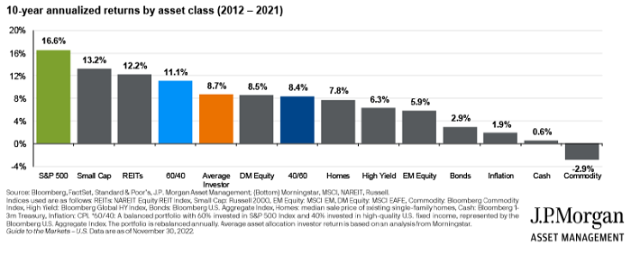

## Table of Contents

## What is contrarian investing?

Contrarian investing is a strategy where investors go against the crowd. Instead of following what everyone else is doing, they look for opportunities in stocks or assets that are not popular or are being ignored. They believe that the market can sometimes overreact to news or events, causing prices to drop too low or rise too high. By buying when others are selling, and selling when others are buying, contrarian investors hope to buy low and sell high, making a profit.

This approach requires patience and a strong belief in one's own analysis. It can be risky because it goes against the general trend, and it might take a long time for the market to recognize the true value of the investment. However, if a contrarian investor is right, the rewards can be significant. They might find great deals on stocks that others have overlooked, leading to big gains when the market eventually corrects itself.

## Why might someone choose to invest during market downturns?

People might choose to invest during market downturns because they believe it's a good chance to buy things at a lower price. When the market goes down, many people get scared and sell their investments. This can make the prices of stocks and other assets drop a lot. If an investor thinks the market will go back up eventually, they can buy these assets at a discount. It's like shopping for clothes during a big sale; you're getting more for your money.

Another reason is that downturns can create opportunities that aren't there when the market is doing well. When everyone is happy and buying, prices can get too high. But during a downturn, some good companies might be undervalued because people are too scared to buy them. By investing in these companies, an investor can get in early and benefit when the market recovers. It takes courage and patience, but it can lead to big rewards if the investor is right about the market turning around.

## What are the risks associated with contrarian investing?

Contrarian investing can be risky because it goes against what everyone else is doing. When you buy things that other people are selling, you might be wrong. If the market keeps going down, you could lose a lot of money. It's hard to know when the market will turn around, and it might take a long time for your investments to start making money.

Another risk is that the things you invest in might not be good investments, even if they are cheap. Just because a stock is unpopular doesn't mean it's a good buy. You need to do a lot of research to make sure the companies you're investing in are strong and have a good chance of recovering. If you don't do this, you might end up with a bunch of bad investments that never go up in value.

## How can one identify a market downturn?

A market downturn happens when the prices of stocks and other investments start going down a lot. You can see this happening by looking at stock market indexes like the S&P 500 or the Dow Jones. If these indexes are dropping over a few weeks or months, it might mean the market is in a downturn. Also, if you see a lot of news about companies doing badly or the economy slowing down, that can be a sign too.

Another way to spot a market downturn is by watching how people are feeling about the market. If everyone is worried and selling their investments, that can push prices down even more. You might hear people talking about a "bear market," which is when the market goes down for a long time. If you notice that more and more people are scared and pulling their money out, it's a good clue that a downturn is happening.

## What are some historical examples of successful contrarian investments?

One famous example of a successful contrarian investment was when Warren Buffett bought shares of American Express in 1964. At that time, American Express was in trouble because of a big scandal. Many investors were selling their shares and the price was going down. But Buffett believed in the company and thought the problems would be fixed. He bought a lot of shares when they were cheap. A few years later, American Express recovered and the share price went up a lot. Buffett made a big profit because he went against what everyone else was doing.

Another example is when investors bought stocks during the 2008 financial crisis. When the housing market crashed, many people were scared and selling their stocks. The stock market dropped a lot. But some investors saw this as a chance to buy good companies at low prices. They believed the market would recover eventually. People who invested in strong companies like Apple or Amazon during the crisis saw their investments grow a lot when the market came back up. It took courage to buy when everyone else was selling, but it paid off in the end.

## How does one evaluate the intrinsic value of a company during a market downturn?

During a market downturn, figuring out a company's intrinsic value can be tricky because prices are often lower than usual. But you can start by looking at the company's financials. Check the balance sheet to see how much cash the company has and how much debt it owes. Then look at the income statement to see if the company is making money or losing it. If a company has a lot of cash and not much debt, it might be in a good position to weather the downturn. Also, if the company is still making money even when things are tough, that's a good sign.

Another way to evaluate intrinsic value is by using valuation methods like the price-to-earnings (P/E) ratio or discounted cash flow (DCF) analysis. The P/E ratio compares the company's stock price to its earnings per share. If the P/E ratio is lower than usual during a downturn, it might mean the stock is undervalued. DCF analysis tries to figure out what the company's future cash flows are worth today. You need to make some guesses about how the company will do in the future, but if the current stock price is a lot lower than your DCF calculation, it could be a good buy. Both methods help you see if the market is undervaluing a good company just because of the downturn.

## What psychological factors should an investor consider before adopting a contrarian strategy?

Before adopting a contrarian strategy, an investor should think about how they handle fear and doubt. Going against the crowd can be scary because everyone else might think you're wrong. When the market is going down and everyone is selling, it's hard not to feel worried. If you're the kind of person who gets easily scared by what other people are doing, contrarian investing might be too stressful for you. You need to be able to stick to your own beliefs even when it feels like the whole world is against you.

Another important psychological [factor](/wiki/factor-investing) is patience. Contrarian investing often means waiting a long time for your investments to pay off. If the market stays down longer than you expected, you need to be able to keep calm and not sell just because you're getting impatient. It's easy to feel frustrated when your investments aren't making money right away, but if you can stay patient and believe in your choices, you might see big rewards in the end. So, before you start, make sure you're ready to wait it out and not give up too soon.

## How can diversification be used effectively in contrarian investing?

Diversification is a smart way to lower the risk when you're doing contrarian investing. When you buy things that other people are selling, you might be wrong sometimes. But if you spread your money across different kinds of investments, you won't lose everything if one of them doesn't work out. For example, you can invest in different industries or buy stocks from different countries. This way, if one industry or country has a big problem, your other investments might still be okay. It's like not putting all your eggs in one basket.

Another good thing about diversification in contrarian investing is that it helps you find more opportunities. When the market is down, not every company or industry will be affected the same way. Some might be doing better than others, and you can find good deals in different places. By looking at a lot of different options, you increase your chances of finding undervalued stocks that will go up when the market gets better. So, diversification not only helps you manage risk, but it also lets you explore more possibilities for making money.

## What are the key indicators that suggest a market is due for a rebound?

When the market is down, there are some signs that it might be ready to go back up. One big sign is when the prices of stocks are really low compared to how much money the companies are making. This is called the price-to-earnings ratio. If this ratio is lower than usual, it might mean that stocks are a good deal and people will start buying them again. Another sign is when people stop selling and start buying. If you see that fewer people are selling their stocks and more are buying, it can mean that the market is about to turn around.

Another thing to look at is what the economy is doing. If the economy is starting to get better, like if more people are getting jobs or if companies are making more money, that can help the market go up too. Also, if the government or the central bank does things to help the economy, like lowering interest rates or giving money to people, that can make people feel more confident and start buying stocks again. Watching these signs can help you guess when the market might be ready for a rebound.

## How do macroeconomic factors influence contrarian investing decisions?

Macroeconomic factors are big things that affect the whole economy, like interest rates, inflation, and unemployment. These factors can make a big difference in contrarian investing because they can change how people feel about the market. When interest rates go down, borrowing money becomes cheaper, and people might feel more confident about investing in stocks. On the other hand, if inflation is high, people might worry that their money won't be worth as much in the future, and they might sell their stocks. Contrarian investors need to watch these big economic changes to figure out when the market might be undervaluing good companies.

Another important macroeconomic factor is the overall health of the economy. If the economy is doing badly, with lots of people out of work and companies not making money, the stock market might go down a lot. This can be a good time for contrarian investors to buy, if they think the economy will get better soon. But if the economy stays bad for a long time, their investments might not go up in value. So, contrarian investors need to think about whether the bad times are going to last or if things will get better soon. By understanding these big economic factors, they can make better choices about when to buy and sell.

## What advanced strategies can be employed to maximize returns from contrarian investments?

One advanced strategy for maximizing returns from contrarian investments is to use deep value investing. This means looking for companies that are really cheap compared to what they're worth. You do a lot of research to find these hidden gems that other people might be missing. It's like finding a great deal at a yard sale. Once you find these undervalued companies, you buy their stocks and wait for the market to realize how good they are. This can take a long time, but if you're right, you can make a lot of money when the stock price goes up.

Another strategy is to use options to make your contrarian bets even stronger. Options are like bets on whether a stock will go up or down. You can buy options that let you buy a stock at a lower price in the future, even if the stock goes up a lot. This can help you make more money if your contrarian pick turns out to be a winner. But options can be risky, so you need to know what you're doing. It's like playing a game where the rewards can be big, but you have to be careful not to lose too much if you're wrong.

## How can one use technical analysis to enhance contrarian investing outcomes?

Technical analysis can help contrarian investors by showing them when the market might be ready to turn around. It's all about looking at charts and patterns to see what the market has been doing. If a stock's price has been going down for a long time but starts to level off, that could be a sign that it's about to go back up. Contrarian investors can use this information to buy the stock before everyone else does. They look for things like support levels, where the price stops going down, or resistance levels, where the price stops going up. By understanding these patterns, contrarian investors can make better choices about when to buy and sell.

Another way technical analysis helps is by showing how strong the market's current trend is. If everyone is selling and the market is going down fast, technical indicators like the Relative Strength Index (RSI) can show if the market is getting too oversold. When the RSI gets really low, it might mean that the selling is about to stop and the market could start going up again. Contrarian investors can use this signal to buy stocks when they're at their cheapest. By combining technical analysis with their own research about a company's value, contrarian investors can find the best times to make their moves and hopefully make more money.

## References & Further Reading

[1]: Bergstra, J., Bardenet, R., Bengio, Y., & Kégl, B. (2011). ["Algorithms for Hyper-Parameter Optimization."](https://dl.acm.org/doi/10.5555/2986459.2986743) Advances in Neural Information Processing Systems 24.

[2]: ["Advances in Financial Machine Learning"](https://www.amazon.com/Advances-Financial-Machine-Learning-Marcos/dp/1119482089) by Marcos Lopez de Prado

[3]: ["Evidence-Based Technical Analysis: Applying the Scientific Method and Statistical Inference to Trading Signals"](https://www.amazon.com/Evidence-Based-Technical-Analysis-Scientific-Statistical/dp/0470008741) by David Aronson

[4]: ["Machine Learning for Algorithmic Trading"](https://github.com/stefan-jansen/machine-learning-for-trading) by Stefan Jansen

[5]: ["Quantitative Trading: How to Build Your Own Algorithmic Trading Business"](https://www.amazon.com/Quantitative-Trading-Build-Algorithmic-Business/dp/1119800064) by Ernest P. Chan