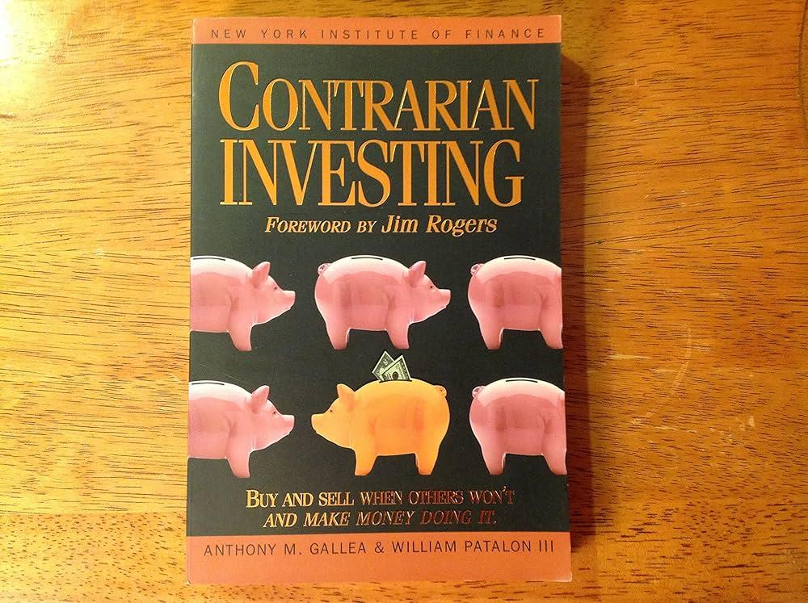

## Table of Contents

## What is contrarian investing?

Contrarian investing is a strategy where investors go against the crowd. Instead of following what everyone else is doing, they look for opportunities in stocks or assets that are currently unpopular or undervalued. The idea is that the market often overreacts to news, causing prices to drop too low or rise too high. Contrarian investors believe that by buying when others are selling, and selling when others are buying, they can get great deals and make good profits in the long run.

This approach requires patience and a strong belief in one's own analysis. It can be risky because it might take a long time for the market to recognize the true value of an investment. However, if the contrarian investor is right, the rewards can be significant. For example, if a company is temporarily struggling but has strong fundamentals, a contrarian might buy its stock at a low price and wait for the company to recover, eventually selling the stock at a much higher price.

## How does contrarian investing differ from other investment strategies?

Contrarian investing is different from other strategies because it goes against the common trends. While many investors follow the crowd and buy stocks that are popular and rising in value, contrarians do the opposite. They look for stocks that are unpopular and falling in value, believing that these stocks are undervalued and will eventually go up. This approach requires a lot of research and patience, as it can take time for the market to realize the true value of these investments.

Other investment strategies, like growth investing or value investing, have different focuses. Growth investing involves buying stocks of companies that are expected to grow quickly, even if their current stock prices are high. Value investing, on the other hand, involves looking for companies that are undervalued but stable, often based on financial metrics like price-to-earnings ratios. Contrarian investing can overlap with value investing, but it specifically targets stocks that are out of favor with the majority of investors, often due to negative news or market sentiment.

In summary, contrarian investing stands out because it requires investors to go against the grain and trust their own analysis over the market's current behavior. This can be riskier but also potentially more rewarding if the investor's predictions about the market's overreaction are correct. Meanwhile, strategies like growth and value investing focus more on specific financial indicators and company performance rather than market sentiment.

## What are the key principles of contrarian investing?

Contrarian investing is all about going against what everyone else is doing. Instead of buying stocks that everyone likes, contrarians look for stocks that people are selling because they think they are bad. They believe that the market often gets too excited or too scared, making prices go too high or too low. So, contrarians buy when prices are low and everyone else is selling, hoping to make money when the prices go back up.

The main idea behind contrarian investing is that the market can be wrong. Contrarians do a lot of research to find companies that are not doing well right now but could do better in the future. They look for signs that a company is undervalued, like good financials or strong products, even if the stock price is low because of bad news. This strategy takes patience because it might take a long time for the market to see the value that contrarians see. But if they are right, they can make a lot of money.

## Who are some famous contrarian investors and what are their strategies?

Warren Buffett is a famous contrarian investor. He looks for companies that are not popular but have good value. He buys these companies when their stock prices are low because of bad news. He believes that the market can be wrong and that good companies will do well in the long run. He waits patiently for the market to see the value he sees, and then he makes a lot of money.

Another famous contrarian investor is Seth Klarman. He focuses on buying stocks that are very cheap, often because people are scared and selling them. He looks for companies that are not doing well right now but have the potential to get better. He does a lot of research to find these hidden gems. Like Buffett, he waits for the market to realize the true value of these companies, and then he sells for a profit.

## What are the potential benefits of contrarian investing?

Contrarian investing can help you find great deals on stocks. When everyone else is selling a stock because they are scared, contrarians see a chance to buy it cheap. They believe that the market can overreact, making stock prices go too low. If a contrarian is right about a company's true value, they can buy the stock at a low price and sell it later for a big profit.

This strategy can also help you avoid buying stocks that are too expensive. When everyone is excited about a stock and its price is very high, contrarians wait. They know that the market can get too excited, and stock prices can drop. By not buying when everyone else is, contrarians can avoid losing money on stocks that might go down in value later.

## What are the risks associated with contrarian investing?

Contrarian investing can be risky because it goes against what most people are doing. When you buy stocks that others are selling, you might be wrong about the company's future. If the company keeps doing badly, the stock price could stay low or even go lower. This means you could lose money if you have to sell the stock at a lower price than you bought it.

Another risk is that it can take a long time for the market to see the value that contrarians see. You might have to wait a long time before you can sell the stock for a profit. This can be hard because you need to be patient and believe in your own research. If you need money sooner, you might have to sell at a loss.

## How can one identify undervalued stocks for contrarian investing?

To find undervalued stocks for contrarian investing, you need to look at companies that people are not excited about right now. These are the companies that everyone is selling because they think they are bad. But you need to do a lot of research to see if these companies are really as bad as everyone thinks. Look at their financials, like their earnings and debts, to see if they are strong even if the stock price is low. You also need to check if the company has good products or services that could make it successful in the future.

Another way to find undervalued stocks is to look at the price-to-earnings ratio (P/E ratio). This is a number that shows how much you are paying for each dollar of the company's earnings. If the P/E ratio is low compared to other companies in the same industry, it might mean the stock is undervalued. Also, pay attention to the news and see if the market is overreacting to bad news about a company. If the stock price drops a lot because of something that might not be a big problem in the long run, it could be a good time to buy.

## What role does market sentiment play in contrarian investing?

Market sentiment is really important in contrarian investing. It's all about how people feel about the market or a specific stock. When everyone is scared and selling a stock because of bad news, contrarians see a chance to buy it cheap. They believe that the market can overreact, making stock prices go too low because of fear or too high because of excitement. So, contrarians look for stocks that are unpopular and falling in value, thinking that they are undervalued and will eventually go up.

Understanding market sentiment helps contrarians find these opportunities. They pay attention to the news and see if the market is overreacting to bad news about a company. If the stock price drops a lot because of something that might not be a big problem in the long run, it could be a good time to buy. Contrarians do a lot of research to make sure the company has strong fundamentals, even if the market doesn't see it yet. By going against the crowd and buying when others are selling, contrarians hope to make a profit when the market eventually recognizes the true value of the stock.

## How should one manage a contrarian investment portfolio?

Managing a contrarian investment portfolio means you need to be patient and do a lot of research. When you buy stocks that others are selling, you have to wait for the market to see the value you see. This can take a long time, so you need to be ready to hold onto your investments even if the stock price stays low for a while. Keep checking the company's financials and news to make sure your reasons for buying the stock are still good. If the company's situation changes and it's not doing well anymore, you might need to sell the stock, even if it means losing money.

It's also important to spread your money around in different stocks. This way, if one stock does badly, you won't lose all your money. Look for stocks in different industries and with different risks. This helps you balance your portfolio and reduces the chance of losing a lot of money if one stock goes down. Remember, contrarian investing can be risky, so always think about how much risk you are willing to take and make sure you can handle the ups and downs of the market.

## What are some common mistakes to avoid in contrarian investing?

One common mistake in contrarian investing is buying stocks just because they are cheap without doing enough research. It's easy to think a low price means a good deal, but if the company is really doing badly, the stock might not go up. You need to look at the company's financials, like earnings and debts, and see if it has good products or services. If you don't do this, you might end up buying stocks that keep going down.

Another mistake is not being patient enough. Contrarian investing often means waiting a long time for the market to see the value you see in a stock. If you get scared and sell too soon, you might miss out on big profits. It's important to believe in your research and be ready to hold onto your investments even when the stock price stays low for a while. Patience is key in contrarian investing.

## How does economic cycle affect contrarian investing strategies?

The economic cycle can really change how contrarian investing works. During a boom, when the economy is doing great, people get excited and buy a lot of stocks. This can make stock prices go too high. Contrarians might see this and decide to sell stocks that everyone else is buying, thinking the prices will come down later. On the other hand, during a recession, when the economy is not doing well, people get scared and start selling stocks. This can make stock prices drop too low. Contrarians might see this as a chance to buy good companies at a cheap price, hoping to make money when the economy gets better.

Understanding the economic cycle helps contrarians find the right times to buy and sell. They need to look at where the economy is in its cycle and think about how it might affect different companies. For example, during a recession, some industries might do worse than others, but if a company in a struggling industry still has strong financials, it could be a good contrarian investment. By paying attention to the economic cycle, contrarians can make smarter choices about when to go against the crowd and make the most of their investments.

## What advanced techniques can be used to enhance contrarian investment decisions?

One advanced technique for enhancing contrarian investment decisions is using quantitative analysis. This means using numbers and math to find stocks that might be undervalued. Contrarians can look at things like the price-to-earnings ratio, price-to-book ratio, and other financial metrics to see if a stock is cheaper than it should be. They can also use computer programs to analyze lots of data and find patterns that might show when a stock is a good buy. This can help them make more informed decisions and find hidden opportunities that other investors might miss.

Another technique is to use sentiment analysis. This involves looking at what people are saying about a company on social media, in news articles, and in other places to understand how people feel about it. If everyone is talking badly about a company, its stock price might be low because of fear. But if the contrarian's research shows the company is actually doing okay, this could be a good time to buy. By combining sentiment analysis with their own research, contrarians can get a better sense of when the market is overreacting and find stocks that are undervalued because of negative sentiment.

## References & Further Reading

[1]: Nassim Nicholas Taleb (2007). ["The Black Swan: The Impact of the Highly Improbable."](https://archive.org/details/10.1.1.695.4305) Random House.

[2]: Asness, C. S., & Liew, J. (2004). ["The Paradox of Value Stocks."](https://www.jstor.org/stable/42002613) SSRN Electronic Journal.

[3]: Lakonishok, J., Shleifer, A., & Vishny, R. W. (1994). ["Contrarian Investment, Extrapolation, and Risk."](https://onlinelibrary.wiley.com/doi/full/10.1111/j.1540-6261.1994.tb04772.x) The Journal of Finance, 49(5), 1541-1578.

[4]: Andrew W. Lo (2017). ["Adaptive Markets: Financial Evolution at the Speed of Thought."](https://www.amazon.com/Adaptive-Markets-Financial-Evolution-Thought/dp/0691135142) Princeton University Press.

[5]: Chan, E. P. (2009). ["Quantitative Trading: How to Build Your Own Algorithmic Trading Business."](https://github.com/egorpe/EPChan-QuantitativeTrading/blob/master/example7_6.m) Wiley.

[6]: Marcos Lopez de Prado (2018). ["Advances in Financial Machine Learning."](https://www.amazon.com/Advances-Financial-Machine-Learning-Marcos/dp/1119482089) Wiley.

[7]: Scharfstein, D. S., & Stein, J. C. (1990). ["Herd Behavior and Investment."](https://www.jstor.org/stable/2006678) The American Economic Review, 80(3), 465-479.

[8]: Peter L. Bernstein (1996). ["Against the Gods: The Remarkable Story of Risk."](https://www.amazon.com/Against-Gods-Remarkable-Story-Risk/dp/0471295639) Wiley.