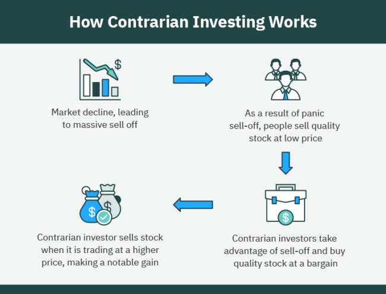

Contrarian investing is a strategic approach that involves buying and selling against prevailing market trends. This strategy is grounded in the belief that markets overreact to news and events, leading to mispriced assets. Investors who practice contrarian investing capitalize on these overreactions by acquiring undervalued assets or selling overvalued ones, aiming to profit when market perceptions eventually align with intrinsic values. 

Algorithmic trading facilitates this strategy by leveraging advanced technology to quickly identify and act on market inefficiencies. Through computational algorithms, investors can process vast amounts of market data to uncover patterns and trends that may not be immediately apparent to human traders. For instance, algorithms can rapidly analyze indicators such as price-earnings ratios, market sentiment scores, or historical price movements to identify potential opportunities for contrarian positions. Once identified, these opportunities can be acted upon instantaneously, providing a competitive advantage in fast-moving markets.



This article explores the principles of contrarian investing and its integration with algorithmic trading, illustrating how these can be applied to achieve significant returns. It will cover key methods, strategies, and examples of contrarian investing, highlighting the potential for high returns when market inefficiencies are exploited successfully. Furthermore, the article will examine the key risks and challenges presented by contrarian investing, such as the difficulty of timing the market and the psychological pressure of going against popular opinion.

Join us as we explore the intriguing synergy between contrarian investing and algorithmic trading, providing an in-depth understanding aimed at savvy investors looking to enhance their investment strategies through insight and technology.

## Table of Contents

## What is Contrarian Investing?

Contrarian investing is an investment strategy that encourages investors to defy prevailing market trends by purchasing undervalued assets or selling those considered overvalued. At its core, this strategy is premised on the belief that the majority of investors succumb to herd mentality, wherein their collective behaviors and decisions lead to the mispricing of assets and market inefficiencies. This herd behavior often causes prices to diverge from their intrinsic values—sometimes leading to drastic overvaluation or undervaluation.

Contrarian investors adopt a critical stance towards market consensus, employing a skeptical lens to identify and capitalize on the errors made by the larger market. Such investors inherently possess the willingness to challenge popular opinion and market trends, allowing them to spot opportunities that others overlook. This unique approach demands rigorous research and analysis, as well as a steadfast commitment to comprehensive financial evaluation. By concentrating on the intrinsic value of assets rather than succumbing to external noise or short-term sentiment, contrarians aim to achieve superior long-term returns.

The process of contrarian investing often revolves around a deep understanding of financial metrics and indicators. Investors scrutinize a variety of data points, such as price-to-earnings ratios, debt-to-equity ratios, and other valuation models, to discern whether an asset is genuinely undervalued or simply reflecting a longer-term trend. The [fundamental analysis](/wiki/fundamental-analysis) forms the backbone of this strategy, aiding investors in verifying whether the market has misjudged a particular stock or asset class.

Furthermore, contrarian investing necessitates a long-term perspective, as market corrections that restore asset prices to their true value can be protracted. Patience and resolve are paramount, as contrarian investors must remain steadfast in their analysis amidst potential market [volatility](/wiki/volatility-trading-strategies) and temporary losses. By maintaining this disciplined approach, contrarian investors aim to secure a competitive advantage and ultimately reap significant rewards.

## Role of Algorithmic Trading in Contrarian Investing

Algorithmic trading employs sophisticated algorithms to automate trading processes based on predefined criteria, which significantly enhances contrarian investing strategies. These algorithms are adept at processing substantial volumes of data, enabling them to detect patterns and identify mispriced assets with a precision and speed that surpasses human capabilities. This ability to swiftly assess market conditions and execute trades provides contrarian investors with a distinct advantage, allowing them to capitalize on fleeting opportunities that may arise from market inefficiencies.

The use of [algorithmic trading](/wiki/algorithmic-trading) in contrarian investing allows for systematic buy and sell signal identification. By employing advanced data analytics and real-time market assessments, these algorithms can dynamically adapt to changing market conditions and refine strategy execution. For example, measures of central tendency like means or medians can be rapidly computed over large datasets to identify anomalies in asset pricing, which can indicate potential investment opportunities deviating from the prevailing market sentiment.

Moreover, algorithmic trading systems can integrate various technical indicators to optimize entry and [exit](/wiki/exit-strategy) points. Consider a scenario where a contrarian investor is interested in an undervalued stock. An algorithm could monitor various indicators, such as moving averages or the Relative Strength Index (RSI), to provide timely alerts when the asset shows signs of upward [momentum](/wiki/momentum), thereby offering a calculated approach to leverage potential value discrepancies.

The utilization of algorithms also facilitates [backtesting](/wiki/backtesting)—evaluating how contrarian trading strategies would have performed using historical data. This capability helps in assessing strategy efficacy and risk management before actual capital deployment. Here's a basic example of how one might use Python for such backtesting:

```python
import pandas as pd
import numpy as np

# Load historical data
data = pd.read_csv('historical_stock_data.csv')

# Define a simple contrarian strategy
def contrarian_strategy(data):
    data['Signal'] = 0
    data['Signal'][data['Price'] < data['Price'].rolling(window=20).mean()] = 1
    data['Signal'][data['Price'] > data['Price'].rolling(window=20).mean()] = -1
    return data

# Apply the strategy
strategy_results = contrarian_strategy(data)

# Calculate returns
strategy_returns = strategy_results['Signal'].shift(1) * strategy_results['Price'].pct_change()

# Performance evaluation
total_return = np.exp(np.log1p(strategy_returns).sum()) - 1
print(f"Total Return: {total_return:.2f}")
```

In this Python example, a simple contrarian strategy is applied over historical stock data to signal buy and sell actions based on whether the stock price is below or above its 20-day rolling mean. Such algorithmic approaches to refining contrarian investment strategies not only boost execution speed but also heighten decision-making accuracy, ensuring that investors capture value from mispriced assets efficiently. By leveraging these technological advancements, contrarian investors can bolster their ability to exploit market overreactions and achieve superior returns.

## Key Principles of Contrarian Investing

Contrarian investing is characterized by several key principles that guide investors in uncovering opportunities often overlooked by the mainstream market. These principles include going against the herd, independent analysis, identifying undervalued assets, and maintaining a long-term perspective.

### Going Against the Herd
The primary tenet of contrarian investing is to challenge prevailing market trends. This principle advocates for making investment choices contrary to the general consensus. By rejecting popular investment trends, contrarian investors often find opportunities at times when others are buying or selling aggressively. This counter-cyclical approach requires a steadfast belief that market sentiment may be misguided, leading to mispriced assets and opportunities for astute investors.

### Independent Analysis
Successful contrarian investing demands thorough research and financial analysis. Investors should depend on detailed evaluations of financial statements, economic indicators, and individual company performance rather than following rumors or succumbing to market sentiment. Independent analysis enables investors to develop a well-informed view on assets that others may have misjudged. By focusing on objective data rather than subjective opinions, contrarians can uncover genuine investment opportunities.

### Identifying Undervalued Assets
Contrarian investors focus on assets that are undervalued due to market overreactions. These investors utilize various financial metrics, such as price-to-earnings ratios, book value, and cash flow analysis, to determine the intrinsic value of assets. The goal is to identify discrepancies between an asset's market price and its intrinsic worth, presenting a potential investment opportunity. For example, if an asset's price ($P$) is significantly less than its intrinsic value ($V$), mathematically expressed as $P < V$, it may be considered undervalued.

### Long-Term Perspective
A long-term perspective is vital in contrarian investing as market corrections often take time. Patience becomes crucial as investors may need to endure short-term losses before realizing gains. The commitment to a long-term view allows investors to withstand market volatility and wait for the market to recognize the true value of undervalued assets. A patient approach provides the necessary buffer for contrarian strategies to mature and potentially lead to significant returns once the broader market aligns with the investor's valuation.

## Examples and Case Studies of Contrarian Investing

Warren Buffett is a quintessential example of a contrarian investor, particularly during economic downturns. Known for his disciplined approach, Buffett has historically capitalized on market pessimism to acquire undervalued assets. Amidst the 2008 financial crisis, Buffett invested significantly in robust companies at depressed prices, such as Goldman Sachs and General Electric. His strategy hinged on the belief that while the market’s immediate reaction was to sell amid panic, the intrinsic value of these companies remained intact. This approach resulted in substantial returns when the market recovered, illustrating the core principle of contrarian investing—profiting from market overreactions.

Another illustrative example of contrarian investing is seen in the investments in Apple and Bank of America. At times when these companies faced market skepticism, contrarian investors saw opportunity. Apple's stock, for instance, was once perceived as faltering, but the company's innovative trajectory and strong fundamentals were evident to astute investors. Similarly, Bank of America was heavily scrutinized during financial crises, yet proved to be a lucrative investment as its core business showed resilience and adaptability.

Beyond Buffett, Carl Icahn and Bill Ackman exemplify contrarian tactics. Carl Icahn has consistently identified value where others see risk, using his influence to unlock shareholder value in companies deemed underwhelming by broader market standards. Bill Ackman gained recognition for his contrarian stance in investing heavily in companies with temporary setbacks or misunderstood business models. His investments are marked by rigorous analysis and a strategic vision that contrasts with prevailing market sentiments.

These case studies underscore the essence of contrarian investing—successful investors often accumulate assets that are shunned by others due to transient setbacks or market hysteria. By focusing on underlying fundamentals and adopting a long-term perspective, these investors demonstrate that contrarian strategies, while challenging, can yield significant rewards when executed with precision and foresight.

## Strategies for Contrarian Investing

Contrarian investing encompasses several strategies that allow investors to capitalize on market inefficiencies. The following methods are prevalent among contrarian investors:

**Value Investing:** This strategy involves identifying stocks that are undervalued compared to their intrinsic worth. The intrinsic value of a stock is determined through meticulous analysis of a company's fundamentals, including earnings, dividends, growth potential, and financial health. Investors utilize financial metrics, such as the price-to-earnings (P/E) ratio, price-to-book (P/B) ratio, and discounted cash flow (DCF) models, to estimate a stock's true value. The fundamental principle guiding value investing is that the market will eventually recognize the true worth of an undervalued stock, leading to price corrections and profits for the investor.

**Short Selling:** This approach allows investors to profit from overvalued assets by betting on a decline in their stock prices. Short selling entails borrowing shares of a stock, selling them at the current market price, and buying them back later at a lower price to return to the lender. The difference between the selling price and the repurchase price constitutes the profit. Short selling requires a keen understanding of market trends and potential catalysts that might trigger a price decline. Traders should be wary of potential risks, such as short squeezes, which can lead to significant losses if the stock price rises unexpectedly.

**Sector Rotation:** This method involves investing in sectors that have temporarily fallen out of favor but exhibit potential for recovery. Sector rotation is predicated on the cyclical nature of economic sectors and their performance during different economic phases. Investors analyze macroeconomic indicators, such as interest rates, inflation, and GDP growth, to ascertain which sectors might underperform or outperform in the following economic cycle. By rotating investments into neglected sectors, contrarian investors can capture potential rebounds as market conditions change and sector performance improves.

**Using Algorithmic Tools:** In modern contrarian investing, employing algorithmic tools is integral for efficient data analysis and implementation of strategies. Algorithms can process vast amounts of financial data and execute trades based on predefined criteria, devoid of emotional bias. For instance, a Python-based algorithm might scan for stocks with a P/E ratio significantly below the industry average, signaling potential undervaluation. Additionally, algorithms can be programmed to identify overbought conditions for short-selling opportunities using indicators like the Relative Strength Index (RSI). This systematic approach allows investors to act swiftly on contrarian signals, enhancing decision-making precision and speed.

Algorithmic Example in Python:
```python
import yfinance as yf

# Define the stock universe and valuation metrics
stocks = ['AAPL', 'TSLA', 'MSFT', 'GOOGL']
undervalued_stocks = []

# Retrieve stock data and calculate valuation metrics
for stock in stocks:
    data = yf.Ticker(stock)
    pe_ratio = data.info['trailingPE']

    # Example threshold to determine undervaluation
    if pe_ratio < 15:  
        undervalued_stocks.append(stock)

# Output the list of potentially undervalued stocks
print("Undervalued Stocks:", undervalued_stocks)
```

This Python snippet retrieves financial data for a selection of stocks and identifies those with a P/E ratio indicating potential undervaluation. Such methodologies illustrate how algorithmic tools can amplify contrarian investing by providing insightful analyses and swift trade execution.

## Risks and Challenges in Contrarian Investing

Market timing poses a significant challenge in contrarian investing, as it requires precise judgment to determine the optimal moments for entering or exiting positions. The difficulty lies in forecasting when market trends will reverse, a task fraught with uncertainty due to numerous influencing factors. Even minor miscalculations in timing can lead to substantial opportunity costs or losses. Developing models that incorporate historical data, market indicators, and sentiment analysis can aid investors in honing their market timing skills.

Psychological pressure also plays a critical role in contrarian investing. Going against prevailing market sentiments can be an emotionally taxing endeavor. Investors must maintain conviction in their analyses and strategies, even when facing temporary market volatility and downturns. This requires a strong mental fortitude and the ability to withstand criticism and short-term financial setbacks, which can be particularly testing in periods of prolonged market adversity. 

A risk specific to contrarian strategies is the phenomenon of value traps. These occur when investors mistakenly identify declining or low-valued stocks as undervalued investment opportunities. While these stocks appear attractive, they may be cheap for valid reasons, such as fundamental issues with the company or its industry. Distinguishing between genuine undervalued opportunities and value traps necessitates thorough fundamental analysis, reviewing financial statements, industry conditions, and future growth prospects.

Handling volatility is an inherent aspect of contrarian investing, where high market volatility can both pose risks and present opportunities. It is essential for investors to implement robust risk management strategies to mitigate potential losses. Techniques such as diversification, setting stop-loss orders, and employing options for hedging can provide protection against unforeseen market moves. Developing a disciplined approach to risk management helps investors navigate the uncertainties and capitalize on the market's inherent inefficiencies.

## Conclusion

Contrarian investing, when integrated with algorithmic trading, represents a sophisticated approach to achieving above-average returns. This strategy leverages the power of advanced algorithms to efficiently identify and exploit market inefficiencies. However, success in this domain necessitates a commitment to due diligence, ensuring thorough research and analysis underpin each investment decision.

Patience is a critical quality for contrarian investors, as the realization of gains often requires time. Market corrections can be unpredictable, and maintaining conviction amidst prevailing market sentiment is crucial. Risk management also plays a pivotal role; implementing robust strategies to mitigate potential losses is essential to achieving sustained success.

Investors adopting this strategy must embrace independent thinking, often standing in opposition to the consensus. This approach requires mental resilience, as short-term volatility may present challenges before long-term gains materialize. Nevertheless, the potential rewards are substantial for those who master contrarian investing, empowered by algorithmic trading. By capitalizing on market inefficiencies, investors can position themselves for a rewarding investment journey.

## References & Further Reading

[1]: Nassim Nicholas Taleb (2007). ["The Black Swan: The Impact of the Highly Improbable."](https://archive.org/details/10.1.1.695.4305) Random House.

[2]: Asness, C. S., & Liew, J. (2004). ["The Paradox of Value Stocks."](https://www.jstor.org/stable/42002613) SSRN Electronic Journal.

[3]: Lakonishok, J., Shleifer, A., & Vishny, R. W. (1994). ["Contrarian Investment, Extrapolation, and Risk."](https://onlinelibrary.wiley.com/doi/full/10.1111/j.1540-6261.1994.tb04772.x) The Journal of Finance, 49(5), 1541-1578.

[4]: Andrew W. Lo (2017). ["Adaptive Markets: Financial Evolution at the Speed of Thought."](https://www.amazon.com/Adaptive-Markets-Financial-Evolution-Thought/dp/0691135142) Princeton University Press.

[5]: Chan, E. P. (2009). ["Quantitative Trading: How to Build Your Own Algorithmic Trading Business."](https://github.com/egorpe/EPChan-QuantitativeTrading/blob/master/example7_6.m) Wiley.

[6]: Marcos Lopez de Prado (2018). ["Advances in Financial Machine Learning."](https://www.amazon.com/Advances-Financial-Machine-Learning-Marcos/dp/1119482089) Wiley.

[7]: Scharfstein, D. S., & Stein, J. C. (1990). ["Herd Behavior and Investment."](https://www.jstor.org/stable/2006678) The American Economic Review, 80(3), 465-479.

[8]: Peter L. Bernstein (1996). ["Against the Gods: The Remarkable Story of Risk."](https://www.amazon.com/Against-Gods-Remarkable-Story-Risk/dp/0471295639) Wiley.