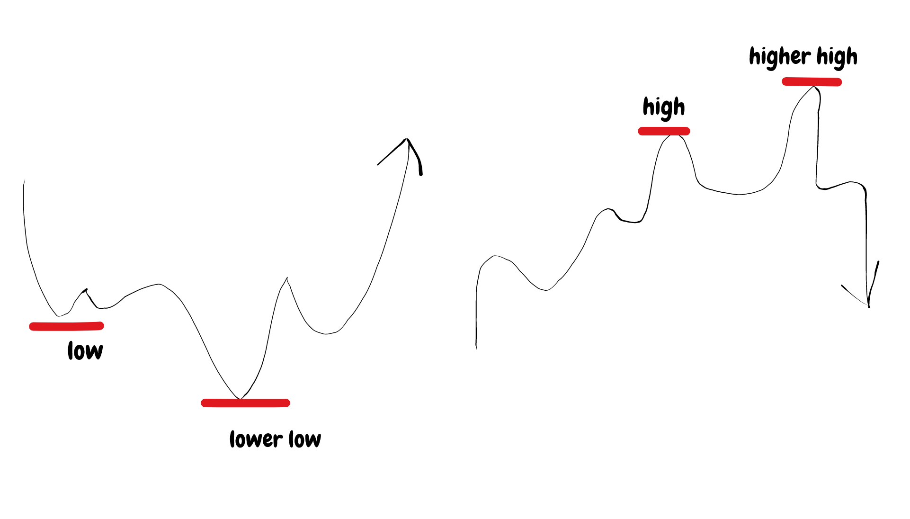

## Table of Contents

## What is a contrarian trading strategy?

A contrarian trading strategy is when a trader goes against what most other people are doing in the market. Instead of following the crowd, a contrarian trader looks for opportunities where the majority might be wrong. For example, if everyone is selling a stock because they think its price will go down, a contrarian might buy it, believing that the price will eventually go up once the panic selling stops.

This strategy is based on the idea that markets can overreact to news or events, causing prices to move too far in one direction. Contrarians believe that these overreactions create buying or selling opportunities. They often look at indicators like the fear and greed index or extreme levels of bullish or bearish sentiment to find these opportunities. However, contrarian trading can be risky because it goes against the current trend, and it requires patience and a strong belief in one's analysis.

## How does a contrarian trading strategy differ from other trading strategies?

A contrarian trading strategy is different from other trading strategies because it involves going against what most people are doing in the market. While many traders follow the trend and buy when prices are going up or sell when they are going down, contrarians do the opposite. They look for times when the market might be overreacting, like when everyone is selling a stock out of fear. Instead of joining the crowd, contrarians might buy that stock, thinking that the price will eventually go back up once the panic is over.

Other trading strategies, like [trend following](/wiki/trend-following) or momentum trading, focus on riding the current market direction. Trend followers, for example, will buy a stock that is going up and sell it when it starts to go down. Momentum traders look for stocks that are moving quickly in one direction and try to profit from that movement. These strategies rely on the idea that trends will continue for a while, so traders try to get in early and get out before the trend changes. Contrarian trading, on the other hand, bets on the market correcting itself after an overreaction, which can be riskier but also potentially more rewarding if the trader's timing is right.

## What are the basic principles behind contrarian trading?

Contrarian trading is based on the idea that the crowd is often wrong about the market. When most people are scared and selling a stock, a contrarian trader might see this as a chance to buy. They believe that the market can overreact to news or events, causing prices to drop too low. Instead of following everyone else, contrarians look for these moments to buy low, hoping to sell high later when the market corrects itself.

The key to contrarian trading is understanding market sentiment. Contrarians use tools like the fear and greed index to see if people are feeling too scared or too excited about the market. If everyone is very scared and selling, a contrarian might think it's a good time to buy. If everyone is too excited and buying, a contrarian might think it's a good time to sell. This strategy requires patience and a strong belief in one's own analysis, as it can take time for the market to turn around.

## What are some common indicators used in contrarian trading?

Contrarian traders use different indicators to see when the market might be overreacting. One common indicator is the fear and greed index. This index shows if people are feeling too scared or too excited about the market. If the index shows a lot of fear, contrarians might think it's a good time to buy because everyone else is selling. If it shows a lot of greed, they might think it's a good time to sell because everyone else is buying.

Another indicator is the put/call ratio. This shows how many people are buying options to protect against falling prices (puts) compared to options betting on rising prices (calls). A high put/call ratio might mean people are scared, and this could be a signal for contrarians to buy. On the other hand, a low put/call ratio might mean people are too confident, and this could be a signal to sell.

Contrarians also look at sentiment surveys, like the AAII Sentiment Survey, to see what other investors are thinking. If most people are very bearish and expect prices to fall, contrarians might see this as a chance to buy. If most people are very bullish and expect prices to rise, contrarians might see this as a chance to sell. These indicators help contrarians find times when the market might be overreacting, so they can go against the crowd.

## How can a beginner start implementing a contrarian trading strategy?

To start using a contrarian trading strategy, a beginner should first learn about market sentiment. This means understanding how other people feel about the market. You can look at things like the fear and greed index, which shows if people are scared or excited about the market. If everyone is scared and selling, you might want to buy because prices could go up later. If everyone is excited and buying, you might want to sell because prices could go down. It's also good to check the put/call ratio, which shows how many people are betting on prices going down compared to going up. A high ratio might mean people are scared, so it could be a good time to buy.

Once you understand these indicators, the next step is to practice patience. Contrarian trading means going against what most people are doing, so you need to wait for the right moment. Start by watching the market and looking for times when it seems to be overreacting. For example, if a stock drops a lot because of bad news, but you think the news isn't that bad, you might want to buy it. Remember, contrarian trading can be risky, so it's important to only use money you can afford to lose and to keep learning about the market. Over time, you'll get better at spotting good opportunities to go against the crowd.

## What are the risks associated with contrarian trading?

Contrarian trading can be risky because you're going against what most people are doing in the market. When you buy a stock that everyone else is selling, you're betting that the price will go up later. But if you're wrong and the price keeps going down, you could lose a lot of money. It's hard to know when the market will turn around, so you might have to wait a long time before you see any profit. This can be tough, especially if you need your money sooner.

Another risk is that you might not understand the market well enough. Contrarian trading requires you to read the market sentiment correctly and figure out when people are overreacting. If you make a mistake, you could buy at the wrong time or sell too early. It's also important to remember that just because a lot of people are doing something, it doesn't mean they're wrong. Sometimes, the crowd can be right, and going against them can lead to big losses. So, it's important to keep learning and stay patient, but always be ready for the possibility that your trades might not work out.

## Can you provide examples of successful contrarian trades?

One famous example of a successful contrarian trade was during the 2008 financial crisis. When the stock market crashed and many people were selling their stocks out of fear, Warren Buffett, a well-known investor, decided to buy. He believed that the market had overreacted and that good companies were being sold at very low prices. Buffett invested billions of dollars in companies like Goldman Sachs and Bank of America. Over time, as the market recovered, these investments made him a lot of money. This shows how contrarian trading can be very profitable if you have the patience and the right timing.

Another example happened in the early 2000s with the tech bubble. Many investors were buying tech stocks because they thought the prices would keep going up forever. But a contrarian investor named Michael Burry saw that these prices were too high and that the bubble would burst. He started short-selling tech stocks, which means he bet that their prices would go down. When the tech bubble did burst, Burry made a lot of money from his contrarian trade. His story was even featured in the book and movie "The Big Short." This shows how going against the crowd can lead to big gains if you can spot when the market is wrong.

## How do market sentiment and contrarian trading interact?

Market sentiment is all about how people feel about the market. If most people are scared and think prices will go down, we say the sentiment is bearish. If most people are excited and think prices will go up, we say the sentiment is bullish. Contrarian traders pay close attention to market sentiment because they want to go against what most people are doing. When everyone is scared and selling, contrarians might see this as a good time to buy, thinking that the fear is making prices too low. When everyone is excited and buying, contrarians might see this as a good time to sell, thinking that the excitement is making prices too high.

This interaction between market sentiment and contrarian trading is important because it helps contrarians find good trading opportunities. They use tools like the fear and greed index to measure how scared or excited people are. If the index shows a lot of fear, contrarians might think it's a good time to buy because everyone else is selling. If the index shows a lot of greed, they might think it's a good time to sell because everyone else is buying. By going against the crowd, contrarians hope to buy low and sell high, but it takes patience and a good understanding of the market to make this strategy work.

## What psychological factors should a contrarian trader consider?

Contrarian traders need to think about their own feelings and the feelings of other people in the market. It's hard to go against what everyone else is doing because it can make you feel nervous or scared. When everyone is selling and you decide to buy, it can be tough to stick with your plan. You might start to doubt yourself and wonder if you're making a big mistake. That's why it's important for contrarian traders to stay calm and trust their own analysis, even when it seems like the whole world is doing the opposite.

Another thing to think about is how other people's emotions can affect the market. When people get really scared or excited, they can make big moves that push prices up or down a lot. Contrarian traders look for these times when the market might be overreacting because of fear or greed. They try to use these emotions to their advantage by buying when others are scared and selling when others are excited. But it's not easy, and it takes a lot of patience and a strong belief in your own ideas to do well as a contrarian trader.

## How can advanced technical analysis enhance contrarian trading strategies?

Advanced technical analysis can help contrarian traders make better decisions by giving them more tools to understand the market. They can use things like chart patterns, moving averages, and technical indicators to see when the market might be overreacting. For example, if a stock's price is far below its moving average, it might be a sign that it's been oversold and could be a good time to buy. By looking at these technical signals, contrarian traders can find better entry and [exit](/wiki/exit-strategy) points for their trades, making their strategy more effective.

Technical analysis also helps contrarian traders stay disciplined and patient. It's hard to go against the crowd, and it's easy to get scared or excited by what everyone else is doing. But if you use technical analysis, you can set clear rules for when to buy or sell based on what the charts are telling you. This can help you stick to your plan and not get swayed by emotions. Over time, using technical analysis can make your contrarian trading strategy more reliable and successful.

## What role does fundamental analysis play in contrarian trading?

Fundamental analysis is important for contrarian traders because it helps them understand if a stock is really a good buy when everyone else is selling it. When the market is scared and prices are low, contrarians look at things like a company's earnings, debts, and how it's doing compared to other companies. If the fundamentals show that the company is strong and the low price is just because of fear, then it might be a good time to buy. This way, contrarians can make sure they're not just going against the crowd for no reason, but because they believe the stock is undervalued.

Using [fundamental analysis](/wiki/fundamental-analysis) also helps contrarians stay patient and confident in their trades. When you know a company's fundamentals are good, it's easier to wait for the market to turn around, even if it takes a long time. This can be really important because contrarian trading often means holding onto stocks for a while until the price goes back up. By combining fundamental analysis with their strategy, contrarians can make smarter decisions and feel more sure about going against what everyone else is doing.

## How can a contrarian trader adapt their strategy during different market cycles?

A contrarian trader needs to change their strategy depending on what's happening in the market. During a bull market, when prices are going up and everyone is excited, a contrarian might look for signs that the market is too happy. They might sell stocks that everyone else is buying because they think the prices are too high. They can use things like the fear and greed index to see if people are too greedy, which could mean it's a good time to sell. In a bull market, contrarians need to be careful not to get caught up in the excitement and stay focused on finding overvalued stocks to sell.

In a bear market, when prices are going down and everyone is scared, a contrarian might look for chances to buy. They might buy stocks that everyone else is selling because they think the prices are too low. They can use indicators like the put/call ratio to see if people are too scared, which could mean it's a good time to buy. In a bear market, contrarians need to be patient and ready to wait for the market to turn around. By understanding the different market cycles and using the right tools, contrarian traders can adapt their strategy to make the most of any situation.

## What are some examples of contrarian algorithmic strategies?

Mean reversion algorithms are a staple in contrarian trading strategies, built on the principle that asset prices fluctuate around their historical average. When recent prices fall significantly below the historical average, these algorithms trigger buy orders, anticipating a price rebound towards the mean. Conversely, they initiate sell orders when prices rise substantially above the historical mean, expecting a downward correction. Mathematically, mean reversion can be described using the formula:

$$

MR = \frac{P - \mu}{\sigma} 
$$

where $MR$ is the mean reversion signal, $P$ is the current price, $\mu$ is the historical mean, and $\sigma$ is the standard deviation of prices. This approach assumes that deviations from the mean are temporary and that prices will revert over time.

RSI-based algorithms are another common contrarian tool, leveraging the Relative Strength Index (RSI) to identify overbought and oversold conditions. The RSI is a [momentum](/wiki/momentum) oscillator that measures the speed and change of price movements on a scale of 0 to 100. Typically, an RSI above 70 indicates overbought conditions, suggesting a potential sell signal, while an RSI below 30 indicates oversold conditions, suggesting a potential buy signal.

Here is a basic Python snippet demonstrating an RSI-based trading strategy:

```python
def calculate_rsi(prices, period=14):
    deltas = np.diff(prices)
    gains = deltas[deltas > 0].sum() / period
    losses = -deltas[deltas < 0].sum() / period
    rs = gains / losses
    rsi = 100 - (100 / (1 + rs))
    return rsi

def trading_strategy(prices):
    rsi = calculate_rsi(prices)
    if rsi > 70:
        action = "Sell"
    elif rsi < 30:
        action = "Buy"
    else:
        action = "Hold"
    return action
```

Sentiment analysis algorithms utilize data from social media and news sources to gauge market sentiment and identify crowded trades. By analyzing the tone and [volume](/wiki/volume-trading-strategy) of mentions regarding a specific asset, these algorithms predict potential price movements. A significant number of positive mentions might suggest that an asset is overbought, leading the algorithm to take a contrarian sell position. Conversely, a surge in negative sentiment could indicate that an asset is oversold, prompting a buy signal.

For implementing sentiment analysis, natural language processing (NLP) techniques and [machine learning](/wiki/machine-learning) models are often employed to accurately assess market sentiment from textual data. This sophisticated data analysis enables traders to anticipate shifts in market dynamics and execute contrarian trades effectively.

These contrarian algorithmic strategies, when executed correctly, exploit inefficiencies created by collective market behavior, offering profitable trading opportunities by anticipating reversals in market trends.

## References & Further Reading

[1]: Bergstra, J., Bardenet, R., Bengio, Y., & Kégl, B. (2011). ["Algorithms for Hyper-Parameter Optimization."](https://papers.nips.cc/paper/4443-algorithms-for-hyper-parameter-optimization) Advances in Neural Information Processing Systems 24.

[2]: ["Advances in Financial Machine Learning"](https://www.amazon.com/Advances-Financial-Machine-Learning-Marcos/dp/1119482089) by Marcos Lopez de Prado

[3]: ["Evidence-Based Technical Analysis: Applying the Scientific Method and Statistical Inference to Trading Signals"](https://www.amazon.com/Evidence-Based-Technical-Analysis-Scientific-Statistical/dp/0470008741) by David Aronson

[4]: ["Machine Learning for Algorithmic Trading"](https://github.com/PacktPublishing/Machine-Learning-for-Algorithmic-Trading-Second-Edition) by Stefan Jansen

[5]: ["Quantitative Trading: How to Build Your Own Algorithmic Trading Business"](https://books.google.com/books/about/Quantitative_Trading.html?id=j70yEAAAQBAJ) by Ernest P. Chan