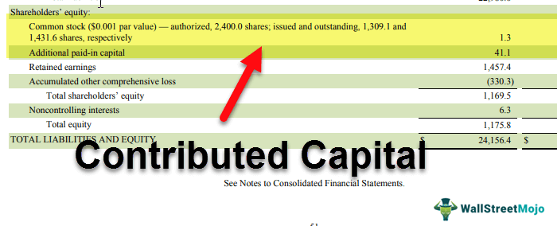

## Table of Contents

## What is contributed capital?

Contributed capital is the money that shareholders put into a company when they buy its stock. This happens when the company first sells its shares to the public or to investors. The money from these sales goes into the company's bank account and is used to help the business grow, buy equipment, or pay for other needs.

This amount is shown on the company's balance sheet under the shareholders' equity section. It is different from other types of capital, like retained earnings, which is the profit the company keeps and reinvests. Contributed capital is important because it shows how much money investors have directly given to the company to support its operations and growth.

## How is contributed capital different from paid-in capital?

Contributed capital and paid-in capital are terms that often get mixed up, but they mean the same thing in simple terms. They both refer to the money that people pay to a company when they buy its stock. This happens when the company first sells its shares to the public or to investors. The money from these sales goes into the company's bank account and is used to help the business grow, buy equipment, or pay for other needs.

On a company's balance sheet, this amount is shown under the shareholders' equity section. It's different from other money the company has, like retained earnings, which is the profit the company keeps and reinvests. So, contributed capital or paid-in capital is important because it shows how much money investors have directly given to the company to support its operations and growth.

## What are the common sources of contributed capital?

The main way companies get contributed capital is by selling their stock to people or other businesses. When a company decides to sell its stock for the first time, this is called an initial public offering (IPO). During an IPO, the company sets a price for its shares, and people or investors buy them at that price. The money they pay for the shares goes straight to the company and becomes part of its contributed capital.

Another way companies can increase their contributed capital is through secondary offerings. This happens when a company that's already public decides to sell more shares. Investors can buy these new shares, and the money from these sales also goes into the company's contributed capital. Sometimes, companies also get contributed capital from private placements, where they sell shares to a small group of investors without going through a public offering.

Both IPOs and secondary offerings are important because they help companies raise the money they need to grow or invest in new projects. The contributed capital from these sources shows how much support the company has from its investors, and it's a key part of the company's overall financial health.

## How do you calculate contributed capital?

To calculate contributed capital, you add up all the money that people paid to buy the company's stock. This includes money from the first time the company sold its shares, which is called an initial public offering (IPO), and any other times the company sold more shares, like in secondary offerings. If the company also got money from private placements, where it sold shares to a small group of investors, you add that money too.

So, contributed capital is the total of all these amounts. It's shown on the company's balance sheet under the shareholders' equity section. It's important because it shows how much money investors have given the company to help it grow and operate.

## Can contributed capital be negative?

Contributed capital can't be negative. It's the money people pay to buy a company's stock, like when the company first sells its shares to the public or later sells more shares. This money goes into the company's bank account and helps it grow or buy things it needs. So, contributed capital is always a positive number because it's the total amount of money investors have given the company.

If a company loses money or has debts, that doesn't change the contributed capital. The losses or debts are shown in different parts of the company's financial statements, like retained earnings or liabilities. Contributed capital stays the same because it only counts the money that came in from selling stock, not what the company did with that money afterward.

## What is the difference between contributed capital and retained earnings?

Contributed capital and retained earnings are two different parts of a company's money. Contributed capital is the money that people pay to buy the company's stock. This happens when the company first sells its shares to the public or later sells more shares. The money from these sales goes into the company's bank account and is used to help the business grow or buy things it needs. Contributed capital is always a positive number because it's the total amount of money investors have given the company.

Retained earnings, on the other hand, are the profits that the company decides to keep and reinvest in the business instead of paying out to shareholders as dividends. This money comes from the company's earnings after it pays all its expenses and taxes. Retained earnings can be positive if the company makes a profit, or negative if the company loses money. Unlike contributed capital, retained earnings show how well the company is doing with the money it already has, not just the money it gets from selling stock.

## How does contributed capital affect a company's balance sheet?

Contributed capital is an important part of a company's balance sheet. It's the money that people pay to buy the company's stock, and it shows up under the shareholders' equity section. When a company sells its shares, like during an initial public offering (IPO) or a secondary offering, the money from these sales goes into the company's bank account and becomes part of its contributed capital. This money helps the company grow and buy things it needs, and it's always a positive number because it's the total amount of money investors have given the company.

The balance sheet shows what the company owns (assets), what it owes (liabilities), and the shareholders' equity, which is what's left over after you subtract the liabilities from the assets. Contributed capital is a big part of shareholders' equity because it's the money that came directly from investors. It doesn't change based on the company's profits or losses, unlike retained earnings, which can go up or down depending on how well the company is doing. So, contributed capital stays the same on the balance sheet and helps show how much support the company has from its investors.

## What are some examples of contributed capital in real companies?

When a company like Tesla decides to go public, it sells its shares to the public for the first time. This is called an initial public offering (IPO). In 2010, Tesla had its IPO and sold shares at $17 each. The money people paid for these shares went into Tesla's bank account and became part of its contributed capital. This money helped Tesla grow and invest in making more electric cars. So, the contributed capital from the IPO was important for Tesla because it showed how much money investors were willing to give the company to help it succeed.

Another example is when a company like Amazon decides to sell more shares after it's already public. This is called a secondary offering. In 1999, Amazon did a secondary offering and sold more shares to raise money. The money from these new shares also went into Amazon's contributed capital. This helped Amazon expand its business and invest in new projects. So, the contributed capital from the secondary offering showed how much more support Amazon had from its investors, even after it was already a public company.

## How does contributed capital impact shareholders' equity?

Contributed capital is a big part of shareholders' equity on a company's balance sheet. Shareholders' equity is what's left over after you subtract what the company owes (liabilities) from what it owns (assets). Contributed capital is the money that people pay to buy the company's stock, like when the company first sells its shares to the public or later sells more shares. This money goes into the company's bank account and becomes part of its contributed capital. So, when a company gets more contributed capital, it makes the shareholders' equity go up because it's more money that the company has from its investors.

Contributed capital is different from other parts of shareholders' equity, like retained earnings. Retained earnings are the profits that the company decides to keep and reinvest in the business instead of paying out to shareholders as dividends. Contributed capital stays the same on the balance sheet and doesn't change based on the company's profits or losses. It's always a positive number because it's the total amount of money investors have given the company. So, contributed capital is important for shareholders' equity because it shows how much support the company has from its investors, and it helps the company grow and buy things it needs.

## What are the tax implications of contributed capital?

When a company gets money from selling its stock, this is called contributed capital. The good news for the company is that this money is not taxed. When people buy the company's shares, the money they pay goes straight into the company's bank account without the company having to pay any taxes on it. This is because the money from selling stock is not considered income for the company. It's just money that investors are giving the company to help it grow.

For the people who buy the stock, there can be tax implications later on. If they sell their shares for more money than they paid for them, they might have to pay capital gains tax on the profit. But when they first buy the shares, they don't have to pay any taxes on the money they spend. So, contributed capital helps the company grow without any immediate tax burden, but investors might have to think about taxes if they make money by selling their shares later.

## How does contributed capital relate to stock issuance?

Contributed capital is the money a company gets when it sells its stock. When a company decides to sell its shares to the public for the first time, this is called an initial public offering (IPO). During an IPO, the company sets a price for its shares, and people or investors buy them at that price. The money they pay for the shares goes straight into the company's bank account and becomes part of its contributed capital. This money helps the company grow and invest in new projects.

Sometimes, a company that's already public decides to sell more shares. This is called a secondary offering. When investors buy these new shares, the money from these sales also goes into the company's contributed capital. Both IPOs and secondary offerings are important because they help the company raise the money it needs to expand its business. So, contributed capital is closely tied to stock issuance because it's the total amount of money the company gets from selling its stock.

## What advanced accounting treatments are associated with contributed capital?

When a company gets money from selling its stock, this is called contributed capital. Sometimes, a company might give out stock options or warrants to its employees or investors. These are like promises that let people buy the company's stock at a special price in the future. When people use these options or warrants to buy the stock, the money they pay goes into the company's contributed capital. But the company also has to keep track of how much the options or warrants were worth when they were given out. This can make the accounting a bit more complicated because the company has to figure out the value of these options and report it correctly.

Another thing that can make contributed capital more complex is if a company does a stock split or a reverse stock split. A stock split is when a company decides to split each of its shares into more shares, which makes the price of each share lower. A reverse stock split is the opposite, where the company combines shares to make the price of each share higher. When a company does a stock split or a reverse stock split, it doesn't change the total amount of contributed capital, but it does change how the shares are counted. The company has to make sure it records these changes correctly on its balance sheet so that the contributed capital still shows the right amount of money investors have given the company.

## What is Understanding Contributed Capital?

Contributed capital, also referred to as paid-in capital, represents the total amount of funds that shareholders contribute in exchange for equity in a company. This equity financing instrument is crucial for companies seeking to raise capital without incurring debt. The concept encompasses two main components: the par value of the stock and the additional paid-in capital (APIC), which is the excess amount paid by investors over the par value.

### Basic Calculation and Recording

When a company issues new shares, the contributed capital is recorded on the equity section of its balance sheet. The entry generally appears as the sum of the common stock (or preferred stock, if applicable) at its par value and the additional paid-in capital.

#### Formula:
The contributed capital can be mathematically represented as:

$$
\text{Contributed Capital} = (\text{Number of Shares Issued} \times \text{Par Value per Share}) + \text{APIC}
$$

For example, if a firm issues 1,000 shares at a par value of $1 each and receives $10 per share from investors, the APIC would be calculated as:

$$
\text{APIC} = 1,000 \times (10 - 1) = 9,000
$$

Thus, the total contributed capital would amount to:

$$
\text{Contributed Capital} = (1,000 \times 1) + 9,000 = 10,000
$$

The journal entry for this transaction would be to debit cash for $10,000 and credit common stock for $1,000 (1,000 shares at $1 par value) and APIC for $9,000.

### Significance of Additional Paid-In Capital

Additional paid-in capital is a significant indicator of a company’s financial health and investment allure. It represents the amount investors are willing to pay over the par value due to their confidence in the company's potential for growth and profitability. A high APIC often signals robust investor interest and may reflect positively on the firm's reputation and market perception. It can be viewed as a buffer that cushions the company during financial downturns, providing more substantial capital reserves compared to firms with solely par value shares.

APIC also has implications for shareholder equity calculations, which encompass retained earnings, common stock, APIC, and other comprehensive income. A strong APIC can lead to a healthier balance sheet, impacting financial ratios including return on equity (ROE) and price-to-book value, which are critical in investment decision-making.

Collectively, contributed capital is not just a mere placeholder on the balance sheet but a versatile component reflecting the underlying confidence stakeholders have in the company’s potential, while also providing financial stability and resources for growth and expansion.

## What are examples of contributed capital?

Contributed capital, often referred to as paid-in capital, represents the total value of cash or assets that shareholders have given to the company in exchange for stock. This can be broken down into two main components: the par value of the shares and the additional paid-in capital (APIC), which is the excess paid over the par value. To illustrate how contributed capital functions in practice, we examine recent initial public offerings (IPOs) and consider case studies of companies that effectively used contributed capital to fund expansion.

### Detailed Calculations of Par Value and Additional Paid-in Capital

When a company goes public, it issues shares at a specific price, part of which is designated as the par value, and the remainder is considered additional paid-in capital. For instance, if a company issues shares at $10 each with a par value of $1, the additional paid-in capital per share is $9. 

**Example Calculation:**

Consider a scenario where a company issues 1 million shares at an IPO price of $10 per share, with a par value of $1 per share:

1. **Par Value** = Number of Shares × Par Value per Share  
$$
   \text{Par Value} = 1,000,000 \, \text{shares} \times \$1/\text{share} = \$1,000,000

$$

2. **Additional Paid-in Capital (APIC)** = Number of Shares × (Issue Price - Par Value per Share)  
$$
   \text{APIC} = 1,000,000 \, \text{shares} \times (\$10 - \$1) = \$9,000,000

$$

3. **Total Contributed Capital** = Par Value + APIC  
$$
   \text{Total Contributed Capital} = \$1,000,000 + \$9,000,000 = \$10,000,000

$$

This combination of par value and additional paid-in capital provides the shareholders' total investment, reflected in the company's balance sheet.

### Case Studies of Effective Leveraging of Contributed Capital

#### Case Study 1: TechCorp's Expansion

TechCorp, a technology startup, successfully utilized contributed capital raised through its IPO to expand its research and development facilities. By issuing 2 million shares at an IPO price of $15, where the par value was $1, TechCorp raised significant additional paid-in capital:

- **Par Value** = 2,000,000 shares × $1 = $2,000,000
- **APIC** = 2,000,000 shares × $(15-1) = $28,000,000
- **Total Contributed Capital** = $30,000,000

With this capital, TechCorp invested heavily in innovative product development, driving subsequent growth and profitability.

#### Case Study 2: GreenEnergy Inc.'s Market Penetration

GreenEnergy Inc. tapped into contributed capital from its public offering to bolster operations and enter new markets. By issuing shares at $20 each with a par value of $2, the company gathered substantial resources for strategic initiatives. This contributed capital enabled GreenEnergy to diversify its product line and significantly expand its geographical reach.

These examples demonstrate how companies can strategically employ contributed capital to facilitate growth and success, leveraging the funds derived from shareholders to pursue their business objectives and enhance value creation.

## References & Further Reading

[1]: ["Advances in Financial Machine Learning"](https://www.amazon.com/Advances-Financial-Machine-Learning-Marcos/dp/1119482089) by Marcos Lopez de Prado

[2]: ["Machine Learning for Algorithmic Trading"](https://github.com/stefan-jansen/machine-learning-for-trading) by Stefan Jansen

[3]: ["Quantitative Trading: How to Build Your Own Algorithmic Trading Business"](https://www.amazon.com/Quantitative-Trading-Build-Algorithmic-Business/dp/1119800064) by Ernest P. Chan

[4]: ["Evidence-Based Technical Analysis: Applying the Scientific Method and Statistical Inference to Trading Signals"](https://www.amazon.com/Evidence-Based-Technical-Analysis-Scientific-Statistical/dp/0470008741) by David Aronson

[5]: Bergstra, J., Bardenet, R., Bengio, Y., & Kégl, B. (2011). ["Algorithms for Hyper-Parameter Optimization."](https://dl.acm.org/doi/10.5555/2986459.2986743) Advances in Neural Information Processing Systems 24.