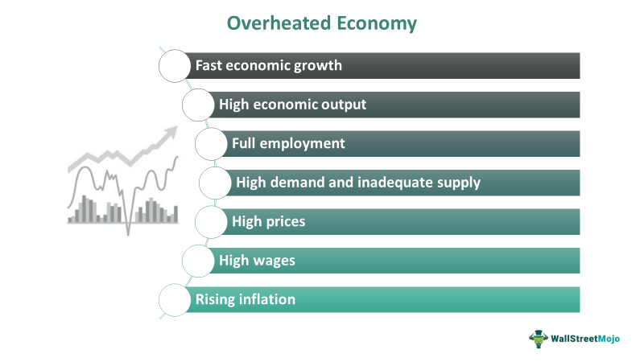

Economic overheating refers to a situation in which an economy expands at an unsustainable pace, leading to imbalances and elevated inflation levels. This phenomenon can pose significant challenges as demand outstrips supply, potentially causing price increases and economic disequilibrium. Prolonged overheating can threaten financial stability and necessitate intervention from policymakers and economists to stabilize the situation.   

This article examines the concept of an overheated economy, exploring its underlying causes such as excessive consumer spending and expansive monetary policies, along with the resultant effects that include inflationary pressures and heightened economic instability. 

A pertinent element in discussing economic overheating is the role of algorithmic trading. As an integral part of modern financial markets, algorithmic trading can, under certain circumstances, exacerbate the volatility associated with overheating by rapidly adjusting trading strategies in response to market signals. This necessitates a deeper understanding, regulation, and strategic management of algorithmic trading activities during periods of economic imbalance.

For investors, policymakers, and businesses, comprehending the dynamics of economic overheating is vital. It aids in identifying potential risks, devising strategies to navigate these challenges, and implementing measures to foster stable economic growth. As the global economy becomes increasingly interconnected and complex, the ability to foresee and mitigate the risks associated with economic overheating is indispensable for maintaining long-term financial and economic stability.

## Table of Contents

## What Is an Overheated Economy?

An overheated economy is characterized by rapid economic growth that surpasses a nation’s long-term productive capacity, creating unsustainable economic conditions. Typically, this scenario manifests through excessive demand that exceeds supply, resulting in upward pressure on prices and consequently, inflation. An overheated economy disrupts the balance between supply and demand, leading to inefficiencies in resource allocation.

Several indicators signal an overheating economy, with a low unemployment rate and rising inflation being the most prominent. A low unemployment rate indicates most of the labor force is employed, which can drive wages up as businesses compete for a limited pool of workers leading to cost-push inflation. Rising inflation, another critical indicator, can erode purchasing power, distorting consumer spending and saving behavior.

A classic example of an overheating indicator is when consumer spending growth surpasses an economy's productive capacity. This may lead to production bottlenecks as industries struggle to meet burgeoning demand, resulting in supply shortages and further inflationary pressures. In such situations, the aggregate demand curve shifts more rapidly than the aggregate supply curve, potentially leading to an economic downturn. The following simplistic equation highlights the relationship at play:

$$
\text{AD} = C + I + G + (X - M)
$$

Where:
- $\text{AD}$ is the Aggregate Demand,
- $C$ represents consumer spending,
- $I$ is investment from businesses,
- $G$ denotes government expenditures,
- $X$ stands for export levels,
- $M$ symbolizes imports.

In an overheated economy, $C$ (consumer spending) often surges, leading to an increase in $\text{AD}$ that exceeds what the economy can sustainably produce, pushing $\text{AD}$ rightwards beyond potential output levels. These dynamics can result in price level increases unless mitigating measures are undertaken to rebalance demand and supply dynamics.

## Causes of Economic Overheating

Economic overheating occurs due to several interconnected factors that drive demand beyond the economy's supply capacity, leading to imbalances and unsustainable growth conditions. 

Excessive consumer confidence often acts as a primary catalyst for economic overheating. When consumers are optimistic about their future economic prospects, they are more likely to increase spending. This surge in demand can exceed the supply of goods and services, resulting in upward pressure on prices and heightened inflation. Such consumer behavior is frequently driven by positive economic indicators such as rising employment levels and income growth, which bolster confidence in the economic outlook. 

Monetary policy also plays a crucial role in economic overheating. Central banks, by setting low-interest rates, aim to stimulate economic growth by making borrowing more attractive. However, persistently low rates can lead to excessive expansion of credit, as individuals and businesses take on more loans and increase their spending and investment. This environment can give rise to asset bubbles, particularly in sectors like real estate and stock markets. For example, the housing market might experience rapid price increases as demand driven by cheap credit outpaces supply, creating unsustainable price levels that risk collapsing once interest rates rise or economic sentiment changes.

External shocks, such as sudden spikes in commodity prices, can also lead to overheating. When commodities that are fundamental to production, like oil or metals, experience price surges due to geopolitical tensions or supply disruptions, the cost of goods across the economy increases. This not only strains resources but also contributes to inflationary pressures as production costs rise, eventually leading to higher prices for consumers.

These causes of economic overheating are interrelated, and their impacts can be compounded in a globalized economy where financial systems are interconnected. The challenge for policymakers lies in carefully balancing these dynamics to prevent economic instability while promoting healthy growth.

## Effects of an Overheating Economy

Economic overheating is a state that can cause significant and multifaceted effects on an economy. One prominent consequence is inflation, which reduces the purchasing power of consumers. As prices rise, consumers are able to buy less for the same amount of money, which can lead to decreased consumer spending and an erosion of savings. This decrease in purchasing power affects the overall demand for goods and services in the economy, potentially leading to a slowdown in economic activity.

To counteract overheating, central banks may increase interest rates to rein in excessive economic growth. Higher interest rates can lead to increased borrowing costs for businesses and consumers. For businesses, this means higher costs for financing investments, potentially slowing down expansion and hiring plans. For consumers, more expensive loans can limit spending on big-ticket items such as homes and cars, leading to a decrease in overall consumer expenditure.

A prolonged period of economic overheating may ultimately culminate in a recession. Historical examples, such as the Great Recession, illustrate how an overheated economy can lead to severe downturns. In these instances, a combination of factors, including excessive borrowing and asset bubbles, contribute to a sharp reversal in economic conditions, resulting in widespread unemployment and financial instability. During these periods, the initial corrections that follow an overheated period can exacerbate economic disruptions, leading to sustained economic contractions.

In conclusion, the effects of an overheated economy are broad and significant. They pose challenges not only to individual consumers and businesses but also to policymakers tasked with maintaining economic stability. Preventative and corrective measures such as prudent monetary policy are essential to minimizing the adverse impacts of overheating and ensuring sustainable economic growth.

## Algorithmic Trading in an Overheated Economy

Algorithmic trading utilizes sophisticated computer programs to execute trades at high speeds and volumes, responding rapidly to various economic signals. This high-frequency trading approach relies on pre-set criteria and algorithms to make trading decisions, often within milliseconds, significantly faster than human traders. In an overheated economy, where rapid economic growth and excessive demand may already exacerbate market [volatility](/wiki/volatility-trading-strategies), [algorithmic trading](/wiki/algorithmic-trading) can further amplify these effects.

The primary way algorithmic trading might increase volatility is by amplifying existing market trends. For instance, during periods of economic overheating, markets often experience excessive optimism, leading to price surges in stocks, real estate, or other assets. Algorithms programmed to identify and capitalize on upward trends can accelerate these surges by executing large volumes of trades based on similar signals, thus contributing to and reinforcing the creation of asset bubbles. This self-reinforcing feedback loop can lead to mispricing of assets and increased financial instability.

Moreover, algorithmic trading's role in [liquidity](/wiki/liquidity-risk-premium) provision can be a double-edged sword in overheated conditions. While algorithms generally enhance market liquidity by consistently executing trades, during periods of heightened economic stress, they might retract from the market, causing liquidity shortages. This situation was evident in the Flash Crash of May 2010, where algorithmic trading contributed to a sudden and severe dip in U.S. stock indices. Such events highlight the importance of regulatory oversight to prevent liquidity-driven market destabilizations in overheated economies.

Despite the potential for increased volatility, algorithmic trading can enhance overall market efficiency by narrowing bid-ask spreads and facilitating more accurate price discovery under normal conditions. However, its contribution to rapid market changes underscores the need for careful regulation. Policymakers and financial regulators must implement measures to mitigate systemic risks associated with algorithmic trading. This may include setting limits on trading speed and [volume](/wiki/volume-trading-strategy), ensuring adequate market surveillance, and developing robust stress-testing frameworks to prepare for adverse economic conditions.

In summary, while algorithmic trading can offer significant benefits to market efficiency, its capacity to intensify market movements in overheated economies necessitates vigilant regulatory oversight. Such measures are crucial to curtail excessive volatility and safeguard financial system stability.

## Mitigation Strategies

Mitigation strategies are essential in addressing the challenges posed by economic overheating. Central banks, governments, and regulators play crucial roles in implementing these strategies to maintain economic stability and sustainable growth.

One of the primary tools used by central banks to counteract economic overheating is monetary policy. By raising interest rates, central banks can make borrowing more expensive, which tends to reduce consumer spending and business investment. This helps decrease demand, thus reining in inflationary pressures. The relationship between interest rates and economic activity can be described by the equation:

$$
I = C + I_r + G + (X - M)
$$

Where:
- $I$ represents national income or GDP,
- $C$ denotes consumption,
- $I_r$ is investment,
- $G$ refers to government spending,
- $X - M$ is the net export (exports minus imports).

By adjusting interest rates, central banks influence $I_r$, thus affecting overall GDP and demand in the economy.

Governments, on the other hand, can utilize fiscal policies to manage overheating. One effective approach is reducing budget deficits, which involves either cutting public spending or increasing taxes. Both measures aim to decrease aggregate demand. For example, higher taxes reduce disposable income for households, thereby decreasing consumption. Conversely, cutting government expenditures directly reduces demand for goods and services.

Regulatory measures can also curb speculative bubbles, which are often a consequence of economic overheating. Regulators can tighten lending standards to ensure that credit growth is sustainable and does not contribute to asset bubbles. This involves setting stricter criteria for loan approval and increasing capital requirements for banks to enhance financial stability. Implementing investment standards that require transparency and risk assessment can also prevent irrational exuberance in markets.

In conclusion, addressing economic overheating requires a multifaceted approach involving monetary policy adjustments, fiscal discipline, and stringent regulatory measures. By coordinating these strategies, central banks, governments, and regulators can mitigate the risks associated with overheating and promote a balanced economic environment.

## Conclusion

Economic overheating poses substantial risks to financial stability and economic growth. When an economy grows too quickly, it can lead to high inflation, reducing the purchasing power of consumers and potentially triggering financial instability. These risks highlight the need for vigilance among policymakers and market participants.

Awareness of the symptoms and consequences of economic overheating is the first step in mitigating these risks. Policymakers should monitor key economic indicators, such as inflation rates, consumer spending, and unemployment levels, to detect signs of overheating. Timely interventions, such as adjusting interest rates or implementing fiscal policies, can help stabilize the economy before conditions deteriorate.

Proactive measures are equally essential. Central banks and governments can design policies that promote sustainable growth and prevent the emergence of asset bubbles. For example, implementing macroprudential policies can regulate lending standards and curb excessive risk-taking in financial markets. Such strategies require coordination among regulatory bodies to efficiently address economic imbalances.

Ongoing research and strategic planning play a crucial role in maintaining balanced economic growth and stability. Economists and policymakers must continuously refine their understanding of economic dynamics and develop models that accurately predict potential overheating scenarios. Sophisticated analytical tools, including [machine learning](/wiki/machine-learning) and data analytics, can enhance the precision of economic forecasting.

In today's dynamic global economy, maintaining stability demands a combination of foresight, flexibility, and collaboration among international agencies and governments. Ensuring financial stability and fostering sustainable growth necessitates a comprehensive approach that integrates economic monitoring, policy innovation, and regulatory adjustments. By prioritizing these efforts, stakeholders can effectively mitigate the adverse impacts of economic overheating.

## References & Further Reading

[1]: ["Monetary Policy and Economic Overheating: From the Great Inflation to COVID-19"](https://www.stlouisfed.org/publications/regional-economist/fourth-quarter-2020/monetary-policy-fiscal-policy-responses-covid-crisis) by The Brookings Institution

[2]: Galí, J. (2015). ["Monetary Policy, Inflation, and the Business Cycle: An Introduction to the New Keynesian Framework and Its Applications."](https://press.princeton.edu/books/hardcover/9780691164786/monetary-policy-inflation-and-the-business-cycle) Princeton University Press.

[3]: Hong, H., & Stein, J. C. (2003). ["Differences of Opinion, Short-Sales Constraints, and Market Crashes"](https://scholar.harvard.edu/files/stein/files/rfs-2003.pdf) in *The Review of Financial Studies*.

[4]: Frankel, J. A., & Froot, K. A. (1986). ["Understanding the U.S. Dollar in the Eighties: The Expectations of Chartists and Fundamentalists"](https://scholar.harvard.edu/files/kenfroot/files/understanding_the_u.s._dollar_in_the_eighties.pdf) in *Economic Record*.

[5]: Farmer, J. D., & Geanakoplos, J. (2009). ["The Virtues and Vices of Equilibrium and the Future of Financial Economics"](https://onlinelibrary.wiley.com/doi/10.1002/cplx.20261) in *Complexity*.