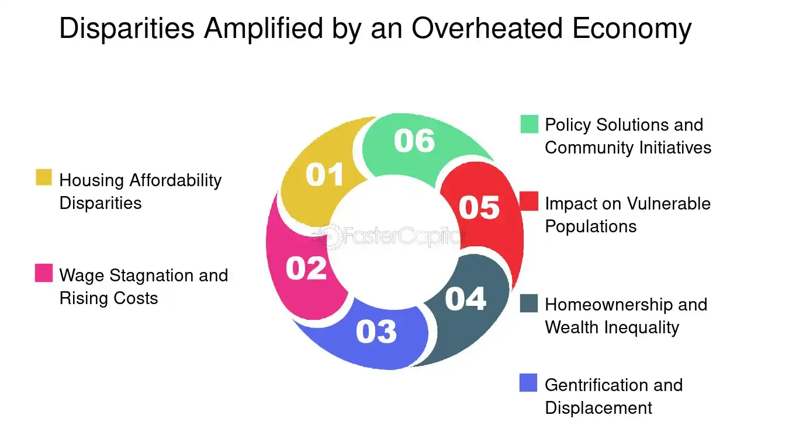

## Table of Contents

## What is an overheated economy?

An overheated economy is when a country's economy grows too fast and becomes unstable. This happens when people and businesses spend a lot more money than usual, causing prices to go up quickly. When this happens, it can lead to high inflation, which means the cost of things like food and gas increases a lot.

If an economy stays overheated for a long time, it can cause big problems. The government might need to raise interest rates to slow down spending and cool down the economy. This can make it harder for people to borrow money and can even lead to a recession, where the economy shrinks and people lose jobs. So, while fast growth can seem good at first, it's important to keep the economy balanced to avoid these issues.

## What are the common signs of an overheated economy?

One common sign of an overheated economy is high inflation. This means the prices of things like food, gas, and rent go up quickly. When inflation is high, the money people earn doesn't buy as much as it used to. Another sign is when unemployment is very low. This might sound good, but when everyone has a job, businesses might have to offer higher wages to get workers, which can make prices go up even more.

Another sign is when people and businesses are borrowing a lot of money. When everyone is borrowing and spending, it can make the economy grow too fast. This can lead to too much demand for goods and services, pushing prices up. Also, if the stock market is growing very quickly, it might be a sign that the economy is overheating. People might be investing too much money in stocks, expecting the economy to keep growing at a fast pace, which can be risky.

Governments and central banks watch these signs closely. If they see the economy is overheating, they might raise interest rates to make borrowing more expensive. This can slow down spending and help cool down the economy. It's important to keep the economy balanced to avoid big problems like a recession, where the economy shrinks and people lose jobs.

## How does excessive demand contribute to an overheated economy?

Excessive demand happens when people want to buy more stuff than what's available. When this happens, businesses might not be able to make enough products or provide enough services to meet everyone's needs. To deal with this, they might raise prices. When prices go up a lot because of high demand, it can lead to inflation. This is one way that excessive demand can contribute to an overheated economy.

When demand is too high, it can also make people and businesses borrow more money. They might take loans to buy things now, expecting to pay later. This borrowing and spending can make the economy grow really fast. But if it grows too fast, it can become unstable. That's another reason why excessive demand can overheat the economy. If it keeps going, the government might need to step in and raise interest rates to slow things down and prevent bigger problems.

## What role does inflation play in an overheated economy?

Inflation is when prices go up, and it's a big part of an overheated economy. When the economy grows too fast, people want to buy a lot of things. But if there aren't enough things to buy, businesses can raise their prices. This makes inflation go up. When inflation is high, the money people have doesn't buy as much as before. This can make life harder for people because they have to spend more to get the same things.

High inflation is a sign that the economy might be overheating. It shows that people are spending too much money and businesses are having a hard time keeping up. If inflation stays high for a long time, it can cause big problems. The government might need to raise interest rates to slow down spending and cool down the economy. This can help stop inflation from getting worse, but it can also make it harder for people to borrow money and might even lead to a recession. So, keeping an eye on inflation is important to make sure the economy stays balanced.

## How can low unemployment rates lead to an overheated economy?

When unemployment is very low, it means almost everyone who wants a job has one. This sounds good, but it can cause problems. Businesses might have to pay more money to get workers because there are not many people looking for jobs. When businesses pay more, they might raise the prices of their products to cover the extra costs. This can make inflation go up, which is a sign of an overheated economy.

High wages from low unemployment can also make people spend more money. When people have more money, they buy more things. If everyone is buying a lot, it can make the economy grow too fast. When the economy grows too fast, it can become unstable. This is another way that low unemployment can lead to an overheated economy. Governments might need to raise interest rates to slow things down and keep the economy balanced.

## What impact do rising asset prices have on overheating an economy?

When the prices of things like houses, stocks, and other investments go up a lot, it can make the economy overheat. People might feel rich because their investments are worth more. This can make them spend more money on things they want, like new cars or vacations. When a lot of people do this, it can make the economy grow too fast. If the economy grows too fast, it can become unstable and lead to high inflation, where the prices of everyday things go up a lot.

Governments and central banks watch rising asset prices closely because they can be a sign that the economy is overheating. If they see prices going up too quickly, they might raise interest rates to make borrowing money more expensive. This can slow down spending and help cool down the economy. It's important to keep the economy balanced to avoid big problems like a recession, where the economy shrinks and people lose jobs.

## How does government spending influence an overheated economy?

When the government spends a lot of money, it can make the economy grow faster. This can be good because it creates jobs and helps people buy things. But if the government spends too much, it can make the economy grow too fast and become unstable. This is called an overheated economy. When the government spends a lot, it can make people and businesses feel confident and spend more money too. This can lead to too much demand for things, which can make prices go up a lot. That's called inflation, and it's a big sign that the economy might be overheating.

If the government sees that the economy is getting too hot, it might need to do something to cool it down. One way is to spend less money. This can slow down the economy and help stop prices from going up so fast. Another way is to raise interest rates, which makes borrowing money more expensive. This can make people and businesses spend less, which helps cool down the economy. It's important for the government to keep an eye on how much it spends to make sure the economy stays balanced and doesn't overheat.

## Can monetary policy contribute to an overheated economy? If so, how?

Yes, monetary policy can contribute to an overheated economy. Monetary policy is what central banks do to control the amount of money in the economy. If they make borrowing money easy by keeping interest rates low, people and businesses might borrow and spend more. When everyone is spending a lot, it can make the economy grow too fast. This fast growth can lead to high demand for things, which can push prices up and cause inflation. If inflation gets too high, it's a sign that the economy might be overheating.

Central banks watch the economy closely. If they see that the economy is growing too fast and prices are going up a lot, they might change their monetary policy to cool things down. They can do this by raising interest rates, which makes borrowing money more expensive. When borrowing is more expensive, people and businesses might spend less, which can slow down the economy and help stop prices from going up so fast. So, while low interest rates can help the economy grow, if they're too low for too long, they can make the economy overheat.

## What are the effects of supply chain disruptions on economic overheating?

Supply chain disruptions can make an economy overheat. When things like parts or materials don't arrive on time, businesses can't make as many products as people want. This can make demand higher than what businesses can supply. When there's too much demand and not enough stuff, businesses might raise prices to make up for it. This can lead to higher inflation, which is a sign that the economy might be overheating. If inflation keeps going up, it can make the economy grow too fast and become unstable.

Governments and central banks watch supply chain problems closely. If they see that these disruptions are making prices go up a lot, they might need to do something to cool down the economy. One way is to raise interest rates, which makes borrowing money more expensive. This can make people and businesses spend less, which helps slow down the economy and stop prices from going up so fast. Keeping the economy balanced is important to avoid big problems like a recession, where the economy shrinks and people lose jobs.

## How do global economic factors contribute to an overheated economy?

Global economic factors can make an economy overheat. When other countries are doing really well, they might buy more things from other places. This can make demand go up a lot in countries that sell things to them. If everyone wants to buy a lot and there aren't enough things to go around, prices can go up. This can lead to high inflation, which is a sign that the economy might be overheating. Also, if other countries have low interest rates, people might borrow money from there and spend it in their own country, making the economy grow too fast.

Another way global factors can affect an economy is through changes in things like oil prices or exchange rates. If the price of oil goes up a lot, it can make everything more expensive because oil is used to make and move things. This can make inflation go up, which can overheat the economy. Also, if a country's money becomes worth less compared to other countries' money, it can make things they buy from other places more expensive. This can also make prices go up and contribute to an overheated economy. Governments and central banks need to watch these global factors closely to keep their own economy balanced and avoid big problems.

## What advanced indicators should economists monitor to predict an overheated economy?

Economists should keep an eye on some special signs to figure out if an economy might get too hot. One important sign is the yield curve, which shows the difference between short-term and long-term interest rates. If the yield curve starts to flatten or even invert, it can mean that people expect the economy to grow too fast and then slow down. Another sign is the Producer Price Index (PPI), which tells us how much the prices of things businesses buy are going up. If the PPI is rising quickly, it can mean that inflation is coming, which is a big sign of an overheated economy.

Another thing to watch is the money supply, which is how much money is out there for people to spend. If the money supply is growing much faster than the economy, it can make people spend more and push prices up. Economists also look at capacity utilization, which shows how much factories and businesses are working. If it's close to 100%, it means they're working as hard as they can, and any more demand can push prices up and make the economy overheat. Keeping an eye on these signs can help economists predict when the economy might be getting too hot and help them take steps to cool it down.

## How can fiscal policy be adjusted to mitigate the risks of an overheated economy?

Fiscal policy is what the government does with taxes and spending to help the economy. If the economy is getting too hot, the government can change its fiscal policy to cool it down. One way is to raise taxes. When taxes go up, people and businesses have less money to spend. This can slow down the economy and help stop prices from going up too fast. Another way is to spend less money. If the government spends less, it can also slow down the economy. This helps stop the economy from growing too fast and becoming unstable.

The government can also use a mix of both raising taxes and spending less to keep the economy balanced. By doing this, they can make sure that the economy doesn't overheat. It's important for the government to watch the economy closely and adjust its fiscal policy when needed. This helps avoid big problems like high inflation or a recession, where the economy shrinks and people lose jobs. Keeping the economy stable is good for everyone.

## What is an overheated economy?

An overheated economy is characterized by rapid economic growth that surpasses a nation’s long-term productive capacity, creating unsustainable economic conditions. Typically, this scenario manifests through excessive demand that exceeds supply, resulting in upward pressure on prices and consequently, inflation. An overheated economy disrupts the balance between supply and demand, leading to inefficiencies in resource allocation.

Several indicators signal an overheating economy, with a low unemployment rate and rising inflation being the most prominent. A low unemployment rate indicates most of the labor force is employed, which can drive wages up as businesses compete for a limited pool of workers leading to cost-push inflation. Rising inflation, another critical indicator, can erode purchasing power, distorting consumer spending and saving behavior.

A classic example of an overheating indicator is when consumer spending growth surpasses an economy's productive capacity. This may lead to production bottlenecks as industries struggle to meet burgeoning demand, resulting in supply shortages and further inflationary pressures. In such situations, the aggregate demand curve shifts more rapidly than the aggregate supply curve, potentially leading to an economic downturn. The following simplistic equation highlights the relationship at play:

$$
\text{AD} = C + I + G + (X - M)
$$

Where:
- $\text{AD}$ is the Aggregate Demand,
- $C$ represents consumer spending,
- $I$ is investment from businesses,
- $G$ denotes government expenditures,
- $X$ stands for export levels,
- $M$ symbolizes imports.

In an overheated economy, $C$ (consumer spending) often surges, leading to an increase in $\text{AD}$ that exceeds what the economy can sustainably produce, pushing $\text{AD}$ rightwards beyond potential output levels. These dynamics can result in price level increases unless mitigating measures are undertaken to rebalance demand and supply dynamics.

## What are Mitigation Strategies?

Mitigation strategies are essential in addressing the challenges posed by economic overheating. Central banks, governments, and regulators play crucial roles in implementing these strategies to maintain economic stability and sustainable growth.

One of the primary tools used by central banks to counteract economic overheating is monetary policy. By raising interest rates, central banks can make borrowing more expensive, which tends to reduce consumer spending and business investment. This helps decrease demand, thus reining in inflationary pressures. The relationship between interest rates and economic activity can be described by the equation:

$$
I = C + I_r + G + (X - M)
$$

Where:
- $I$ represents national income or GDP,
- $C$ denotes consumption,
- $I_r$ is investment,
- $G$ refers to government spending,
- $X - M$ is the net export (exports minus imports).

By adjusting interest rates, central banks influence $I_r$, thus affecting overall GDP and demand in the economy.

Governments, on the other hand, can utilize fiscal policies to manage overheating. One effective approach is reducing budget deficits, which involves either cutting public spending or increasing taxes. Both measures aim to decrease aggregate demand. For example, higher taxes reduce disposable income for households, thereby decreasing consumption. Conversely, cutting government expenditures directly reduces demand for goods and services.

Regulatory measures can also curb speculative bubbles, which are often a consequence of economic overheating. Regulators can tighten lending standards to ensure that credit growth is sustainable and does not contribute to asset bubbles. This involves setting stricter criteria for loan approval and increasing capital requirements for banks to enhance financial stability. Implementing investment standards that require transparency and risk assessment can also prevent irrational exuberance in markets.

In conclusion, addressing economic overheating requires a multifaceted approach involving monetary policy adjustments, fiscal discipline, and stringent regulatory measures. By coordinating these strategies, central banks, governments, and regulators can mitigate the risks associated with overheating and promote a balanced economic environment.

## References & Further Reading

[1]: ["Monetary Policy and Economic Overheating: From the Great Inflation to COVID-19"](https://www.stlouisfed.org/publications/regional-economist/fourth-quarter-2020/monetary-policy-fiscal-policy-responses-covid-crisis) by The Brookings Institution

[2]: Galí, J. (2015). ["Monetary Policy, Inflation, and the Business Cycle: An Introduction to the New Keynesian Framework and Its Applications."](https://press.princeton.edu/books/hardcover/9780691164786/monetary-policy-inflation-and-the-business-cycle) Princeton University Press.

[3]: Hong, H., & Stein, J. C. (2003). ["Differences of Opinion, Short-Sales Constraints, and Market Crashes"](https://scholar.harvard.edu/files/stein/files/rfs-2003.pdf) in *The Review of Financial Studies*.

[4]: Frankel, J. A., & Froot, K. A. (1986). ["Understanding the U.S. Dollar in the Eighties: The Expectations of Chartists and Fundamentalists"](https://scholar.harvard.edu/files/kenfroot/files/understanding_the_u.s._dollar_in_the_eighties.pdf) in *Economic Record*.

[5]: Farmer, J. D., & Geanakoplos, J. (2009). ["The Virtues and Vices of Equilibrium and the Future of Financial Economics"](https://onlinelibrary.wiley.com/doi/10.1002/cplx.20261) in *Complexity*.